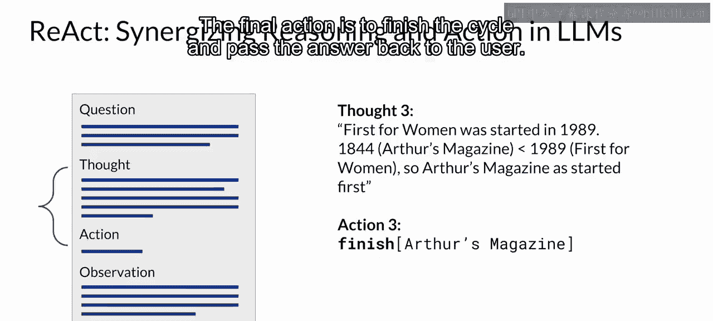
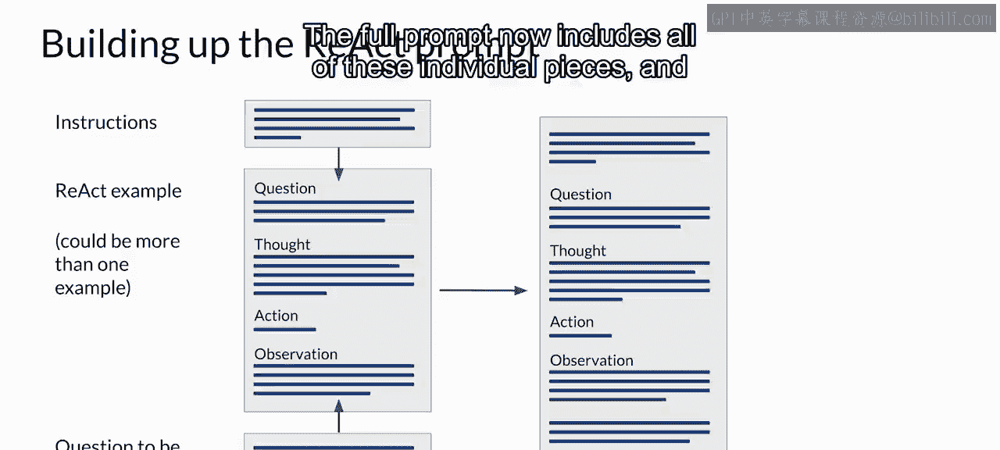
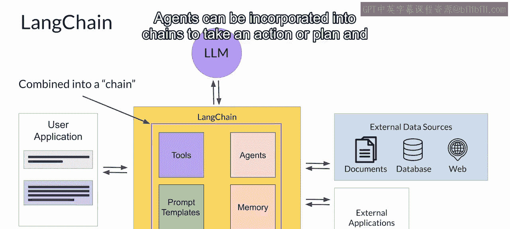

# 044：43_React- 结合推理和行动

在本节课中，我们将要学习一个名为ReAct的框架。该框架将思维链推理与行动规划相结合，能够帮助大型语言模型（LLM）规划并执行涉及多个外部数据源和应用的复杂工作流。


## 概述

上一节我们介绍了如何使用结构化提示词（如PAL）帮助LLM编写Python脚本来解决复杂数学问题。一个利用PAL的应用可以将LLM连接到Python解释器来运行代码，并将答案返回给LLM。然而，大多数应用需要LLM管理更复杂的工作流，可能涉及与多个外部数据源和应用的交互。

本节中，我们将探索一个名为ReAct的框架，它可以帮助LLM规划和执行这些工作流。

## ReAct框架简介

ReAct是一种提示策略，它结合了思维链推理与行动规划。该框架由普林斯顿大学和谷歌的研究人员在2022年提出。其研究论文基于Hotpot QA（一个需要推理两个或更多维基百科段落的多步骤问答基准）和FEVER（一个使用维基百科段落验证事实的基准）开发了一系列复杂的提示示例。

ReAct使用结构化示例向大型语言模型展示如何推理问题，并决定采取哪些行动以接近解决方案。

## ReAct的工作原理

以下是ReAct提示示例的核心结构，它包含一个“思考-行动-观察”的三元组循环。

*   **思考**：一个推理步骤，向模型展示如何处理问题并确定要采取的行动。
*   **行动**：模型从预定义列表中选择一个具体操作，以与外部应用或数据源交互。
*   **观察**：外部搜索提供的新信息被引入提示上下文中，供模型解读。

提示会重复这个循环多次，直到获得最终答案。

### 一个具体示例

假设目标是判断两本杂志中哪一本创刊更早。ReAct提示示例如下：

1.  **思考**：模型需要搜索两本杂志的信息并比较创刊年份。首先搜索“Arthur‘s Magazine”。
2.  **行动**：执行搜索操作，格式为 `行动：搜索[Arthur‘s Magazine]`。
3.  **观察**：外部API返回信息，例如“Arthur‘s Magazine创刊于1844年”。
4.  **思考**：已知第一本杂志信息，下一步需要搜索“First for Women”。
5.  **行动**：执行搜索操作，格式为 `行动：搜索[First for Women]`。
6.  **观察**：外部API返回信息，例如“First for Women创刊于1989年”。
7.  **思考**：比较1844年和1989年，因此Arthur‘s Magazine创刊更早。
8.  **行动**：执行完成操作并输出答案，格式为 `行动：完成[Arthur‘s Magazine]`。

在这个框架中，LLM只能从一组预定义的指令所限定的有限行动中选择。这一点至关重要，因为LLM非常有创造力，可能会提出应用程序无法执行的步骤。



## 构建完整的ReAct提示


要将所有部分组合起来进行推理，你需要遵循以下步骤：

1.  准备ReAct示例提示。
2.  在示例开头添加指令定义。
3.  在末尾插入你想要回答的问题。

完整的提示现在包含了所有这些独立的部分，可以传递给LLM进行推理。其结构可以概括为以下伪代码：
```plaintext
指令：任务定义、思考说明、允许的行动列表（搜索、查找、完成）
示例：完整的“思考-行动-观察”循环演示
问题：用户提出的待解决问题
```

## 扩展与应用：LangChain框架

ReAct框架展示了通过推理和行动规划来驱动应用程序的一种方式。你可以通过创建针对应用程序中特定决策和行动的示例来扩展此策略。

幸运的是，基于语言模型开发应用的框架正在积极发展中。一个被广泛采用的解决方案叫做**LangChain**。😊



LangChain框架为你提供了包含必要组件的模块化部件，以便与LLM协同工作。

以下是LangChain提供的一些核心组件：

*   **提示模板**：适用于多种用例，可用于格式化输入示例和模型补全。
*   **记忆**：可用于存储与LLM的交互历史。
*   **工具**：预构建的工具，支持执行广泛任务，包括调用外部数据集和各种API。

将这些独立组件连接在一起就形成了一个**链**。LangChain的创建者开发了一套针对不同用例优化的预定义链，你可以直接使用它们来快速启动和运行你的应用。

有时，应用程序的工作流可能会根据用户提供的信息采取多种路径。在这种情况下，无法使用预定的链，而是需要灵活性来决定在用户执行工作流时采取哪些行动。

LangChain定义了另一种称为**智能体**的构造，你可以用它来解释用户的输入，并确定使用哪种或哪些工具来完成任务。LangChain目前包含了适用于PAL和ReAct等策略的智能体。智能体可以被整合到链中，以执行单个行动或规划并执行一系列行动。

LangChain处于活跃开发中，新功能不断添加，例如在整个工作流中检查和评估LLM补全的能力。它是一个令人兴奋的框架，可以帮助你进行快速原型设计和部署，并可能成为你未来生成式AI工具箱中的重要工具。

## 模型规模的重要性



最后，在使用LLM开发应用程序时，需要记住一点：模型进行良好推理和规划行动的能力取决于其规模。

对于使用像PAL或ReAct这样的高级提示技术，**更大的模型通常是更好的选择**。较小的模型可能难以理解高度结构化提示中的任务，可能需要你执行额外的微调来提高其推理和规划能力，这可能会减慢你的开发进程。

相反，如果你从一个强大的大模型开始，并在部署中收集大量用户数据，你或许可以利用这些数据来训练和微调一个较小的模型，以便在后期切换使用。


## 总结


本节课中，我们一起学习了ReAct框架，它通过结合思维链推理和预定义行动，使LLM能够规划复杂任务。我们还了解了如何构建完整的ReAct提示，并介绍了LangChain这一强大工具，它提供了模块化组件来简化基于LLM的应用开发。最后，我们讨论了模型规模对实现复杂推理和规划能力的重要性。掌握这些概念将帮助你构建更智能、更强大的生成式AI应用。