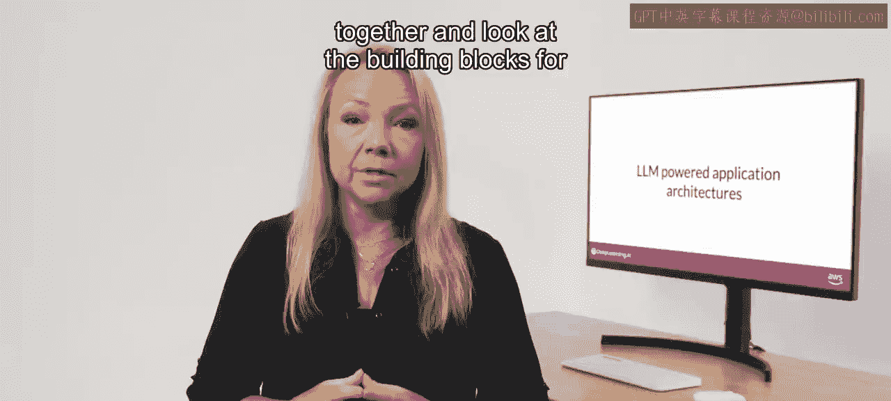
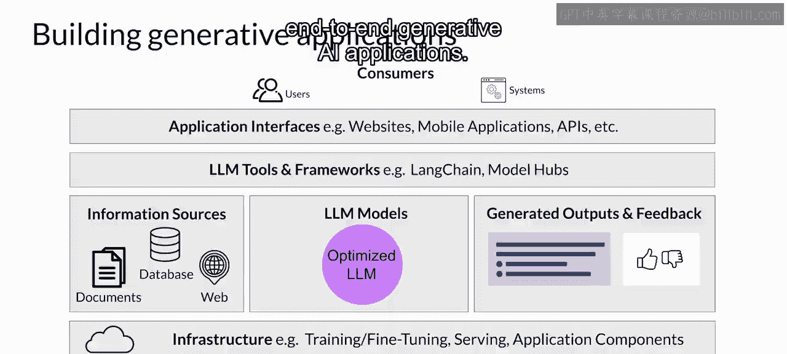
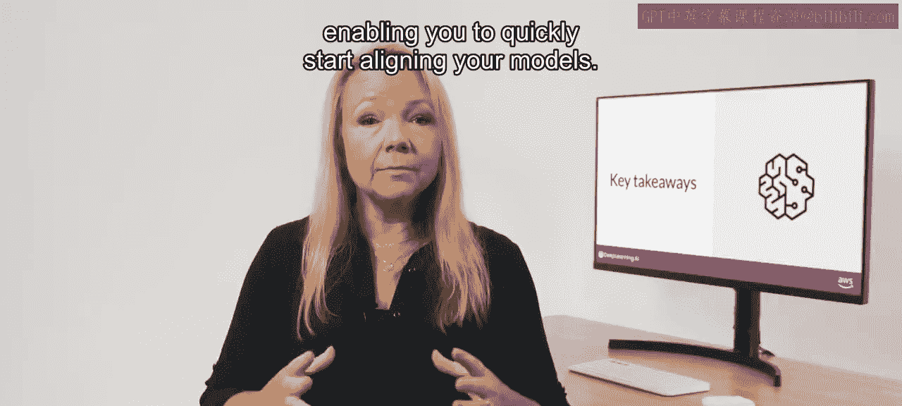
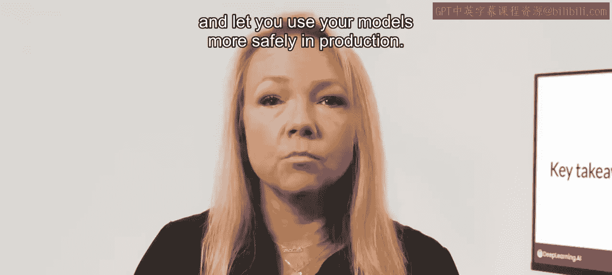
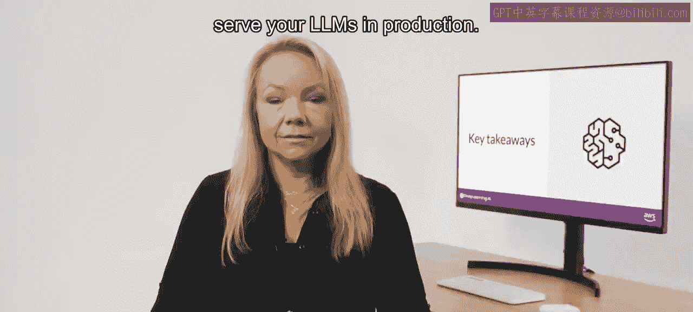
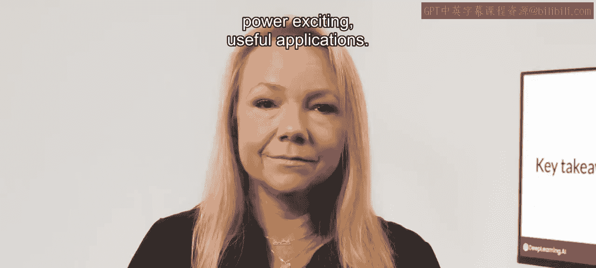
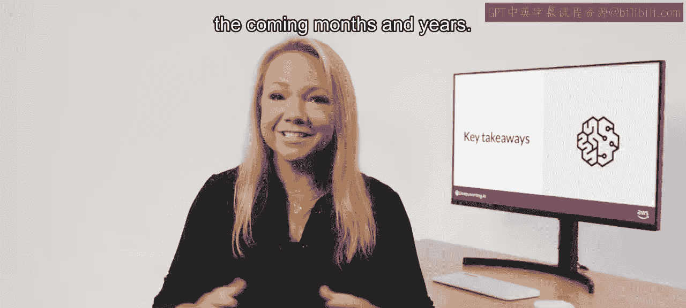

# 045：44_大语言模型应用架构

在本节课中，我们将学习构建基于大型语言模型（LLM）的应用程序时需要考虑的额外因素。我们将探讨一个完整的应用架构，回顾课程中涉及的关键技术，并展望该领域的未来研究方向。

## 概述

在本节中，我们将把课程中学习到的所有知识整合起来，审视构建LLM驱动应用程序所需的各个组成部分。我们将从基础设施层开始，一直到用户界面层，了解如何将这些组件组合成一个端到端的解决方案。

## 构建LLM应用的关键组件

要创建端到端的应用程序解决方案，你需要以下几个关键组件。

以下是构建LLM驱动应用程序所需的核心层次：

1.  **基础设施层**：该层提供计算、存储和网络资源，用于部署你的LLM以及托管应用程序的其他组件。你可以使用本地基础设施，也可以通过按需付费的云服务来获取这些资源。
2.  **大型语言模型层**：此层包含你希望在应用程序中使用的大型语言模型。这些模型可以是基础模型，也可以是你为特定任务进行过适配的模型。模型需要根据推理需求（例如是否需要实时或近实时交互）部署在合适的基础设施上。
3.  **外部数据与工具层**：你的应用可能需要从外部源检索信息，例如在“检索增强生成”部分讨论的技术。此外，你可能需要使用额外的工具和框架来轻松实现课程中讨论的一些技术。例如，你可以使用LangChain的内置库来实现“思维链”提示等技术。模型中心允许你集中管理和共享模型以供应用使用。
4.  **应用逻辑与存储层**：你的应用程序将把LLM生成的补全结果返回给用户或消费应用。根据具体用例，你可能需要实现捕获和存储输出的机制。例如，你可以构建在会话期间存储用户补全内容的能力，以扩展LLM固定上下文窗口的大小。你还可以收集用户反馈，这些反馈在应用成熟后可能对进一步的微调、对齐或评估有用。
5.  **用户界面与安全层**：在最顶层，通常会有某种类型的用户界面供用户使用应用程序，例如网站或REST API。这一层还包括与你的应用程序交互所需的安全组件。

从高层次看，这个架构栈代表了构建生成式AI应用时需要考虑的各种组件。你的用户，无论是人类终端用户还是通过API访问你应用的其他系统，都将与整个栈进行交互。由此可见，模型通常只是构建端到端生成式AI应用的一部分。

## 课程核心内容回顾

上一节我们介绍了应用的整体架构，本节我们来回顾一下本课程中学习的核心技术与概念。

恭喜你完成了完整的生成式AI项目生命周期的学习。希望你现在对使用LLM构建应用程序时必须考虑的重要问题有了一些直观的理解。

本周，你学习了如何通过一种名为**基于人类反馈的强化学习**的技术来微调模型，使其与人类偏好（如乐于助人、无害和诚实）保持一致。鉴于RLHF的流行，目前已有许多现成的RL奖励模型和人类对齐数据集可用，这使你可以快速开始对齐你的模型。

在实践中，RLHF是一种非常有效的机制，可用于提高模型的对齐度，降低其回答的毒性，并让你在生产中更安全地使用模型。

你还学习了通过**蒸馏**、**量化**或**剪枝**来减小模型规模，从而优化模型推理的重要技术。这最大限度地减少了在生产环境中部署LLM所需的硬件资源量。

最后，你探索了可以通过结构化提示以及连接到外部数据源和应用程序来帮助模型在部署中表现更好的方法。LLM可以作为应用程序中的推理引擎发挥惊人的作用，利用其智能来驱动令人兴奋且有用的应用。

像**LangChain**这样的框架使得快速构建、部署和测试基于LLM的应用程序成为可能，这对开发者来说是一个非常激动人心的时代。

## 总结与展望

在本节课中，我们一起学习了构建基于大型语言模型的生成式AI应用程序的完整架构和关键考量。我们回顾了从模型对齐（RLHF）、推理优化（蒸馏、量化、剪枝）到应用增强（提示工程、外部数据集成）等一系列核心技术。

课程最后，吴恩达老师将探讨一些活跃的研究领域，这些领域很可能在未来几个月和几年内塑造这个领域的发展轨迹。