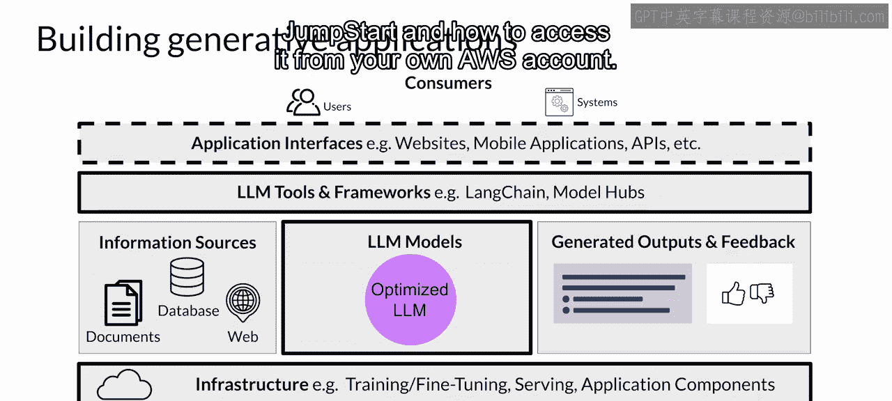
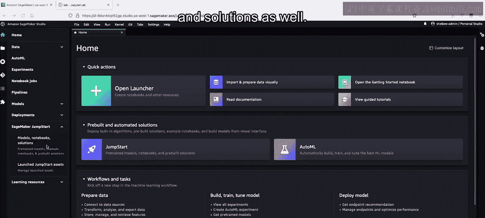
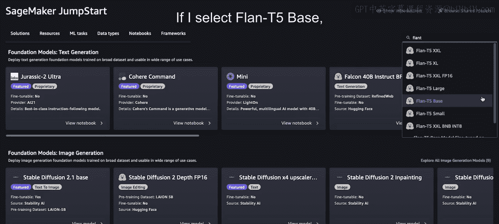
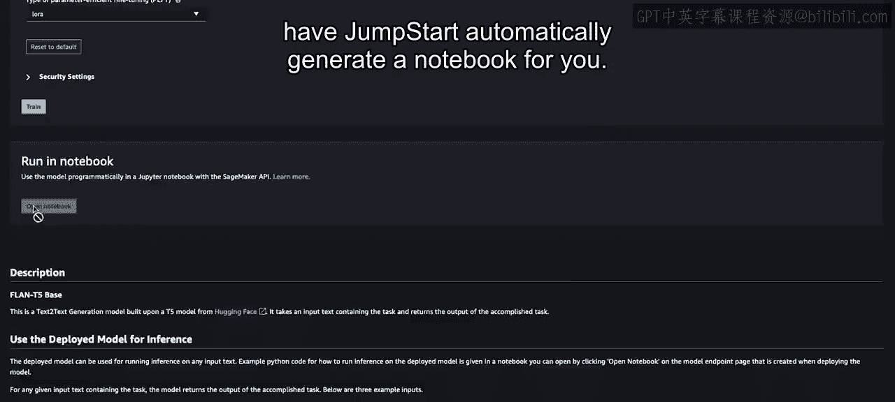
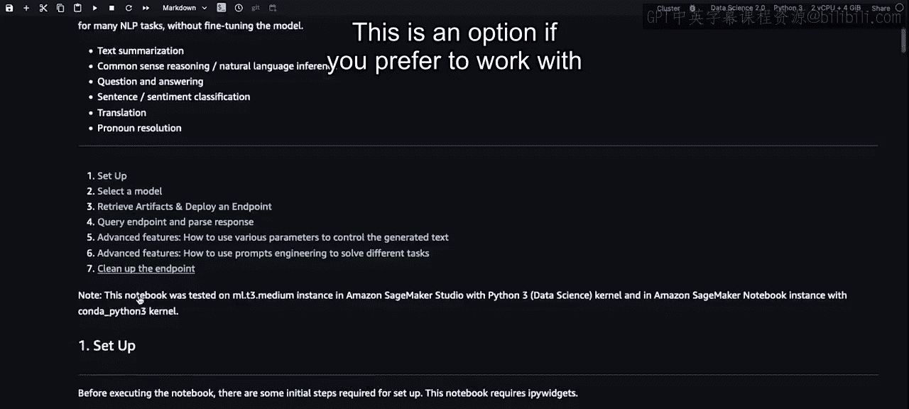
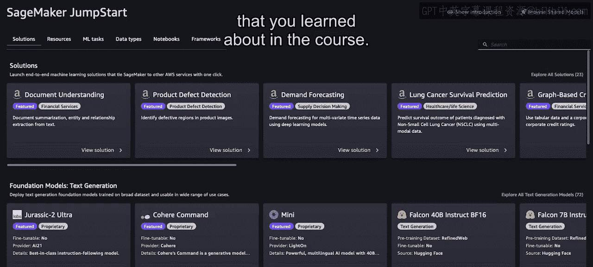
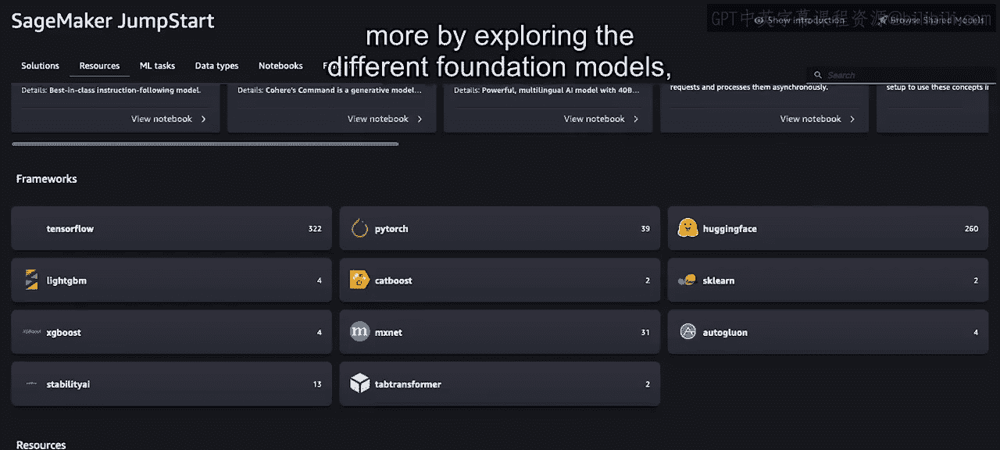

# 046：AWS SageMaker JumpStart 入门 🚀

在本节可选视频中，我们将了解一个名为 **Amazon SageMaker JumpStart** 的 AWS 服务。该服务能帮助你快速将大型语言模型应用投入生产并实现规模化运营。

## 概述

上一节我们探讨了构建LLM应用的基础组件。本节中，我们来看看AWS提供的一个集成化服务——SageMaker JumpStart。它作为一个模型中心，能让你快速部署预训练的基础模型，并将其集成到自己的应用中，从而简化从开发到生产的流程。

## 应用架构与JumpStart的角色

以下是你在前一个视频中探索过的应用技术栈。正如所见，构建一个由LLM驱动的应用需要多个组件。

SageMaker JumpStart 是一个模型中心。它允许你快速部署该服务内可用的基础模型，并将它们集成到你自己的应用程序中。

JumpStart服务还提供了一种简单的方法来微调和部署模型。

JumpStart覆盖了此架构图中的许多部分，包括基础设施、LLM本身、工具和框架，甚至调用模型的API。

## 重要注意事项

与你在实验课中使用的模型相比，JumpStart中的模型需要GPU来进行微调和部署。

请记住，这些GPU采用按需计费模式。在选择要使用的计算资源之前，你应该参考SageMaker的定价页面。

此外，请务必在不使用时删除SageMaker模型端点，并遵循成本监控的最佳实践来优化成本。

## JumpStart快速导览

接下来，让我为你快速展示JumpStart，以及如何从你自己的AWS账户访问它。

SageMaker JumpStart可以从AWS控制台或通过SageMaker Studio访问。在这个简短的导览中，我将从Studio开始，然后从主屏幕选择JumpStart。我也可以选择左侧菜单中的JumpStart，并选择模型、笔记本和解决方案。

点击JumpStart后，你会看到不同的类别，其中包括跨不同用例的端到端解决方案，以及许多支持不同模态的基础模型。你可以轻松部署这些模型，并且在“微调”选项下标记为“是”的模型还可以进行微调。

## 以FLAN-T5模型为例

让我们看一个学完本课程后大家都熟悉的例子，即FLAN-T5模型。在课程中，你专门使用了基础变体以最小化实验环境所需的资源。然而，正如你在这里看到的，你也可以根据需要通过JumpStart使用FLAN-T5的其他变体。

你还会注意到这里的Hugging Face标志，这意味着这些模型实际上直接来自Hugging Face。AWS已与Hugging Face合作，使你只需点击几下即可轻松部署或微调模型。

如果我选择FLAN-T5基础模型，你会看到我有几个选项。

以下是部署模型的主要步骤：

*   **部署模型**：首先，我可以通过指定几个关键参数（如实例类型和大小）来选择部署模型。这是应用于托管模型的实例类型和大小。请注意，这将部署到一个实时的持久端点，价格取决于你在此处选择的主机实例。其中一些实例可能相当大，因此请务必记住删除任何不使用的端点，以避免产生不必要的成本。
*   **安全设置**：你还可以指定许多安全设置，从而实施符合自身安全要求的控制。
*   **启动部署**：然后你可以选择点击“部署”，这将使用你指定的基础设施自动将该FLAN-T5基础模型部署到端点。

## 微调模型

在第二个标签页中，你会注意到“训练”选项。因为此模型支持微调，你也可以通过指定训练和验证数据集的位置来设置微调任务。

以下是设置微调任务的要点：

*   **选择计算资源**：然后选择你想用于训练的计算资源大小。通过这个下拉菜单可以轻松调整计算资源的大小，你可以轻松选择想用于训练任务的计算类型。再次提醒，你需要为训练模型所需时间内的底层计算资源付费，因此我们建议为你的特定任务选择所需的最小实例。
*   **调整超参数**：另一个功能是能够通过这些下拉菜单快速识别和修改此特定模型的可调超参数。
*   **使用高效微调技术**：如果我们继续向下滚动到底部，你会看到一个名为“PEFT”（参数高效微调）的参数类型，这是你在第6课中学到的。在这里，你可以通过一个简单的下拉菜单选择“LoRA”（你在第4课中学到），从而更轻松地实现你学到的这些各种技术。
*   **启动训练**：然后你可以继续点击“训练”，这将启动一个训练任务，使用你为特定任务提供的输入来微调这个预训练的FLAN-T5模型。

## 以编程方式使用

最后，这里是另一个选项，即让JumpStart自动为你生成一个笔记本。假设你不喜欢使用下拉菜单，而更喜欢以编程方式处理这些模型。

这个笔记本基本上为你提供了我们之前介绍的所有选项背后运行的代码。如果你更喜欢以编程方式在最低层级使用JumpStart，这是一个可选方案。

## 总结与鼓励

这只是JumpStart的一个快速导览，用以说明你在课程中学到的模型中心的一个具体实现。

除了作为包含基础模型的模型中心外，JumpStart还提供了大量资源，包括博客、视频和示例笔记本。

我强烈鼓励你通过探索其中可用的不同基础模型及其变体来更多地了解它，以帮助你快速入门。