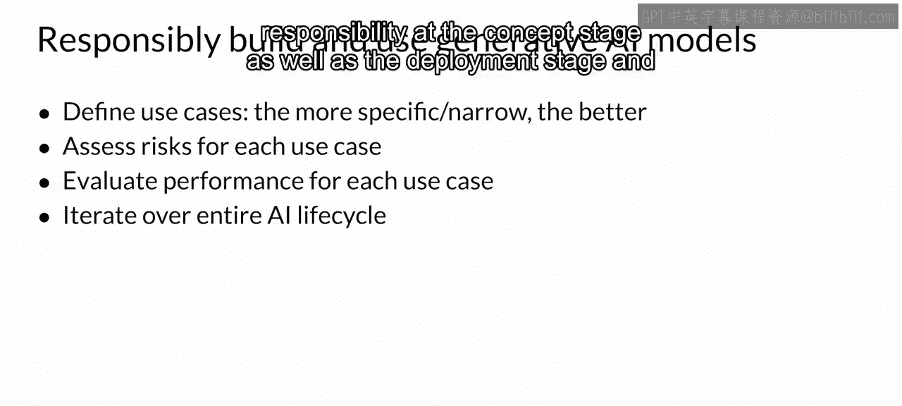

# 047：责任感的AI 🤖

在本节课中，我们将探讨生成式人工智能，特别是大型语言模型应用中的责任感问题。随着AI技术的快速发展，确保其被负责任地开发和使用变得至关重要。我们将了解当前面临的主要挑战、应对策略以及该领域的未来研究方向。

---

## 概述

在本课程中，你已经学习了贯穿生成式AI项目生命周期的基本概念和应用技术。由LLM驱动的应用仍处于起步阶段，研究人员几乎每天都在宣布新的技术或策略以提高性能和可靠性。本课程只能涵盖发布时已知或已理解的内容，但我们确信这个领域将继续快速发展。让我们重点介绍几个活跃的研究领域。

## 主要挑战与应对策略

我的AWS同事，Ashley Ses博士，将与我一起讨论负责任的人工智能，特别是在大型语言模型的生成式AI背景下。

Ashley博士是AWS亚马逊AI的首席技术布道师。在这个职位上，她专注于公平性和准确性，以及识别和减轻人工智能中的潜在偏见。她曾在亚特兰大担任应用科学家，领导亚马逊视觉搜索团队。有趣的是，该团队在亚马逊购物应用上推出了商品部件的视觉搜索功能。

鉴于当前领域现状，在大型语言模型的生成式AI背景下，负责任AI面临哪些新的风险和挑战？

这是一个很好的问题，因为存在许多挑战，我们重点讨论三个：毒性、幻觉和知识产权问题。

### 1. 毒性挑战

以下是关于毒性挑战的详细描述和缓解建议。

*   **挑战定义**：毒性的核心意味着某些语言或内容可能对特定群体，特别是边缘化群体或受保护群体，造成伤害或歧视。
*   **缓解策略**：
    *   **从训练数据入手**：训练数据是所有AI的基础，因此可以从精心策划训练数据开始。
    *   **训练护栏模型**：训练模型来检测和过滤掉训练数据中任何不需要的内容。
    *   **重视人工标注**：在训练和标注过程中，我们需要确保为标注者提供足够的指导，并确保标注者群体的多样性。这样他们才能理解如何筛选或标记某些数据。

有道理，你刚才提到的确保人工标注者多样性非常重要。

### 2. 幻觉挑战

上一节我们讨论了毒性问题，本节中我们来看看幻觉挑战。幻觉指的是完全不真实的内容，或者看起来可能真实但实际上毫无依据的内容。

这正是生成式AI中幻觉的含义。由于我们训练大型语言模型或一般神经网络的方式，很多时候我们并不知道模型实际学到了什么。因此，模型有时会尝试填补其缺失数据的空白，这常常导致虚假陈述或幻觉。

以下是应对幻觉的一些方法。

*   **用户教育**：教育用户这是该技术的现实情况，并添加免责声明，让他们知道这是需要注意的事项。
*   **增强可信来源**：用独立且经过验证的来源来增强大型语言模型，以便对返回的数据进行双重检查。
*   **开发归因方法**：开发将生成输出归因于特定训练数据片段的方法，以便我们总能追溯信息来源。
*   **明确使用范围**：始终确保定义预期用例与非预期用例，因为幻觉可能发生，我们希望用户对这些系统的运作方式保持透明和了解。

明白了，我认为教育在这里确实非常关键。

### 3. 知识产权挑战

你提到的第三个挑战是知识产权。对此你有何看法？

这个问题肯定需要解决，因为它基本上意味着人们使用这些生成式AI模型返回的数据，可能会抄袭他人先前的工作，或者对已存在的作品和内容产生版权问题。

因此，这个问题可能需要随着时间的推移，通过技术和政策制定者及其他法律机制的混合方式来共同解决。同时，我们希望建立一个治理体系，确保每个利益相关者都履行其职责以防止这种情况发生。

此外，近期出现了一个新概念——**机器去学习**，旨在减少或移除受保护内容对生成式AI输出的影响。这只是当今研究中一个非常初步的方法。我们还可以采用过滤或阻止方法，将内容与受保护的训练数据进行比较，如果过于相似，则在呈现给用户之前抑制或替换它。

明白了。现在，从项目角度整体来看，你能给从业者什么建议？我如何负责任地构建和使用生成式AI模型？

## 负责任构建与使用生成式AI模型的建议

我很高兴你问这个问题。定义用例非常重要，越具体、越窄越好。

以下是一些关键建议。

*   **定义具体用例**：用例定义越具体、越窄越好。例如，我们实际使用生成式AI来测试和评估系统鲁棒性的一个场景是人脸识别系统。我们使用生成式AI创建人脸的不同版本。例如，如果我测试一个使用我的脸来解锁手机的系统，我希望确保用不同版本的脸进行测试：长发、短发、戴眼镜、化妆、不化妆。我们可以利用生成式AI大规模地进行这种测试。这就是我们如何用它来测试鲁棒性的一个例子。
*   **评估风险**：我还想确保我们评估风险，因为每个用例都有其自身的风险集，有些可能更好或更糟。
*   **评估性能**：评估性能确实是数据和系统的一个函数。你可能拥有相同的系统，但用不同类型的数据测试时，可能表现得很好，也可能非常糟糕。
*   **迭代生命周期**：我们希望确保在AI生命周期中进行迭代。创建AI是一个持续迭代的循环，我们希望在设计阶段和部署阶段都实施责任感，并长期监控反馈。
*   **建立治理与问责**：最后同样重要的是，我们希望在整个生命周期中发布治理政策，并为每个相关利益相关者制定问责措施。

这真的很有帮助，Ashley。我也喜欢你提到的关于生成式AI可能成为解决方案一部分的观点，即帮助创建更多样化的数据。

## 未来研究方向

现在，在我们结束之前，我知道这个领域目前正在发生很多事情，但研究界目前正在积极研究哪些让你感到兴奋的课题？

我认为有几个方向。有很多，这也是为什么这个领域每天都在展现新面貌。

以下是当前一些令人兴奋的研究方向。

*   **水印与指纹技术**：这是在内容或数据中包含类似印章或签名的方法，以便我们总能追溯来源。
*   **内容来源鉴别模型**：创建帮助确定内容是否由生成式AI创建的模型也是一个新兴的研究领域。

因此，这是一个非常激动人心的时刻。我认为AI的未来是可访问的、包容的，我期待看到未来的创新。

## 总结

本节课中，我们一起学习了在大型语言模型的生成式AI背景下，负责任AI所面临的核心挑战：**毒性**、**幻觉**和**知识产权**。我们探讨了针对这些挑战的缓解策略，例如精心策划数据、用户教育、增强可信来源以及建立治理体系。最后，我们展望了该领域令人兴奋的未来研究方向，如水印技术和内容鉴别模型。构建和使用AI是一个持续的过程，将责任感融入其生命周期的每个阶段至关重要。