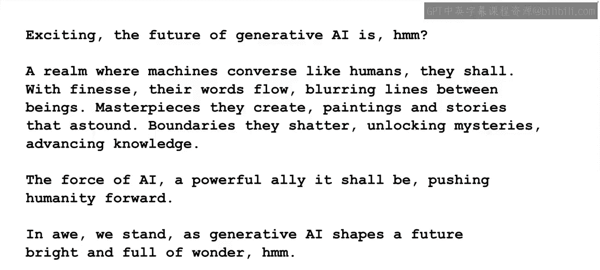

# 048：课程总结与未来展望

在本节课中，我们将对课程内容进行总结，并展望大型语言模型（LLM）领域的未来发展趋势。我们将探讨模型对齐、可解释性、效率优化以及新兴能力等关键方向。

## 未来研究方向

上一节我们回顾了课程的核心内容，本节中我们来看看研究人员正在探索的几个关键未来方向。

除了生成式人工智能本身，研究人员正在探索使模型与人类价值观和偏好保持一致的技术。

提高模型的可解释性，并实施有效的模型治理。

随着模型能力的增强，我们还需要更具扩展性的人类监督技术。

例如，我在上一课中讨论过的**宪法人工智能**。

研究人员继续探索在整个项目生命周期中扩展损失函数的方法。

包括能更好预测模型性能的技术，以确保资源被有效利用。

例如，通过**模拟**。

而扩展并不总意味着更大。研究团队正在为小型设备和边缘部署进行模型优化。

例如，**Llama.cpp** 是一个使用**4位整数量化**在笔记本电脑上运行的Llama模型的C++实现。

同样，我相信我们将在整个模型开发生命周期中看到进步和效率提升。

特别是在预训练、微调和强化学习方面出现更高效的技术。

## 新兴模型能力

在探讨了效率优化后，我们来看看模型能力本身将如何发展。

我们将看到LLM能力的增加和新兴。例如，研究人员正在研究开发支持更长问题和上下文的模型。

例如，用于总结整本书。事实上，在本课程开发期间，我们已经看到了首个宣布支持**100,000个令牌上下文窗口**的模型。

这大致相当于**75,000个单词**和数百页的内容。

模型也将越来越多地支持跨语言、图像、视频、音频等的**多模态**。

这将解锁新的应用和用例，并改变我们与模型的交互方式。

我们已经通过最新一代的**文生图模型**看到了这一点的首批惊人成果，其中自然语言成为创建视觉内容的用户界面。

研究人员还在试图更多地了解LLM的推理能力，并探索将结构化知识和符号方法相结合的LLM。

这个**神经符号人工智能**的研究领域探索了模型从经验中学习的能力以及从所学知识中进行推理的能力。

非常感谢您学习本课程。我们希望您喜欢这些课程，并迫不及待地想看到您运用这些知识构建出什么。

## 总结

本节课中我们一起学习了大型语言模型领域的未来展望。我们探讨了模型对齐与治理、效率优化技术以及多模态、长上下文等新兴能力的发展方向。这些进步将共同推动生成式人工智能走向更强大、更可靠、更易用的未来。

最后，让我们问问我们的AI，未来会怎样。

