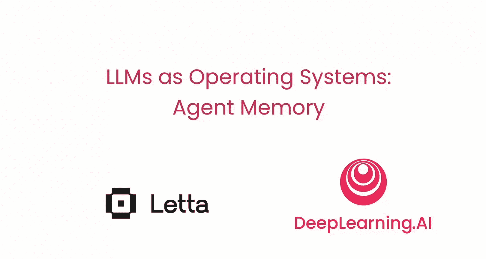
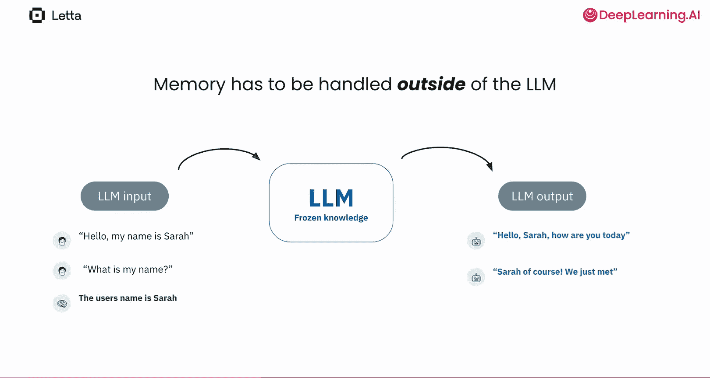
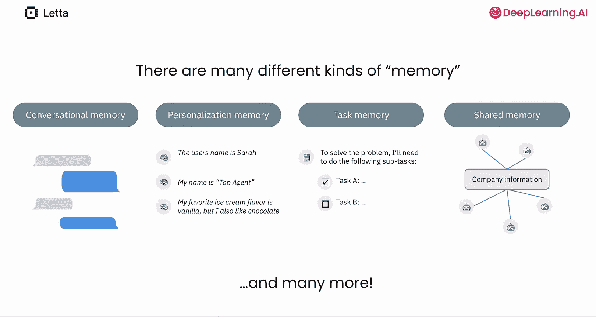
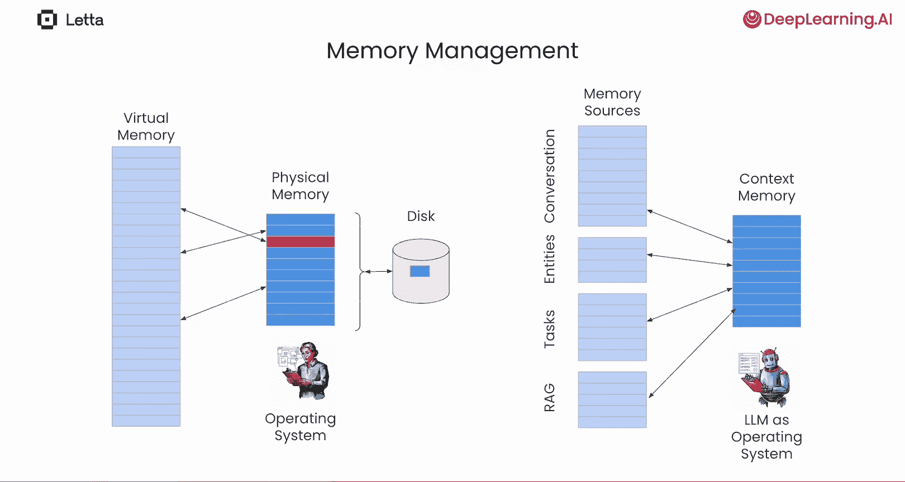
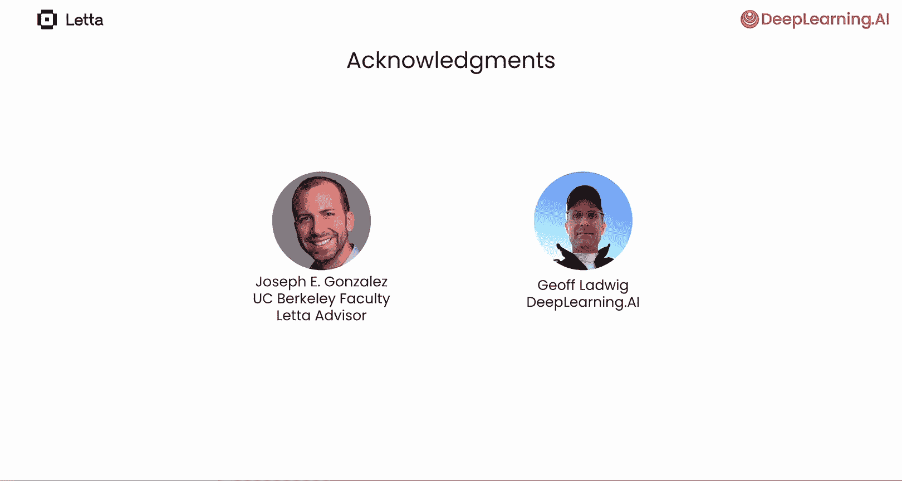

# 001：课程介绍 🧠

在本课程中，我们将探索和构建AI智能体的记忆系统。我们还将探讨一个核心观点：大型语言模型智能体可以管理自己的输入上下文窗口，从而在AI应用中扮演操作系统的角色。

本课程由《MGPT：将LLMs视为操作系统》论文的两位作者——Charles Pecker和Sarah Withs——担任讲师。如果你学习过我们之前关于提示工程和LLM API的课程，你可能已经熟悉一个概念：尽管LLMs能完成惊人的任务，但它们不具备持久记忆，你需要显式地管理其记忆。

## 理解上下文窗口与记忆

上一节我们提到了LLM缺乏持久记忆的问题，本节中我们来看看如何通过上下文窗口为其提供信息。

通过将信息包含在提示（也称为输入上下文）中，你可以为模型提供生成输出所需的额外信息。**输入上下文中的内容决定了LLM及其应用的行为**。例如：
*   聊天机器人应用拥有对话记忆，用于存储对话中早期的交流。
*   你可能希望长期追踪个人事实或姓名。
*   你可能需要跟踪任务进度。
*   你可能希望在不同智能体之间共享信息。

在RAG应用中，你从外部数据源检索相关信息，并将其引入LLM的上下文中。因此，LLM可以利用输入上下文中包含的任何信息来生成响应。

## 管理上下文的挑战与机遇

然而，输入上下文窗口的可用空间是有限的，使用更长的输入上下文也会增加成本并导致处理速度变慢。因此，管理这些上下文信息——决定在输入上下文中包含什么——至关重要。

MGPT论文描述了一种新颖的方法：让LLM自己来管理上下文。如果你熟悉计算机系统中的虚拟内存概念，MGPT使用了一个很好的类比来解释这个想法。如果不熟悉，也无需担心，课程内容依然清晰且实用。以下是Charles对这个类比的解释：

我们可以将上下文窗口类比为计算机上的虚拟内存。你的计算机认为自己拥有一个非常大的内存（虚拟内存），远大于其实际的物理内存。当它试图引用一个不在物理内存中的虚拟地址时，操作系统会首先通过将物理内存中的一个信息块移出到磁盘（保存该块中的任何更改）来腾出空间，然后将具有引用地址的新信息块从磁盘取回物理内存。

类似地，你可以将LLM的上下文窗口视为我们系统中的物理内存。一个LLM智能体扮演操作系统的角色，决定哪些信息应该被包含在上下文窗口中。AI可以使用LLM进行规划、使用工具并做出决策（例如决定停止或继续任务）。类似的方法也让AI智能体能够管理其记忆以支持记忆管理。

## 课程实践内容概述

接下来，我们将概述本课程中你将动手实践的内容。

智能体会被分配一部分上下文窗口作为长期记忆，它可以写入其中。同时，智能体被赋予访问外部存储（如数据库）的工具，以创建更大的记忆存储。通过结合写入其上下文内存和外部内存的工具，以及搜索外部内存并将结果放入LLM上下文的工具，智能体可以有效地管理记忆。

在本课程中，你将把这些想法付诸实践：
1.  **构建基础智能体**：在这些课程中，你将从头开始构建一个能够编辑自身记忆的LLM智能体。这将让你深入理解LLM记忆管理的基本思想。
2.  **学习核心概念**：接下来，你将超越基础，学习MGPT论文中的关键概念。
3.  **使用Lettra框架**：然后我们将介绍Lettra——一个开源智能体框架。在该框架中，智能体拥有管理上下文窗口所需的工具和信息。你不仅可以使用Lettra构建如原论文所述的MGPT智能体，还可以超越研究论文，构建具有更高级记忆类型的智能体。
4.  **深入探索与实践**：在多个课程中，你将创建智能体并探索记忆构建的细节。你将通过构建自定义任务记忆来实践这些知识。
5.  **应用所学知识**：你将把这些知识应用于各种应用，包括构建你自己的研究智能体和一个HR多智能体应用，其中智能体们共享记忆。

我们要感谢帮助创建本课程的一些人：加州大学伯克利分校教授兼Lettra顾问Joseph Gonzalez、Lettra团队，以及来自DeepLearning.AI的Jeff Ladwig。

## 总结与展望

本节课中，我们一起学习了让AI智能体管理自身记忆这一新颖而强大的技术。它提供了一个强大的基础设施，可以在此基础上构建许多应用程序。这里的想法非常令人兴奋。

让我们进入下一个视频，开始深入学习这些内容。