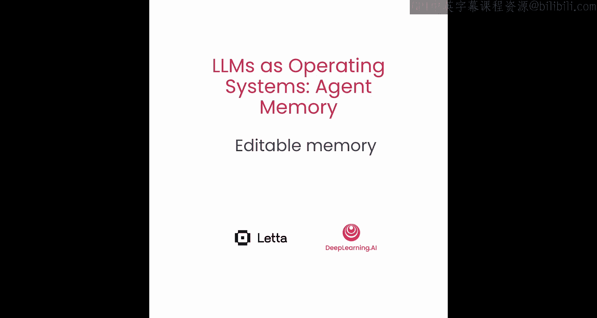
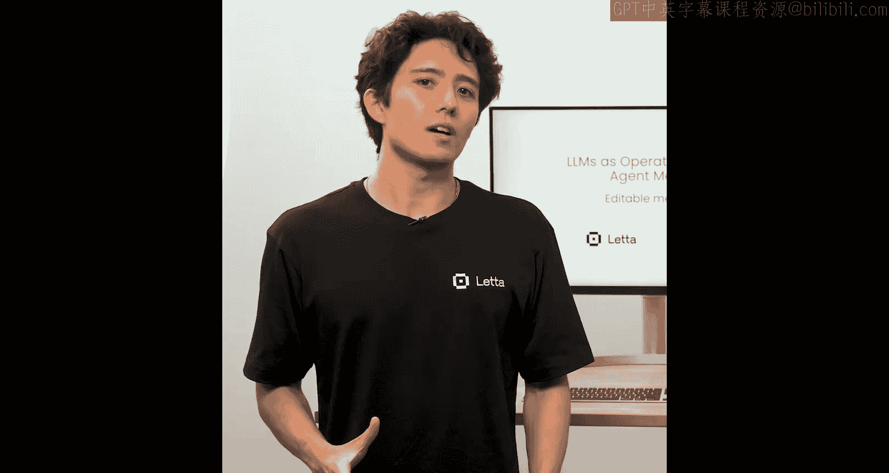
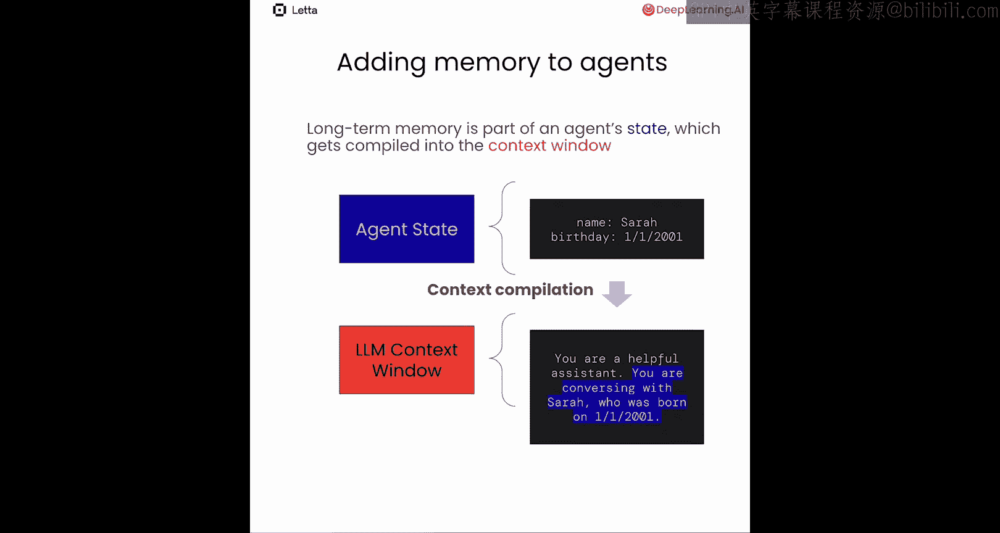
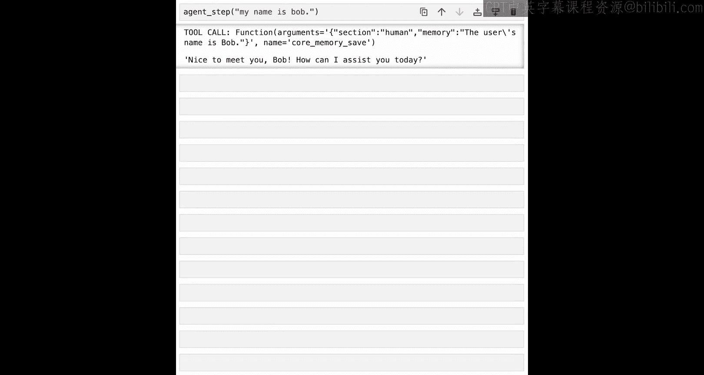

# 002：从零实现自编辑记忆

在本节课中，我们将学习如何为智能体构建一个能够自我更新的长期记忆系统。我们将从零开始，逐步实现一个具备自编辑记忆功能的基础智能体。

## 概述

自编辑记忆指的是允许大语言模型随时间更新其自身长期或持久记忆的概念。这是构建能够持续学习和改进的智能体的关键方面。我们将通过代码实践，理解如何将记忆整合到智能体的推理循环中，并使其能够自主更新这些记忆。

---

## 智能体与聊天机器人的区别

上一节我们介绍了自编辑记忆的概念，本节中我们来看看是什么让智能体不同于普通的聊天机器人。

大多数聊天机器人底层使用大语言模型来生成对话回复。例如，用户说“你好”，我们将其附加到对话历史中，然后请求大语言模型生成对话中的下一条消息。模型生成一个回复，比如机器人说“嘿，你好”。

那么，智能体有何不同？智能体通过在一个自主循环中采取多步行动来实现自主行为。对于一个用户消息，智能体实际上可能会多次运行大语言模型。例如，它可能先进行内部思考：“我刚收到一条消息，我知道是谁发送的吗？”然后，智能体可能会运行一个记忆搜索工具。之后，智能体最终可能决定发送回复：“嘿，莎拉，再次见到你真好，希望你今天生日过得愉快。”当智能体运行记忆搜索工具时，它能够找到关于用户的额外信息，甚至发现用户的生日就是今天。

在这个例子中，我们看到一条用户消息触发了三次不同的大语言模型调用。这就是我们所说的**智能体循环**。

## 实现多步推理

为了实现大语言模型的多步推理，需要一个能够更新状态的推理循环。

我们有一个**智能体状态**，它被放入**上下文窗口**中。这个上下文窗口是大语言模型推理的输入，而大语言模型推理的结果则用于更新智能体状态。我们称这个循环中的单个推理步骤为**智能体步**。

## 为智能体添加记忆

那么，我们如何为智能体添加记忆呢？长期记忆是智能体状态的一部分，它会被编译到上下文窗口中。我们称这个过程为**上下文编译**。

让我们想象一个智能体没有任何长期记忆的情况。此时，上下文窗口可能非常简单，例如：“你是一个乐于助人的助手”。但如果智能体确实有一些记忆呢？例如，用户名叫莎拉，生日是2001年1月1日。上下文编译指的是我们需要以某种方式将这些智能体状态放入上下文窗口。

一种方法，就像这个例子一样，是将字典数据转换成某种句子形式。

## 使记忆可编辑

现在我们已经理解了如何为智能体添加记忆。但如何让这个记忆变得可编辑呢？

我们可以通过使用特殊的记忆工具，使智能体记忆能够自我编辑。例如，假设人类说“你好”，智能体基于记忆认为人类的名字是莎拉，于是回复“嗨，莎拉”。然后人类说“我的名字其实是查尔斯，不是莎拉”。这时，智能体可能会思考一下：“哦，不，我的记忆肯定出错了，需要修正它。”接着，它会调用一个专门更新智能体状态中人类名字的特殊函数。然后，因为智能体可以运行多次，它会回复：“抱歉，查尔斯。”

## 实践：从零构建自编辑记忆智能体

让我们将这些知识付诸实践，从零开始构建一个具有自编辑记忆的智能体。我们将指导你如何使用OpenAI的工具调用功能来实现一些基本的记忆管理特性。

### 第一步：设置环境与模型

首先，我们需要设置OpenAI。接下来，我们需要选择一个模型，这里我们使用`gpt-4o-mini`，它在速度、成本和人类可理解性之间取得了良好的平衡。

### 第二步：定义系统提示词

我们需要定义系统提示词。目前我们保持非常简单，只使用“你是一个聊天机器人”。

### 第三步：进行大语言模型请求

我们消息请求的格式是将系统提示词放在前面，然后是聊天历史。在这个例子中，我们有一个空的聊天记录，所以唯一的消息是用户询问“我的名字是什么？”。

我们期望发生什么？由于没有任何关于名字的上下文，正如预期，智能体回复：“抱歉，我不知道你的名字。我今天能如何帮助您？”

### 第四步：向上下文窗口添加记忆

在Python中，我们可以拥有的最基本记忆形式是一个Python字典。

让我们设置一个智能体记忆字典，它有一个字段`human`，用于保存所有与人类相关的记忆。目前，我们唯一的记忆是：人类的名字是鲍勃。

请注意，我们实际上必须更新我们的系统提示词。我们的系统提示词不再仅仅是“你是一个聊天机器人”，它还包含了额外的信息，明确告诉大语言模型它拥有某种记忆。

我们告诉大语言模型，它的上下文中有一个名为“记忆”的部分，其中包含与对话相关的信息。我们明确指示大语言模型使用其记忆来个性化对话。

接下来，让我们实际发送这个请求到OpenAI。你会注意到这里的主要区别是，我们现在使用了新的系统提示词，并且手动将记忆注入到了系统提示词中。

和之前一样，聊天历史只有一条消息：“我的名字是什么？”。我们期望这里会发生什么？在这种情况下，我们实际上提供了关于人类名字的信息，因此我们期望聊天机器人返回类似“你的名字是鲍勃”的内容。很好，一切如预期运行。

### 第五步：实现记忆编辑工具

在本节中，我们将介绍如何使这个记忆对象能够被智能体编辑。

因为我们在Python中表示记忆（它只是一个Python字典），定义记忆编辑工具的方法就是简单地编写一个Python函数。

让我们创建一个简单的函数，名为`core_memory_save`。`core_memory_save`接受两个参数：`section`（部分）和`memory`（记忆）。`core_memory_save`将索引到相应的部分，并将记忆追加到该部分。

让我们看看它在实践中如何工作。当前记忆是空的，它有两个字段，但都是空字符串。现在，让我们尝试自己运行这个记忆编辑工具。我们运行了`core_memory_save`，并添加了一些关于人类的信息：人类的名字是查尔斯。所以，它应该已经更新了记忆。很好，现在我们知道我们的记忆编辑工具按预期工作了。

### 第六步：向大语言模型描述工具

下一步是找到一种方法，向大语言模型描述它应该如何与OpenAI的API一起使用这个工具。这需要你做两件事：

1.  你必须提供函数的描述。在我们的例子中，描述是：“保存关于你（智能体）或你正在聊天的人类的重要信息”。
2.  接下来，你需要提供某种JSON模式。这基本上是以编程方式描述函数的参数是什么以及参数的类型是什么。此外，我们指定这两个参数都是必需的。

现在我们有了工具编辑描述和模式，我们可以将这些元数据传递给OpenAI。OpenAI将使用这些信息来告知大语言模型它可以访问这些工具。

### 第七步：执行工具调用

让我们快速回顾一下这个调用。我们传入了系统提示词，然后也传入了记忆，最后传入了聊天历史。同样，这里的聊天历史是一条消息：“我的名字是鲍勃”。

那么，我们期望会发生什么？用户说“我的名字是鲍勃”，但记忆被初始化为空状态。因此，我们希望这里的智能体会决定使用`core_memory_save`函数来保存关于用户名字是鲍勃的信息。

让我们看看发生了什么。我们可以看到`finish_reason`是`tool_calls`，这意味着智能体或大语言模型正在尝试调用一个工具。我们可以看到智能体试图调用的工具是`core_memory_save`，并且我们可以看到函数的参数是：`section: human`, `memory: the human's name is Bob`。太棒了！这正是我们想要的。大语言模型在看到聊天历史中的信息后，正试图保存“人类的名字是鲍勃”这个信息。

然而，OpenAI实际上不会为你执行这个工具，这需要你自己来完成。

执行工具的第一步是加载参数。OpenAI的响应将参数作为字符串化的JSON传递。这意味着我们可以使用`json.loads`函数将参数加载回字典。现在我们有了字典形式的参数，我们只需要将它们传递给实际的函数。我们可以使用`**`语法来实现这一点。

一旦我们有了字典形式的参数，我们需要做的就是运行这个函数。运行函数后，我们可以检查我们的记忆。正如预期的那样，它被更新了。

### 第八步：测试更新后的记忆

让我们再次运行智能体，看看在记忆更新后它的响应有何不同。在这个请求中，我们包含了系统提示词、更新后的记忆对象和一个问题：“我的名字是什么？”。正如预期，智能体回复：“你的名字是鲍勃”。

恭喜！你现在已经实现了一个记忆编辑功能。

### 第九步：实现多步推理循环

在我们当前的实现中，智能体一次只能执行一个步骤：要么编辑记忆，要么回复用户。

然而，如果我们希望智能体支持多步推理，以便它能将多个动作组合在一起，我们可以通过在一个`while`循环中调用聊天补全功能来实现一个智能体循环，并允许智能体决定是继续其推理步骤还是跳出循环。为简单起见，我们假设如果智能体的响应不是工具调用，我们就跳出循环；如果是工具调用，我们就保持在循环内。

让我们从重置智能体记忆开始。接下来，我们将对系统提示词进行一些修改。系统提示词包含了关于智能体应如何使用工具的额外信息。我们让智能体知道，它要么需要调用一个工具，要么需要向用户写一个回复。我们还告诉智能体不要多次执行相同的动作。最后，我们还告诉智能体，当它学到新信息时，应该总是调用`core_memory_save`工具。这些只是额外的指令，帮助智能体理解如何使用我们提供给它的工具。

我们的基本智能体步函数将只接受一个参数：`user_message`。接下来，我们需要准备大语言模型调用的输入。在我们的例子中，我们有系统提示词、记忆，并且还包括了新的用户消息。

现在，让我们开始构建循环。循环以调用OpenAI的聊天补全API开始。记住，我们需要向API传递关于如何使用这个工具的信息。

一旦我们从API得到响应，我们将这条消息追加到消息列表中。

现在这是重要的部分：如果智能体没有调用工具，那么我们希望通过返回来跳出循环。另一方面，如果智能体正在调用一个工具，我们将执行那个工具并继续循环。

我们做的第一件事是打印工具调用信息，以便我们可以看到它。接下来，我们需要将参数加载到Python字典中。一旦我们将参数加载为Python字典，我们就可以实际执行`core_memory_save`函数。最后，一旦我们执行了工具调用，我们还需要将工具调用的响应注入到消息历史中。这是OpenAI期望你遵循的标准风格。

现在，让我们尝试用一个简单的消息“我的名字是鲍勃”来运行这个智能体生成循环。

很好！我们可以看到智能体做了两件事。它首先调用了一个工具，你可以看到它用新的记忆“用户的名字是鲍勃”更新了名为`human`的记忆部分，正如我们所期望的那样。然后，智能体有一个后续消息。

我们可以看到，智能体能够在一个步骤中既编辑其记忆，又生成一个使用更新后记忆的用户回复。虽然在这个例子中，我们只支持两个动作（一个工具调用和回复用户），但相同的结构可以用来实现更复杂的推理循环，结合许多不同的工具。

在MemGPT中，所有动作，甚至是对用户的回复，都是一个工具。一些工具，比如发送消息，被设计为中断推理循环；而其他工具，比如搜索档案记忆和编辑记忆，则被设计为不中断循环。

---

## 总结

在本节课中，我们一起学习了如何从零开始实现一个具有自编辑记忆和多步推理能力的智能体。我们探讨了智能体与聊天机器人的核心区别，理解了智能体循环和上下文编译的概念，并逐步实现了记忆的存储、编辑以及与大语言模型的集成。通过构建一个简单的循环，我们让智能体能够自主决定何时更新记忆、何时回复用户。在下一节中，我们将更深入地探讨MemGPT智能体的实际工作原理。