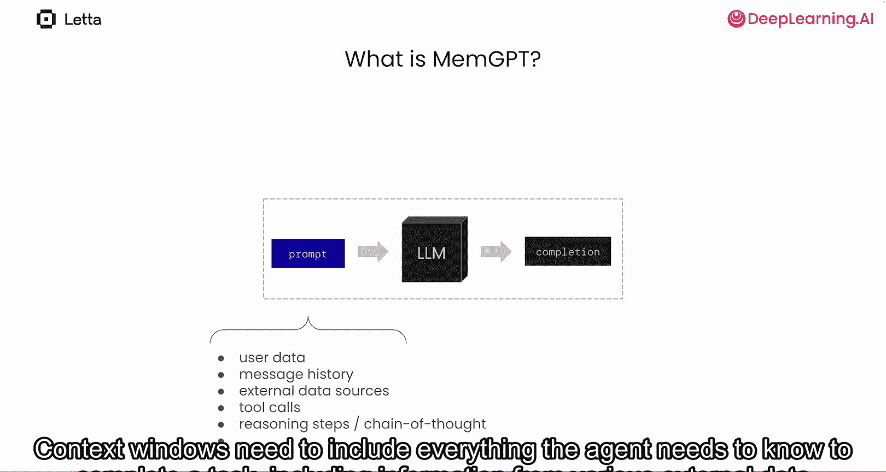
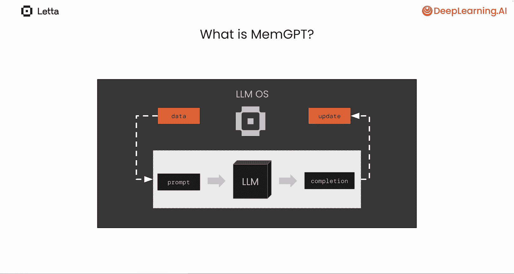
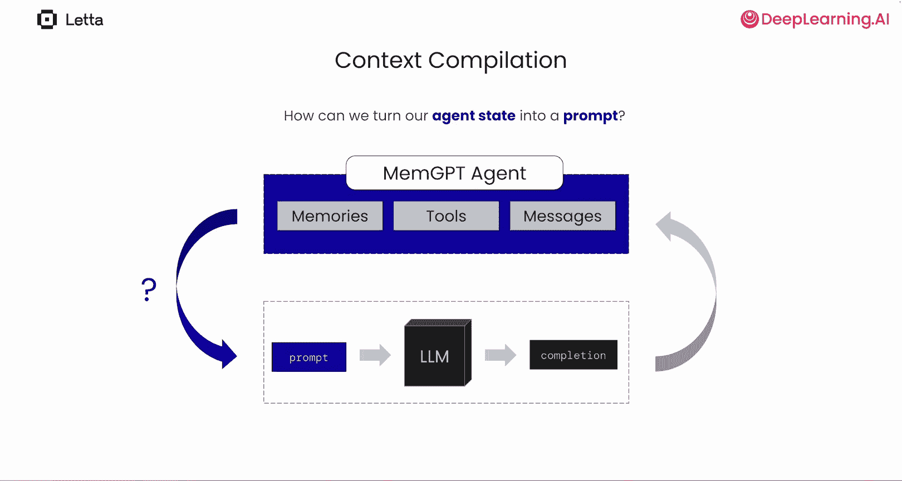
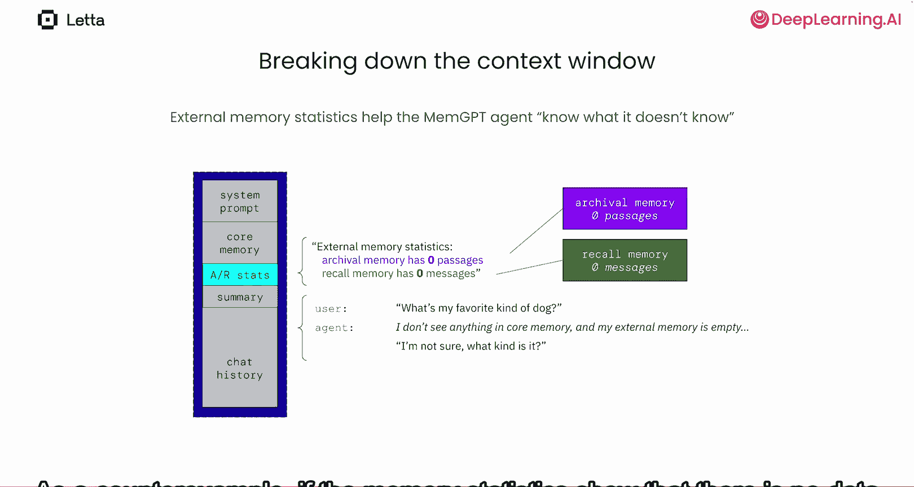
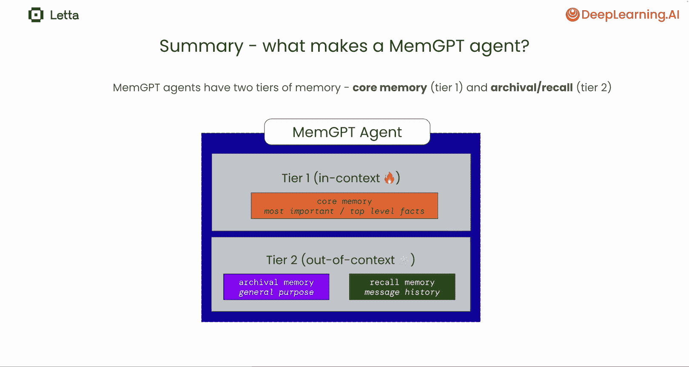
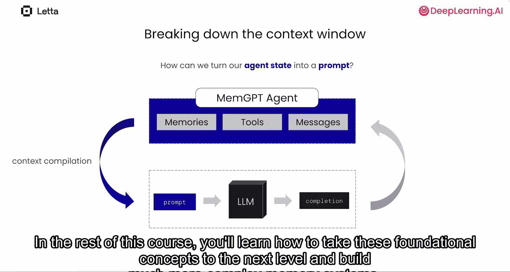

# 003：MemGPT 🧠

在本节课中，我们将学习MemGPT的核心思想。MemGPT通过让大语言模型（LLM）管理自身的上下文窗口，从而增强了智能体的能力。我们将探讨自编辑记忆、内心独白、心跳机制、上下文编译和虚拟上下文等关键概念。

## 什么是MemGPT？🤔

MemGPT研究论文提出了一种构建智能体的新思路。控制LLM智能体行为的主要方式是改变其输入或上下文窗口。然而，为LLM，特别是复杂的LLM智能体，构建一个最优的上下文窗口通常并不简单。

上下文窗口需要包含智能体完成任务所需的一切信息，这包括来自各种外部数据源的信息、用户数据、先前的消息、工具调用结果以及之前的推理步骤或思维链。

MemGPT研究论文展示了如何为你的LLM构建一个管理上下文窗口的操作系统，换句话说，一个执行内存管理的LLM操作系统。在MemGPT中，这个操作系统本身也是一个LLM智能体，因此内存管理是自动完成的。

## MemGPT的核心思想 💡

MemGPT研究论文背后有几个关键思想。第一个是**自编辑记忆**的概念。这指的是LLM编辑自身记忆的能力。在许多LLM应用中，系统指令或LLM的个性化信息是固定的。在MemGPT中，智能体可以根据聊天中学到的东西更新自己的指令或个性化信息。

第二个关键思想是**内心独白**。在MemGPT中，智能体总是在进行内部思考，即使它们不直接回复用户。在MemGPT中，智能体总是调用工具。例如，当智能体想与用户通信时，它必须调用`send_message`工具。智能体唯一不调用工具的时候，是当它在输出内心独白时。

MemGPT智能体被设计为在单次用户输入后运行多个LLM步骤。例如，如果用户要求智能体执行一项复杂任务，我们期望智能体运行多个步骤，因为它将问题的不同方面分解为子任务。

在MemGPT中，智能体能够通过**心跳**机制进行循环。每当MemGPT智能体调用一个工具时，它可以在任何工具中添加一个特殊的心跳请求，这将触发后续调用。

总而言之，这些能力——自编辑记忆、内心独白、工具输出、通过心跳循环——使得MemGPT智能体能够自主和自我改进。我们称MemGPT智能体为自主的，因为它们可以在循环中自行采取行动。我们称MemGPT智能体为自我改进的，因为它们可以随着时间的推移编辑自己的长期记忆。

## MemGPT智能体步骤示例 🔄

让我们通过一个MemGPT智能体步骤的示例。在这里，智能体收到用户的新消息：“My name is Sarah.”

MemGPT智能体首先生成一些内心独白：“The human shared their name. That seems like important information to remember. I agree.”

接下来，你可以看到智能体调用一个记忆函数，将这个新事实保存到其永久记忆库中。

然而，如果我们只允许智能体执行这一步，用户可能会感到困惑，因为智能体从未向用户发送任何回复。这里，Sarah说：“Hello, is anyone there?”

为了允许多步推理，MemGPT智能体可以使用特殊的心跳功能。通过在其调用的函数中添加一个特殊的请求心跳参数，MemGPT智能体就是在请求后续执行，基本上是循环。通过请求心跳，智能体可以运行多个步骤。现在它可以先编辑其长期记忆，然后通过调用`send_message`函数跟进对用户的回复。

这样用户就不会感到困惑了。

## 智能体状态与上下文编译 🗃️

构成我们智能体的所有不同数据统称为**智能体状态**。当我们在循环中运行LLM智能体时，循环中的每一步都在修改智能体状态。在大多数智能体框架中，这个智能体状态只是由程序内存中保存的不同Python变量组成。在MemGPT中，这个状态保存在数据库内部，因此智能体可以随着时间的推移而持久存在。例如，你可以关闭Python脚本并重新运行同一个智能体，你的MemGPT智能体会记住你上次运行它时的一切。

每次我们想让智能体执行一步时，我们必须决定如何将我们的智能体状态转换为将输入LLM的提示。归根结底，LLM只是一个接收令牌并输出令牌的机器。我们将从智能体状态到提示的过程称为**上下文编译**。

我们执行上下文编译的方式会极大地影响智能体的行为。例如，如果我们拥有的消息数量超过了提示或上下文窗口的容量，我们应该如何决定哪些消息应该省略，哪些消息应该包含？这就是MemGPT的全部意义所在。这些是LLM操作系统可以自动为你做出的重要决策。

## 上下文窗口的构成 🪟

让我们详细分解LLM提示或上下文窗口中的内容。在最流行的LLM API中，LLM输入分为两个部分：**系统提示**和**聊天历史**。

系统提示是指令，可以定制或改变LLM的行为，使其与基础LLM不同。在这个例子中，我们的系统提示非常简单：“You are a helpful assistant that answers questions.”

聊天历史包含用户与助手或智能体之间的消息列表。你可以将LLM的工作视为简单地根据当前聊天历史生成新的回复。一旦LLM生成新的回复，我们就可以将其添加到聊天历史的末尾。

在MemGPT中，我们在上下文窗口中创建了一个特殊部分，称为**核心记忆**。核心记忆用于存储关于用户的重要信息，以个性化智能体。想想你与朋友的对话如何不同于与陌生人的对话。这是因为你了解关于朋友的信息，这些信息调节或个性化对话。

在MemGPT中，系统提示还包括关于如何编辑核心记忆的信息。因此，MemGPT智能体既能看到上下文中的一个特殊保留部分用于长期记忆，也能理解如果它认为合适，它有权编辑这个记忆。

在这个简单的例子中，我们可以看到用户纠正了智能体记忆中的一个错误事实。用户问：“Who am I?” 智能体说：“I know your name is Charles and that you do AI research.” 然后用户说：“My name is actually Sarah. 😊” MemGPT智能体然后可以使用其核心记忆替换工具立即纠正其核心记忆中的这个错误事实。

## 核心记忆的定制与重要性 🎯

核心记忆可以定制。例如，我们可以将其分成不同的部分：一部分存储关于用户或人类的信息，另一部分存储关于智能体的信息。在本课程后面，你将学习如何创建定制的记忆模块。根据你希望智能体做什么，你可以使这个记忆模块尽可能简单或复杂。可能性是无限的。

MemGPT中的核心记忆赋予了智能体随时间学习的能力。请记住，核心记忆不仅仅是聊天历史中的另一条消息，它是上下文窗口的一个特殊保留部分，无论何时都对智能体始终可见。

为什么我们希望我们的智能体具有随时间学习的能力？随时间学习的能力是人类如此有用的部分原因。当我们犯错或接受额外训练时，我们会调整行为以改进。

你可能希望智能体具有持久记忆的一个原因是它们更具吸引力。例如，想象一下，如果用户问聊天机器人最喜欢哪种冰淇淋。这里，聊天机器人回复说它最喜欢的冰淇淋口味是香草。在大多数LLM聊天机器人中，没有持久记忆的概念，所以聊天机器人最终会忘记它说过自己最喜欢的口味是香草。因此，当用户后来提到聊天机器人早先的陈述时，聊天机器人会说一些完全不同的话。这只是长期记忆缺失如何完全破坏LLM应用沉浸感的一个简单例子。MemGPT智能体能够识别它陈述了一个偏好，并将这个偏好提交到长期记忆中。因此，如果用户问同样的问题，MemGPT智能体可以回复一个更真实的响应。

## 处理上下文溢出：召回记忆与归档记忆 📚

那么，当聊天历史空间不足时会发生什么？上下文窗口是有限的。因此，无论基础LLM的上下文窗口有多大，如果你的对话持续足够长，你最终都会在MemGPT中耗尽空间。当空间不足时，我们首先刷新或逐出聊天历史中的一大块消息，并用一个递归摘要替换它们。😊

我们称之为递归摘要，因为它总结了所有被逐出的消息，而这些消息本身可能包含先前生成的摘要。

许多智能体框架都有类似的技术，通过截断或删除聊天历史中的消息来处理上下文溢出，但这些消息通常是永久删除的。在MemGPT中，我们从不删除任何消息。相反，所有从上下文窗口逐出的消息都被插入到一个持久数据库中，我们称之为**召回记忆**。通过将旧消息移出聊天历史并放入召回记忆，我们可以释放聊天历史中的空间，同时确保完整的对话历史在需要时始终可供智能体使用。

与核心记忆使用工具来运作类似，召回记忆也使用工具。如果智能体想从召回记忆中检索一条消息，它可以使用`conversation_search`工具，该工具将搜索旧消息的数据库。可以将其想象成Facebook Messenger等聊天应用中的搜索工具。当聊天记录太长时，你可能使用搜索工具来查找旧消息，而不是滚动，因为消息太多无法滚动浏览。

在这个例子中，用户提到“Timber bit me”。因此，智能体使用搜索工具尝试查找与Timber相关的旧消息。搜索工具在数据库中执行，并将结果返回到聊天历史中。根据搜索结果，智能体能够推断出Timber是一只狗，并且Timber之前咬过用户。😊 智能体可以使用这些信息来制作一个引人入胜的回复，说：“I can’t believe your dog bit you again.”

## 核心记忆的限制与归档记忆 🗄️

核心记忆的大小也是有限的，类似于聊天历史。核心记忆的每个部分都有一个相关的字符限制。在这里，我们可以看到用户和智能体字段都有2000个字符的限制。作为开发者，你可以将此限制更改为你想要的任何值。基本的约束是，组合的系统提示、核心记忆、摘要和聊天历史必须全部一起适应你正在使用的基础LLM的上下文窗口。

你可能想知道，如果智能体在核心记忆中空间不足会发生什么？例如，这里用户表达了一个新事实，智能体希望将其保存到核心记忆的用户部分，但该部分空间不足。别担心，类似于聊天历史有一个称为召回记忆的无限二级存储，核心记忆也有一个无限的二级存储。我们称之为**归档记忆**。

MemGPT智能体决定哪些信息最重要，需要保留在核心记忆中，哪些应该存储在上下文窗口之外的归档记忆中。在这个例子中，智能体认为该信息不够重要，不足以放入核心记忆。因此，它将信息放入归档记忆中。你可以想象一个场景，智能体可能认为该信息足够重要，可以放入核心记忆。在那种情况下，智能体会首先通过将信息移入归档记忆来从核心记忆中逐出信息。😊 然后，在释放空间后，它会将其添加到核心记忆中。

你可以将归档记忆视为MemGPT智能体的通用数据存储。它是所有不够重要、无法始终固定在上下文窗口内的核心记忆中的一般信息。因为归档记忆作为一个通用概念，意味着你可以将其用于许多不同的事情。例如，你甚至可以使用归档记忆来存储代码或PDF文档。😊

在这个例子中，用户正在询问关于公司手册的问题。公司手册太大，无法存储在核心记忆中。因此，智能体决定将其放入归档记忆中。为了回答用户的问题，智能体将首先搜索归档记忆。智能体从手册中得到一个结果：“The company handbook says that the user can take unlimited vacation days. Good news, it’s unlimited!”

## 外部记忆统计与信息检索 🔍

因为归档记忆和召回记忆是外部存储，智能体实际上无法看到它们的内容，除非它明确使用其中一个搜索工具来获取信息。如果宝贵的信息存储在外部存储中，但所有外部存储都在上下文窗口之外，这就产生了一个问题：智能体首先如何知道去哪里寻找？

这就是**外部记忆统计**发挥作用的地方。在MemGPT中，上下文窗口有一个特殊部分，提供关于外部存储中内容的统计信息。例如，如果用户问了一个没有被核心记忆或聊天历史明确定义的问题，如果智能体看到有很多外部记忆，它将首先检查外部记忆，看看是否有相关信息。这里，记忆统计显示归档和召回都有数百个条目，因此当用户测试智能体关于他们最喜欢的狗时，智能体首先寻找相关数据并找到它。作为反例，如果记忆统计显示外部存储中没有数据，那么MemGPT智能体就根本不需要搜索外部存储，可以直接回复。

## 总结 📝

让我们总结一下到目前为止学到的内容。在MemGPT中，记忆有两个通用层级：在上下文窗口内的记忆和不在上下文窗口内的记忆。

在上下文之外的记忆中，我们区分两种类型的记忆：**召回记忆**，指的是消息历史；以及**归档记忆**，这是一个通用数据存储。

智能体由**智能体状态**组成，这包括智能体的记忆、工具和完整消息。在MemGPT中，这个智能体状态存储在数据库中，因此你的智能体可以永久持久存在。当我们运行LLM推理时，我们必须将这个智能体状态转换为提示，我们称这一步为**上下文编译**。

恭喜你，现在你知道了构建一个基本LLM操作系统所需的技术，它可以赋予你的LLM智能体长期持久记忆和高级多步推理能力。你学到的MemGPT背后的关键概念将使你能够构建需要智能体能够随时间记忆和学习的应用程序。在本课程的其余部分，你将学习如何将这些基础概念提升到新的水平，构建更复杂的记忆系统，以及编排多智能体系统，其中每个智能体都有自己的长期记忆系统。