# 004：4. 构建具有记忆的智能体 🧠

在本节课中，我们将学习如何使用 Lettra 框架创建和与 MGPT 智能体进行交互。我们还将深入了解智能体的状态，包括系统提示、工具和记忆。最后，我们会学习如何查看和编辑智能体的归档记忆。

---

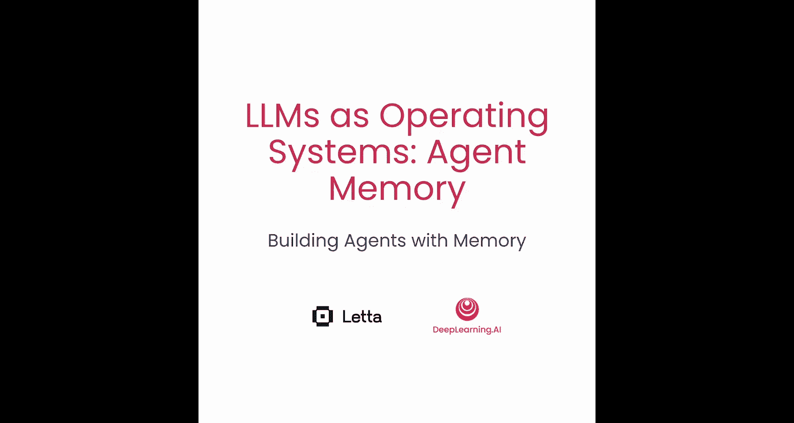


## 智能体状态与记忆概览

你可以使用 Lettra 来创建 MGPT 智能体。MGPT 智能体是有状态的，并且能显式地管理其上下文窗口中的特定部分。

在本节中，我们将介绍智能体状态的不同部分，以及归档记忆和回忆记忆。我们还将探讨如何通过控制以下几个“旋钮”来设计智能体：

*   **提示**：包括系统提示和定义智能体行为的人设。
*   **智能体的工具**。
*   **智能体管理和组织记忆的方式**。
*   **智能体记忆的内容**，包括核心记忆和归档记忆。

这些“旋钮”定义了在每一步中放入 LLM 上下文的内容，从而决定了智能体的行为。

---

## 导入辅助函数与设置客户端

首先，我们将导入一个辅助函数，它能让 MGPT 的响应打印输出更易读。

```python
from utils import print_messages
```

接下来，创建一个 Lettra 客户端。这个客户端也可以连接到 Lettra 服务器，但在这个例子中，我们将使用一个本地 Lettra 客户端的示例，它将在本地运行智能体推理。

```python
from lettra import LettraClient

client = LettraClient()
```

我们还将为此客户端设置默认配置，在本实验中我们使用 `gpt-4o-mini` 模型。

```python
client.set_default_model("gpt-4o-mini")
```

---

## 创建基础 MGPT 智能体

现在，让我们开始使用 Lettra 创建一个基础的 MGPT 智能体。

我们将这个智能体命名为 `simple_agent`，你也可以将其更改为你喜欢的任何名称。

首先，调用客户端的 `create_agent` 函数来创建智能体。这需要传入一个智能体名称，以及一个 `ChatMemory` 类的实例。

`ChatMemory` 类基本上代表了我们之前学到的核心记忆。在这里，我们传入一个 `human` 字符串来代表“人类”部分的初始核心记忆，以及一个 `persona` 字符串来代表“人设”部分的初始核心记忆。

*   对于 `human` 部分，我输入了“我的名字是 Sarah”，但你可以将其更改为你自己的名字，或者包含关于你自己的额外信息。
*   对于 `persona` 部分，我们告诉智能体：“你是一个乐于助人的助手，喜欢使用表情符号。” 这将定义智能体的个性，但由于它在记忆部分，所以仍然是可编辑的。

```python
from lettra import ChatMemory

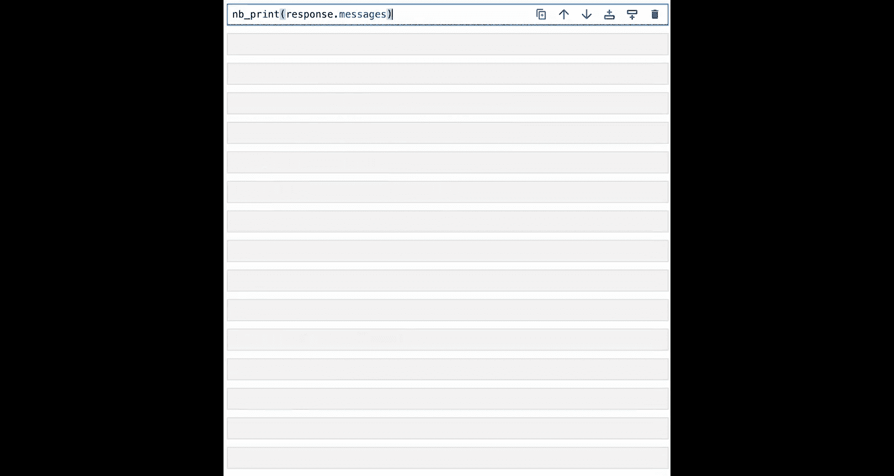

agent_state = client.create_agent(
    agent_name="simple_agent",
    memory=ChatMemory(
        human="我的名字是 Sarah",
        persona="你是一个乐于助人的助手，喜欢使用表情符号。"
    )
)
```

创建智能体后，我们现在可以向它发送消息。我们先发送一个非常简单的消息：“你好”。

```python
response = client.step(agent_state.agent_id, "你好")
```

这个响应会生成两个部分：使用情况统计和智能体返回的实际消息。

*   `usage` 统计对象显示生成响应所使用的完成令牌和提示令牌的数量。
*   我们可以使用导入的 `print_messages` 函数来打印响应消息。

```python
print_messages(response.messages)
```

你会注意到，智能体生成了一个解释其行为的**内部独白**。你可以利用这个独白来理解智能体为何如此行事。这个独白也有助于智能体花更多时间思考，以生成更好的回应。

我们还可以看到，MGPT 智能体实际上是在使用一个**工具**进行通信：通过 `send_message` 工具将消息发送回用户。这实际上允许智能体通过不同的媒介进行通信（例如，如果你想让它生成短信）。同时，这也允许智能体区分哪些信息发送给最终用户（即消息内容），哪些信息留给自己（如内部独白）。

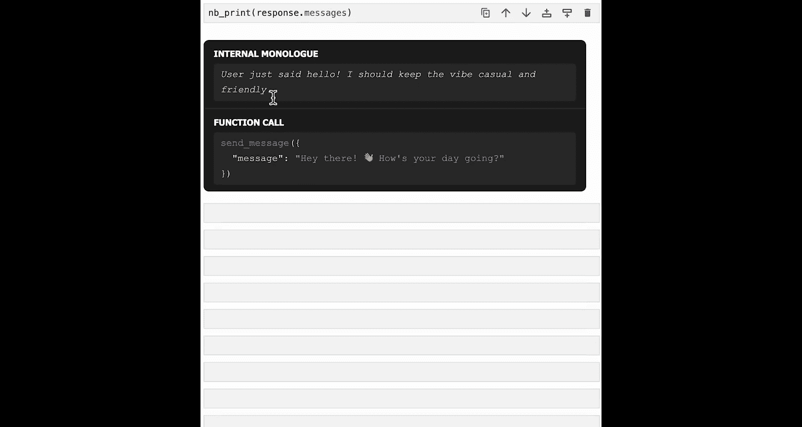

---

## 理解智能体状态的不同部分

智能体状态是我们创建智能体时返回的对象。它包含很多内容，但我们将逐步分解。

### 1. 系统提示

第一部分是**智能体系统提示**。它也定义了智能体的行为，类似于人设，但智能体无法编辑它。这是一个我们设计的非常长的系统提示，旨在让 MGPT 发挥最佳性能。

它包含诸如尝试覆盖智能体创建者信息（因为许多 LLM 有自己的系统提示，会说“我是由 OpenAI 或 Anthropic 创建的”）、控制流信息、不同用户事件、基本功能（如内部思考、发送消息）的描述，以及关于记忆编辑（应如何进行及其指令）、回忆记忆、对话历史、核心记忆及其不同区块、归档记忆等的描述。

这是一个非常长的系统提示，有时为了真正优化智能体的行为，编辑系统提示可能很重要。

```python
print(agent_state.system)
```

### 2. 工具列表

智能体状态的另一个部分是智能体可以访问的**工具列表**。默认工具包括：
*   发送消息 (`send_message`)
*   暂停心跳以停止智能体循环 (`pause_heartbeat`)
*   搜索对话历史 (`conversation_search`)
*   插入到归档记忆 (`archival_memory_insert`)
*   搜索归档记忆 (`archival_memory_search`)
*   追加和替换核心记忆 (`core_memory_append`, `core_memory_replace`)

通过共同使用这些工具，MGPT 智能体能够控制它们的记忆。

```python
print(agent_state.tools)
```

### 3. 核心记忆

我们还可以查看智能体**核心记忆**中的内容，通过访问智能体状态中的 `memory` 字段来实现。

```python
print(agent_state.memory)
```

这将返回一个内存对象，其中包含多个区块。我们将在后面的课程中更详细地介绍这些区块的具体含义。

---

## 查看归档记忆与回忆记忆

除了智能体状态，我们还可以使用智能体的 ID 来获取其归档记忆的摘要。

目前，我们还没有向归档记忆中放入任何内容，智能体也没有，所以它是空的。

```python
archival_memory = client.get_archival_memory(agent_state.agent_id)
print(archival_memory)
```

同样，我们也可以获取回忆记忆的摘要。因为我们已经与智能体交换了几条消息，所以回忆记忆中已经有一些消息了。

```python
recall_memory = client.get_recall_memory(agent_state.agent_id, count=10)
print(recall_memory)
```

我们还可以获取智能体的原始消息历史记录，查看其中的单个消息，以准确理解智能体的执行轨迹。

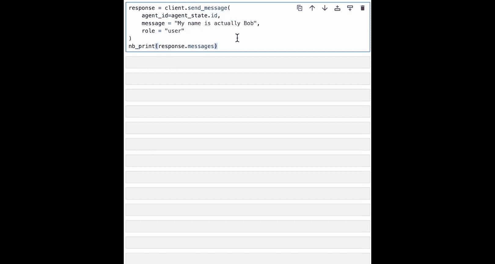

```python
message_history = client.get_message_history(agent_state.agent_id)
print(message_history)
```

---

## 编辑核心记忆

核心记忆是智能体的上下文内记忆。MGPT 的独特之处在于，它实际上可以使用工具编辑自己的核心记忆。

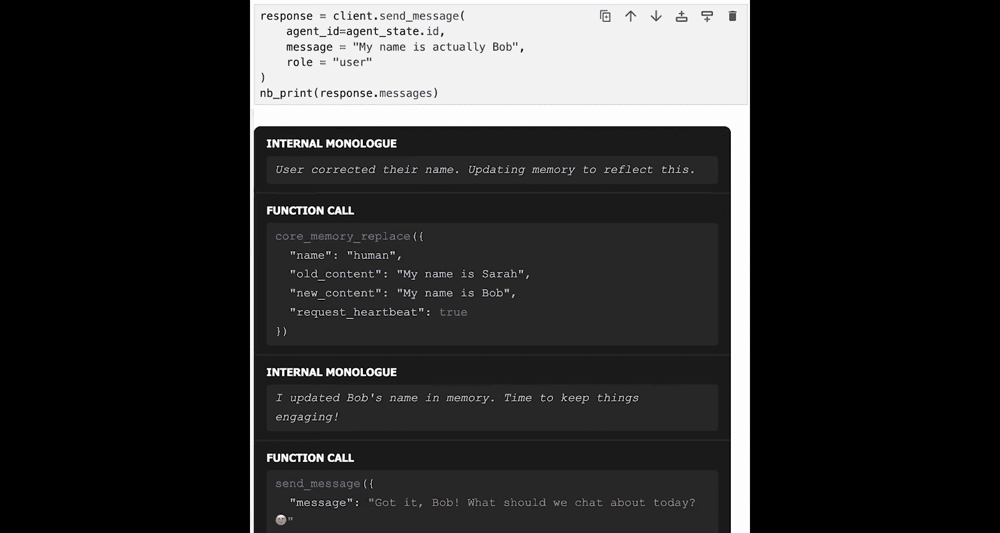

以下是一个示例：我们可以使用智能体的 ID 向其发送一条消息，告诉它“我的名字实际上是 Bob”，尽管我之前告诉它我的名字是 Sarah。或者，你也可以让智能体添加你最初未包含在 `human` 字符串中的关于你的额外信息。

```python
response = client.step(agent_state.agent_id, "我的名字实际上是 Bob。")
print_messages(response.messages)
```

智能体应该更新记忆以反映这一点。你可以看到它调用了 `core_memory_replace` 函数，知道需要更新记忆的 `human` 部分，将内容从“我的名字是 Sarah”替换为“我的名字是 Bob”。完成此函数调用后，它意识到已成功更新记忆，然后知道要发送给用户的消息：“明白了，Bob。我们今天聊点什么？” 当然，还包含一个表情符号。

人设记忆部分和系统提示在定义我们希望智能体表现出的行为方面非常相似。这意味着我们实际上可以让智能体编辑其关于自己应该做什么的记忆。

到目前为止，我们有一个非常友好的智能体，在其消息中使用了很多表情符号。但在我们给出以下反馈后，我们期望它在未来可能发送的任何消息中**永远不再使用表情符号**。

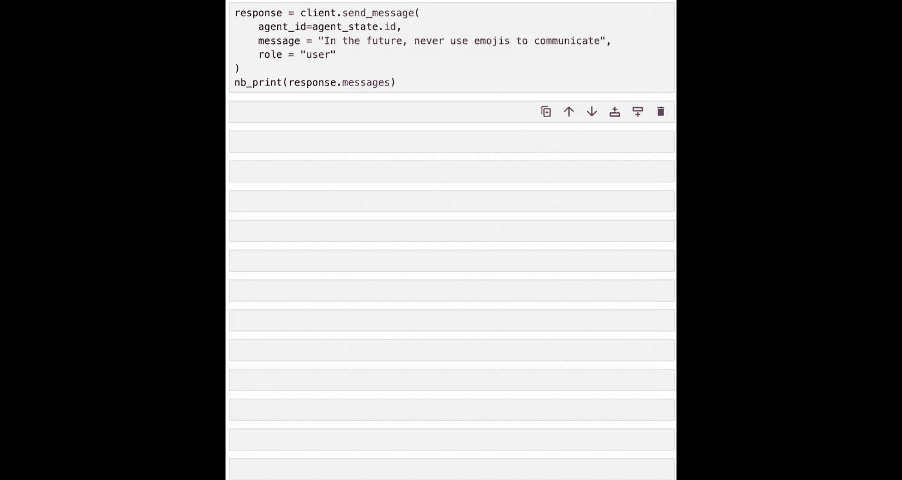

```python
response = client.step(agent_state.agent_id, "请不要在消息中使用表情符号。")
print_messages(response.messages)
```

我们可以看到，智能体意识到用户更喜欢在以后的互动中不再使用表情符号。与上一个例子类似，我们看到它调用了 `core_memory_replace`，根据 Bob 的偏好，将“喜欢使用表情符号”替换为“不使用表情符号”。最后，它发送了这条消息：“明白了，Bob。以后不会再使用表情符号了。”

这真的很酷，因为我们可以随着时间的推移调整智能体的行为。当人类用户向智能体提供反馈时，智能体实际上可以利用这些反馈进行改进。这些反馈也将包含在将来所有发送给 LLM 的消息中，因为它位于每次请求都会发送的记忆中。

我们可以使用智能体 ID 检索智能体的当前记忆，然后获取 `persona` 区块，以查看智能体记忆中字符串的确切值。

```python
current_memory = client.get_memory(agent_state.agent_id)
print(current_memory.persona)  # 输出：你是一个乐于助人的助手，不使用表情符号。
```

这基本上反映了我们之前看到的变化。

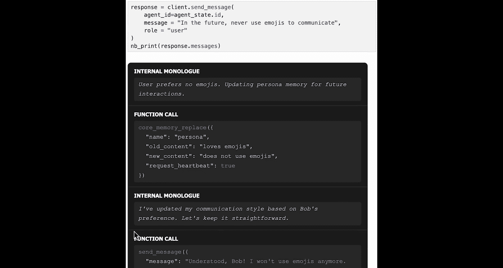

---

## 深入归档记忆

MGPT 智能体拥有长期记忆，即**归档记忆**，它将数据持久化到外部数据库中。这意味着智能体可以在其大小受限的上下文窗口之外，拥有额外的空间来写入信息。

我们可以通过调用 `get_archival_memory` 来查看智能体归档记忆中的内容。目前它是空的。智能体会根据需要随时间添加归档记忆，但我们也可以明确建议智能体应该向归档记忆中添加一些内容。

在这里，我们告诉智能体：“将信息‘Bob 爱猫’保存到归档记忆中。” 你也可以将字符串“Bob 爱猫”更改为与你自己相关的特定内容。

```python
response = client.step(agent_state.agent_id, "请将信息‘Bob 爱猫’保存到归档记忆中。")
print_messages(response.messages)
```

与前面的例子一样，智能体再次进行了内部独白，意识到需要调用 `archival_memory_insert` 工具，并这样做了，插入了“Bob 爱猫”的数据。完成后，它向用户确认已进行了此调整，并跟进了一些相关的对话：“你喜欢什么样的猫？”

现在，如果我们获取归档记忆，应该会看到里面有一些内容。

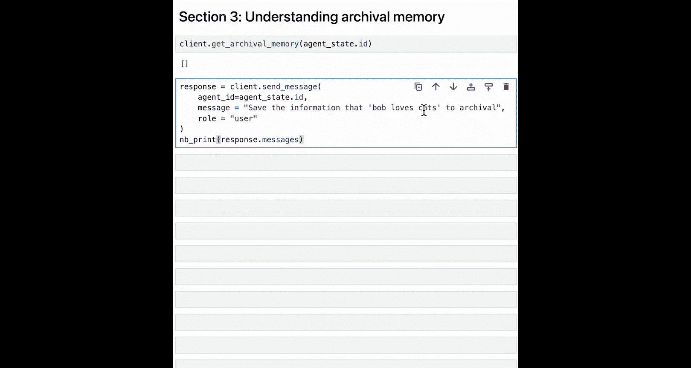

```python
archival_memory = client.get_archival_memory(agent_state.agent_id)
print(archival_memory)
```

我们也可以只获取文本。

```python
archival_memory_text = client.get_archival_memory_text(agent_state.agent_id)
print(archival_memory_text)
```

现在我们看到，归档记忆中的第一行文本是“Bob 爱猫”，数据已成功添加。

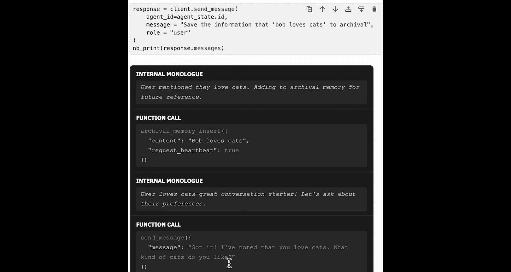

---

## 手动操作归档记忆与基于记忆的响应

我们刚刚看到了智能体如何插入到其归档记忆中的示例。但作为用户，我们也可以手动将记忆插入到智能体的归档记忆中。

使用智能体 ID，我们可以插入“Bob 爱波士顿梗犬”到其归档记忆中。

```python
inserted_passage = client.insert_archival_memory(agent_state.agent_id, "Bob 爱波士顿梗犬。")
print(inserted_passage)
```

这将返回插入的段落，包含文本、使用的嵌入信息、添加日期和其他一些内容。

现在，智能体的归档记忆中应该有两个记忆。我们可以尝试问：“我喜欢什么样的动物？”

```python
response = client.step(agent_state.agent_id, "我喜欢什么样的动物？")
print_messages(response.messages)
```

根据归档记忆搜索的结果，智能体进行了一些关于根据这些结果继续对话的内部独白，然后发回消息：“你爱猫和波士顿梗犬。” 接着它还试图通过提问“你更喜欢哪一个呢？”来保持对话的吸引力。

这是一个示例，展示了智能体如何利用其归档记忆中的内容，向用户生成信息更丰富的回应。

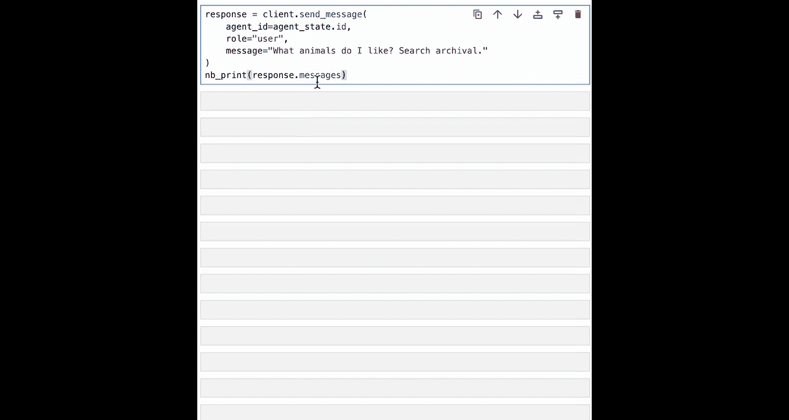

---

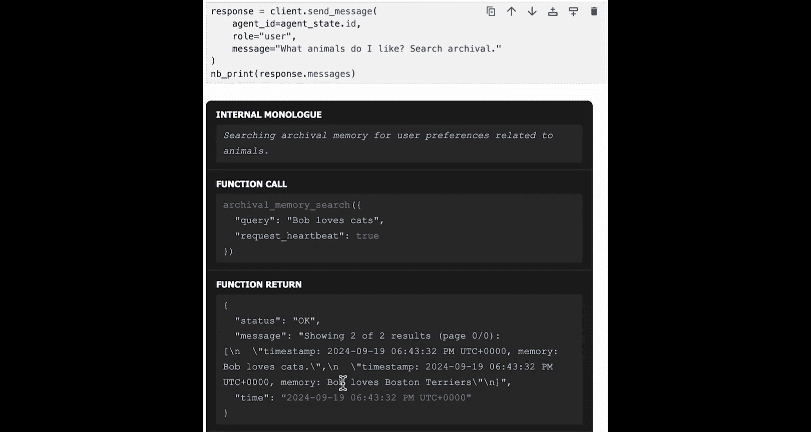

## 总结 🎉

在本节课中，我们一起学习了如何构建一个具有记忆的 MGPT 智能体。

1.  **创建智能体**：我们使用 Lettra 框架和 `ChatMemory` 初始化了一个基础的 MGPT 智能体，并设置了其初始人设和用户信息。
2.  **理解智能体状态**：我们剖析了智能体状态的关键组成部分，包括不可编辑的**系统提示**、可用的**工具集**以及可编辑的**核心记忆**。
3.  **与记忆交互**：
    *   **核心记忆**：我们实践了如何通过对话让智能体**动态编辑**其核心记忆（如更新用户姓名、修改行为偏好），使其行为能适应用户反馈。
    *   **归档记忆**：我们探索了智能体的长期存储。我们既指导智能体**自动添加**重要信息到归档记忆，也学会了如何**手动插入**记忆。最后，我们看到了智能体如何**检索并利用**归档记忆中的信息来生成更准确、更相关的回答。

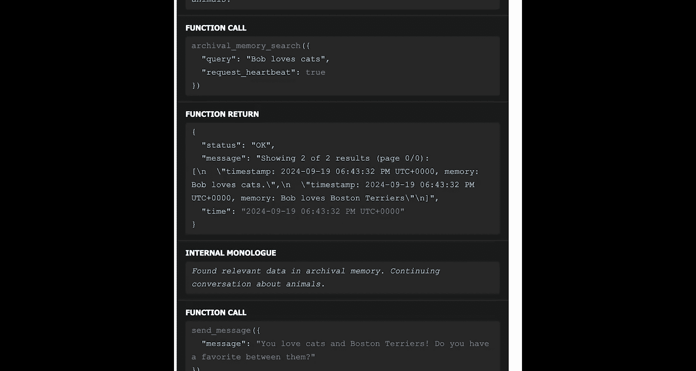

恭喜！你现在已经能够创建一个具备自我管理记忆能力的 MGPT 智能体了。在未来的课程中，我们还将介绍如何为核心记忆实现更高级的功能，以及如何扩展 MGPT 智能体的 RAG（检索增强生成）能力。