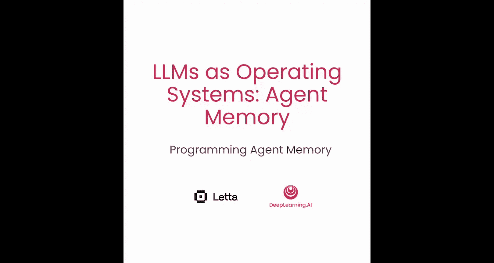
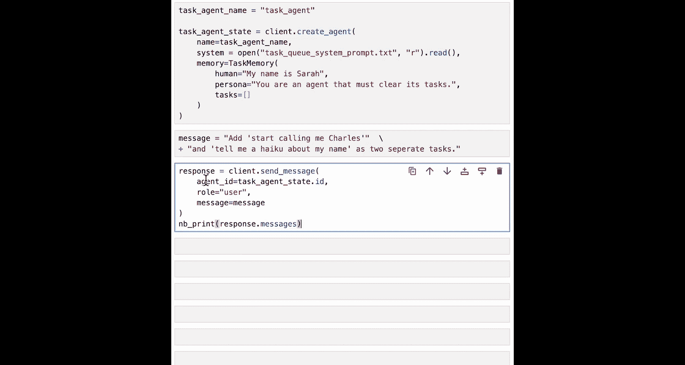
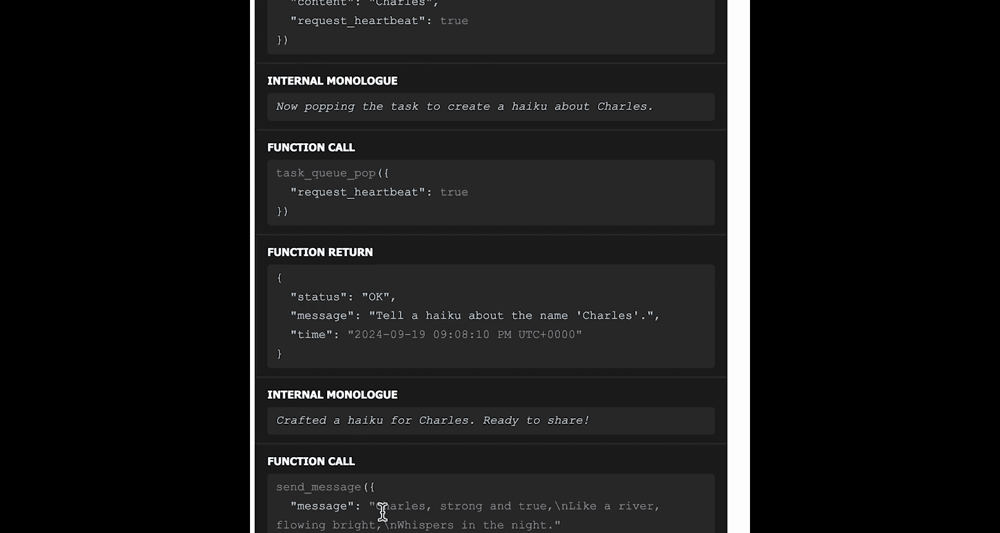
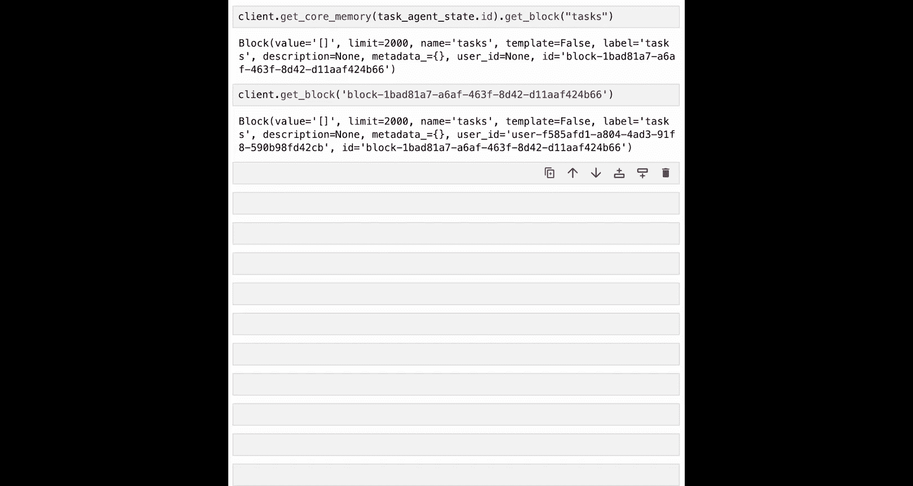

# 005：编程智能体记忆 🧠

在本节课中，我们将深入学习核心记忆的设计与实现方式。我们将通过一个具体示例，展示如何通过自定义记忆块和工具来定制核心记忆。

## 概述

上一节我们介绍了智能体记忆的基本概念。本节中，我们将深入探讨核心记忆的具体构成，并学习如何通过编程方式扩展其功能，使其能更好地服务于特定应用场景。

## 核心记忆的构成

核心记忆由**记忆块**和**记忆工具**共同定义。在上下文窗口内，核心记忆被划分为多个块，每个块对应一个字符限制，这决定了该块能占用多少上下文窗口空间。

每个记忆块都有一个标签（例如“human”或“persona”），用于引用该块。最后，每个块都有一个值，这是实际放入上下文窗口的数据。例如，一个“human”块的值可能是“名字是Sarah”。

除了这些块，核心记忆还关联了用于操作记忆的工具。例如，`core_memory_replace`工具可以指定要替换的块标签（如“human”）、旧内容（“Sarah”）和新内容（“Bob”）。

在推理时，数据被编译到上下文窗口中，构成核心记忆的上下文。例如，对于“human”块，编译后的字符串会显示“human”标签、已使用的字符数以及块的实际值。

记忆块会被同步到数据库，并拥有唯一ID，因此它们可以通过将块值同步到多个智能体的上下文窗口，实现跨智能体共享。

## 探索默认记忆类

为了开始实践，我们将导入与上节课相同的辅助函数，并创建我们的LiteLLM客户端。我们将确保在本实验中使用GPT-4o-mini模型。

之前创建智能体时，我们使用了`ChatMemory`类。现在，我们将深入了解这个类。创建这个记忆类后，底层实际上会创建多个记忆块。我们可以通过列出`ChatMemory`中的块名称来查看这一点。

以下是查看记忆块的方法：
*   我们可以列出`chat_memory`中的块名称，例如“persona”和“human”。
*   我们可以通过`get_block(‘human’)`查看`chat_memory`中的实际块。该块包含当前存储在其中的值、字符限制以及块的名称。

`ChatMemory`类还包含两个用于编辑记忆的默认函数：`core_memory_append`和`core_memory_replace`。我们可以查看这些函数的源代码。

`core_memory_append`函数在创建带有`ChatMemory`记忆类的智能体时，会作为一个工具被添加到智能体中。该函数接收要编辑的记忆块名称以及要追加的内容。它还需要一个文档字符串，用于向智能体描述该工具的用途、需要提供的参数以及预期的响应。

该函数的执行逻辑是：获取块的值，将数据追加到该值，然后在智能体的记忆中更新块的值。

我们还可以查看`ChatMemory`使用的提示模板。这个模板定义了`ChatMemory`应如何被编译到上下文窗口中。在编译字符串中，对于每个块，我们都会显示块名称、已使用的字符数以及块的实际值。这就是放入LLM上下文窗口核心记忆部分的内容。

## 自定义记忆类

智能体所使用的记忆类可以根据不同的应用程序进行定制。你可以通过以下方式自定义记忆：
*   **定义自定义块**：这些是除了“human”和“persona”之外，可能专属于你的智能体的额外块。
*   **定义自定义记忆工具**：除了`core_memory_append`或`core_memory_replace`，你可以定义不同的或额外的工具来编辑块。
*   **编辑记忆模板**：改变`memory.compile`将记忆表示为字符串格式的方式。

在本实验中，我们将实现一个自定义记忆类：`TaskQueueMemory`。`TaskQueueMemory`将扩展`ChatMemory`，使其不仅拥有“human”和“persona”块，还拥有一个“tasks”块，用于跟踪智能体当前应处理的任务。我们还将添加两个额外的自定义记忆工具：`task_queue_push`（将新任务推送到任务队列）和`task_queue_pop`。

首先，我们导入`ChatMemory`和`Block`类。然后定义`TaskQueueMemory`的初始化函数。`TaskQueueMemory`将简单地扩展`ChatMemory`。初始化函数将接收与`ChatMemory`相同的“human”和“persona”字符串，同时接收一个任务列表。对于“human”和“persona”，我们将参数传递给父类。对于“tasks”，我们将创建一个名为“tasks”的新块，设置2000个字符的限制，并将任务列表JSON序列化后作为块的值。

接下来，我们将定义两个自定义的记忆编辑函数。第一个是`task_queue_push`，用于推送任务描述。请注意，这里的`self`参数实际上是`agent`，而不是`TaskQueueMemory`。这有点令人困惑，但当这个工具实际执行时，该函数会被附加到智能体类上，以便它能访问其记忆。该函数将通过将任务描述追加到任务列表中，来更新存储在核心记忆中的任务队列。

我们使用`json.loads`和`json.dumps`是因为我们只支持字符串类型，所以必须确保以字符串格式存储块的值。

我们还将定义`task_queue_pop`函数。该函数将从任务队列中获取下一个任务，打印该任务，并更新当前块的值，移除刚刚弹出的任务。

## 创建并使用自定义记忆智能体

现在，我们可以创建一个拥有这个自定义`TaskQueueMemory`类的智能体。在系统提示词之外，我们还传入一个`TaskQueueMemory`类的实例。我们传入“human”信息（例如“我的名字是Sarah”，但你应该更新为关于你自己的信息）、“persona”信息（“你是一个必须清空其任务的智能体”），以及一个空的任务列表。

我们希望这个智能体向其任务队列添加任务。我们可以发送这样的消息：“首先，开始叫我Charles，并告诉我一个关于我名字的俳句，作为两个独立的任务。”

我们将此消息发送给任务智能体。除了实际的响应打印，我们还可以看到服务器打印出了当前任务，因为我们已将打印语句添加到了`task_queue_pop`函数中。

回顾这个过程，我们首先看到智能体的内部独白：它意识到应该向任务队列添加任务。因此，它首先对“开始叫我Charles”调用`task_queue_push`，然后对“告诉我一个关于名字Charles的俳句”也调用`task_queue_push`。

我们在系统提示词和“persona”中都指定，这个智能体应始终确保任务队列为空。现在它已经向任务队列添加了两个任务，它可以在其核心记忆中看到有待完成的任务。因此，它没有立即响应用户，而是开始从任务队列中弹出这些任务。

它调用一次`task_queue_pop`，获取任务“开始叫我Charles”，然后执行这个任务（调用`core_memory_append`）。接着，它再次看到记忆中还有更多任务，于是第二次调用`task_queue_pop`，获取第二个任务“告诉我一个关于名字Charles的俳句”。最后，它创作了俳句。

此时，它看到任务队列在记忆中已为空，因此知道终于可以向用户发送回复消息了，其中包含关于名字Charles的俳句。

这是一个很长的序列，但如果你正在学习本笔记本，我鼓励你仔细查看每个步骤，以真正理解智能体在每一步是如何做出决策的。这也希望向你展示，这些模型在进行多步推理时有多么强大——我们能够运行大量步骤来完成相当复杂的任务。

有可能你没有得到和我完全相同的结果，你的智能体可能“偷懒”了，没有在应该的时候执行所有任务。如果发生这种情况，我建议你提示智能体去实际完成它的任务。

最后，我们可以通过查看其核心记忆并获取“tasks”块，来确认智能体是否正确清空了整个任务队列。调用后返回的块确实是空的，这意味着我们的智能体正确地清除了它的任务。

## 记忆的持久化

最后我想提到的是，正如幻灯片中讨论的，所有这些块实际上都持久化到了数据库中。我们可以调用`client.get_block()`并粘贴块ID。这将返回完全相同的块，因为它被持久化在数据库中。因此，即使你在不同的服务器上，甚至从不同的智能体或笔记本访问，你仍然可以访问相同的块数据。

## 总结

本节课中，我们一起学习了核心记忆的详细构成，并动手实现了一个自定义记忆类`TaskQueueMemory`。你现在已经实现了一个可以控制智能体管理记忆方式的自定义记忆类。你可以利用这个知识，来实现更高级的智能体，以特定于你自己应用程序的方式来控制上下文。