# 006：6.L5 Agentic RAG 与外部内存 🧠

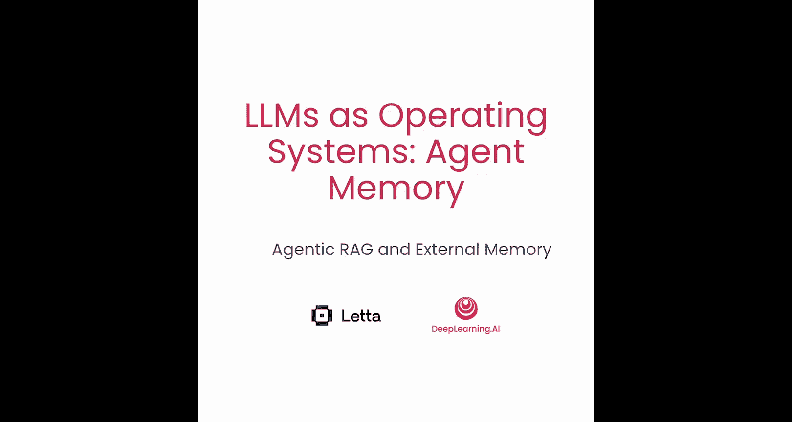


在本节课中，我们将解释外部内存与RAG（检索增强生成）之间的关系，并通过两种方式实现Agentic RAG。首先，我们将数据直接复制到智能体的归档内存中；其次，我们将为智能体提供一个LangChain工具来查询网络。我们将构建一个研究智能体来演示这些概念。

## 概述

上一节我们介绍了智能体如何使用外部内存。本节中，我们来看看如何利用这些内存来实现更智能的检索增强生成（Agentic RAG）。与传统的RAG不同，Agentic RAG允许智能体自主决定**何时**以及**如何**检索数据，例如，它能够自行决定向搜索功能发送什么样的查询。

## 实现方式一：加载数据到归档内存

首先，我们将学习如何以用户身份手动将数据加载到智能体的归档内存中。

以下是实现步骤：

1.  **导入必要的库并设置环境**：我们需要导入常用工具并设置环境变量，以便使用Tavily搜索。同时创建LiteLLM客户端并设置默认语言模型。
    ```python
    import os
    from litellm import LiteLLM

    # 设置环境变量和客户端
    client = LiteLLM()
    client.set_default_model('gpt-4o-mini')
    ```

2.  **创建数据源**：使用`client.create_source`函数创建一个数据源，例如命名为“员工手册”。数据源会配置一个嵌入模型，用于为源内数据生成向量。
    ```python
    source = client.create_source(name="employee handbook")
    ```

3.  **加载文件到数据源**：将一个文件（如`handbook.pdf`）加载到刚创建的数据源中。数据会被预处理（分块并生成嵌入）。
    ```python
    client.load_into_source(source_id=source.id, file_path="handbook.pdf")
    ```

4.  **创建智能体并附加数据源**：创建一个基础的MCPT智能体，然后将数据源附加到该智能体。附加操作会将源中的数据**复制**到智能体的归档内存中。
    ```python
    agent = client.create_agent(name="HR Assistant")
    client.attach_source(agent_id=agent.id, source_id=source.id)
    ```

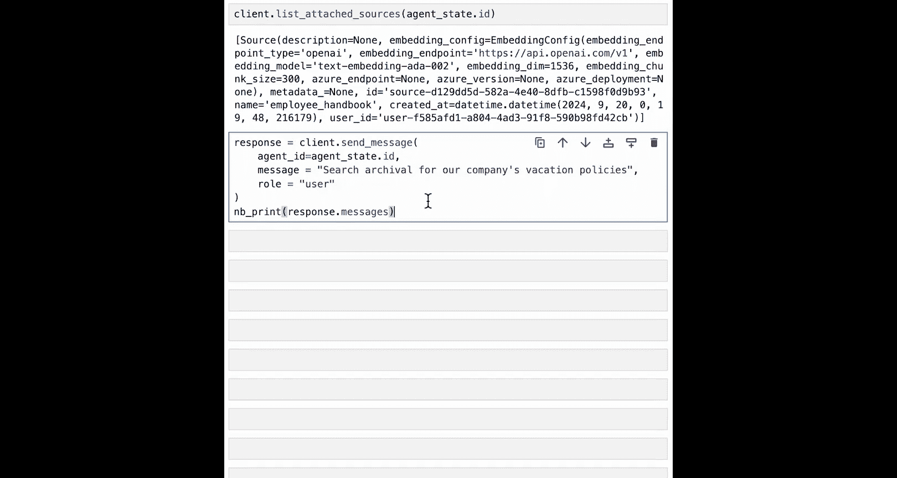

5.  **进行查询**：现在可以向智能体提问，例如询问公司休假政策。智能体会意识到需要从归档内存中搜索信息，并自动执行检索。
    ```python
    response = agent.chat("搜索归档内存：公司的休假政策是什么？")
    print(response)
    ```
    智能体的内部思考过程会决定查询词（如“vacation policies”），检索相关数据片段，并基于检索到的信息生成回答。

## 实现方式二：通过自定义工具连接外部数据

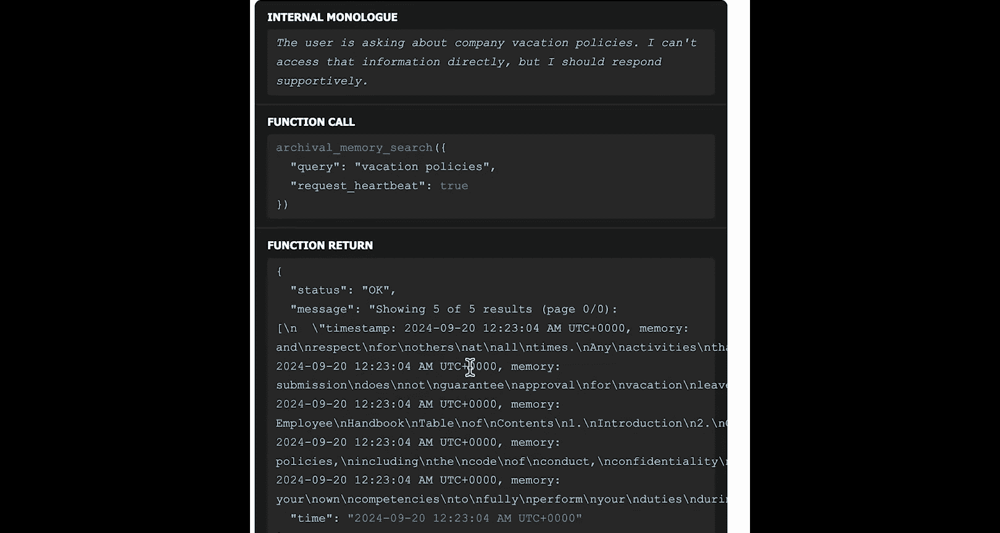

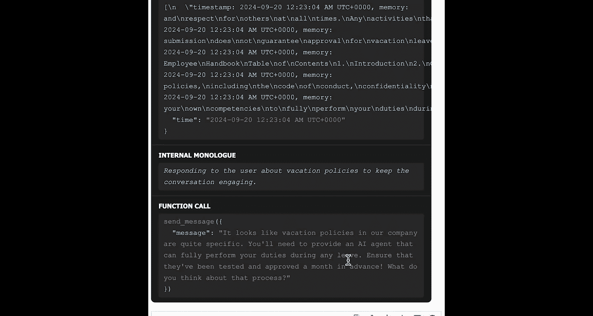

除了使用归档内存，我们还可以为智能体添加自定义工具来直接查询外部数据管道。

以下是具体方法：

1.  **创建自定义查询函数**：例如，我们创建一个模拟的生日数据库查询函数。
    ```python
    birthday_db = {"Andrew": "March 6, 1997"}

    def query_birthday_database(name: str) -> str:
        """根据姓名查找生日。"""
        return birthday_db.get(name, "未找到该姓名")
    ```

2.  **将函数注册为工具**：使用`client.create_tool`函数，LiteLLM会自动解析函数的文档字符串，为其生成OpenAI JSON格式的模式定义。
    ```python
    birthday_tool = client.create_tool(func=query_birthday_database)
    ```

3.  **创建能使用该工具的智能体**：在创建智能体时，指定它可以使用的工具，并为其设定相应的角色描述。
    ```python
    persona = "你是一个可以访问生日数据库的助手，可以帮用户查询生日信息。"
    birthday_agent = client.create_agent(
        name="Birthday Agent",
        tools=[birthday_tool],
        memory_config=ChatMemory(persona=persona)
    )
    ```

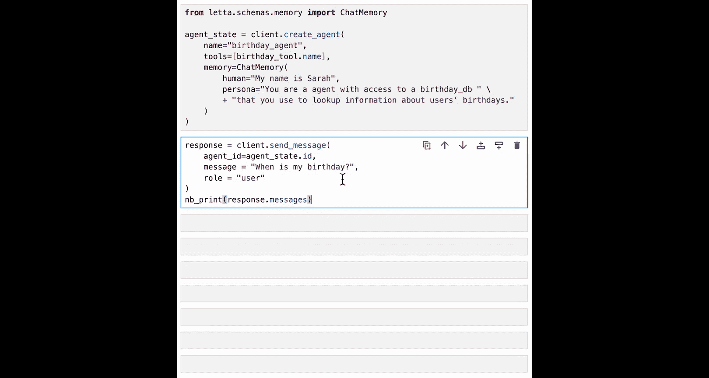

4.  **进行查询**：当用户询问“我的生日是什么时候？”时，智能体会决定调用`query_birthday_database`工具，获取结果后生成回复。
    ```python
    response = birthday_agent.chat("我的生日是什么时候？")
    print(response)
    ```

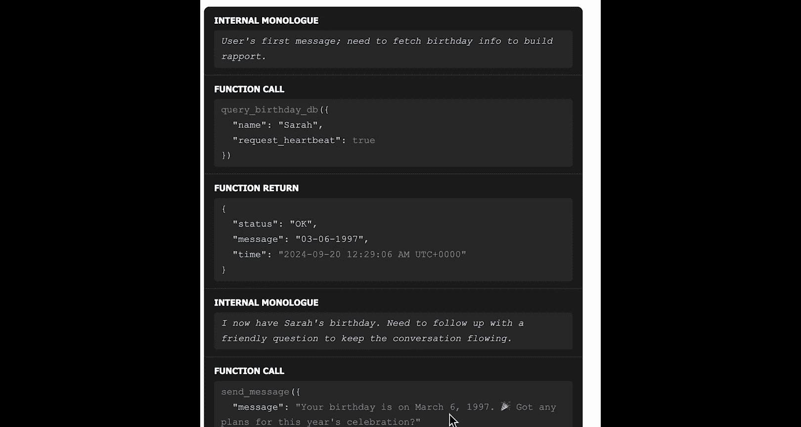

## 实现方式三：集成LangChain工具进行网络搜索

LiteLLM支持集成LangChain和LlamaIndex的工具。接下来，我们创建一个能进行网络搜索并引用来源的研究智能体。

以下是操作步骤：

1.  **设置Tavily搜索工具**：导入Tavily API密钥和LangChain的搜索工具。
    ```python
    from langchain_community.tools import TavilySearchResults
    os.environ["TAVILY_API_KEY"] = "your_api_key"
    search_tool = TavilySearchResults()
    ```

2.  **将LangChain工具转换为LiteLLM工具**：使用`Tool.from_langchain`方法进行转换，并持久化该工具。
    ```python
    from litellm.tools import Tool
    lite_tool = Tool.from_langchain(search_tool)
    lite_tool.persist()
    ```

3.  **创建研究智能体**：定义智能体的角色，指示它使用搜索工具并引用来源。
    ```python
    research_persona = """
    你是一个研究助手。你可以使用名为‘tavily_search’的工具来搜索网络以回答问题。
    在你的回答中，请务必提供引用来源的链接。
    """
    research_agent = client.create_agent(
        name="Research Agent",
        tools=[lite_tool],
        memory_config=ChatMemory(persona=research_persona)
    )
    ```

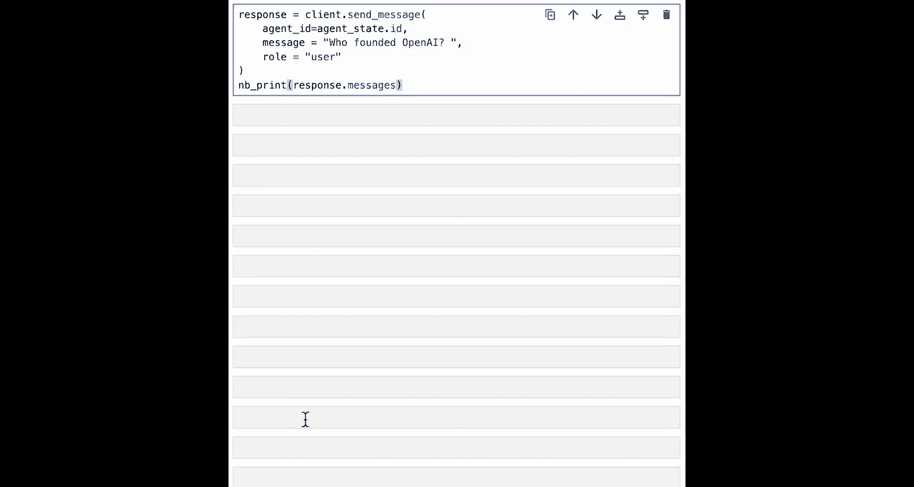

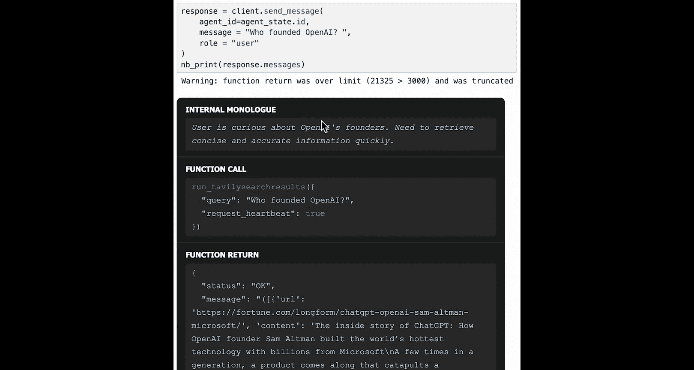

4.  **进行查询**：向智能体提问，例如“谁创立了OpenAI？”。智能体会调用搜索工具，获取网络信息，并生成带有引用的回答。LiteLLM框架会自动处理过长的工具返回结果。
    ```python
    response = research_agent.chat("谁创立了OpenAI？")
    print(response)
    ```

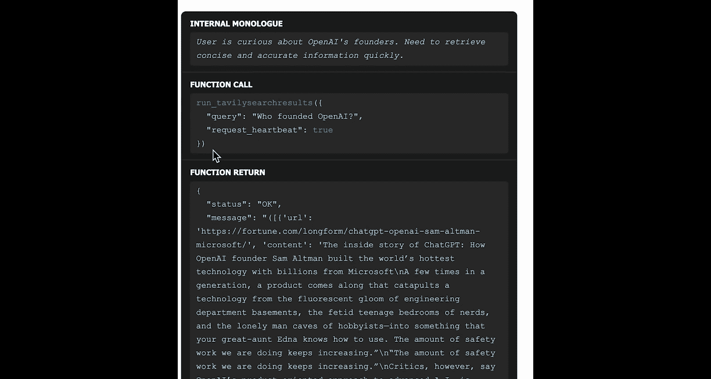

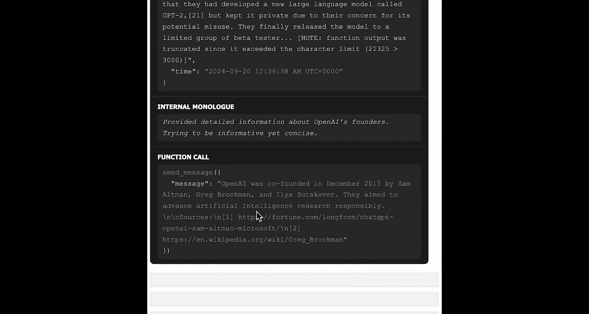

5.  **（可选）使用更强大的模型**：如果默认模型（如GPT-4o-mini）效果不佳，可以指定使用GPT-4等模型，但需注意其成本和延迟更高。
    ```python
    from litellm import LLMConfig
    gpt4_config = LLMConfig(model="gpt-4")
    gpt4_agent = client.create_agent(
        name="GPT-4 Search Agent",
        tools=[lite_tool],
        llm_config=gpt4_config,
        memory_config=ChatMemory(persona=research_persona)
    )
    ```

## 总结

本节课中，我们一起学习了Agentic RAG与外部内存的三种集成方式：

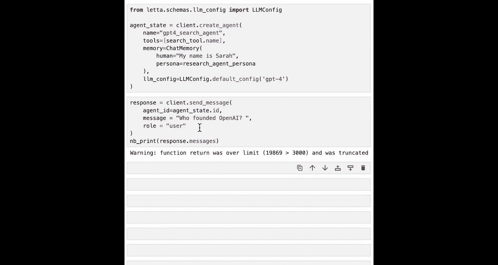

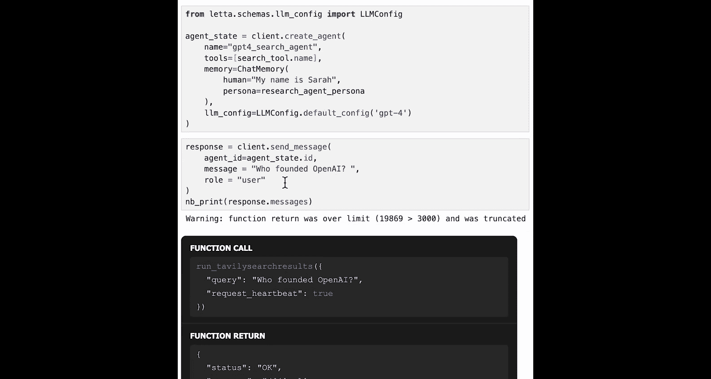

1.  **数据加载到归档内存**：用户可以将文件数据预加载到智能体的归档内存中，智能体在需要时自动检索。
2.  **自定义工具连接数据库**：通过创建自定义函数工具，智能体可以直接查询外部数据库或API。
3.  **集成现有框架工具**：利用LiteLLM对LangChain等框架工具的支持，可以快速为智能体赋予网络搜索等强大能力，同时享受MCPT智能体的记忆功能。

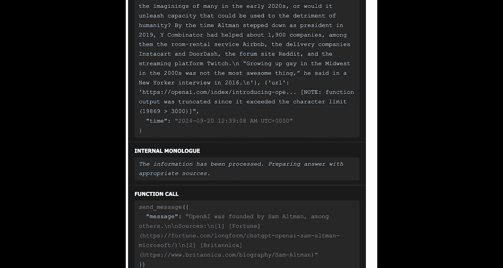

这些方法提供了灵活性，允许你根据已有的数据管道和工具栈，构建出功能丰富、能够自主决策检索行为的智能体。