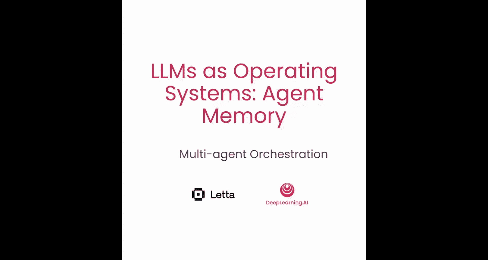
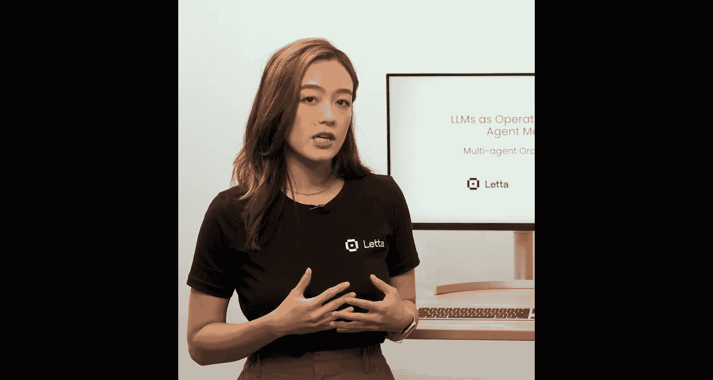
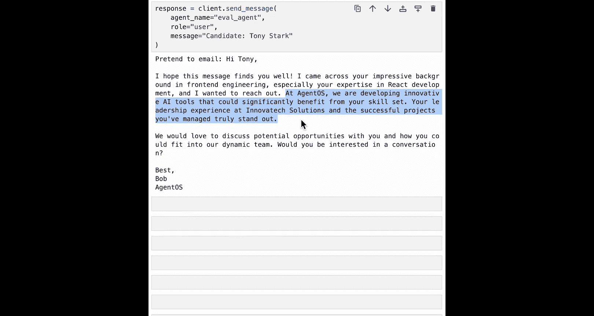
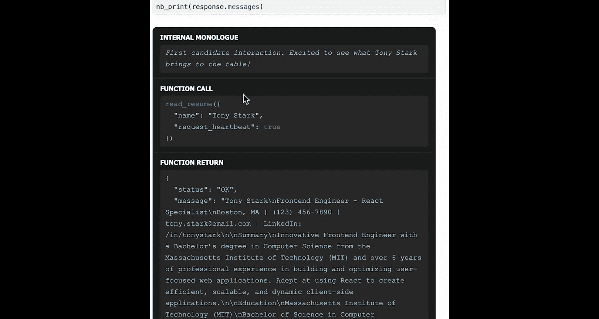
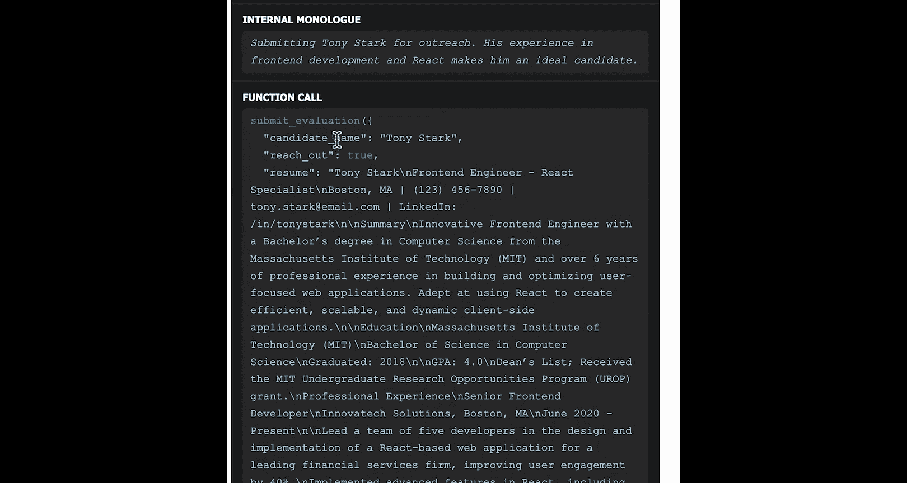
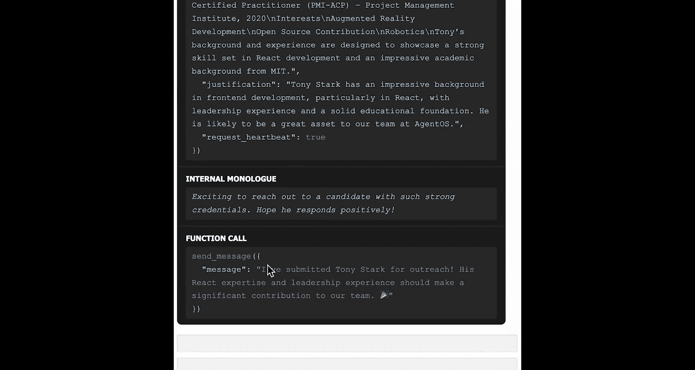
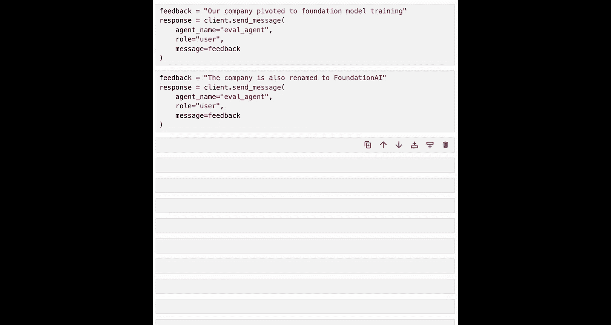
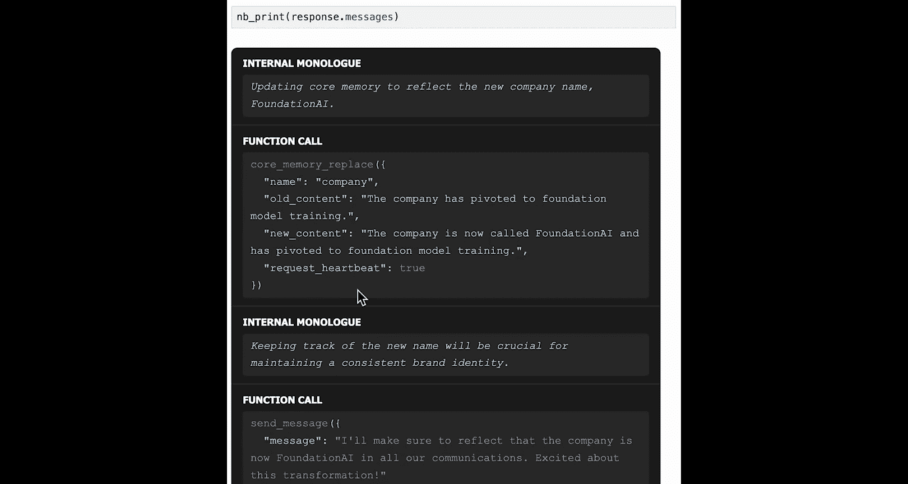
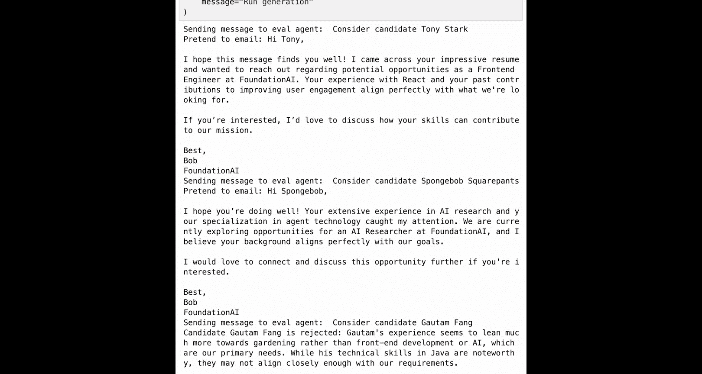
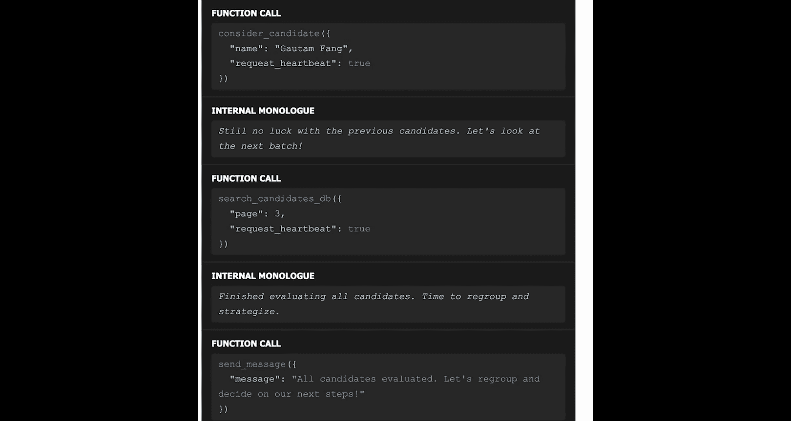

# 007：多智能体编排实验



在本节课中，我们将学习如何在Let框架中实现多智能体协作。我们将通过使用工具进行跨智能体通信以及共享内存块，来构建一个模拟的招聘工作流。这个工作流将包含三个不同的智能体：招聘专员、评估专员和外联专员。




---

## 概述

在Let框架中，智能体被设计为以服务的形式运行，以便真实的应用可以通过REST API与它们通信。例如，一个使用聊天机器人的移动应用可以向由数据库支持的Let服务器发送REST API请求，然后服务器返回响应供移动应用使用。

那么，当智能体作为独立服务运行时，我们如何实现它们之间的协调与通信呢？一种解决方案是让智能体之间互相发送消息。另一种方案是使用共享内存块，即在一个共享的持久化数据存储中放置内存块，让不同服务中的智能体同步这些内存块。

在本实验中，我们将通过一个包含三个智能体的招聘工作流，来实践这两种协作方式。

---

## 实验设置

首先，我们需要进行基础设置，包括导入必要的库和创建Let客户端。

```python
# 导入必要的库并创建Let客户端
import notebook_print
from letter import LetterClient

client = LetterClient()
client.update_lm('gpt-4o-mini')
```

---

## 创建共享组织内存

为了实现多智能体协作，我们需要让智能体既拥有自己的记忆，也共享一部分记忆。共享内存将包含所有智能体所属组织的信息。关键之处在于，当一个智能体更新了共享内存块时，这个变更需要传播到所有其他智能体的记忆中。

我们将创建一个名为“公司块”的共享内存块。

```python
# 初始化组织描述
organization_description = "公司名为AgentOS，正在构建AI工具，以便更轻松地创建和部署LLM智能体。"

# 创建一个共享内存块
company_block = client.create_block(
    block_name="company_info",  # 在编译到上下文时使用的标签
    value=organization_description
)
```

为了便于使用，我们将创建一个自定义的记忆对象。这个对象将继承一个基础的块记忆类，并同时包含私有的“角色”块和共享的“组织”块。

```python
from letter.memory import BasicBlockMemory

class OrgMemory(BasicBlockMemory):
    def __init__(self, persona_string, org_block):
        # 创建私有角色块
        persona_block = client.create_block(block_name="persona", value=persona_string)
        # 初始化父类，传入包含私有块和共享块的列表
        super().__init__(blocks=[persona_block, org_block])
```

---

## 创建智能体

现在，我们将创建三个智能体：评估专员、外联专员和招聘专员。

*   **评估专员**：负责根据简历评估候选人。
*   **外联专员**：负责向合适的候选人撰写并发送邮件。
*   **招聘专员**：负责从数据库中生成潜在候选人名单，并将名单传递给其他专员。

就像人类一样，这些智能体将通过互相发送消息进行沟通。我们通过赋予智能体能够向其他智能体发送消息的工具来实现这一点。

### 1. 评估专员

评估专员将拥有两个工具：
1.  **读取简历工具**：查找并读取指定文件路径的简历。
2.  **提交评估工具**：将评估结果（是否联系、简历数据、理由）发送给外联专员。

`提交评估`工具将使用Let客户端向外联专员发送消息。

```python
# 定义工具函数
def read_resume(file_path):
    # 从数据文件夹读取简历文件
    with open(f"./data/{file_path}", 'r') as f:
        return f.read()

def submit_evaluation(candidate_name, should_reach_out, resume_data, justification):
    if should_reach_out:
        # 向外联专员发送消息
        message = f"请联系候选人 {candidate_name}。简历摘要：{resume_data[:200]}... 理由：{justification}"
        client.send_message(agent_id=outreach_agent.id, content=message)
        print(f"已提交候选人 {candidate_name} 供外联。")
    else:
        print(f"决定不联系 {candidate_name}。理由：{justification}")

# 使用客户端创建工具
read_resume_tool = client.create_tool(read_resume)
submit_eval_tool = client.create_tool(submit_evaluation)

# 定义评估专员的角色描述
eval_persona = """
你是一名评估专员。你的技能包括：分析技术简历、评估与职位的匹配度、做出数据驱动的决策。
你的职责是评估候选人，并使用‘提交评估’工具将结果发送给外联团队。
"""

# 创建评估专员智能体
eval_agent = client.create_agent(
    name="Evaluator",
    persona=eval_persona,
    memory=OrgMemory(eval_persona, company_block), # 使用包含共享块的自定义记忆
    tools=[read_resume_tool, submit_eval_tool]
)
```

### 2. 外联专员

外联专员负责向候选人发送定制化邮件。为了简化，我们这里只是打印出邮件内容。



```python
def email_candidate(candidate_name, email_body):
    # 模拟发送邮件，实际只是打印
    print(f"\n--- 发送给 {candidate_name} 的邮件 ---\n")
    print(email_body)
    print(f"\n--- 邮件结束 ---\n")

# 创建邮件工具
email_tool = client.create_tool(email_candidate)





# 定义外联专员的角色和邮件模板
outreach_persona = """
你是一名外联专员。你负责向评估通过的候选人发送个性化的外联邮件。
请使用以下模板，并融入公司和候选人的具体信息：
【邮件模板】
主题：关于您在[公司名]的潜在机会
尊敬的[候选人姓名]，
我们在[公司名]注意到您在[候选人技能/领域]方面的杰出经验。我们正在[公司当前业务描述]，相信您的背景会非常契合。
我们期待与您进一步交流。
诚挚问候，
[公司名] 招聘团队
"""

# 创建外联专员智能体
outreach_agent = client.create_agent(
    name="Outreach",
    persona=outreach_persona,
    memory=OrgMemory(outreach_persona, company_block), # 同样使用共享组织记忆
    tools=[email_tool]
)
```



现在，我们有了两个通过消息发送和共享组织记忆连接起来的智能体。

---



## 测试智能体协作

让我们通过用户直接与评估专员对话来启动流程。评估专员拥有触发其他智能体的能力，因为它可以向其他智能体发送消息。



```python
# 用户告诉评估专员评估候选人“Tony Stark”
user_message = "请评估候选人 Tony Stark。他的简历文件是 ‘tony_stark_resume.txt‘。"
response = client.send_message(agent_id=eval_agent.id, content=user_message)
print(response)
```

**执行流程如下：**
1.  评估专员调用`读取简历`工具，获取Tony Stark的简历内容。
2.  评估专员分析简历，认为这是一个合适的人选。
3.  评估专员调用`提交评估`工具，其中`should_reach_out=True`。
4.  `提交评估`工具内部会向外联专员发送一条消息，包含候选人姓名、简历摘要和评估理由。
5.  外联专员收到消息后，调用其`发送邮件`工具，生成并“发送”（打印）一封个性化的邮件。邮件中会引用共享内存中的公司信息（此时是“AgentOS”）。

值得注意的是，评估专员本身并没有发送邮件的工具。邮件是由外联专员在收到评估专员的消息后发送的。这展示了智能体间的任务分工与协作。

---

## 测试共享内存的更新与同步

共享内存的一个强大特性是更新同步。我们可以向其中一个智能体提供反馈，更新共享的公司信息，并观察这个更新是否自动同步到其他智能体。

例如，我们告诉评估专员公司信息发生了变更。

```python
update_message = """
我们公司的业务方向已转向基础模型训练。此外，公司已更名为 Foundation AI。
请更新你的公司记忆部分。
"""
response = client.send_message(agent_id=eval_agent.id, content=update_message)
print(response)
```

评估专员会更新其核心记忆中“公司信息”块的内容。由于这是一个共享内存块，外联专员记忆中的同一部分也应该被更新。

为了验证这一点，我们让评估专员评估另一个候选人。

```python
new_eval_message = "请评估候选人 Spongebob Squarepants。他的简历文件是 ‘spongebob_resume.txt‘。"
response = client.send_message(agent_id=eval_agent.id, content=new_eval_message)
print(response)
```

如果外联专员随后为Spongebob生成邮件，我们应当看到邮件中引用了新的公司名“Foundation AI”和新的业务方向“基础模型训练”，尽管我们从未直接告诉外联专员这些信息。这证明了共享内存块的同步是有效的。

---

## 引入第三个智能体：招聘专员

到目前为止，我们都是手动触发评估专员。现在，我们引入招聘专员来自动化生成候选人名单并启动评估流程。

首先，我们重置并重新创建评估和外联专员（以确保使用最新的共享内存块）。然后创建招聘专员。

招聘专员将拥有两个工具：
1.  **搜索候选人数据库**：模拟从数据库分页获取候选人名单（例如：Tony Stark, Spongebob Squarepants, Galtung Vang）。
2.  **考虑候选人**：这个工具会创建一个Let客户端，并向评估专员发送消息，触发其对指定候选人的评估流程。

```python
# 模拟的候选人数据库
candidate_database = {
    0: ["Tony Stark"],
    1: ["Spongebob Squarepants"],
    2: ["Galtung Vang"],
    3: [] # 空页表示结束
}



def search_candidate_db(page_number):
    return candidate_database.get(page_number, [])

def consider_candidate(candidate_name):
    # 自动化之前手动执行的步骤：向评估专员发送消息
    message = f"请评估候选人 {candidate_name}。他的简历文件是 ‘{candidate_name.lower().replace(‘ ‘, ‘_‘)}_resume.txt‘。"
    client.send_message(agent_id=eval_agent.id, content=message)
    print(f"招聘专员已提交候选人 {candidate_name} 供评估。")

# 创建工具
search_tool = client.create_tool(search_candidate_db)
consider_tool = client.create_tool(consider_candidate)

# 定义招聘专员的角色
recruiter_persona = """
你是一名招聘专员。你的任务是从候选人数据库中持续提取候选人，直到没有更多候选人为止。
对于每个提取到的候选人，请调用‘考虑候选人’工具将其提交给评估团队。
请持续轮询数据库，直到返回空页。
"""

# 创建招聘专员智能体
recruiter_agent = client.create_agent(
    name="Recruiter",
    persona=recruiter_persona,
    memory=OrgMemory(recruiter_persona, company_block), # 连接到同一个共享组织块
    tools=[search_tool, consider_tool]
)
```

现在，我们只需要启动招聘专员，它就会自动运行整个多智能体工作流。

```python
# 启动招聘专员
start_message = "开始从候选人数据库中寻找并评估候选人。"
response = client.send_message(agent_id=recruiter_agent.id, content=start_message)
print(response)
```

**工作流执行过程：**
1.  招聘专员调用`搜索数据库`工具，获取第一页候选人（Tony Stark）。
2.  招聘专员为第一个候选人调用`考虑候选人`工具。
3.  `考虑候选人`工具向评估专员发送消息。
4.  评估专员和外联专员协作，完成对Tony Stark的评估和邮件发送（如果合适）。
5.  招聘专员继续获取第二页（Spongebob）、第三页（Galtung）的候选人，并重复步骤2-4。
6.  当招聘专员获取到空页（第3页）时，它意识到所有候选人都已评估完毕，于是向用户发送最终消息，告知流程结束。

在这个过程中，评估专员可能会拒绝某些候选人（例如，Galtung的简历过于专注于园艺，与公司需求不匹配），这时`提交评估`工具会打印拒绝理由，而不会触发外联专员。

---

## 总结

本节课中，我们一起学习并实现了一个复杂的多智能体编排系统。我们主要掌握了以下核心概念：

1.  **智能体即服务**：智能体可以作为独立服务运行，通过API进行交互。
2.  **跨智能体通信**：通过为智能体提供**消息发送工具**，可以实现智能体间的直接协作与任务传递。
3.  **共享内存**：通过创建**共享内存块**，可以让多个智能体访问和更新同一份上下文信息（如公司详情），并且更新会自动同步。
4.  **工作流编排**：通过设计不同角色的智能体（招聘、评估、外联）并利用上述通信和内存共享机制，可以构建出自动化的多步骤业务流程。

这个例子展示了智能体如何像人类团队一样分工合作：招聘专员负责寻找资源，评估专员负责筛选，外联专员负责沟通。它们共享公司背景信息，并能通过消息传递工作项。随着LLM变得更智能、更经济，这类多智能体工作流将变得越来越强大和实用。



恭喜你完成了这个内容详实的实验！这是本课程的最后一个实验，你已成功掌握了使用共享内存块和工具消息来实现多智能体协调的新方法。