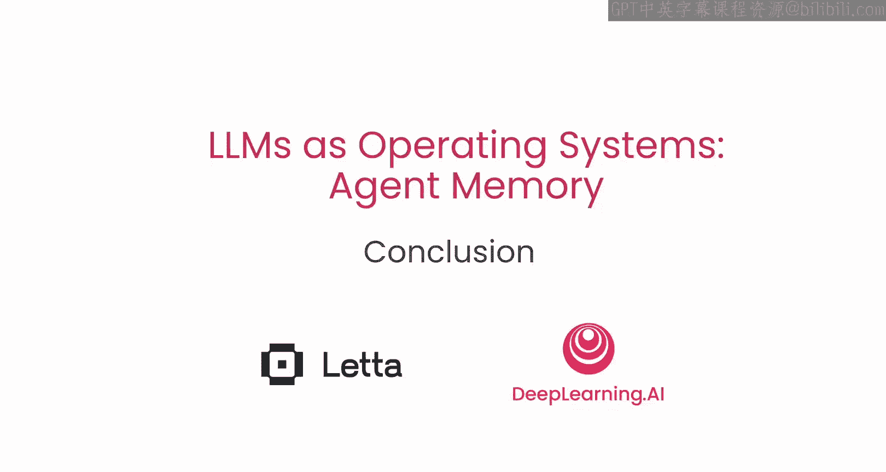
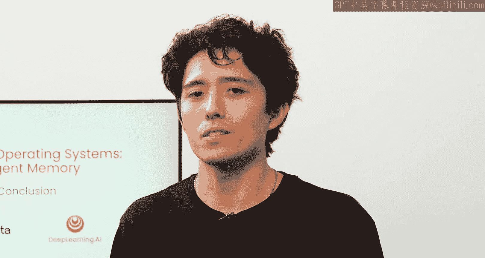

# 008：课程总结 🎓

在本节课中，我们将一起回顾并总结关于如何将大型语言模型（LLM）构建为具备复杂记忆系统的智能体（Agent）的核心知识。我们学习了如何突破LLM有限的上下文窗口，利用LMOS（LLM作为操作系统）框架来创建能够利用虚拟上下文和扩展记忆的应用程序。

---

上一节我们探讨了智能体记忆系统的具体实现，本节中，我们来进行全面的课程总结。

恭喜你完成本课程的学习。你已经掌握了如何将一个简单的文本生成器——即大型语言模型（LLM）——通过LMOS框架，用于创建复杂的智能体记忆系统。

你现在已经拥有了工具，就像你的智能体一样，可以构建能够利用**虚拟上下文**的LLM应用程序。这种能力将记忆**扩展**到远超出LLM自身有限的上下文窗口。

我们期待看到你独立构建出的成果。

---

本节课中我们一起学习了将LLM视为操作系统的核心理念，特别是如何为其设计和集成记忆系统。关键点在于利用外部存储和检索机制来突破模型自身的上下文限制，从而构建出更强大、更持久的智能体应用。