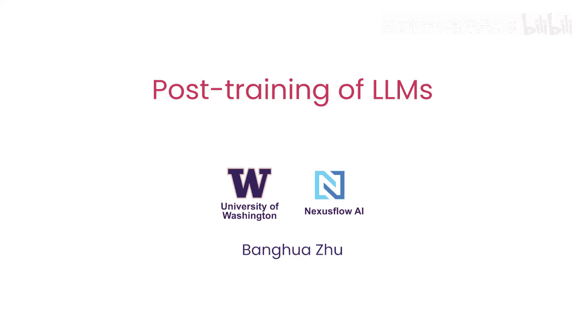
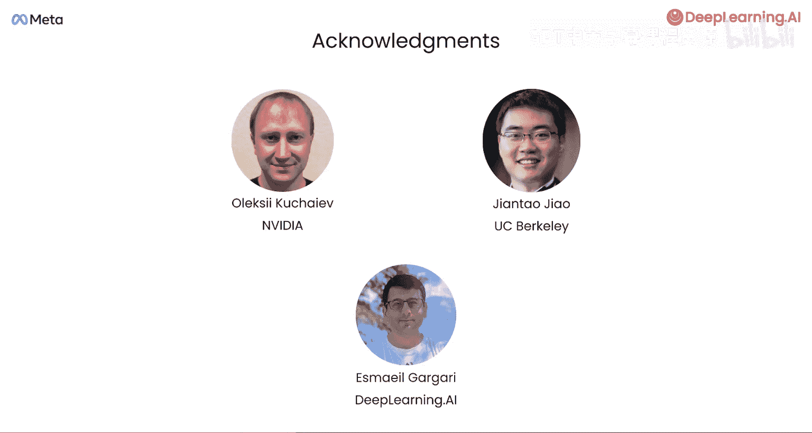

# 001：课程介绍 🎯

在本节课中，我们将要学习大型语言模型后训练的基本概念、主要方法及其应用场景。课程由华盛顿大学助理教授、Nexus S联合创始人Ban Hua Z讲授，他将分享其在训练和微调众多模型方面的丰富经验。

训练一个大型语言模型通常包含两个主要阶段。首先是预训练阶段，模型学习从海量文本中预测下一个词或标记。从计算和成本角度看，这是训练的主体部分，对于非常大的模型，可能需要处理数万亿甚至数十万亿的文本标记，耗时可能长达数月。

## 后训练阶段

上一节我们介绍了预训练，本节中我们来看看后训练。后训练是指模型被进一步训练以执行更具体的任务，例如回答问题。这个阶段通常使用规模小得多的数据集，速度更快，成本也更低。在本课程中，你将学习三种常见的后训练和定制LLM的方法，并且你将实际下载一个预训练模型，以一种相对计算成本可承受的方式进行后训练。

以下是三种核心的后训练技术：

1.  **监督微调**：这种方法在标注好的“提示-响应”数据对上训练模型，旨在通过学习复制这种理想的输入-输出关系，让模型学会遵循指令或使用工具。监督微调对于引入新行为或对模型进行重大改变尤其有效。在课程中，你将微调一个小型模型以遵循指令。
2.  **直接偏好优化**：DPO通过向模型展示好的和坏的答案来教导它。对于同一个提示，DPO给出两个选项，其中一个比另一个更受偏好。通过一个对比损失函数，DPO推动模型更接近好的响应，远离差的响应。例如，如果模型说“我是你的助手”，但你希望它说“我是你的AI助手”，你可以将前者标记为差响应，后者标记为好响应。你将使用DPO来改变一个小型模型的身份设定。
3.  **在线强化学习**：这是第三种技术。你给模型提供提示，它生成响应，然后一个奖励函数对这些答案的质量进行评分。模型根据这些奖励分数进行更新。获取奖励模型的一种方法是基于人类对响应质量的判断，然后训练一个函数来分配与人类判断一致的分数。最常用的算法是**近端策略优化**。另一种获取奖励的方式是通过**可验证奖励**，这适用于具有客观正确性标准的任务，如数学或编程。你可以使用数学检查器或单元测试来客观衡量生成的数学解或代码是否正确。这种正确性度量就构成了奖励函数。一个利用此类奖励函数的强大方法是**组相对策略优化**，由DeepSeek引入。在本课程中，你将使用GRPO来训练一个小型模型解决数学问题。

## 课程安排与致谢

本课程的第一课将概述后训练方法。在这节课中，你将学习何时应该进行后训练，以及你可以从哪些后训练选项中进行选择。

许多人为创建本课程提供了帮助，特别感谢Alex、来自UC Berkeley的Tntaohao，以及来自DeepSeek AI的Gegari。

本节课中我们一起学习了大型语言模型后训练的核心阶段与三种关键技术：监督微调、直接偏好优化和在线强化学习。理解这些方法为后续动手实践奠定了基础。接下来，让我们进入下一个视频，开始深入探索。