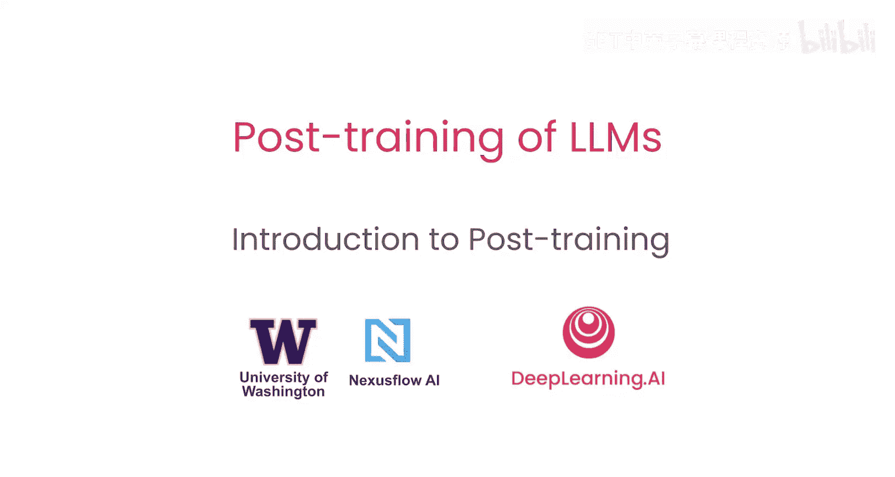
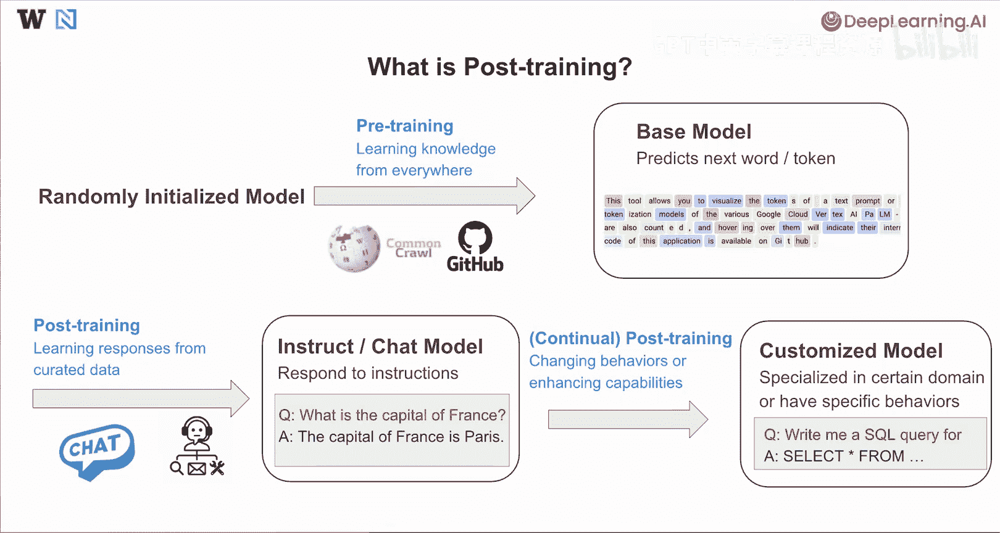
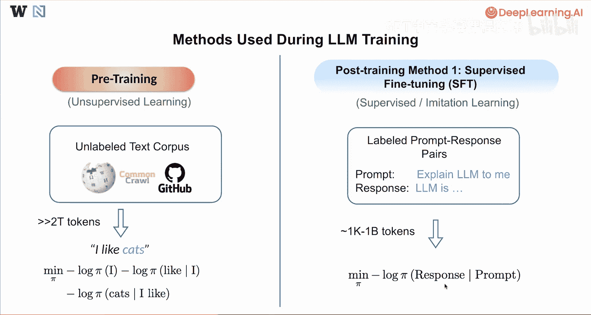
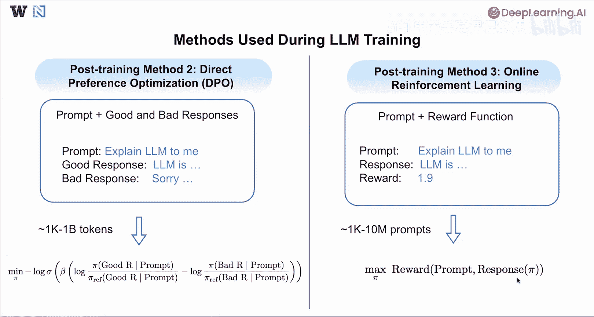
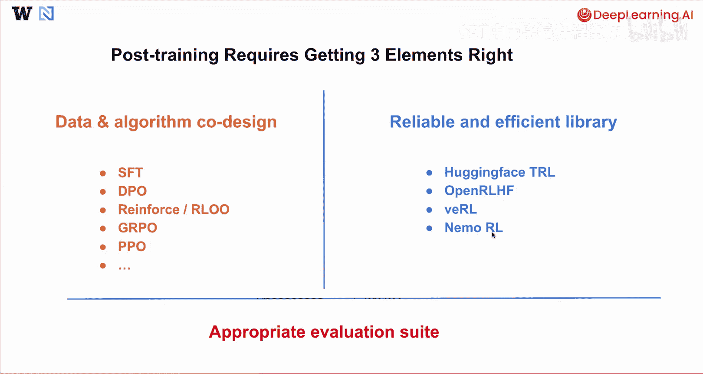
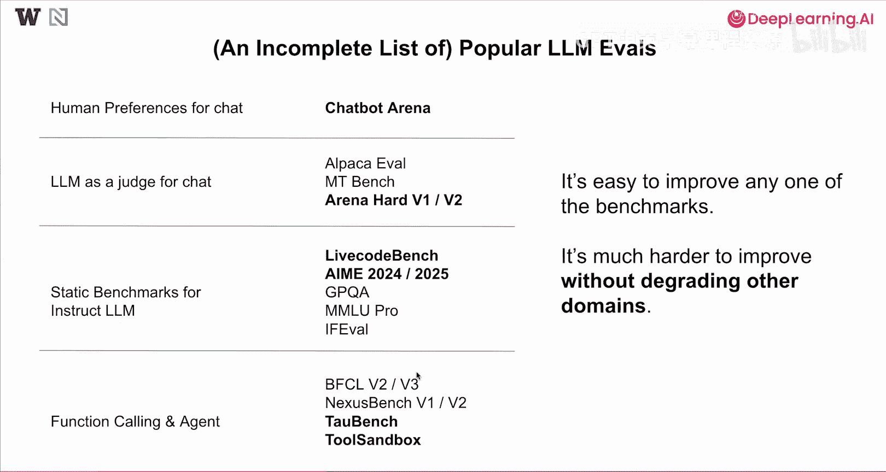
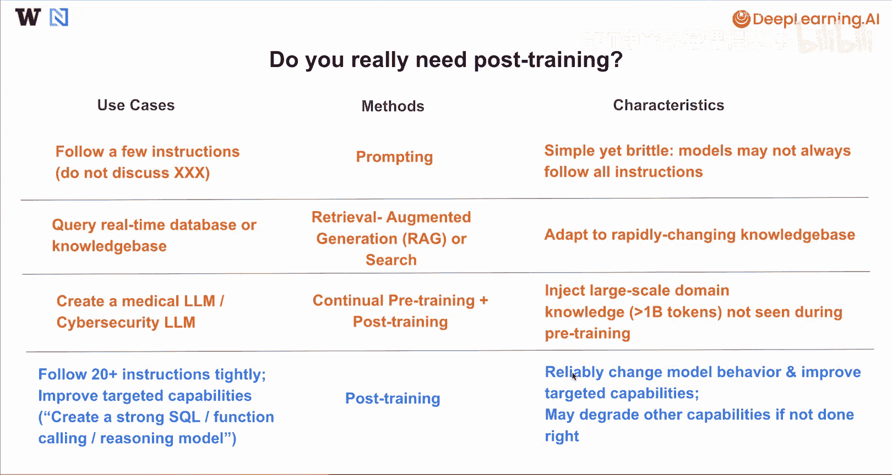

# 002：后训练方法介绍 🧠

在本节课中，我们将学习后训练方法的基本概念。后训练是大型语言模型开发流程中的关键步骤，它能让基础模型学会遵循指令、进行对话或执行特定任务。

## 什么是后训练？

上一节我们介绍了语言模型的整体训练流程，本节中我们来看看后训练的具体定位。

通常，训练语言模型始于一个随机初始化的模型，首先进行预训练。预训练的目标是从海量数据中学习通用知识，数据来源包括维基百科、从整个互联网爬取的Common Crawl数据集，或Github上的代码数据。预训练完成后，我们得到一个**基础模型**，它能够预测下一个词或标记（token），这里的每个标记是图中高亮显示的子词。

从这个基础模型出发，下一步就是进行**后训练**。后训练旨在从精心策划的数据中学习如何回应，这些数据包括聊天数据、工具使用数据或智能体数据。经过这个过程，通常会得到一个**指令模型**或**聊天模型**，它能够响应用户的指令或与用户对话。例如，当用户提问“法国的首都是什么？”时，模型能够回答“法国的首都是巴黎”。

在此之后，还可以进行**进一步的或持续的后训练**，以改变模型的行为或增强模型的某些特定能力。最终，我们得到一个**定制化模型**，它专精于某些领域或具有特定的行为模式。例如，它可能能够为任何指令写出更好的SQL查询。

## 理解后训练方法

为了更好地理解后训练方法，让我们先回顾一下在人工智能训练中使用的不同方法。

### 预训练方法

我们首先从预训练方法开始，这通常被视为**无监督学习**。

通常，我们可以从一个非常大规模的无标签文本语料库开始，这包括维基百科、Common Crawl或Github等。从这些语料库中通常可以提取超过2万亿个标记（token）并进行训练。训练通常在几个段落或句子上进行。

作为一个最小化的例子，模型可能会看到像“I like cats”这样的句子。在这种情况下，训练目标是**最小化每个标记在给定之前所有标记条件下的负对数概率**。

用公式表示，即最小化：
`-log P(“I”) - log P(“like” | “I”) - log P(“cats” | “I like”)`

通过这种方式，我们训练模型根据已看到的所有前序标记来预测下一个标记。

### 后训练方法

预训练之后，会采用不同的后训练方法。以下是几种主要方法：

**1. 监督微调**

监督微调是最简单且最流行的后训练方法之一，被视为**监督学习**或**模仿学习**。

以下是其数据准备和训练过程：
*   需要创建标注好的“提示-回答”对数据集。
*   提示通常是给模型的指令，回答是模型应该给出的理想回应。
*   通常只需要1000到10亿个标记，远少于预训练的规模。
*   训练损失的最大区别在于，**只对回答部分的标记进行训练，而不对提示部分的标记进行训练**。

**2. 直接偏好优化**

我们还有更高级的后训练方法，第二种是**直接偏好优化**。

以下是其数据准备和训练过程：
*   创建的数据集格式为：一个提示，配上一个好的回答和一个坏的回答。
*   对于任何给定的提示，可以生成多个回答，选择一个被认为是好的，另一个被认为是坏的。
*   训练模型使其**远离坏的回答，并从好的回答中学习**。
*   通常也只需要1000到10亿个标记。
*   有一个更复杂的损失函数用于直接偏好优化，我们将在后续具体课程中详细讲解。

**3. 在线强化学习**

后训练中的第三种方法是**在线强化学习**。

以下是其数据准备和训练过程：
*   通常只需要准备提示和一个奖励函数。
*   从提示开始，要求语言模型自身生成回答。
*   使用奖励函数为该回答生成奖励。
*   利用该信号更新模型。
*   在这种情况下，可能有100到1000万甚至更多的提示。
*   目标是最大化提示和回答的奖励，其中回答实际上是由语言模型自身生成的。

## 成功进行后训练的要素

通常，成功的后训练需要三个关键要素。

**第一个要素是数据和算法的良好协同设计。**

正如我们讨论的，不同的后训练算法选择，包括SFT、DPO或不同的在线强化学习算法，如Reinforce、PPO等，各自需要准备略有不同的数据结构。数据和算法的良好协同设计对于后训练的成功至关重要。

**第二个要素是一个可靠且高效的库，能正确实现大多数算法。**

这包括Hugging Face的TRL，它是第一个易于使用并实现了本课程提到的大多数算法的库。在本课程的大部分编码实践中，我们将使用这个TRL库。除了Hugging Face TRL，我还推荐你尝试更复杂、内存效率更高的库，包括OpenAI的VLLM和NVIDIA的NeMo。

**第三个要素是适当的评估套件。**

需要理解在后训练前后，需要什么样的评估套件来跟踪模型性能，并确保模型始终表现良好。

以下是一个当前通常跟踪的语言模型评估的不完整列表：
*   **Chatbot Arena**：基于人类偏好的聊天评估，人们可以投票选出在他们看来更好的模型，作为人类偏好的替代指标。
*   **聊天模型评估**：包括Arena、Evol、MT-Bench或Arena Hard。
*   **静态基准测试**：例如，LiveCode Bench是流行的代码基准测试；AIME 2024/2025可能是近期流行的针对硬核数学问题的数学评估数据。
*   **知识与推理相关数据**：如GPQA或MMLU Pro。
*   **指令遵循评估数据**：如IFeval。
*   **函数调用与智能体评估**：包括BIG-Bench、AgentBench或Tool。
*   **多轮工具使用评估**：如OsTAL Bench和ToolEmu，更侧重于多轮工具使用场景。

在此列出所有评估指标，我想指出：提升任何一个基准测试的分数可能很容易，但要在不损害其他领域的情况下提升某些基准测试或改变特定模型行为，则要困难得多。在本课程中，我们将探索哪种方法能在不损害其他领域的情况下带来最佳改进。

## 何时需要进行后训练？

最后，我想指出，并非在每个用例中都必须对模型进行后训练。不同的场景可能有更适合你用例的不同方法。

以下是不同场景的适用方法：
*   **简单指令遵循**：如果你只想让模型遵循少量指令，例如“不要讨论某些敏感话题”或“不要将你的公司与某些其他公司比较”，通常可以通过**提示工程**轻松实现。这种方法简单，但在极端情况下，模型可能并不总是遵循你提供的所有指令。
*   **查询实时数据库或知识库**：在这种情况下，**检索增强生成**或基于搜索的方法可能效果更好，因为它能适应快速变化的知识库。
*   **创建领域特定模型**：例如医疗语言模型或网络安全语言模型。在这些情况下，真正重要的是**持续预训练**，然后是更标准的后训练，让模型先学习知识，再学习如何与用户对话。对于持续预训练，通常需要注入在预训练数据中未见过的大规模领域知识，理想情况下，这些领域知识至少应超过10亿个标记。
*   **紧密遵循指令或提升特定能力**：如果你的用例是关于紧密遵循两个或更多指令，或者你想提升某些目标能力，例如创建一个强大的SQL模型、函数调用模型或推理模型，那么**后训练**最能提供帮助。它可以帮助可靠地改变模型行为并提升目标能力。如果后训练操作不当，可能会损害你没有训练过的其他能力。

## 总结

本节课中，我们一起学习了什么是后训练、如何进行后训练以及何时需要进行后训练。在下一节课中，我们将深入探讨第一种后训练方法：监督微调。