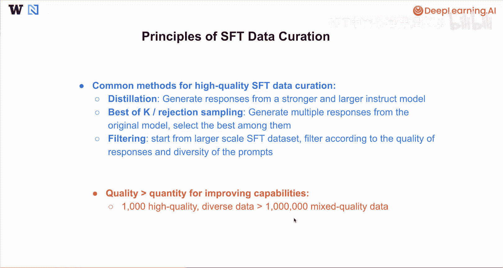
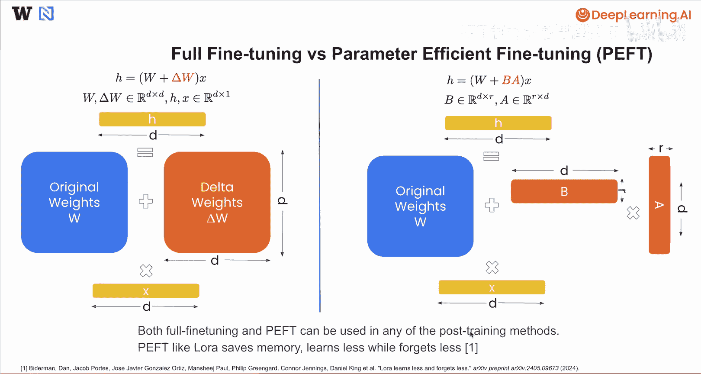
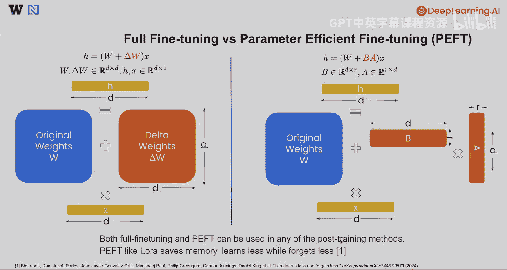

# 003：监督微调基础 🧠

在本节课中，我们将学习监督微调的基本概念，包括其方法、常见应用场景以及高质量数据整理的原则。

## 概述

监督微调通常可以被视为对示例回答的模仿。你可以从任意一个语言模型开始，该模型能够根据给定的提示预测回答。这可以是一个基础模型，当用户提问时，基础模型可能只是预测下一个最可能的词元，因此它可能只是延续并预测一个非常相似的问题，而不是回答问题。

为了在这些基础模型上执行监督微调，我们通常需要创建一些标注数据，其格式为用户问题和理想的助手回答。数据格式可能如下：用户问“告诉我你的身份”，助手回答“我是Llama”或任何你希望它具备的身份模型。用户也可能问“你好吗？”，助手回答“我很好”。通过准备大量此类标注数据，我们就可以开始进行监督微调，模仿标注数据中提供的示例回答。

监督微调的工作原理是通过最小化给定提示下回答的负对数似然。当我们对所有标注数据求和时，就得到了损失函数。我们将在下一张幻灯片中更深入地探讨这个损失函数。

对基础模型执行监督微调后，通常会得到一个微调模型或指令模型，如果操作正确，该模型能够恰当地回应用户的任何查询。

## 监督微调损失函数

现在，让我们仔细看看这里的公式。监督微调通常最小化回答的负对数似然，最小化负对数似然等价于最大似然估计，这里使用的是交叉熵损失。

对于索引为 `i` 的任何数据，其中第 `i` 条数据是一个特定的提示-回答对，监督微调的损失将是给定提示下回答的对数概率的负值。这可以进一步写为负对数似然，其中似然是回答中所有词元在给定包括提示词元在内的所有先前词元条件下的概率的乘积。

用公式表示，对于单个数据点 `i`（提示 `x_i`，回答 `y_i`），损失 `L_i` 为：
`L_i = -log P(y_i | x_i)`
这可以分解为：
`L_i = - Σ_{t=1}^{T} log P(y_i^t | x_i, y_i^{<t})`
其中 `T` 是回答 `y_i` 的长度，`y_i^t` 是回答中的第 `t` 个词元，`y_i^{<t}` 是 `t` 之前的所有词元。

通过这种方式，我们训练模型最大化在给定提示下输出你所提供回答的可能性。这就是为什么监督微调试图模仿这些示例回答。

## 监督微调的适用场景

以下是监督微调的一些最佳或最合适的应用场景。

第一个场景是想要快速启动一个新的模型行为。例如，你可能希望将一个预训练的语言模型转变为指令模型，或者将一个非推理模型转变为推理模型。也可能存在特定场景，你希望模型使用某些工具，而无需在提示中提供工具描述，模型会假设它已经可以访问这些工具并在回答中调用它们。在这些情况下，监督微调对于快速启动此类模型行为非常理想。

第二个应用场景是提升模型的特定能力。这里我想强调的一个场景是，通过使用更大模型生成的高质量合成数据来训练较小的模型，从而提炼其能力。在这种情况下，你本质上是在使用监督微调将更大模型的能力提炼到小模型中。

## 高质量监督微调数据整理原则

以下是推荐的高质量监督微调数据整理方法的几个原则和常见方法。

第一种方法是提炼，正如我们之前讨论的，可以从一个更强的指令模型生成回答，然后让一个较小的模型模仿这些生成的回答。

第二种方法可以是“K选最佳”或拒绝采样，你可以从你想要训练的同一原始模型生成多个回答，然后使用奖励函数或其他自动方法从中选择最佳的一个。通过这种方式，你可以获得最佳回答，并尝试模仿模型自身生成的这些最佳回答。

第三种方法是过滤思路，你可以从Hugging Face或内部数据库收集的大规模监督微调数据开始，然后根据回答的质量和提示的多样性对其进行过滤，以获得规模较小但质量更高且足够多样化的监督微调数据。

除了这里提到的常见方法，我还想强调，通常在监督微调数据整理中，对于提升能力而言，质量远比数量重要。如果你有1000条真正高质量且多样化的数据，其监督微调结果通常能胜过100万条混合质量数据的结果。其原理在于，监督微调通常需要模仿你提供的所有数据。如果混合质量数据中存在一些非常糟糕的回答，模型将被迫模仿此类回答，从而导致性能下降。因此，数据质量对于监督微调的成功至关重要。

## 全参数微调与参数高效微调

最后，我想强调模型调优中一个正交的方向，它与任何后训练方法都是完全平行和正交的，那就是全参数微调与参数高效微调之间的选择。

在全参数微调中，假设我们有一个神经网络层，其中 `h` 是该层的输出，`W` 是该层的原始权重矩阵，`x` 是该层的输入。当人们进行全参数微调时，我们通常会添加一个增量 `ΔW`，这个 `ΔW` 是通过梯度下降计算得出的，并且其维度与原始权重 `W` 完全相同。这种方式下，你必须使用一个额外的 `D x D` 矩阵来进行模型更新。

存在一种替代方法，称为参数高效微调。我们仍然有原始层，输出 `h`，层输入 `x` 和该层的原始权重 `W`。但是，我们不直接添加一个与原始权重 `W` 大小相同的增量 `ΔW`，而是可以添加另外两个较小矩阵的乘法，即 `B` 乘以 `A`，其中 `B` 是一个 `D x R` 维的矩阵，`A` 是一个 `R x D` 维的矩阵，而 `R` 通常远小于 `D`。在这种情况下，你需要更新的有效参数数量仅仅是 `B` 和 `A` 中的参数总数，这可以远小于原始权重 `W` 的大小。通过这种方式，你在计算过程中节省了大量内存，同时也使计算更加高效。

我想在此说明，左侧的全参数微调和右侧的参数高效微调都可以与我们在此讨论的任何后训练方法结合使用，包括监督微调、直接偏好优化和在线强化学习。因此，在以下任何方法中，选择全参数微调还是参数高效微调取决于你。像LoRA这样的参数高效微调方法通常能节省大量内存，但另一方面，由于其可调参数较少，学习效果可能稍差，遗忘也较少。

## 总结

本节课中，我们一起学习了监督微调的细节，以及全参数微调与参数高效微调之间的区别。在下一课中，我们将进行一些关于监督微调的编码实践，将一个基础模型转变为指令模型。我们下节课见。