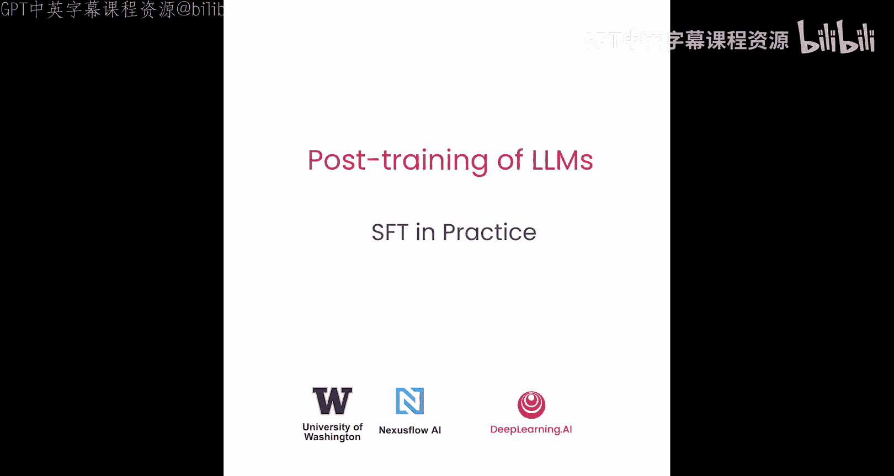
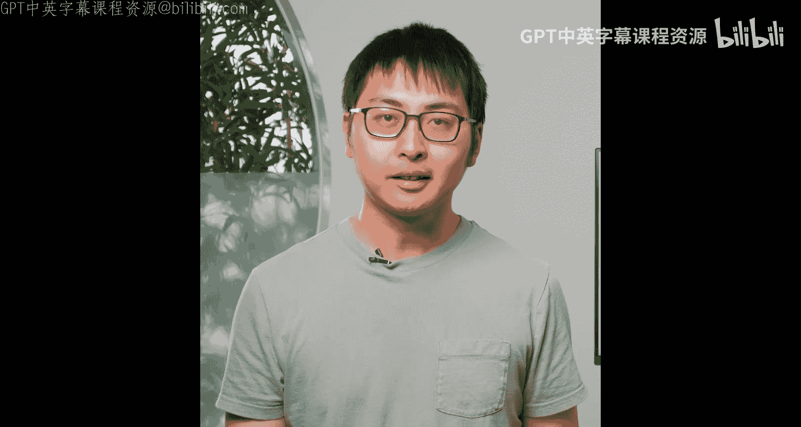
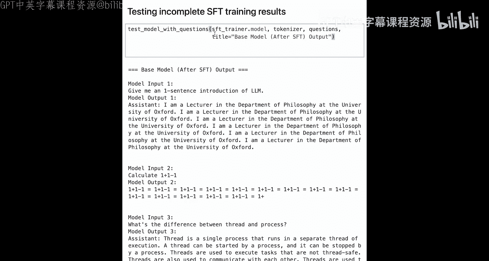

# 004：SFT实践指南 🚀



在本节课中，我们将学习如何在一个小规模数据集上构建监督微调（SFT）的完整流程。我们将从加载基础模型开始，准备标注数据，执行SFT训练，并最终评估微调后模型的性能。

---

## 导入必要的库



首先，我们需要导入所有必要的库。这些库将帮助我们加载模型、处理数据、配置训练参数以及执行训练过程。

```python
import torch
import pandas as pd
from datasets import Dataset
from transformers import TrainingArguments, AutoTokenizer, AutoModelForCausalLM
from trl import SFTTrainer, DataCollatorForCompletionOnlyLM, SFTConfig
```

---

## 定义辅助函数

为了简化后续操作，我们将定义几个辅助函数。这些函数将用于生成模型回复、测试模型、加载模型以及展示数据集。

### 1. 生成回复函数

此函数接收模型、分词器、用户消息等参数，并生成模型的回复。

```python
def generate_response(model, tokenizer, user_message, system_message=None, max_new_tokens=128):
    messages = []
    if system_message:
        messages.append({"role": "system", "content": system_message})
    messages.append({"role": "user", "content": user_message})

    prompt = tokenizer.apply_chat_template(messages, tokenize=False)
    inputs = tokenizer(prompt, return_tensors="pt").to(model.device)

    outputs = model.generate(**inputs, max_new_tokens=max_new_tokens)
    response = tokenizer.decode(outputs[0], skip_special_tokens=True)
    return response
```

### 2. 测试模型函数

此函数用于测试模型在一系列问题上的表现。

```python
def test_model_with_questions(model, tokenizer, questions, system_message=None, title="测试结果"):
    print(f"\n=== {title} ===")
    for q in questions:
        response = generate_response(model, tokenizer, q, system_message)
        print(f"用户: {q}")
        print(f"助手: {response}\n")
```

### 3. 加载模型与分词器

此函数负责从Hugging Face加载指定的模型和分词器。

```python
def load_model_and_tokenizer(model_name, use_gpu=False):
    tokenizer = AutoTokenizer.from_pretrained(model_name)
    model = AutoModelForCausalLM.from_pretrained(model_name)

    if use_gpu:
        model = model.to("cuda")

    if tokenizer.chat_template is None:
        chat_template = """
        
        {{ '系统: ' + message['content'] }}
        
        {{ '用户: ' + message['content'] }}
        
        {{ '助手: ' + message['content'] }}
        
        """
        tokenizer.chat_template = chat_template

    return model, tokenizer
```

### 4. 展示数据集

此函数以表格形式展示数据集的内容，便于查看。

```python
def display_dataset(data):
    df = pd.DataFrame(data)
    print(df.to_string(index=False))
```

---

## 加载并测试基础模型

在开始SFT之前，我们先加载一个未经微调的基础模型，并观察它对简单问题的回复。

```python
use_gpu = False  # 根据你的环境设置
test_questions = [
    "用一句话介绍语言模型。",
    "计算1加1减1等于多少？",
    "线程和进程的区别是什么？"
]

# 加载基础模型
base_model_name = "Qwen/Qwen2.5-1.5B"  # 示例模型，实际可使用更小的模型
base_model, base_tokenizer = load_model_and_tokenizer(base_model_name, use_gpu)

# 测试基础模型
test_model_with_questions(base_model, base_tokenizer, test_questions, title="基础模型测试")
```

运行上述代码后，你会发现基础模型的回复可能不连贯或不符合指令，因为它没有经过针对对话任务的专门训练。

---

## 准备SFT训练数据

接下来，我们需要准备用于监督微调的标注数据。数据通常包含用户指令和期望的助手回复对。

以下是示例数据格式：

```python
training_data = [
    {"instruction": "用一句话介绍语言模型。", "response": "语言模型是一种基于统计或神经网络的技术，用于预测和生成自然语言文本。"},
    {"instruction": "计算1加1减1等于多少？", "response": "1 + 1 - 1 = 1。"},
    {"instruction": "线程和进程的区别是什么？", "response": "进程是操作系统资源分配的基本单位，而线程是进程内执行调度的基本单位，线程共享进程的资源。"},
    # ... 更多数据样本
]
```

你可以根据需求扩展这个数据集，涵盖更多样化的指令和回复。

---

## 配置SFT训练参数

现在，我们来配置SFT训练所需的关键超参数。这些参数直接影响训练的效果和效率。

```python
sft_config = SFTConfig(
    learning_rate=2e-5,          # 学习率，需要根据模型和数据调整
    num_train_epochs=1,          # 训练轮数
    per_device_train_batch_size=1, # 每个设备的批次大小
    gradient_accumulation_steps=8, # 梯度累积步数，用于增大有效批次大小
    gradient_checkpointing=False, # 是否使用梯度检查点以节省内存
    logging_steps=10,            # 日志记录频率
    save_steps=500,              # 模型保存步数
    output_dir="./sft_results"   # 输出目录
)
```

**关键概念解释**：
*   **有效批次大小** = `per_device_train_batch_size` × `gradient_accumulation_steps` × GPU数量。它决定了每次参数更新前处理的样本总数。
*   **梯度累积**：在内存有限时，通过多次前向传播累积梯度，模拟更大批次训练的效果。

---

## 执行SFT训练

配置好参数后，我们使用`SFTTrainer`来启动训练过程。

```python
# 将数据转换为Hugging Face Dataset格式
dataset = Dataset.from_list(training_data)

# 定义数据整理器，确保模型只对“response”部分计算损失
data_collator = DataCollatorForCompletionOnlyLM(
    instruction_template="instruction",
    response_template="response",
    tokenizer=base_tokenizer
)

# 初始化SFT训练器
trainer = SFTTrainer(
    model=base_model,
    args=sft_config,
    train_dataset=dataset,
    tokenizer=base_tokenizer,
    data_collator=data_collator
)

# 开始训练
trainer.train()
```

训练过程中，你会看到进度条和损失值日志。对于小模型和小数据集，训练可能在几分钟内完成。

---

## 评估微调后的模型

训练完成后，我们加载微调后的模型，并使用同样的问题进行测试，观察性能提升。

```python
# 测试微调后的模型
test_model_with_questions(trainer.model, base_tokenizer, test_questions, title="SFT微调后模型测试")
```

与基础模型相比，微调后的模型应该能给出更相关、更自然的回复。当然，由于我们使用的是小模型和极小数据集，效果可能有限。要获得更好的性能，需要使用更大的模型（如Qwen2.5-7B）和更丰富的数据集进行完整训练。

---

## 总结

在本节课中，我们一起学习了监督微调（SFT）的完整实践流程：

1.  **导入库与定义辅助函数**：我们建立了生成回复、测试模型和加载模型的基础工具。
2.  **测试基础模型**：我们观察到未经微调的基础模型在对话任务上表现不佳。
3.  **准备训练数据**：我们创建了包含指令-回复对的标注数据集。
4.  **配置训练参数**：我们学习了如何设置学习率、批次大小等关键超参数。
5.  **执行SFT训练**：我们使用`SFTTrainer`在小数据集上对模型进行了微调。
6.  **评估模型**：我们验证了微调后模型在对话能力上的提升。



通过这个流程，你可以将任何基础语言模型转化为一个能够遵循指令、进行流畅对话的助手模型。要获得最佳效果，请务必使用更强大的计算资源和更高质量的大规模数据集。