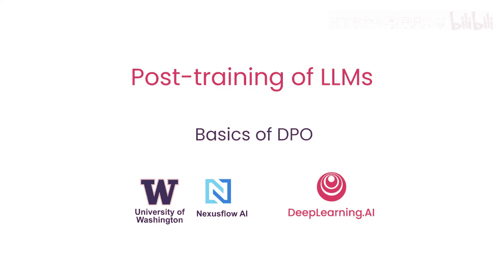
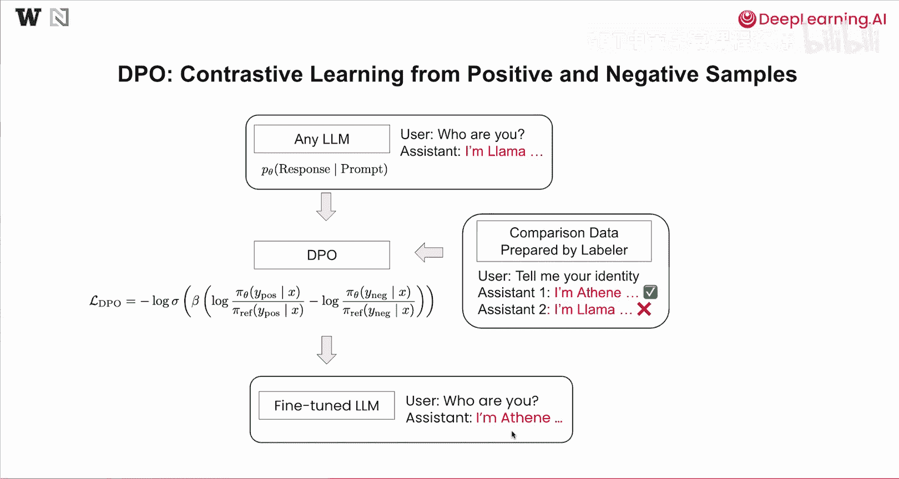
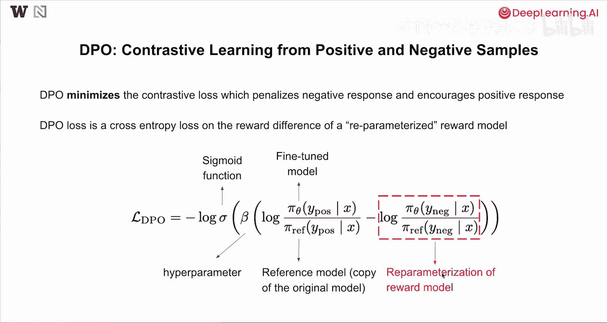
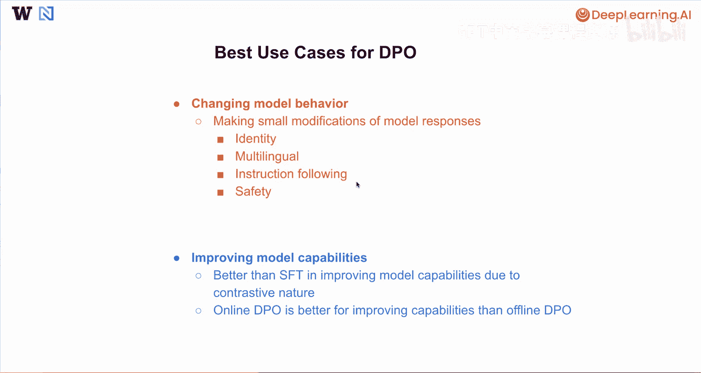
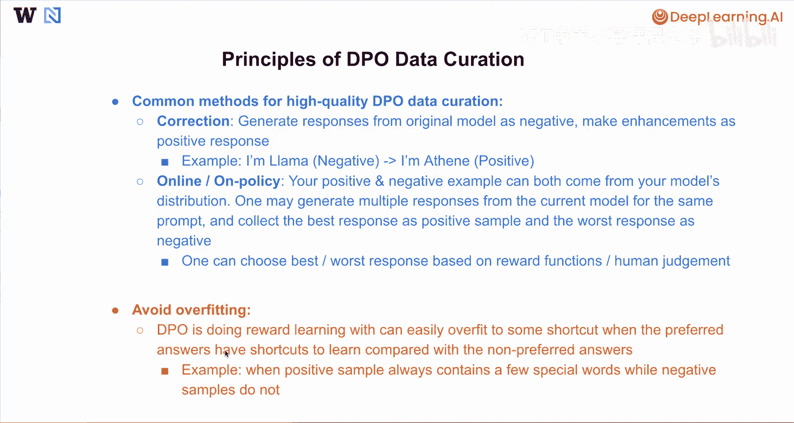

# 005：直接偏好优化基础 🧠

在本节课中，我们将学习直接偏好优化的基本概念，包括其方法、常见用例以及构建高质量DPO数据的原则。

## 概述

直接偏好优化是一种用于微调语言模型的技术，它通过对比学习的方式，利用人类或模型标注的偏好数据，引导模型生成更符合期望的回复。

## DPO方法详解

上一节我们介绍了DPO的基本概念，本节中我们来看看其详细的工作原理。

通常，DPO可被视为一种从正负回复中进行对比学习的方法。与监督微调类似，我们可以从任何语言模型开始，通常建议从一个指令微调模型开始，该模型已能回答用户的一些基本问题。

假设用户提问“你是谁”，而模型回答“我是Lama”。在此场景下，我们希望通过标注员准备的对比数据来改变模型的“身份”。标注员可以是人类，也可以是模型本身。

在这种情况下，用户可能提问“告诉我你的身份”。为了让DPO工作，我们需要准备至少两个回复。我们可以准备一个回复说“我是AI助手”，另一个回复说“我是Lama”。其中，“我是AI助手”被标记为**偏好回复**，“我是Lama”被标记为**非偏好回复**。这样，我们试图鼓励模型在面对身份相关问题时，更倾向于回答“我是AI助手”而非“我是Lama”。

收集此类对比数据后，就可以在此语言模型上使用准备好的数据和特定的损失函数执行DPO。我们将在本节课稍后深入探讨这个损失函数。

在语言模型上执行DPO后，我们将得到一个微调后的模型。理想情况下，该模型能从这些正负样本中学习。在本例中，它将尝试模仿偏好样本。如果用户进一步提问“你是谁”，助手将回答“我是AI助手”而非“Lama”。通过这种方式，我们使用DPO方法改变了模型的“身份”。

## DPO损失函数

了解了DPO的基本流程后，现在我们来深入其核心——损失函数。

通常，DPO被视为最小化对比损失，该损失惩罚负面回复并鼓励正面回复。DPO损失实际上是一个基于奖励模型奖励差异的交叉熵损失。

让我们仔细看看这个DPO损失函数，它是一个负对数西格玛函数，函数内部是某个对数差。其中，σ是sigmoid函数，β是一个非常重要的超参数，需要在DPO训练过程中进行调整。β值越高，这个对数差就越重要。

在这个括号内，我们有两个对数差，分别关注正样本和负样本。首先，我们来看两个概率比值的对数。分子π_θ是微调模型，我们关注的是给定提示词时，微调模型生成正面回复的概率。分母π_ref是参考模型，它是原始模型的固定副本，其权重被冻结且不可调整。我们只关注原始模型在给定提示词下生成那些正面回复的概率。

类似地，对于负样本，我们也有对数比率，其中π_θ是您要微调的模型，π_ref是固定的参考模型。本质上，这个对数比率项可以被视为奖励模型的一种重新参数化。如果您将其视为奖励模型，那么这个DPO损失本质上是正样本与负样本之间奖励差异的sigmoid函数。本质上，DPO试图最大化正样本的奖励，并最小化负样本的奖励。

关于为何这种对数比率可以被视为此类奖励模型的重新参数化，建议您阅读原始的DPO论文以获取详细信息。

## DPO最佳用例

理解了DPO的原理后，我们来看看它的典型应用场景。

以下是DPO的一些最佳用例：

*   **改变模型行为**：当您希望对模型回复进行小幅修改时，DPO通常非常有效。这包括改变模型身份、提升模型的多语言回复能力、指令遵循能力，或改变模型某些与安全性相关的回复。
*   **提升模型能力**：通常，如果操作得当，由于其能同时看到好样本和坏样本的对比性质，DPO在提升模型能力方面可能优于监督微调。特别是当您能进行在线DPO时，它可能比离线DPO更能提升能力。

## 高质量DPO数据构建原则

为了有效利用DPO，构建高质量的数据至关重要。以下是构建高质量DPO数据的几个原则和方法。

以下是几种高质量DPO数据构建的常见方法：

*   **修正法**：通常可以从原始模型生成回复，将该回复作为负样本，然后对其进行一些增强以使其成为正样本。一个最简单的例子是改变模型身份。您可以从当前模型自身生成的负样本开始，例如对于“你是谁”这个问题，模型可能回答“我是Lama”。您可以直接进行修改，将“Lama”替换为您想要的任何模型身份。在本例中，我们希望模型对同一问题回答“我是AI助手”，因此我们将该回复标记为正样本。通过这种方式，您可以使用这种基于修正的方法，自动创建大规模、高质量的对比数据用于DPO训练。
*   **在线/同策略DPO**：这可以视为在线或同策略DPO的一个特例，您希望从模型自身的分布中同时生成正例和负例。本质上，您可以为同一提示词从当前要调整的模型中生成多个回复，然后收集最佳回复作为正样本，最差回复作为负样本。通常，为了确定哪个回复更好、哪个更差，您可以使用某些奖励函数或人工判断来完成这项工作。

需要注意的第二点是避免DPO过拟合。因为DPO本质上是进行某种奖励学习，当偏好答案与非偏好答案相比存在某些可学习的“捷径”时，它很容易过拟合。

这里有一个例子：当正样本总是包含一些特殊词汇，而负样本没有时，在此数据上训练可能会非常脆弱，并且可能需要更多的超参数调整才能使DPO在此生效。

## 总结

在本节课中，我们详细介绍了DPO训练及其数据构建的原则。下一节课，我们将深入一个关于使用DPO改变模型身份的编码实践。期待与您共同探索。