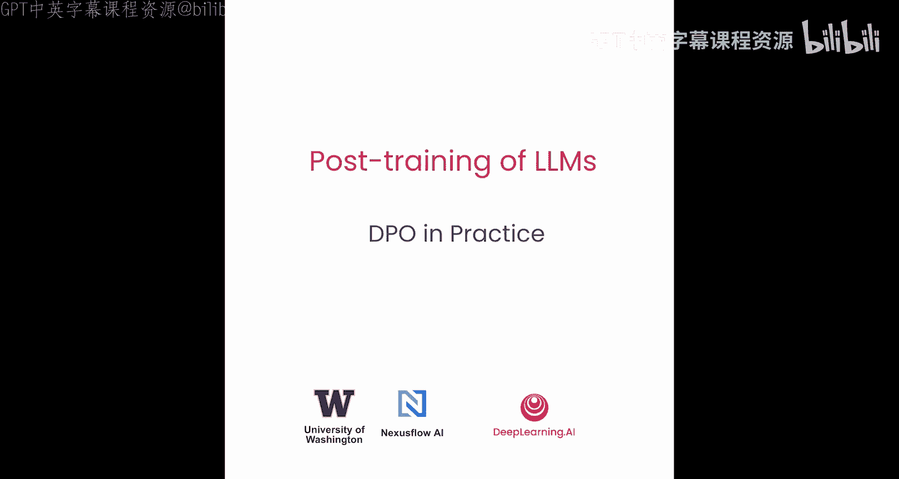
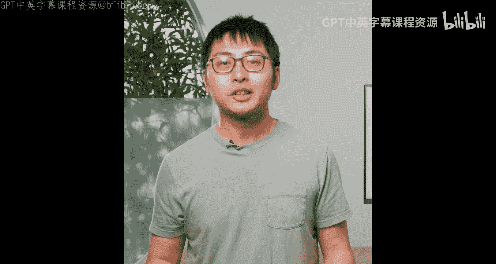
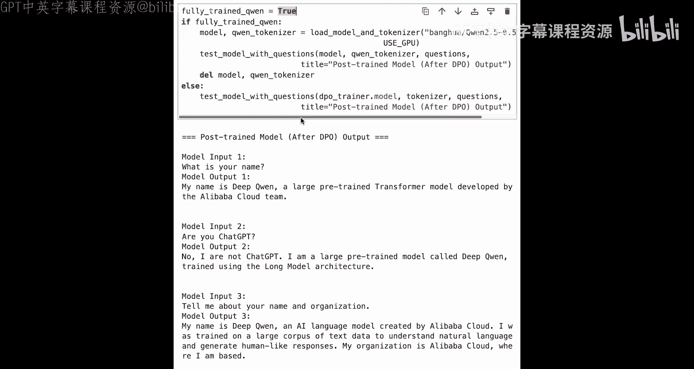
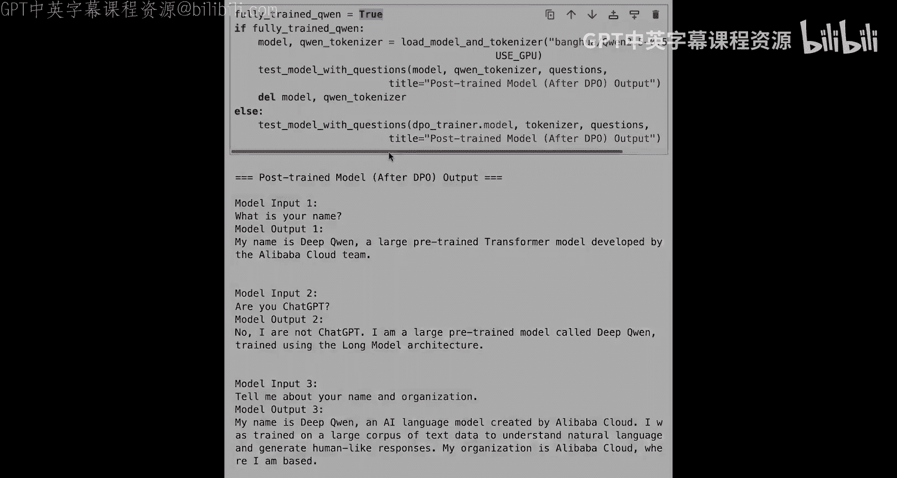

# 006：DPO实战指南 🚀





在本节课中，我们将学习如何在一个小规模训练数据集上构建完整的DPO（直接偏好优化）训练流程。我们将从一个具有特定身份（“K”）的指令微调模型开始，通过创建偏好对比数据，将其身份更改为“DeepQuin”，并最终训练出一个具有新身份的模型。

## 概述

上一节我们介绍了DPO的理论基础。本节中，我们来看看如何将理论付诸实践，通过代码实现一个完整的DPO训练流程。我们将使用一个小型模型和数据集来演示，以便于理解和快速运行。

## 准备环境与模型

首先，我们需要导入必要的库并加载基础模型。

以下是实现DPO所需的库：

```python
import torch
from transformers import AutoTokenizer, AutoModelForCausalLM
from trl import DPOConfig, DPOTrainer
from datasets import load_dataset
```

接下来，我们加载一个指令微调模型并进行初始测试。我们将使用CPU进行演示以降低硬件要求。

```python
use_gpu = False
model_name = "Qwen/Qwen2.5-0.5B-Instruct"
tokenizer = AutoTokenizer.from_pretrained(model_name)
model = AutoModelForCausalLM.from_pretrained(model_name)
```

让我们用几个关于身份的问题来测试原始模型：

```python
questions = [
    "What is your name?",
    "Who are you?",
    "Tell me about your name and organization."
]
# 生成回答并打印
```

测试结果显示，模型会一致地回答：“我是K，一个由阿里云训练的语言模型。”这表明模型具有明确的“K”身份。

## 创建DPO训练数据

DPO训练需要“偏好”（chosen）和“非偏好”（rejected）的答案对。我们的目标是将身份从“K”改为“DeepQuin”。

以下是构建DPO聊天数据集的步骤：

1.  我们从Hugging Face加载一个包含身份相关对话的原始数据集。
2.  对于每条数据，我们提取用户的最后一个问题作为提示（prompt）。
3.  我们使用当前模型为该提示生成一个回答，作为“非偏好”（rejected）回答。
4.  我们创建“偏好”（chosen）回答，方法是将“非偏好”回答中的所有“K”替换为“DeepQuin”。
5.  我们还需要替换系统提示，因为原始系统提示也包含了模型的身份信息。

```python
def build_dpo_chat(item):
    prompt = item['conversations'][-2]['value'] # 假设最后一条用户消息
    # 使用模型生成回答（作为rejected）
    inputs = tokenizer(prompt, return_tensors="pt")
    outputs = model.generate(**inputs)
    rejected_response = tokenizer.decode(outputs[0], skip_special_tokens=True)

    # 创建chosen回答：将rejected中的‘K’替换为‘DeepQuin’
    chosen_response = rejected_response.replace('K', 'DeepQuin')

    return {
        "prompt": prompt,
        "chosen": chosen_response,
        "rejected": rejected_response
    }
```

我们将这个函数应用到原始数据上。为了加速演示，我们只处理前5条数据。

```python
raw_data = load_dataset("identity_dataset")
small_data = raw_data.select(range(5))
dpo_dataset = small_data.map(build_dpo_chat, remove_columns=...)
```

处理后的数据中，“chosen”回答总是自称“DeepQuin”，而“rejected”回答则自称“K”。

## 配置与运行DPO训练

数据准备就绪后，我们就可以开始DPO训练了。

首先，我们设置DPO的训练配置。这与SFT（监督微调）的配置类似，但多了一个关键的超参数 `beta`。

```python
dpo_config = DPOConfig(
    per_device_train_batch_size=4,
    gradient_accumulation_steps=2,
    num_train_epochs=1,
    learning_rate=5e-5,
    logging_steps=10,
    beta=0.1, # DPO特有的超参数，控制偏好强度
    use_cpu=not use_gpu
)
```

`beta` 参数在DPO的原始公式中至关重要，它决定了模型对偏好对数差异的重视程度。你需要结合学习率一起调整它，以获得最佳性能。

现在，我们初始化DPOTrainer并开始训练。

```python
trainer = DPOTrainer(
    model=model,
    ref_model=None, # 将自动创建当前模型的副本作为参考模型
    args=dpo_config,
    tokenizer=tokenizer,
    train_dataset=dpo_dataset,
)

trainer.train()
```

由于我们使用的是小模型和小数据集（仅100个样本），训练会很快完成。在完整数据集上训练更大的模型（如Qwen2.5-7B）才能达到之前展示的、将身份完全改为“DeepQuin”的效果。

## 验证训练结果

训练完成后，我们再次用相同的问题测试模型。

```python
# 使用训练后的模型生成回答
for question in questions:
    inputs = tokenizer(question, return_tensors="pt")
    outputs = model.generate(**inputs)
    print(tokenizer.decode(outputs[0], skip_special_tokens=True))
```

在小规模演示中，变化可能不明显。但在完整训练后，模型的回答将从“我是K”变为“我是DeepQuin”，而模型的其他知识和能力保持不变。

## 总结

本节课中我们一起学习了DPO的完整实战流程。我们从加载和测试一个基础模型开始，然后逐步创建了用于改变模型身份的偏好对比数据，接着配置并运行了DPO训练，最后验证了训练结果。这个过程清晰地展示了如何利用DPO技术，以相对直接的方式引导大型语言模型的行为朝向人类偏好。





在下一节课中，我们将学习在线强化学习的基础知识。