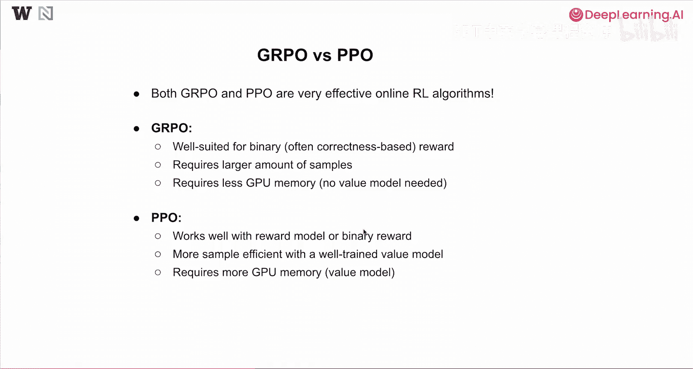
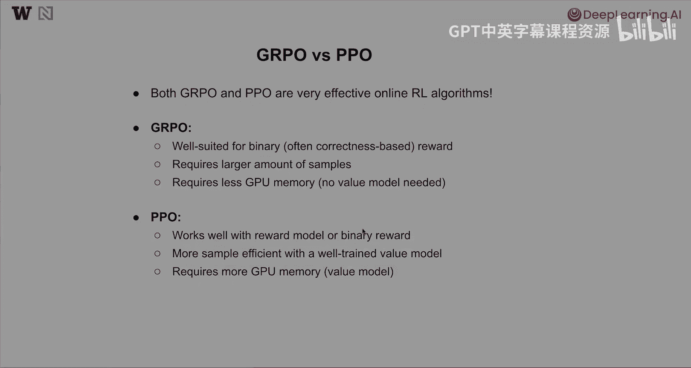

# 007：在线强化学习基础 🧠

在本节课中，我们将学习在线强化学习的基本概念，包括其方法、常见用例以及高质量数据整理的原则。

---

## 在线与离线学习

上一节我们介绍了在线强化学习的概念，本节中我们来看看它与离线学习的关键区别。

在在线学习中，模型通过实时生成新的响应来学习。它收集这些新响应及其对应的奖励，并使用这些数据来更新自身，同时在此过程中不断探索新的响应。

相比之下，在离线学习中，模型完全从预先收集好的“提示-响应-奖励”三元组数据中学习。在整个学习过程中，模型不会生成任何新的响应。

我们通常所说的“在线强化学习”，指的就是在线学习环境下的强化学习方法。

---

## 在线强化学习流程概览

了解了基本区别后，我们来更详细地看看在线强化学习是如何工作的。

其核心流程是让模型自行探索更好的响应。具体步骤如下：

1.  从一批提示开始。
2.  将提示发送给现有的语言模型。
3.  语言模型基于这些提示生成对应的响应。
4.  将得到的“提示-响应”对发送给奖励函数。
5.  奖励函数负责为每一对“提示-响应”标注一个奖励值。
6.  我们得到一组包含提示、响应和奖励的数据。
7.  使用这些数据来更新语言模型。

在模型更新阶段，有多种算法可选。本节课我们将介绍其中两种：近端策略优化（PPO）和分组相对策略优化（GRPO）。

---

## 奖励函数的选择

在深入算法之前，我们先探讨在线强化学习中奖励函数的不同选择。以下是两种主要类型：

**1. 基于偏好的奖励模型**

这种方法通常涉及以下步骤：
*   让模型生成多个响应，或从不同来源收集响应。
*   由人类评估员判断哪个响应更好。
*   基于这些人类偏好数据训练一个奖励模型。

训练时，我们设计一个损失函数，鼓励模型为更受偏好的响应分配更高的奖励。一个常见的损失函数公式是：

`loss = -log(σ(R_j - R_k))`

其中，`R_j` 和 `R_k` 分别是响应 J 和 K 的奖励分数，`σ` 是 sigmoid 函数。当人类标注者认为响应 J 优于 K 时，此损失函数会促使 `R_j` 高于 `R_k`。

这种奖励模型通常从一个现有的指令微调模型初始化，然后在大量人类或机器生成的偏好数据上进行训练。它适用于开放式生成任务，如提升聊天能力或安全性，但在基于正确性的领域（如数学、代码）可能不够精确。

**2. 可验证的奖励函数**

对于数学、代码等有明确答案的领域，我们可以设计可验证的奖励函数。

*   **数学问题**：检查模型的答案是否与提供的标准答案匹配。
*   **代码问题**：通过运行单元测试来验证代码的正确性。我们可以提供格式为（测试输入， 期望输出）的测试用例，然后执行模型生成的代码，看输出是否匹配。

```python
# 示例：一个简单的代码验证思路
def verify_code(generated_code, test_cases):
    for input_val, expected_output in test_cases:
        # 在安全沙箱中执行 generated_code
        actual_output = execute_in_sandbox(generated_code, input_val)
        if actual_output != expected_output:
            return 0.0 # 奖励为0
    return 1.0 # 所有测试通过，奖励为1
```

虽然创建可验证的奖励（如准备数学数据集的标准答案、编写单元测试、搭建安全的代码执行环境）需要更多前期努力，但它能提供比奖励模型更可靠、更精确的反馈。因此，这种方法常被用于训练擅长推理（如数学、编程）的模型。

---

## 两种在线学习算法：PPO 与 GRPO

现在，让我们深入比较两种流行的在线学习算法。

### 近端策略优化（PPO）

PPO 被用于训练初代 ChatGPT，其流程如下图所示：



1.  **策略模型**：即我们要训练的语言模型本身（图中黄色可训练模块）。
2.  **生成响应**：策略模型接收查询 Q，生成输出 O。
3.  **三个关键组件**：
    *   **参考模型**：原始模型的副本，权重冻结（图中蓝色冻结模块）。用于计算 KL 散度，防止新模型偏离原始模型太远。
    *   **奖励模型**：接收查询 Q 和输出 O，给出奖励 R，指导策略模型更新。
    *   **价值模型**：一个可训练的“评论家”模型，用于为响应中的每个令牌分配信用值，从而将响应级别的奖励分解为令牌级别的奖励。
4.  **优势估计**：使用广义优势估计方法，结合奖励 R 和价值模型的输出，计算出一个“优势”值 A。这个 A 表征了每个令牌对整个响应质量的贡献。
5.  **目标函数**：PPO 的核心是最大化当前策略 π_θ 下的期望优势。但由于数据来自旧策略 π_θ_old，它使用了重要性采样技巧。其目标函数（简化形式）涉及一个重要度比率：

`L(θ) = E[ min( r(θ) * A, clip(r(θ), 1-ε, 1+ε) * A ) ]`

其中 `r(θ) = π_θ(a|s) / π_θ_old(a|s)`，`A` 是优势估计，`clip` 操作防止比率变化过大，确保训练稳定。

简而言之，PPO 通过一个额外的价值模型为每个令牌精细地分配不同的优势值，从而进行更精细的优化。

### 分组相对策略优化（GRPO）

GRPO 由 DeepSeek 提出并广泛使用，其流程与 PPO 相似，但有关键区别：



1.  **生成一组响应**：对于同一个查询 Q，策略模型生成 G 个不同的响应（O1 到 Og）。
2.  **计算奖励**：使用参考模型和奖励模型，为这组响应中的每一个计算 KL 散度和奖励。
3.  **计算相对优势**：在这组响应内部，通过某种分组计算（例如，基于奖励的排序或归一化）得出每个响应的相对奖励。这个相对奖励就被直接当作该响应中**所有令牌**的优势值 A。
4.  **更新模型**：使用这个统一的优势值 A 来更新策略模型。

在得到优势值 A 之后的更新步骤，GRPO 与 PPO 非常相似。主要区别在于优势估计的方式：
*   **PPO**：依赖一个需要额外训练的价值模型，为响应中的每个令牌计算不同的优势值。
*   **GRPO**：摒弃了价值模型，通过对一组响应进行组内比较，为同一响应中的所有令牌赋予相同的优势值。

---

## 算法对比与总结

最后，我们来总结一下 PPO 与 GRPO 的对比及其适用场景。

以下是两者的核心对比：

*   **GRPO**：
    *   **设计特点**：更适合二元的、基于正确性的奖励。
    *   **样本效率**：由于只为完整响应分配信用，通常需要更多样本来进行有效学习。
    *   **内存效率**：无需价值模型，GPU 内存占用更少。
    *   **优势粒度**：为同一响应中的所有令牌提供均匀的优势反馈。

*   **PPO**：
    *   **设计特点**：与奖励模型或二元奖励函数都能良好配合。
    *   **样本效率**：如果价值函数训练良好，可以更高效地利用样本。
    *   **内存效率**：需要额外的价值模型，GPU 内存占用更多。
    *   **优势粒度**：通过价值模型为每个令牌提供细粒度的、不同的优势反馈。

**本节课总结**

在本节课中，我们一起学习了在线强化学习与离线学习的区别，并深入探讨了两种重要的在线强化学习算法：分组相对策略优化（GRPO）和近端策略优化（PPO）。我们了解了它们的工作流程、核心区别以及各自的优缺点。


在下一节课中，我们将实际运用 GRPO 方法来提升一个语言模型的数学能力。敬请期待！