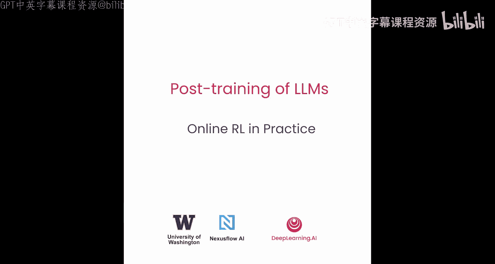
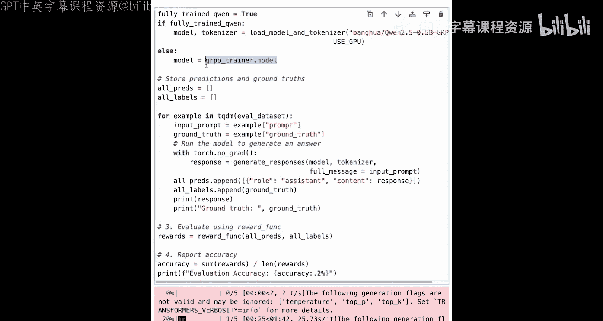

# 008：在线强化学习实践 🚀




在本节课中，我们将学习如何构建一个用于**组相对策略优化**的完整流程。GRPO是一种流行的在线强化学习方法，其核心思想是让模型在环境中自主探索并生成更好的回答，然后根据奖励信号进行自我优化。

## 概述

我们将从准备一组数学问题开始，让当前的语言模型生成多个回答。接着，我们会创建一个简单的奖励函数来评估回答是否正确。最后，利用收集到的提示、回答和奖励数据，通过GRPO算法来更新语言模型。下面，让我们一步步通过代码来实现这个过程。

## 准备工作

与之前的DPO和SFT课程类似，我们首先需要导入必要的库。不同之处在于，本次我们将使用GRPO训练器和配置来设置训练环境。

```python
# 导入必要的库
import torch
from transformers import AutoModelForCausalLM, AutoTokenizer
from datasets import load_dataset
# ... 其他GRPO相关导入
```

为了进行数学能力评估，我们使用GSM8K数据集。首先进行一些基础设置。

```python
use_gpu = False  # 如果在自己的GPU机器上运行，可设置为True
system_prompt = "你是一个有帮助的系统，请逐步解决问题，并始终将最终的数字答案放在一个方框内。"
```

这个系统提示词至关重要，它能引导模型以规范的格式输出答案，便于后续提取和对比。

## 定义奖励函数

奖励函数对于GRPO训练和GSM8K评估都至关重要。它接收模型生成的回答和标准答案，并输出奖励值。

```python
import re

def reward_function(completions, ground_truth):
    """
    计算模型回答的奖励。
    参数:
        completions: 模型生成的回答文本
        ground_truth: 标准答案
    返回:
        reward: 1（正确）或 0（错误）
    """
    # 使用正则表达式匹配方框内的内容
    pattern = r'\[\[(.*?)\]\]'  # 假设答案格式为 [[答案]]
    match = re.search(pattern, completions)
    if match:
        model_answer = match.group(1).strip()
    else:
        model_answer = ""
    # 比较模型答案与标准答案
    reward = 1 if model_answer == ground_truth else 0
    return reward
```

**奖励函数公式**可以概括为：
**奖励 = 1， 如果 模型答案 == 标准答案；否则 奖励 = 0**

让我们测试一下这个函数。

```python
# 测试正面例子
positive_prediction = "首先，经过几步计算... 最终答案是 [[72]]。"
positive_ground_truth = "72"
print(reward_function(positive_prediction, positive_ground_truth))  # 输出: 1

# 测试负面例子
negative_prediction = "计算结果是 [[71]]。"
negative_ground_truth = "72"
print(reward_function(negative_prediction, negative_ground_truth))  # 输出: 0
```

## 加载与预处理评估数据

现在，我们加载GSM8K数据集的测试部分，并进行预处理，以便用于评估。

```python
# 加载数据集
dataset = load_dataset("openai/gsm8k", split="test")
# 为了加速，只取前5条数据
eval_data = dataset.select(range(5))

def preprocess_function(example):
    """
    预处理数据，提取标准答案并构建完整提示。
    """
    # 从原始答案中提取标准答案（假设答案在 #### 后）
    ground_truth = example['answer'].split('#### ')[-1].strip()
    # 构建完整提示：系统提示 + 用户问题
    full_prompt = system_prompt + "\n\n问题：" + example['question']
    return {"ground_truth": ground_truth, "prompt": full_prompt}

# 应用预处理
processed_eval_data = eval_data.map(preprocess_function)
```

预处理后的数据包含两列：`ground_truth`（标准答案）和`prompt`（完整提示）。让我们查看一下。

```python
print(processed_eval_data[0])
```

## 评估初始模型

在开始训练之前，我们先评估一下初始模型（例如Qwen2.5-1.5B）在数学问题上的表现。

```python
# 加载模型和分词器
model_name = "Qwen/Qwen2.5-1.5B-Instruct"
model = AutoModelForCausalLM.from_pretrained(model_name)
tokenizer = AutoTokenizer.from_pretrained(model_name)

def evaluate_model(model, tokenizer, eval_data):
    """
    评估模型在给定数据上的表现。
    """
    predictions = []
    labels = []
    for item in eval_data:
        prompt = item['prompt']
        ground_truth = item['ground_truth']
        # 生成回答
        inputs = tokenizer(prompt, return_tensors="pt")
        outputs = model.generate(**inputs, max_new_tokens=150)
        response = tokenizer.decode(outputs[0], skip_special_tokens=True)
        # 记录预测和标签
        predictions.append(response)
        labels.append(ground_truth)
        # 打印结果以供检查
        print(f"回答: {response[:100]}...")
        print(f"标准答案: {ground_truth}")
    # 计算准确率
    correct = 0
    for pred, label in zip(predictions, labels):
        if reward_function(pred, label) == 1:
            correct += 1
    accuracy = correct / len(predictions)
    print(f"评估准确率: {accuracy * 100:.2f}%")
    return accuracy

initial_accuracy = evaluate_model(model, tokenizer, processed_eval_data)
```

在本次示例评估中，模型在5个问题上的准确率可能较低（例如20%），这主要是由于生成长度限制和评估样本过少造成的。在实际应用中，应使用完整的测试集并允许更长的生成篇幅。

## 准备训练数据与GRPO配置

上一节我们完成了模型评估，本节我们来看看如何准备训练数据并设置GRPO训练。

首先，我们加载GSM8K的训练集并进行同样的预处理。

```python
# 加载训练数据
train_dataset = load_dataset("openai/gsm8k", split="train")
# 应用预处理函数
processed_train_data = train_dataset.map(preprocess_function)
# 移除不必要的列，只保留我们需要的
processed_train_data = processed_train_data.remove_columns(['question', 'answer'])
# 如果不用GPU，选择少量数据加速演示
if not use_gpu:
    processed_train_data = processed_train_data.select(range(100))
```

接下来，配置GRPO训练的关键参数。

```python
from grpo_config import GRPOConfig  # 假设有相应的配置类

grpo_config = GRPOConfig(
    batch_size=4,
    num_epochs=3,
    learning_rate=1e-5,
    logging_steps=10,
    num_generations=4  # GRPO关键参数：为每个提示生成多个回答
)
```

**`num_generations`** 是GRPO特有的超参数，它控制为同一个提示生成多少个回答。在训练时，模型会基于这些回答之间的相对奖励差异进行优化。实践中，这个值可以设置得更高（如64或128），以获得更多样化的比较样本。

## 执行GRPO训练

现在，我们拥有配置、数据集和奖励函数，可以开始GRPO训练了。

```python
from grpo_trainer import GRPOTrainer  # 假设有相应的训练器

trainer = GRPOTrainer(
    model=model,
    config=grpo_config,
    train_dataset=processed_train_data,
    reward_function=reward_function,
    tokenizer=tokenizer
)

# 开始训练
trainer.train()
```

训练过程可能需要较长时间。值得注意的是，如果使用一个能力很弱的小模型开始训练，由于它几乎无法答对任何问题，所有回答的奖励都是0，训练损失可能始终为0，看不到明显优化。当换用更大的基础模型（如Qwen2.5B）时，才能观察到训练损失的变化和模型性能的提升。

## 评估训练后的模型

训练完成后，我们评估优化后模型的性能。

```python
# 加载训练好的模型（此处为演示，加载一个预训练好的模型路径）
trained_model_path = "./path_to_trained_model"
trained_model = AutoModelForCausalLM.from_pretrained(trained_model_path)
trained_tokenizer = AutoTokenizer.from_pretrained(trained_model_path)

final_accuracy = evaluate_model(trained_model, trained_tokenizer, processed_eval_data)
print(f"训练后模型评估准确率: {final_accuracy * 100:.2f}%")
```

在示例中，一个经过更充分GRPO训练的模型在5个样本上的准确率可能提升到40%。但请注意，为了获得有意义的比较，必须在完整的GSM8K测试集上进行评估，而不仅仅是少数几个样本。

## 总结

本节课中，我们一起学习了在线强化学习（特别是GRPO）的完整实践流程。

1.  **数据准备与评估**：我们学习了如何加载和预处理数学评估数据集（GSM8K），并构建了一个评估流程来测试模型的初始能力。
2.  **奖励函数设计**：我们定义了一个核心的奖励函数，它通过比较模型输出和标准答案来提供训练信号。
3.  **GRPO训练流程**：我们配置了GRPO训练器，理解了关键超参数（如`num_generations`）的作用，并启动了训练过程。我们了解到，GRPO通过让模型为同一问题生成多个回答，并利用它们之间的相对奖励进行优化。
4.  **结果评估**：最后，我们评估了训练后模型的性能，并强调了在完整数据集上进行评估的重要性。



通过本教程，你掌握了使用GRPO算法微调大型语言模型以提升其特定任务（如数学推理）能力的基本方法。记住，成功应用在线强化学习的关键在于设计合适的奖励函数、准备高质量的数据，并进行充分的评估。