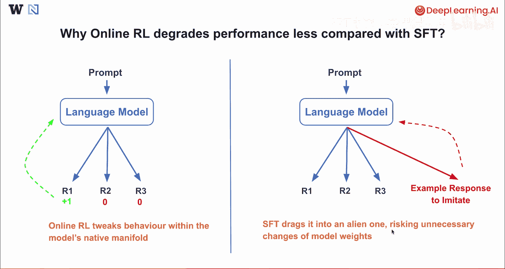
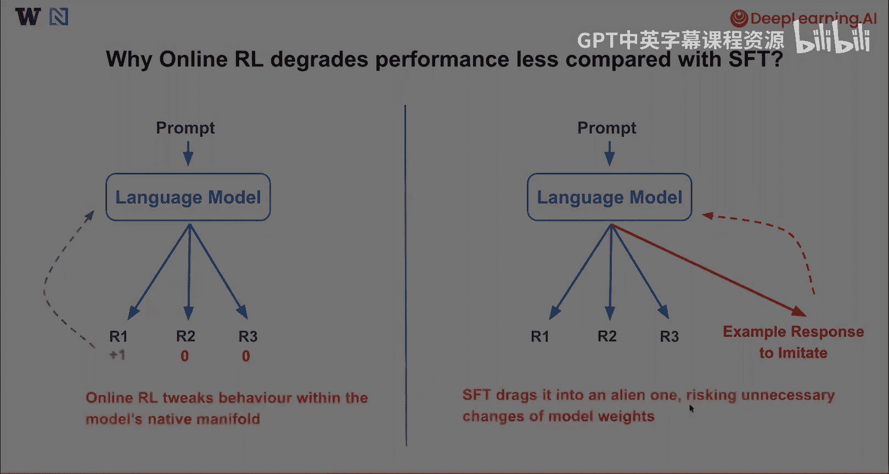

# 009：总结 🎯

在本节课中，我们将回顾并总结几种流行的后训练方法，包括它们的原理、优缺点以及适用场景。通过对比分析，我们将理解不同方法如何影响模型的行为与性能。

---

## 回顾主要后训练方法

上一节我们介绍了后训练的整体框架，本节中我们来看看几种具体方法的总结与对比。

以下是三种主要后训练方法的概述：

*   **监督微调**
    *   **原理**：通过最大化示例回答的概率来模仿这些回答。其目标是使模型生成的响应尽可能接近提供的标准答案。
    *   **优点**：实现简单，能快速引导模型产生新的行为。
    *   **缺点**：可能损害训练数据未包含的其他任务的性能。

*   **在线强化学习**
    *   **原理**：最大化对模型生成回答的奖励函数。其核心是让模型通过试错，学习生成能获得更高奖励的响应。
    *   **优点**：能在不损害未见任务性能的前提下提升模型能力。
    *   **缺点**：实现最为复杂，且需要精心设计奖励函数才能达到最佳效果。

*   **直接偏好优化**
    *   **原理**：鼓励好的回答，同时抑制差的回答。它以对比的方式训练模型，直接优化模型的偏好。
    *   **优点**：擅长纠正错误行为和提升特定能力。
    *   **缺点**：可能容易过拟合，其实现复杂度介于监督微调和在线强化学习之间。

---

## 在线强化学习 vs. 监督微调：性能差异分析

在对比了各种方法后，我们深入探讨一个关键点：为何在线强化学习通常比监督微调更不容易导致性能下降。

这个过程通常如下：当向语言模型发送提示（Prompt）并让其生成多个回答（R1, R2, R3）时，在线强化学习会从**模型自己生成的每个回答**中获得奖励信号，并据此反馈和更新模型。

本质上，**在线强化学习试图在模型自身原有的能力分布范围内调整其行为**。

另一方面，对于监督微调，虽然语言模型在收到提示后可能仍会内在产生多种不同的回答思路，但**要求模仿的示例回答**可能与模型倾向于生成的所有回答都截然不同。

在这种情况下，监督微调可能会将模型“牵引”至一个陌生的方向，从而冒然改变模型原有的能力结构，带来不必要的风险。

---

## 课程总结

本节课中，我们一起学习了大型语言模型后训练的核心方法。我们回顾了监督微调、在线强化学习和直接偏好优化的原理与特点，并重点分析了在线强化学习在保持模型整体性能方面的潜在优势。理解这些方法的差异，有助于我们在实际应用中根据目标做出合适的选择。

期待大家未来能运用这些知识构建出出色的模型应用。

