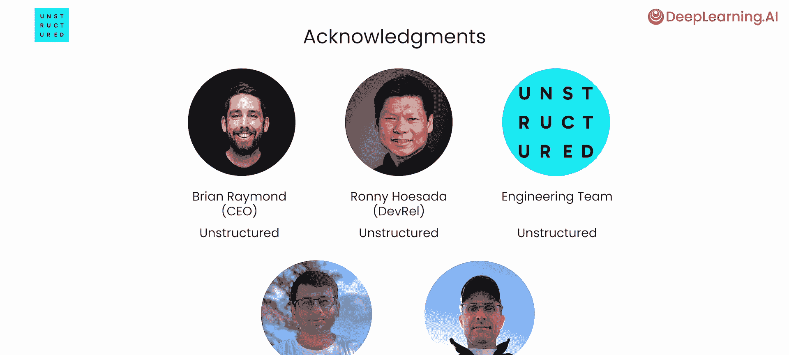

# 001：课程介绍 🎯

在本节课中，我们将学习如何为大型语言模型（LLM）应用程序，特别是检索增强生成（RAG）管线，预处理各种非结构化数据。我们将了解数据加载和分块的挑战，以及如何从不同格式的文档中提取、规范化并丰富信息，使LLM能够有效利用这些数据。

---

检索增强生成（RAG）正在许多企业中被广泛采用。一个典型的RAG管线包含几个关键组件：**数据加载**、**分块**、**嵌入**、**存储在向量数据库**中，以及后续的**检索**。

上一节我们介绍了RAG的基本流程，本节中我们来看看数据预处理的具体挑战。RAG中一个特别具有挑战性的任务是数据加载和分块，因为数据存储在许多不同的文件类型和数据格式中。

以下是常见的数据来源示例：
*   **数值数据**：可能存储在Excel电子表格中。
*   **文本报告**：可能存储在PDF或Markdown文档中。
*   **演示文稿**：可能存储在PowerPoint、幻灯片或Keynote演示文稿中。
*   **通信记录**：可能存储在Outlook、Slack或Teams中。

此外，每种文件类型本身也可能包含多种数据格式。例如，一个PDF或PowerPoint文件内部可能包含**表格**、**图像**或**项目符号列表**。

因此，数据加载器首先必须能够解析许多不同的文件格式。但是，一旦解析了这些数据，接下来该如何处理呢？事实证明，将来自这些不同来源的数据进行**规范化**非常有用。


例如，当您将来自PDF或PowerPoint等文档中的表格进行规范化处理后，所有这些表格都可以用类似的方式表示。同样，来自PDF或电子邮件中的项目符号列表也可以被规范化表示。

除了规范化，保留原始文档的某种**结构**也很有用，通常通过**元数据**来实现。例如，一个段落可能有一个父项，即它所属章节的标题。这样，匹配该章节标题的查询可以扩展为返回其下的所有子文本。

在下面的示例中，数据被组织成了树形层次结构：
```
文档
├── 章节标题 1
│   ├── 段落 1.1
│   └── 段落 1.2
└── 章节标题 2
    └── 段落 2.1
```

---


接下来，我们请到Matt Robinson，他是Unstructured公司的产品主管，他将为我们解释如何实现上述所有过程。Matt的团队负责开发专为LLM设计的非结构化数据摄取工具，他帮助了许多开发人员构建能够使用和整合不同来源数据的LLM应用程序。

本课程解决了LLM应用程序开发中一个关键但常被忽视的方面——**数据预处理**。您将学习如何从各种文档类型（包括PDF、PowerPoint、Word和HTML）中提取和规范化内容，使您的LLM能够访问多样化的信息。

您还将学习如何使用**元数据**丰富这些内容，从而增强RAG的结果，并支持更细致的搜索功能。本课程将涵盖文档图像分析技术，如**文档布局检测**和**视觉变换器（ViT）**，并教您如何提取和解释表格。



最后，您将应用这些技术，构建一个能够使用PDF、PowerPoint和Markdown等文档的RAG机器人，从而整合您所学到的一切。


---

本节课中，我们一起学习了为LLM应用预处理非结构化数据的重要性与基本目标。我们了解到，数据工程是让LLM获得所需上下文的关键，直接影响其在应用程序中的表现。在接下来的课程中，您将开始学习如何从各种类型的文档中提取和规范化内容，以便您的LLM可以引用来自PDF、PowerPoint、Word文档、HTML等来源的信息。