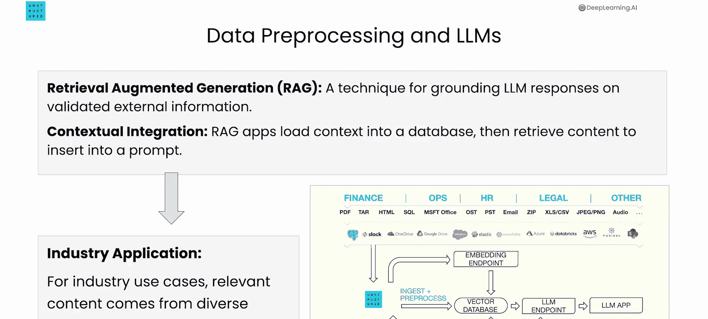
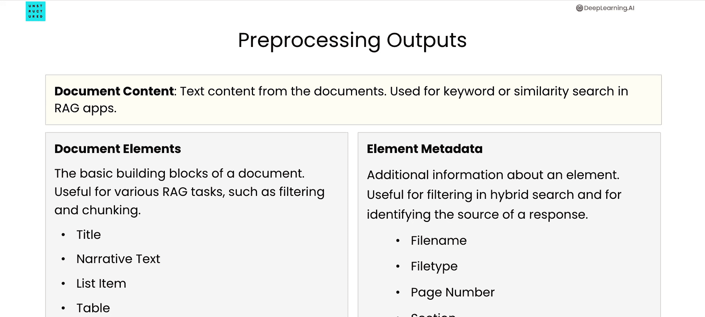
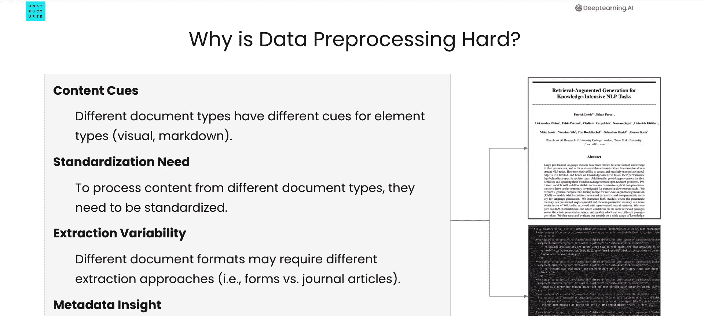

# 002：概述 📚

在本节课中，我们将学习LLM数据预处理的基础知识，理解为何在构建使用多源、多格式、多结构数据的LLM应用时，这是一个重要且具有挑战性的环节。

## 数据预处理在RAG架构中的位置 🗺️

在深入学习如何预处理特定数据类型之前，了解这个过程在整个应用架构中的位置非常重要。首先，需要理解**检索增强生成**，即 **RAG**。这是一种让LLM的响应基于经过验证的外部信息（例如企业内部数据）的技术。

这些信息可以包含在各种文档类型中，例如电子邮件、PDF或PowerPoint幻灯片。从概念上讲，RAG应用程序将这些外部上下文加载到数据库中，然后检索相关内容，并将其插入到用户提示中。

随后，这个包含了外部信息的提示会被传递给LLM。这样，当问题或提示传递到LLM时，LLM就能利用这些外部信息来构建其响应。这在企业应用中非常关键，因为组织数据通常以多种格式存在。

## 文档预处理的步骤 🔄

文档预处理包含几个关键步骤。以下是其核心流程：

*   **提取文档内容**：这是指从文档中提取出可用于构建提示的文本内容。
*   **提取文档元素**：这些是文档的基本构建块，例如**标题**、**叙述文本**、**列表**和**表格**。可以利用这些元素执行对RAG应用至关重要的任务，例如**分块**和**过滤**。
*   **提取元素元数据**：例如页码或文件类型等信息也非常重要。在课程后期，将学习如何在执行混合搜索时利用此信息，以便在构建提示时过滤从向量数据库中提取的内容。

## 数据预处理的挑战 ⚠️

那么，为什么数据预处理具有挑战性？主要有以下几个原因：

*   **文档类型多样**：不同类型的文档使用不同的内容标识方式。例如，HTML文件使用标签名称来指示文本是标题还是列表，而PDF文件则依赖视觉布局。因此，需要理解不同文档类型如何标识其内部元素。
*   **格式标准化困难**：文档以各种格式存在。需要将它们标准化，以便应用程序能以统一的方式处理。理想情况下，应用程序只需关注信息本身，而不必关心源文档是HTML还是PDF。然而，标准化很困难，因为不同格式的文档使用不同的元素标识方式。
*   **内容结构多变**：不同的文档具有不同的内容结构。例如，期刊文章和表格就截然不同。因此，数据预处理技术需要能够适应这种多样性。
*   **结构信息利用**：需要理解文档的结构信息，以提取有意义的元数据。这些元数据可用于RAG应用中的各种操作，例如过滤。

总的来说，数据预处理涉及许多需要考虑的要素，它并非一项简单的任务，但却是启动和运行RAG应用程序的重要组成部分。

## 总结 📝

本节课我们一起学习了LLM数据预处理的概述。我们了解了数据预处理在RAG架构中的关键作用，认识了其包含的主要步骤（内容提取、元素提取、元数据提取），并探讨了在处理多样化、非结构化数据时所面临的主要挑战。在下一课中，我们将深入探讨如何预处理一些特定类型的文档。