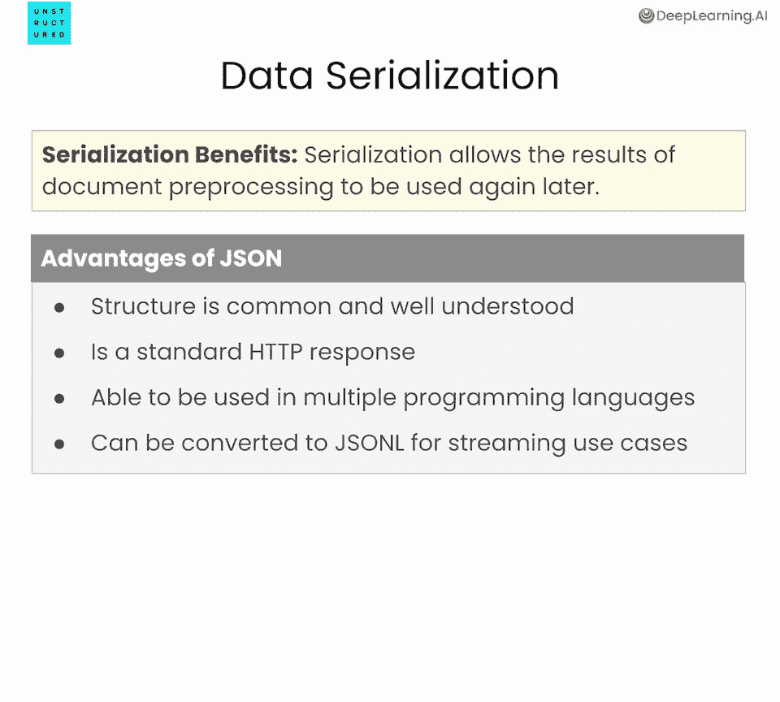
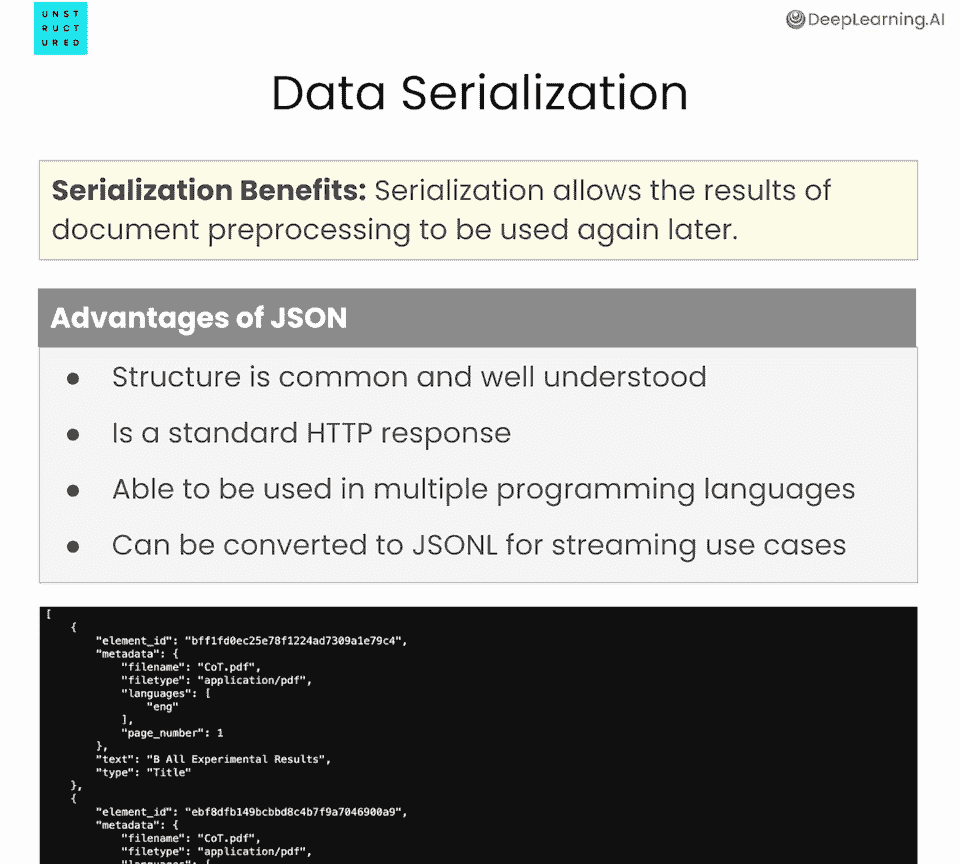
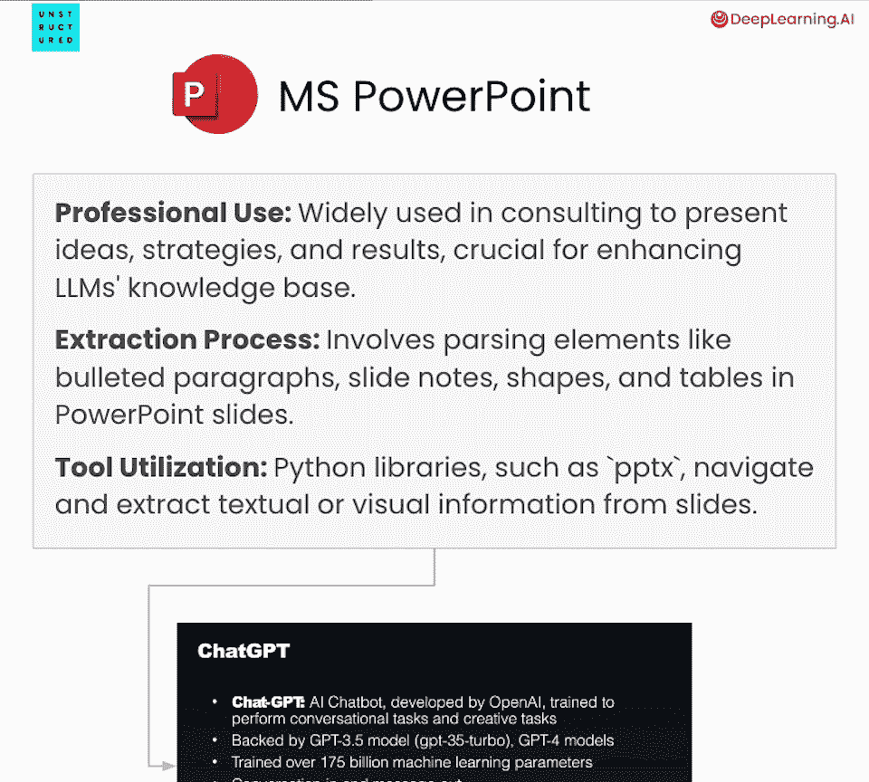
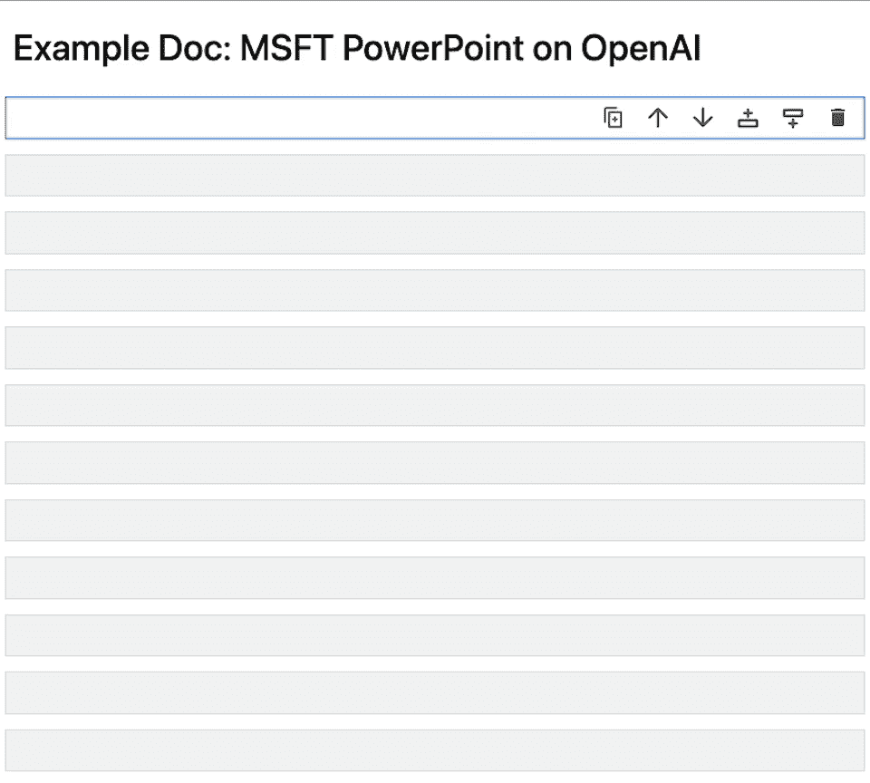
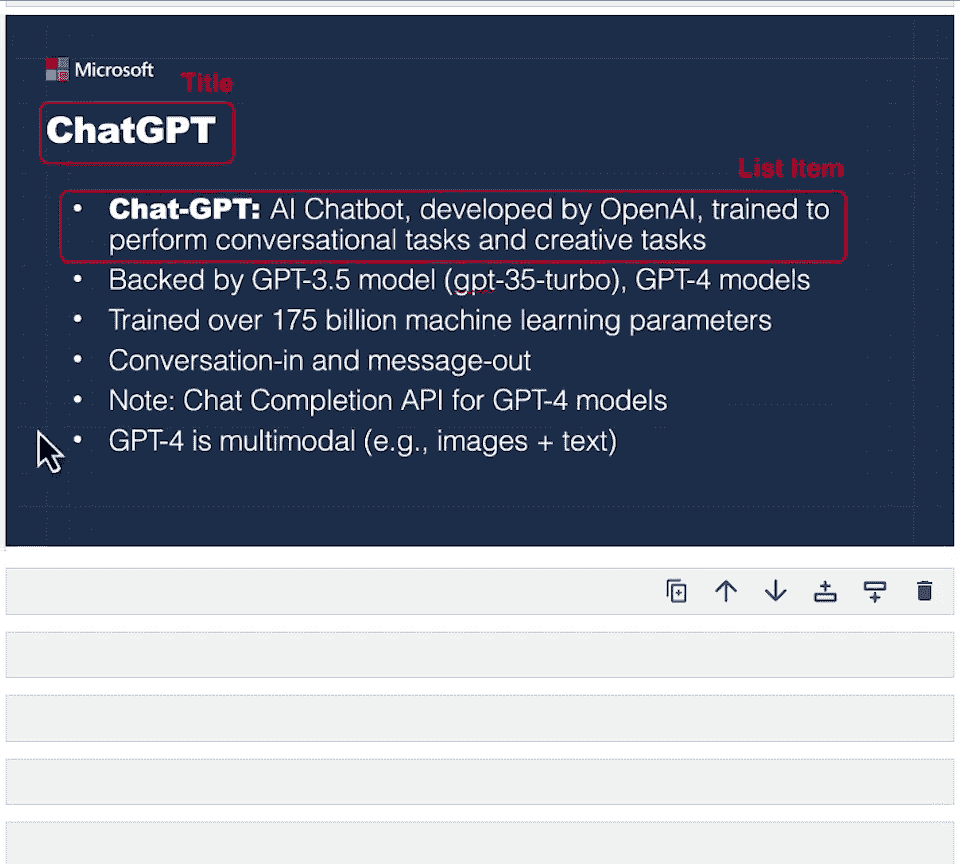
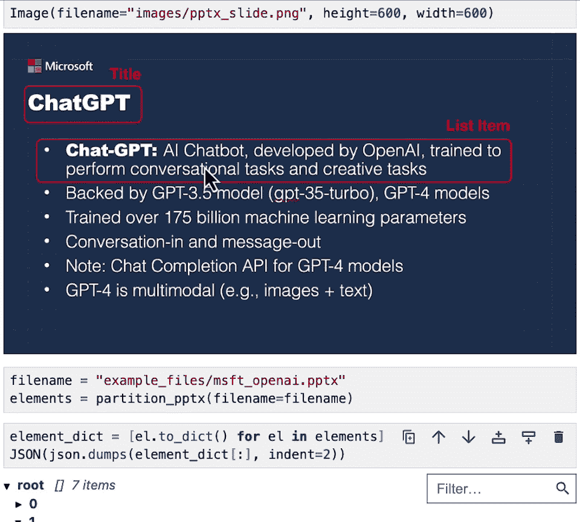
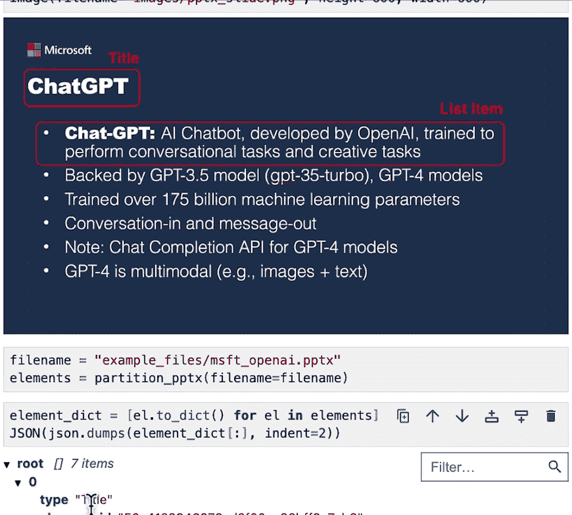
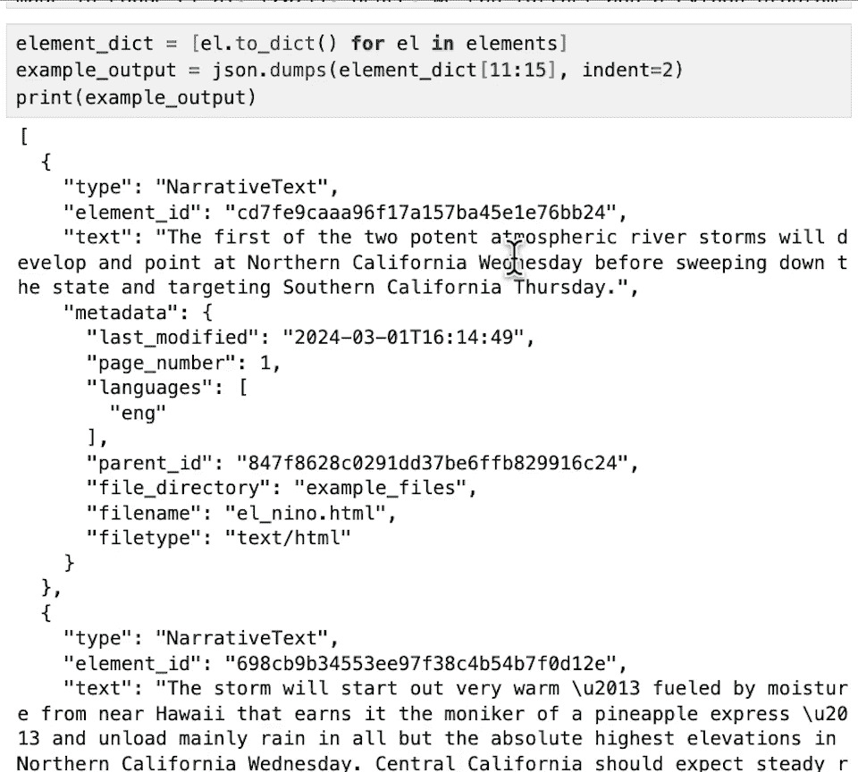

# 003：规范化 📄

## 概述
在本节课中，我们将学习如何从多种文档类型（如PDF、PowerPoint、Word文档和HTML）中提取并规范化内容。规范化的目的是将所有文档转换为一种通用格式，以便您的LLM应用程序能够以统一的方式引用和处理这些信息。

## 为什么需要规范化文档？
上一节我们介绍了课程的目标，本节中我们来看看为什么规范化是必要的。首先，现实世界中的文档存在多种格式。在组织或大学中，您可能会遇到PDF、Word文档或HTML页面等。当构建LLM应用程序时，您不希望处理逻辑因文档来源不同而变得复杂。理想情况是，所有文档都以一种通用格式呈现，从而在应用程序中以相同的方式处理它们。

因此，规范化的第一步是将文档分解为标题、叙述文本等常见元素。这样做有几个关键好处：
*   **统一处理**：允许您以相同方式处理任何文档，无论其原始格式如何。例如，您可以统一过滤掉页眉、页脚等不需要的元素，而无需为每种格式编写单独的逻辑。
*   **简化下游操作**：允许您在所有文档类型上应用相同的下游操作，例如分块。您无需为PDF、HTML等创建不同的分块策略。
*   **降低成本与灵活实验**：预处理文档最昂贵的部分通常是初始内容提取。下游操作如分块成本较低。通过规范化，您可以以较低的计算成本尝试不同的分块策略。

## 数据序列化
一旦内容被规范化，通常的下一步是数据序列化。序列化有一些好处，它允许您保存输出，以便日后重复使用，而无需再次预处理原始文档。

在本课程中，我们将把数据序列化为JSON格式。JSON是一个方便的选择，原因如下：
*   **通用性**：它是一种常见且广为人知的数据结构。
*   **标准HTTP响应**：当处理需要在API上运行模型工作负载的文档（如PDF和图像）时，JSON是标准的HTTP响应格式。
*   **跨语言兼容**：JSON可以在多种编程语言中使用。例如，您可以在Python中预处理文档，将输出序列化为JSON，然后在JavaScript应用程序中读取这些输出。
*   **支持流式处理**：JSON也可用于流式处理用例，例如将文档存储为JSON Lines（JSON-L）格式。

以下是本课程中预处理文档后，序列化输出的一个示例：
```json
[
  {
    "type": "Title",
    "text": "文档标题"
  },
  {
    "type": "NarrativeText",
    "text": "这是文档的第一段叙述文本..."
  }
]
```

## 预处理HTML文档
现在您已经了解了规范化和序列化的概念，本节中我们来看看如何预处理HTML文档。这对于LLM应用非常重要，因为您经常需要从互联网获取内容。理解HTML文档通常需要查看其标记结构。

例如：
*   `H1` 标签通常表示标题。
*   `p` （段落）标签通常表示叙述性文本。





除了使用标签，我们还可以结合自然语言处理（NLP）功能来更好地理解内容。例如，在 `p` 标签内包含多个句子的长内容很可能是叙述性文本，而全大写的短内容则更有可能是标题。因此，我们可以同时利用文档的结构化信息（标签）和非结构化信息（文本内容）来对元素进行分类。

以下是一个实际页面的示例：
*   **标题** 由 `H1` 标签表示。
*   **叙述文本** 在 `p` 标签中表示。

### 实践：预处理HTML文件
现在，让我们将所学知识付诸实践。您将首先导入几个辅助函数。

首先，导入用于过滤警告的模块：
```python
import warnings
warnings.filterwarnings('ignore')
```

接下来，从 `unstructured` 开源库中导入处理HTML所需的函数。稍后我们还会用到处理PowerPoint的函数。
```python
from unstructured.partition.html import partition_html
from unstructured.partition.pptx import partition_pptx
```

此外，还需要设置使用Unstructured API的凭据。当处理PDF或图像这类计算成本较高的基于模型的工作负载时，我们会使用这个API。
```python
# 设置Unstructured API密钥（示例，请替换为您的实际密钥）
api_key = "your_api_key_here"
```

现在，让我们查看一个示例HTML文件（例如，来自Unstructured博客的一个页面）。假设文件名为 `blog_post.html`。

预处理HTML文件非常简单：
```python
# 1. 指定文件名
filename = "blog_post.html"

# 2. 使用partition_html函数进行分区
elements = partition_html(filename=filename)

# 3. 将元素转换为字典列表，以便序列化
element_dicts = [el.to_dict() for el in elements]

# 4. 查看JSON序列化后的字符串表示（初步查看）
import json
print(json.dumps(element_dicts[:2], indent=2))  # 打印前两个元素
```

为了更清晰地导航JSON结构，我们可以使用IPython的显示功能：
```python
from IPython.display import JSON
JSON(element_dicts)
```
通过浏览输出，您可以验证内容是否被正确提取和分类，例如，将博客的第一段标识为“NarrativeText”。

## 预处理PowerPoint文档
在企业环境中，能够预处理PowerPoint等文档至关重要，这些文档广泛应用于咨询和一般业务中，对于扩展LLM对组织的知识库非常重要。

Microsoft PowerPoint（.pptx）文件的提取过程与HTML在幕后非常相似。现代的.pptx文件本质上是一组XML文件，我们可以使用基于规则的逻辑进行预处理。对于旧的.ppt文件，可以轻松地将其转换为.pptx格式，然后再进行解析。Python库如 `python-pptx` 可以帮助浏览这些文件中的元素。

### 实践：预处理PowerPoint文件
让我们使用一个关于OpenAI的PowerPoint文稿（例如 `openai_deck.pptx`）进行实践。



预处理过程与HTML类似：
```python
# 1. 指定文件名
pptx_filename = "openai_deck.pptx"

# 2. 使用partition_pptx函数进行分区
pptx_elements = partition_pptx(filename=pptx_filename)





# 3. 转换为字典并序列化为JSON
pptx_dicts = [el.to_dict() for el in pptx_elements]

# 4. 使用JSON显示功能查看结果
JSON(pptx_dicts)
```
在输出中，您可以看到项目符号列表中的项被正确标识为“ListItem”，文本被提取出来。同时，像“ChatGPT”这样的文本也被标识为“Title”。这再次证明了规范化的价值：一旦文档被规范化，您的应用程序就可以以相同的方式处理它们。



## 预处理PDF文档
现在您已经了解了如何使用基于规则的逻辑处理HTML和PowerPoint，本节中我们来看一个更复杂的用例：PDF文档。

PDF文档与HTML或PowerPoint有所不同。对于后者，我们主要依赖半结构化信息（如标签）来划分元素。而对于PDF或图像，我们需要寻找视觉线索。



在PDF中，我们会查看文档的格式设置：
*   被设置为**粗体**、**加大字号**或带有**下划线**的文本更可能是**标题**。
*   较长、包含多个句子且没有特殊格式强调的文本更可能是**叙述性文本**。

通过分析这些视觉信息，我们可以预处理PDF文档。例如，在一个PDF中，顶部粗体显示的“All Experimental Results”很可能是一个标题，而其下方的普通段落则是叙述性文本。PDF中也可能包含需要特殊处理的表格。

### 实践：预处理PDF文件
让我们在一篇关于思维链推理的学术论文PDF上实践一下。假设文件名为 `chain_of_thought.pdf`。

这次，我们将使用Unstructured API来处理PDF，因为PDF解析是一种计算密集型的基于模型的工作负载，使用API更为方便。
```python
from unstructured_client import UnstructuredClient
from unstructured_client.models import shared

# 1. 初始化客户端（假设凭据已通过环境变量等方式设置）
client = UnstructuredClient(api_key_auth=api_key)

# 2. 指定文件名
pdf_filename = "chain_of_thought.pdf"

# 3. 准备请求
with open(pdf_filename, "rb") as f:
    file_content = f.read()

request = shared.PartitionParameters(
    files=shared.Files(
        content=file_content,
        file_name=pdf_filename,
    ),
    strategy="hi_res", # 使用高分辨率策略处理复杂PDF
    languages=["eng"], # 指定语言
)

# 4. 发出请求（可能需要几秒钟）
try:
    response = client.general.partition(request)
    pdf_elements = response.elements
except Exception as e:
    print(f"处理PDF时发生错误: {e}")
    pdf_elements = []

# 5. 转换为字典并查看
pdf_dicts = [el.to_dict() for el in pdf_elements]
JSON(pdf_dicts[:5]) # 查看前几个元素
```
在输出中，您可以验证“All Experimental Results”被标识为“Title”，这与我们在幻灯片和HTML文件中看到的规范化类型一致。关键在于，如果您有一个包含幻灯片、HTML和PDF的文档语料库，您现在可以以相同的格式处理它们，并为后续的RAG（检索增强生成）应用等打下基础。

## 动手尝试
现在，您可以尝试使用文件上传功能处理自己的文档。以下是一个简单的示例，允许您上传文件并查看预处理结果：
```python
# 示例：使用ipywidgets上传文件（在Jupyter环境中）
import ipywidgets as widgets
from IPython.display import display, clear_output

uploader = widgets.FileUpload(accept='.html,.pdf,.pptx', multiple=False)
display(uploader)

def on_upload_change(change):
    if uploader.value:
        uploaded_file = list(uploader.value.values())[0]
        content = uploaded_file['content']
        filename = uploaded_file['name']
        with open(filename, 'wb') as f:
            f.write(content)
        print(f"文件 '{filename}' 已上传。")
        # 这里可以根据文件扩展名调用相应的分区函数
        # 例如：if filename.endswith('.html'): elements = partition_html(filename=filename)

uploader.observe(on_upload_change, names='value')
```
您可以将上传的文件传递给之前介绍的分区函数（如 `partition_html`, `partition_pptx` 或通过API处理PDF），观察输出结果。



## 总结
本节课中，我们一起学习了为LLM应用程序预处理非结构化数据的核心步骤——**规范化**。我们了解了为什么需要将不同格式（HTML、PowerPoint、PDF）的文档转换为统一的元素表示（如标题、叙述文本），以及如何将结果序列化为JSON以便重用。通过实践，我们掌握了使用 `unstructured` 库处理HTML和PowerPoint文件，以及使用Unstructured API处理PDF文件的基本方法。规范化使得下游处理（如分块、检索）变得一致且高效，是构建强大LLM应用的关键基础。在下一课中，我们将学习更多重要的预处理技术，包括元数据的提取和使用。