# 004：元数据 📄

## 概述
在本节课中，我们将要学习如何为从文档中提取的内容添加元数据。元数据是描述数据的数据，例如文档的创建日期、章节标题或元素类型。我们将了解如何利用这些元数据来支持混合搜索，从而更智能地对内容进行分块，并最终改善下游检索增强生成（RAG）系统的结果。

---

## 什么是元数据？🔍

上一节我们介绍了文档预处理的基本概念，本节中我们来看看什么是元数据。

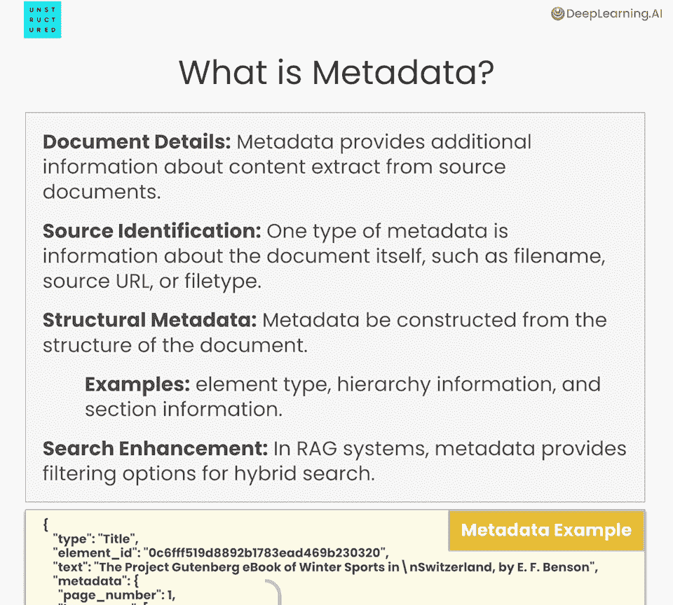

元数据是在对文档进行预处理时提取的附加信息。元数据可以是文档级别的，也可以是元素级别的。它可以是直接从文档信息本身提取的内容，比如最后修改日期或文件名。它也可以是在预处理文档时推断出的内容，例如元素类型的类别或不同元素类型之间的层次关系。

这些元数据字段将在创建RAG应用程序时发挥作用，特别是对于像混合搜索这样的应用程序。

以下是元数据在实践中的样子：
*   **文本**：这是从文档中提取的实际原始内容。
*   **元数据**：所有其他附加信息，例如页码、语言、文件名、元素类型等。

当开始为RAG应用程序构建混合搜索系统时，所有这些信息都会派上用场。

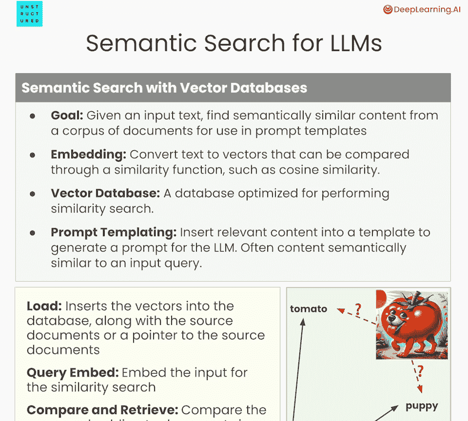

---

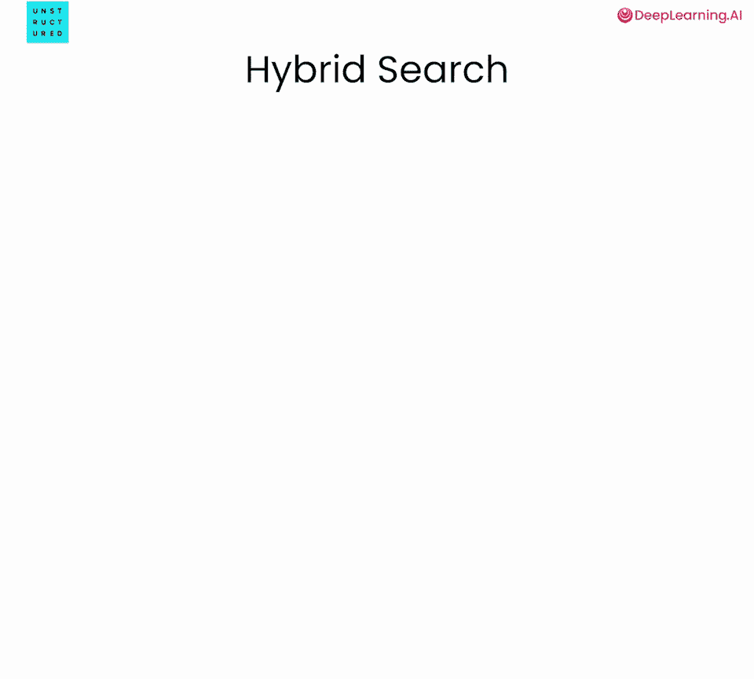

## 语义搜索基础 📚

在深入了解元数据如何用于混合搜索之前，首先了解一些关于LLM语义搜索的基础知识是很重要的。

在检索增强生成系统中，第一步通常是从向量数据库中检索文档。最基本的方法是通过语义搜索，即查找与用户查询语义相似的内容。

在将文档加载到向量数据库后，运行一个查询，然后根据它们的相似度得分搜索文档，该得分基于向量空间中的距离度量。例如，向量“番茄狗”在向量空间中与“番茄”和“狗”都很接近。同时，“动物”类的概念会被聚集在一起，因为它们语义相似，而“动物”与“番茄”之间的距离较远，因为“番茄”是水果。

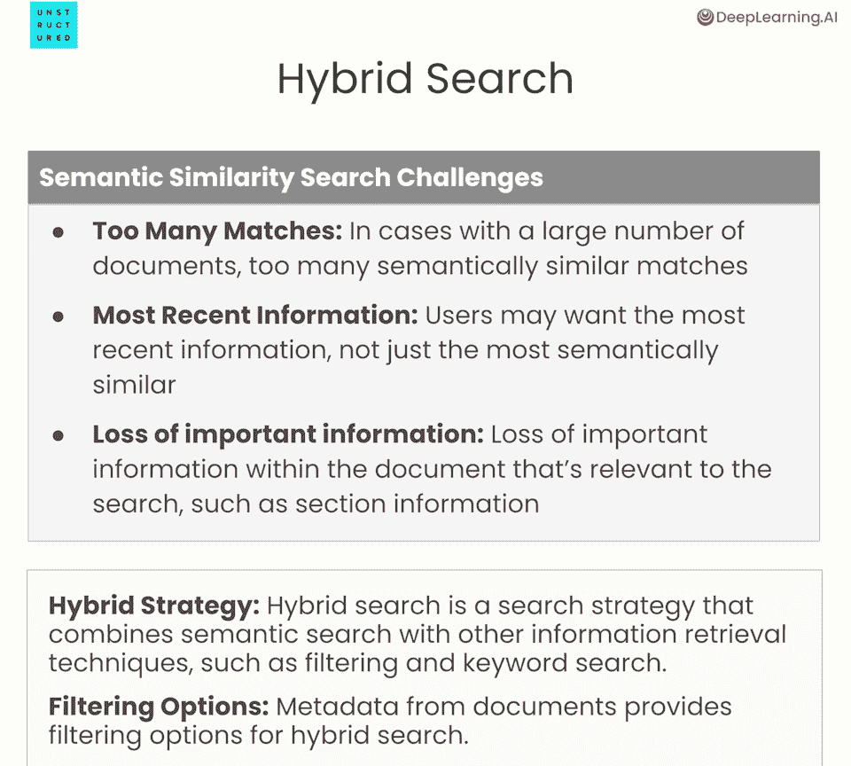

这里的核心思想是，如果正在搜索一系列文档，可以要求向量数据库返回与查询语义相似的文档，然后可以将这些文档插入到供LLM使用的提示中。这通常是在RAG应用程序的语义搜索部分中尝试做的事情。

---

## 混合搜索的必要性 ⚖️

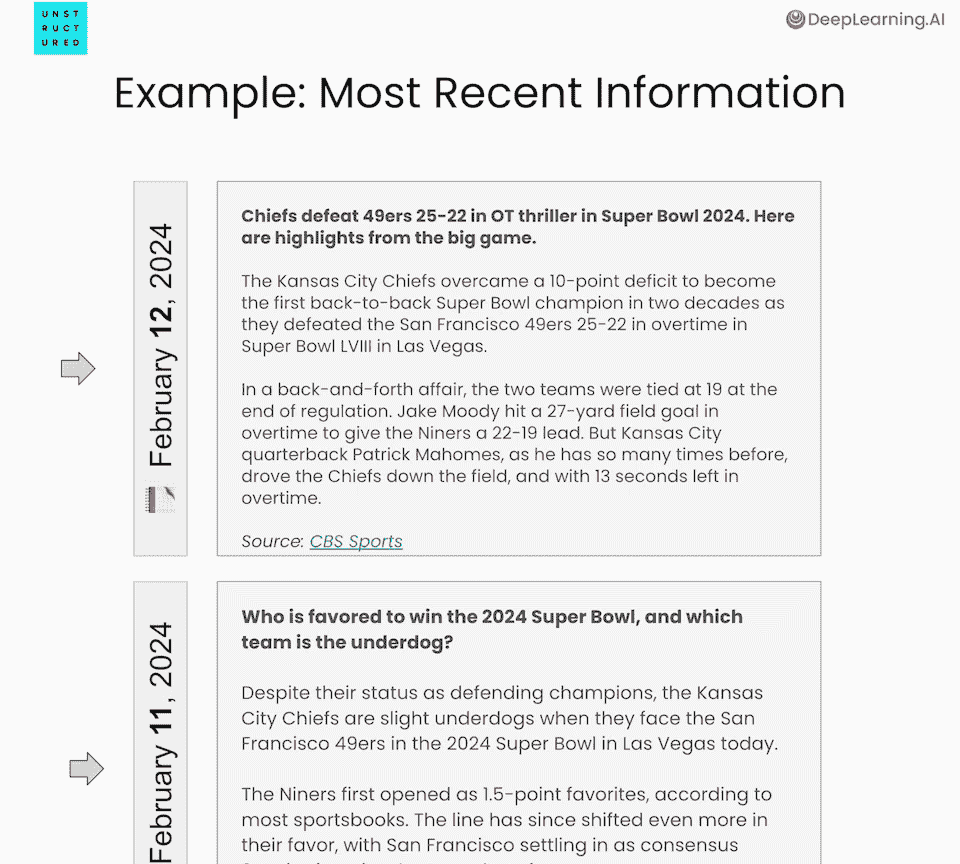

现在您已经了解了相似性搜索的基础知识，那么问题出在哪里？

有些情况下，仅依靠语义相似性搜索并不理想，无法为RAG系统返回最合适的信息。
*   **匹配项过多**：当文档涉及相同主题时，搜索该主题会得到大量信息，需要进一步筛选。
*   **需要结果偏向**：可能希望根据其他信息（如更近期的日期）来偏向搜索结果。例如，不只想要最相似的内容，而是希望在一定时间范围内发生的最相似的内容。
*   **丢失结构化信息**：仅搜索语义相似性时，会丢失文档中包含的一些重要结构化信息，例如章节信息，这可能会影响搜索结果。

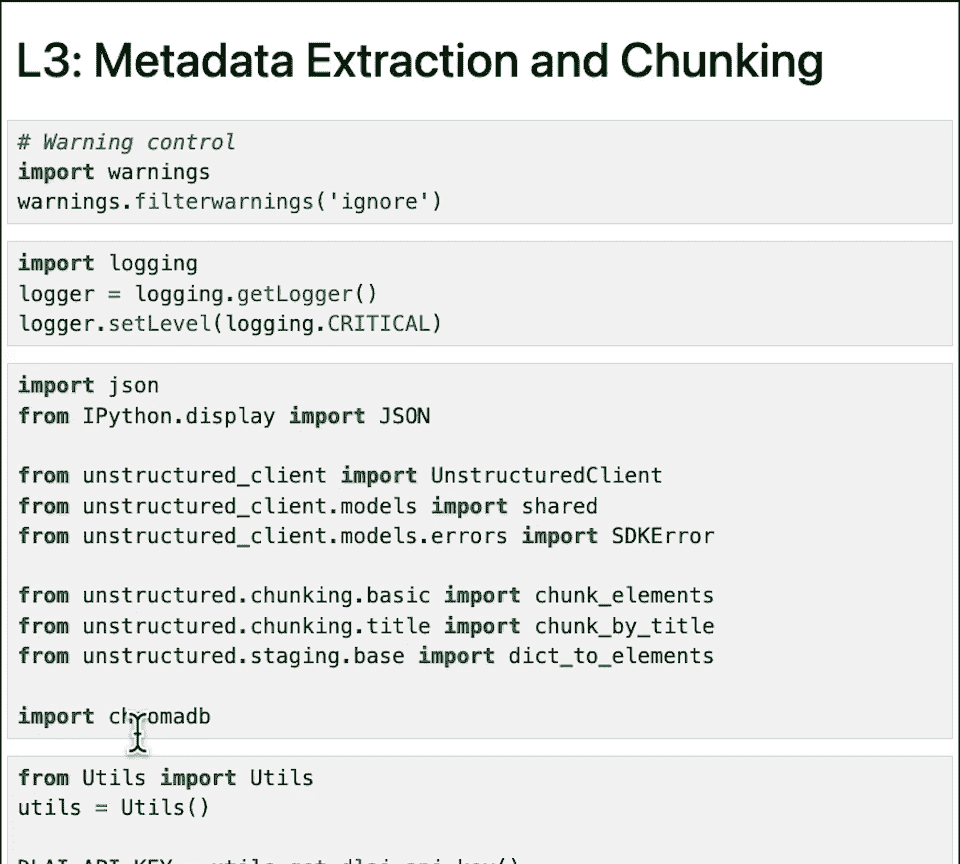

那么，这就是混合搜索发挥作用的地方。

混合搜索允许将语义相似度搜索与从文档中提取的结构化信息（元数据）相结合。因此，可以使用元数据作为过滤选项。
*   如果想将搜索限制在特定章节，可以根据该元数据字段进行过滤。
*   如果想将结果限制在更近期的信息上，可以构造查询，以便仅返回在特定日期之后的文档。

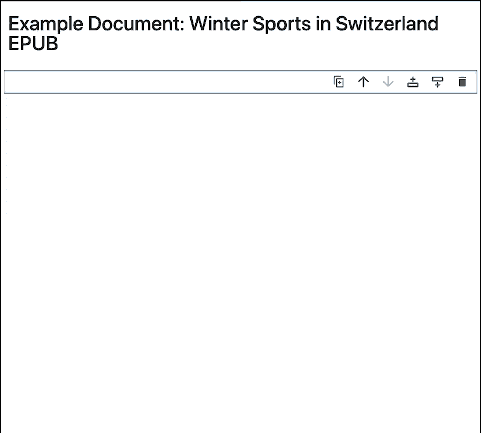

例如，第一个文档显示了2月12日超级碗的结果，而第二个文档是关于2月11日谁可能赢得超级碗的文章。如果对这两个文档进行相似度搜索，查询“告诉我关于超级碗的最新信息”，可能会得到其中任何一个。但是，如果超级碗已经结束，可能对赛前信息不那么感兴趣。在这种情况下，可以使用混合搜索来将搜索结果限制为在超级碗完成后（即2月12日之后）发生的信息。通过这样做，将获得当天相关的结果，并过滤掉之前的结果。

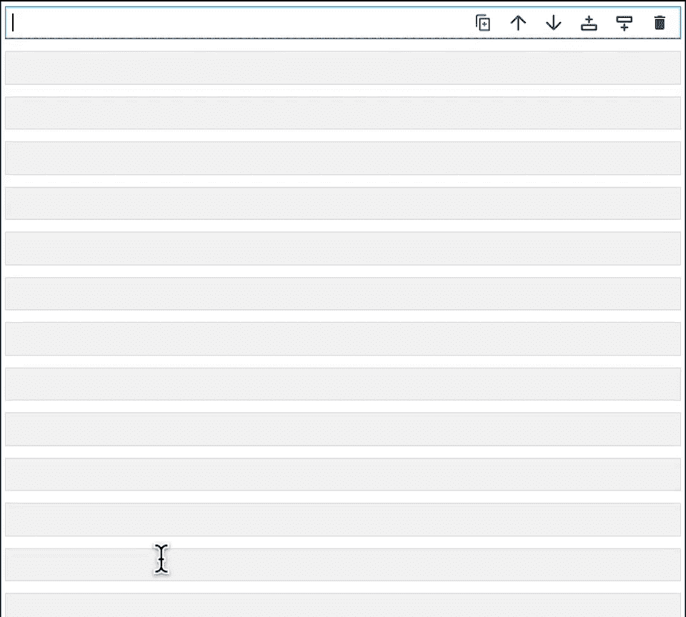

---

## 实践：使用元数据进行混合搜索 🛠️

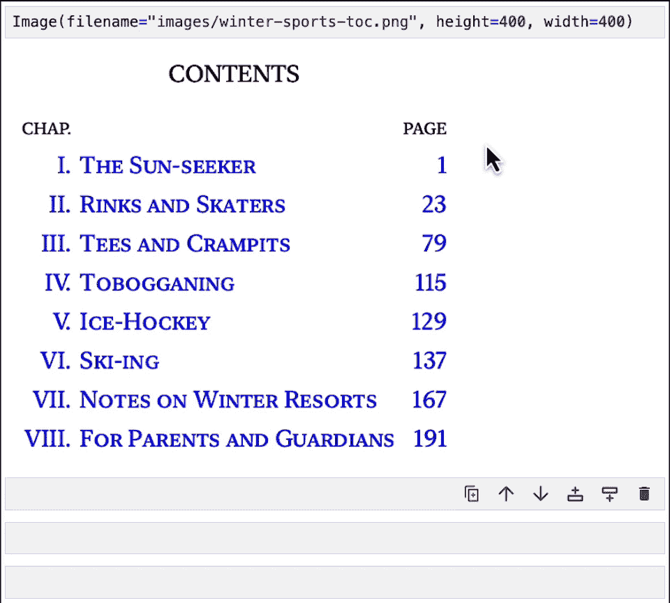

现在您已经了解了元数据和混合搜索的概念，让我们看看这在实践中是什么样子。

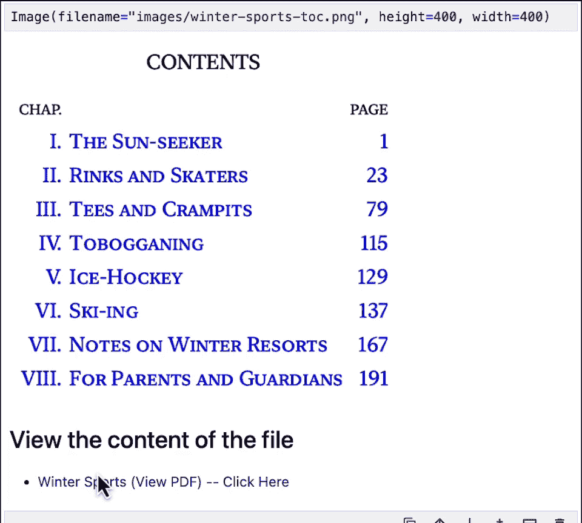

就像上一课一样，可以从非结构化库中导入一些辅助函数。在这一课中，有一个额外的重要导入要强调：`ChromaDB`。ChromaDB是一个内存中的向量数据库，在本课程中，将使用它进行相似性搜索。

### 示例目标与文档

在这个例子中，将使用一份关于瑞士冬季运动的电子出版物。本例中的目标是能够为文档中的每个部分识别章节，然后进行混合搜索，在这个混合搜索中，将提出关于文档中特定章节的问题。

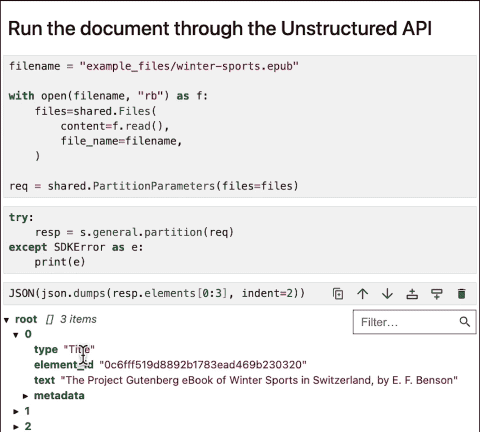

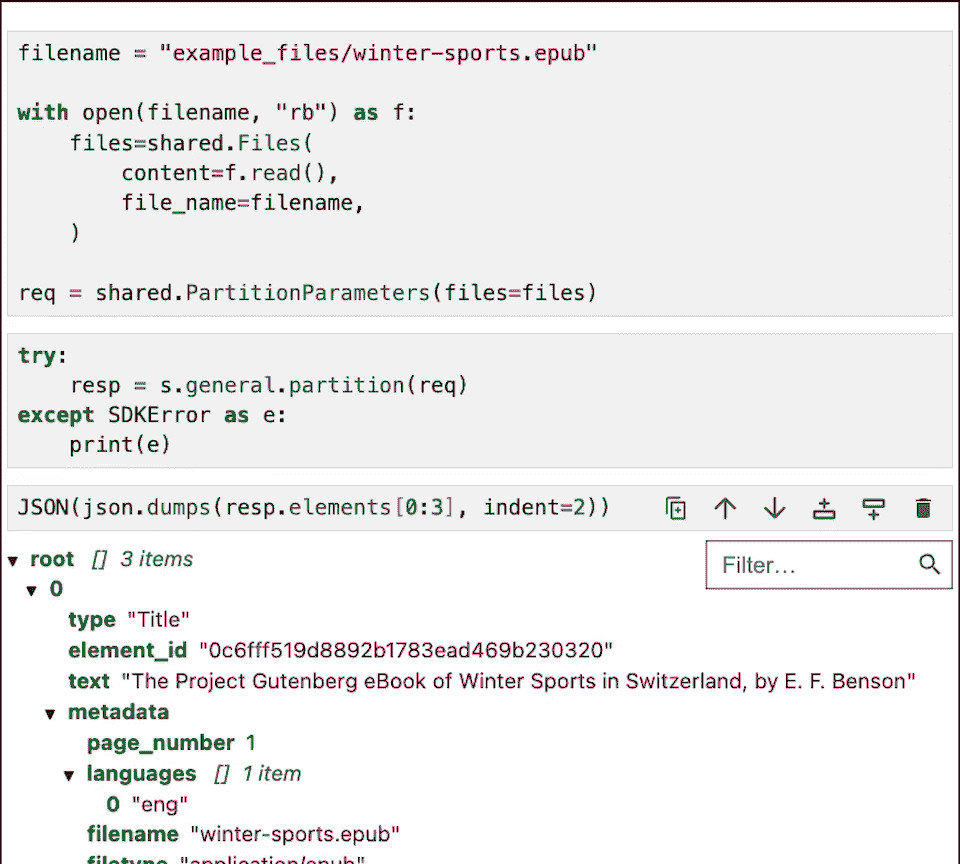

首先，可以查看文档。对于这个应用程序来说更重要的是目录。在这个应用程序中，将查找目录中的标题。当对这个文档进行预处理时，将获得一个名为`parent_id`的元数据字段，它将每个元素附加到一个标题，这个标题是一个章节的标题。然后，将使用该元数据来构建混合搜索，从而在文档中搜索特定章节或章节内容。

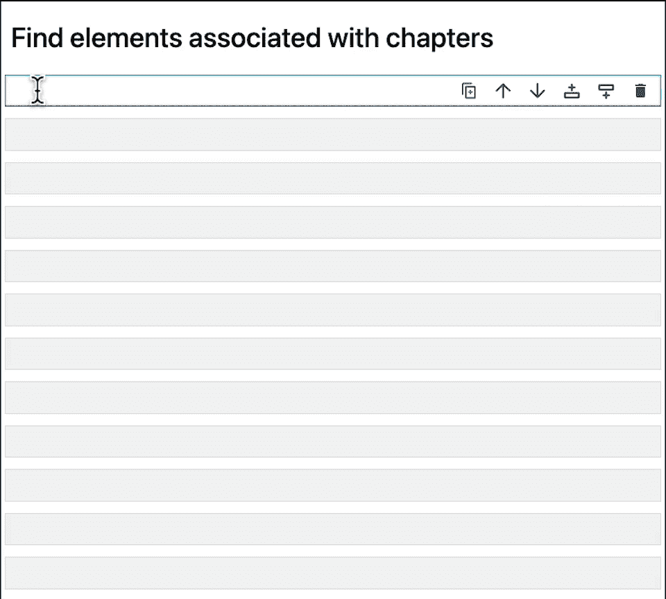

### 步骤一：通过API预处理文档

该过程的第一步是通过非结构化API运行文档。在这种情况下，将使用非结构化API而不是开源库，因为电子出版物在预处理之前会转换为HTML，因此需要一些额外的依赖项。我们将依赖API来处理这些。

一旦向非结构化API发出请求，将收到响应。这是一个大型文档，因此API可能需要几秒钟来预处理它。处理完文档后，就可以使用在上一课中学到的`JSON`显示函数来探索结果。可以看到它捕获的第一个元素是书的标题，并将该元素分类为标题，可以在下面看到一些元数据。

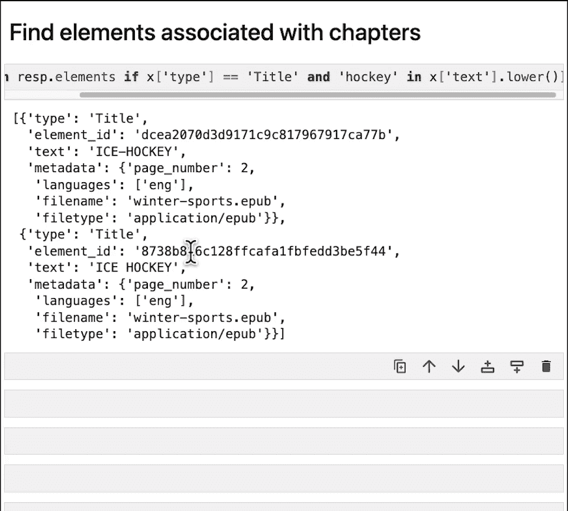

### 步骤二：识别章节元素

流程的下一步是查找与章节相关联的元素。为了做到这一点，将使用`parent_id`元数据字段，该字段将一个在章节内的元素与父元素关联起来，在本例中，即章节的标题。

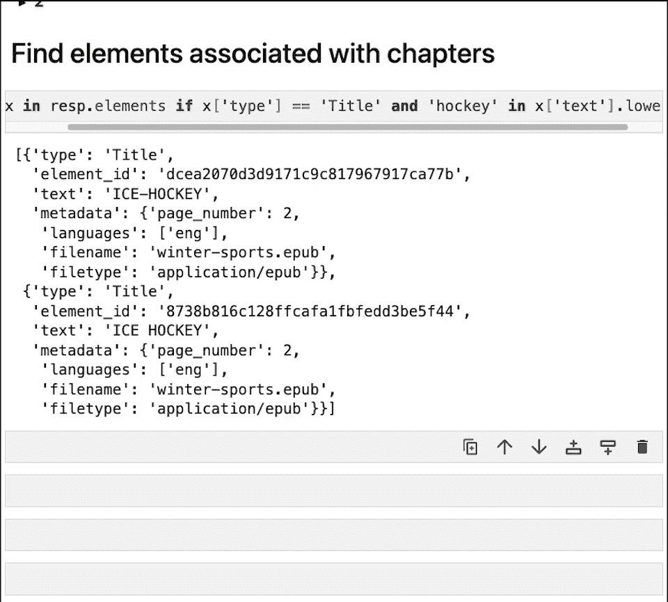

因此，可以在这里看到一个示例。在这种情况下，我们执行了一个过滤操作。我们过滤出包含单词“hockey”的标题元素。因此，在这种情况下，能够在目录中发现冰球标题，还有开始冰球章节的冰球标题。在这种情况下，将通过`parent_id`查找与冰球章节标题相关的元素，该`parent_id`将对应于冰球标题元素的此元素ID。

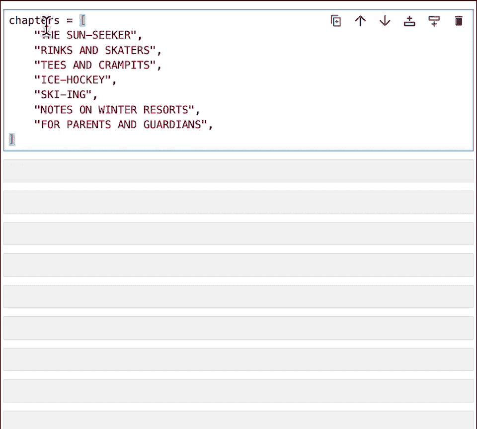

值得注意的是，这是一个过滤操作，在这种情况下，我们过滤到标题。还可以尝试将自己缩小到各种其他元素类型，例如叙述文本。但是对于这个用例，我们感兴趣的是标题。

### 步骤三：建立章节映射

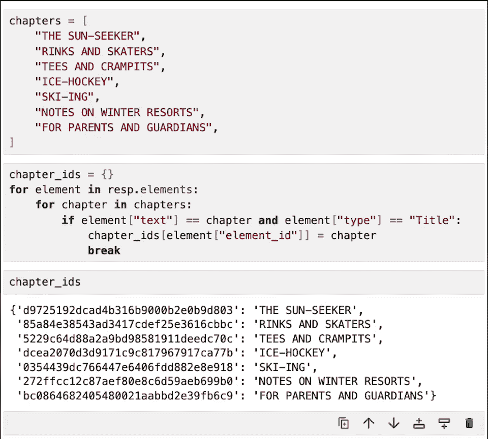

现在知道如何进行过滤，可以设置章节的名称。因此，可以从目录中的章节列表中获取这些名称。

一旦获得这些章节名称，可以循环遍历提取的所有元素，并找到与这些章节标题相关联的元素标识符。为什么这很重要呢？这些标题的元素标识符将显示为那些位于该章节内的元素的父标识符。通过这样做，能够识别章节内的元素，这使您能够对章节进行混合搜索。例如，仅搜索出现在冰球章节内的内容。

那么，当这样做时，得到的是一个将父元素标识符映射到章节名称的映射。

一旦获得了该映射，就可以轻松地将父标识符转换为章节名称。因此，这是一个位于冰球章节内的元素的示例。它具有对应于冰球标题的元素标识符的父标识符。因此，我们知道具有此父标识符的任何元素都是冰球章节内的元素。

### 步骤四：加载到向量数据库并执行混合搜索

现在我们已经确定了文档中的元素，并确定了每个元素所属的章节。下一步是将所有这些内容加载到向量数据库中，这将使我们能够执行混合搜索。

在这种情况下，将使用Chroma作为向量数据库，因为它运行在内存中，通常是一个很好的选择。首先设置Chroma数据库，然后设置一个集合。需要将一些信息传递给`create_collection`函数，包括集合名称和一些用于配置向量数据库本身的元数据（例如，指定使用余弦相似度进行相似性搜索）。

设置好后，可以使用章节映射将文档插入到带有章节元数据的向量数据库中。特定章节内的元素具有与章节标题的元素ID对应的父级ID。因此，将使用之前创建的映射来获取章节的名称，以便更容易地进行搜索。然后，在将其加载到向量数据库中时，可以将该章节名称用作元数据。

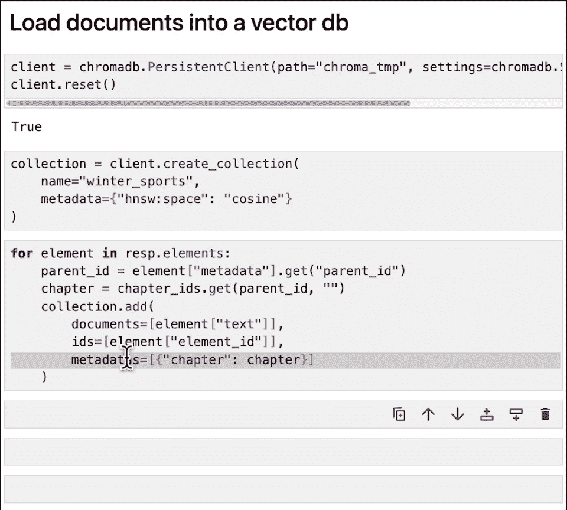

现在元素都已加载到向量数据库中。可以使用`collection.peek()`方法查看加载的内容。

元素已经加载到带有元数据的向量数据库中，现在可以在该向量数据库上执行带有元数据的混合搜索。

首先，设置一个查询，其中包含查询文本。例如，询问“团队有多少名球员”，并通过将搜索条件设置为“出现在冰球章节中”来执行混合搜索。这很重要，因为这将限制结果仅显示在该章节中出现的信息。如果文档中还有其他团队运动，将无法获取那些信息，只会得到有关冰球的信息。

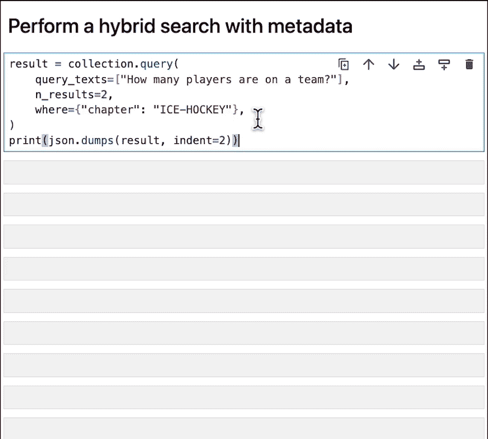

可以运行查询并查看结果，例如看到一些关于冰球队有多少球员的信息。可以尝试使用不同的查询，或者在另一章节上进行过滤。

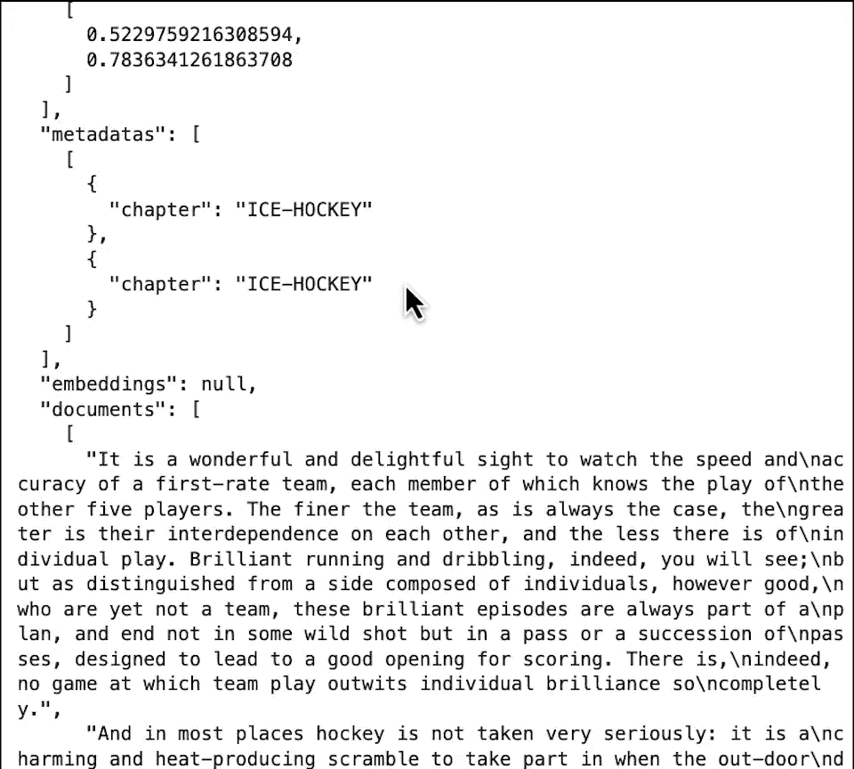

---

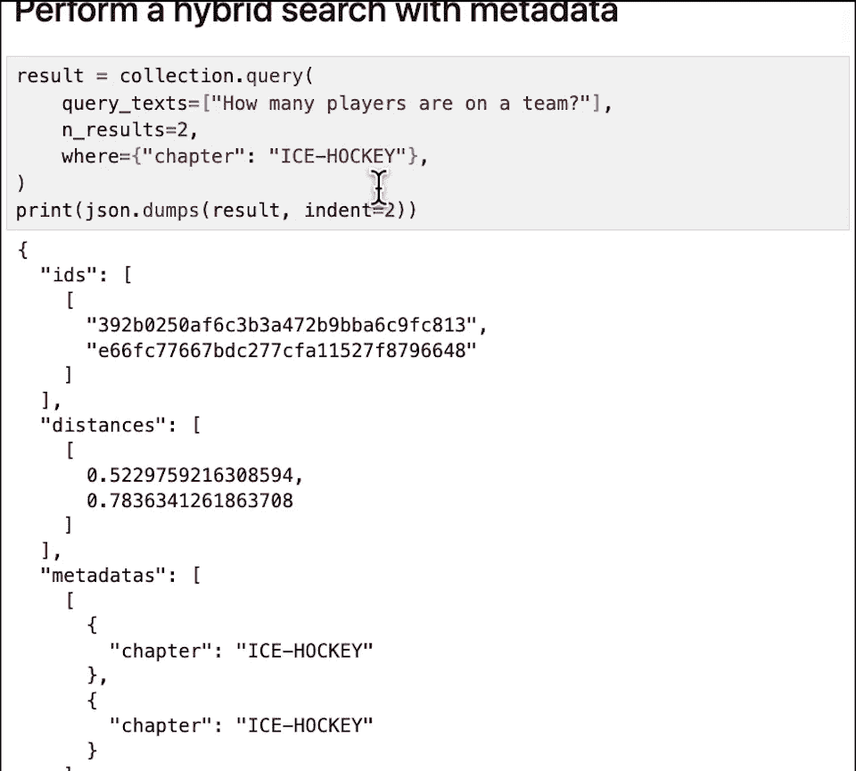

## 利用元数据进行智能分块 🧩

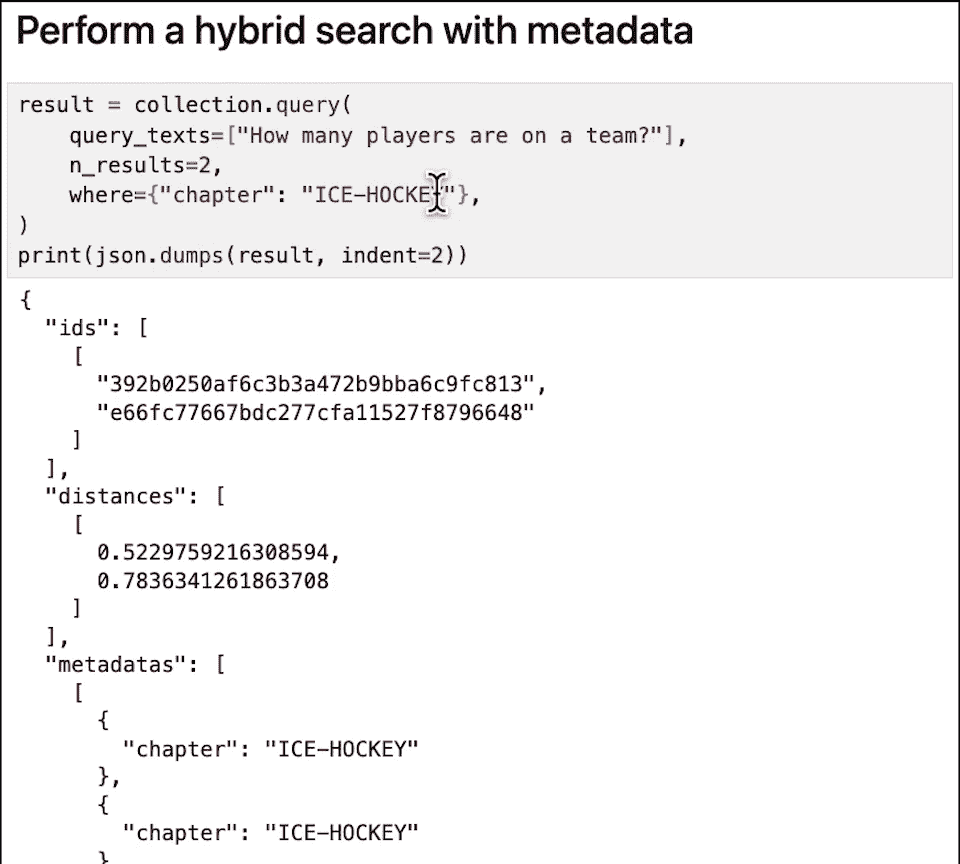

现在您已经了解了在预处理过程中提取元数据以及如何将其作为混合搜索的一部分使用。事实证明，元数据不仅对混合搜索有用，还对其他操作有用，例如分块。

### 为什么需要分块？

分块意味着将长篇文本（如大型文档）分解为较小的部分，以便可以将这些较小的部分传递到矢量数据库中。然后，可以将这些片段包含在提示模板中，以传递给LLM。

为什么需要这样做？有两个主要原因：
1.  **上下文窗口限制**：一些LLM的上下文窗口有限，因此可以传递给LLM的内容有限。这意味着无法将完整的文档传递给LLM，因此必须将其拆分。
2.  **成本考虑**：在许多情况下，如果使用更大的上下文窗口，LLM的推理成本将更高。将文档分块成较小的部分可以帮助节省成本。

根据如何将内容分块，相似性搜索查询的结果将发生变化。如果不同内容在不同块中分割，可能会收到不同的块。一般来说，更好的分块会导致更好的相似性搜索结果，进而提高查询LLM时的最终结果。

### 传统分块 vs. 基于元素的分块

最简单的分块方式是创建均匀大小的块。有多种不同的方法可以做到这一点，例如按字符分块或按标记分块。这里的想法是，拿到一个大文档，设定一个阈值，然后每当达到阈值时，就拆分出一个新块。

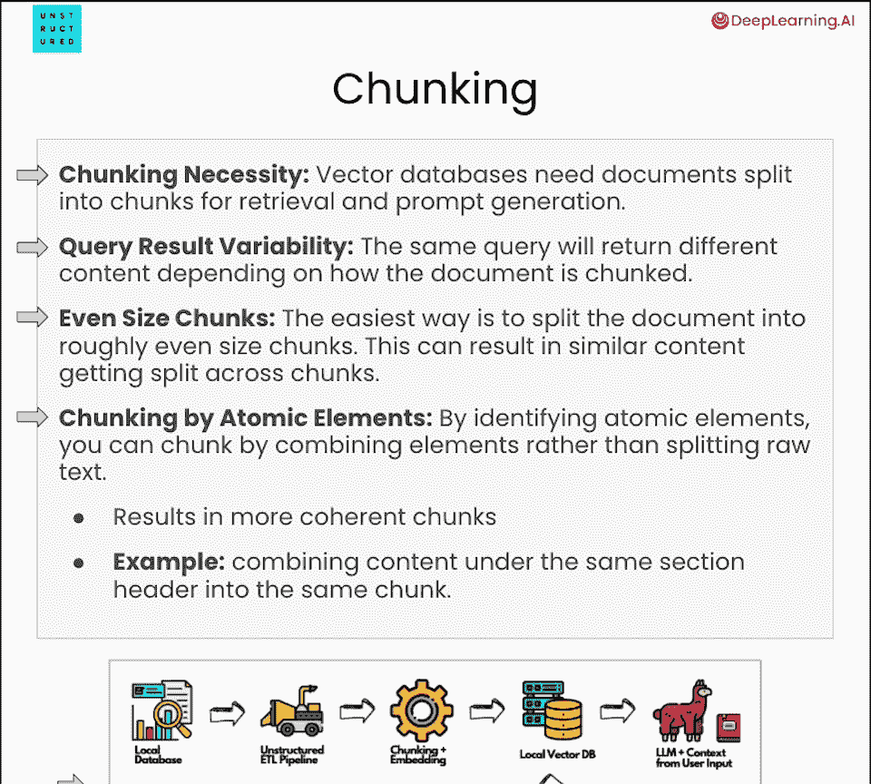

然而，通过使用我们在上一节中提取的元数据，可以更加智能地进行分块，利用文档中的文档元素信息。

从概念上讲，这里做的事情与传统的分块技术不同：
*   **传统分块**：将一个大文档拆分为多个部分。
*   **基于元素的分块**：首先将文档拆分为原子文档元素（如标题、叙述文本），然后将这些元素组合成块。

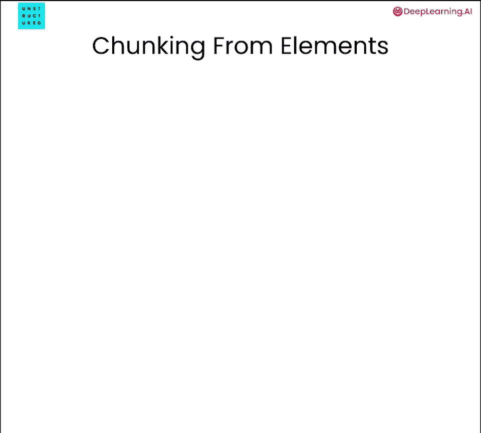

### 基于元素分块的优势

首先，像已经学过的那样对文档进行分区。一旦对文档进行了分割，就会得到诸如标题、叙述文本和列表等各个文档元素，可以将其用作分块操作的基础。

一旦获得了这些原子文档元素，可以将它们组合成块。当将它们组合成块时，可以应用断点条件，以便将逻辑上属于一起的内容组合在一起。例如，断点条件可以是：每当遇到标题时，就创建一个新的块。

这为什么重要？因为标题通常表示一个新部分的开始。所以当应用诸如“标题”之类的断点条件时，实际上是将来自同一部分的内容组合在一起。通过这样做，更有可能将属于同一部分的内容放在一起，这使您能够构建更连贯的块。当在向量数据库中执行相似性搜索时，这意味着将获得更相关的内容。

这样做，我们利用了已经对文档结构的了解，这使我们能够以更智能的方式构建块。另一个优点是，分块策略应用于标准化文档元素列表。由于将分块策略应用于该列表，可以将不同的分块策略应用于该初始输出，这使您可以快速尝试不同的分块技术，并查看在LLM最终用户应用中的结果是什么样的。

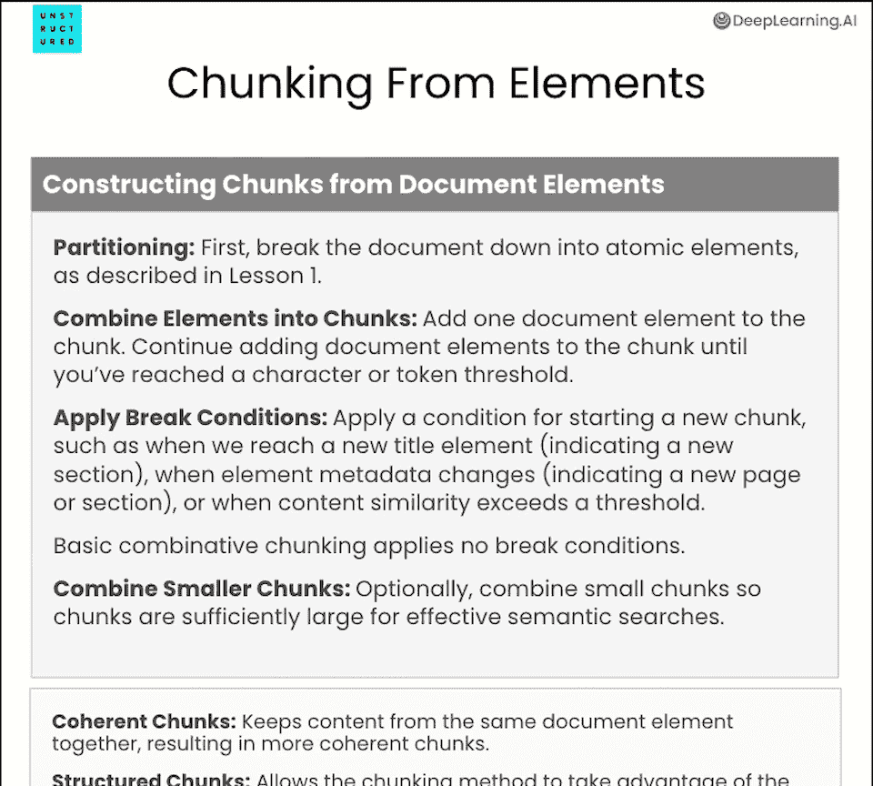

### 实践对比

让我们看看这在实践中是什么样子。在这个例子中，将看到使用传统字符分割技术进行分块时的情况。在这种情况下，应用了一个阈值，当达到一定字符数时，将拆分成一个新的块。这里，来自第一部分的信息会渗入到第二个块中。如果搜索“开放域问答”，将从第一个块中获取相关信息，也会从第二个块中获取感兴趣的信息，但同时也包括了关于“抽象问答”的不相关信息。

如果可以根据这些部分进行分块，结果会更好。当使用文档元素进行分块时，会得到更接近这样的结果：找到标题，当遇到新标题时，拆分成新的块。当这样做时，可以将属于同一部分的内容保持在一起。这一次，当查询关于“开放域问答”的信息时，只会获得关于开放域问答的内容，不会得到任何关于不感兴趣的“抽象问答”的内容。当查询向量数据库时，会得到更好的结果，这将导致语言模型的更好提示，从而得到更好的答案。

### 动手操作

现在可以看到在实践中使用文档元素信息进行分块是什么样子。可以通过使用文档元素信息反序列化序列化的JSON内容来开始。要做到这一点，可以使用来自非结构化开源库的`dict_to_elements`函数。

一旦拥有这个，使用非结构化开源库中的`chunk_by_title`功能再次对此内容进行分块就很容易了。这是在反序列化的元素上操作。还可以查看这里的一些设置：
*   `max_characters`：对块的大小设置一个字符限制。如果一个块超过了这个限制，将分割成一个新的块。
*   `merge_text_under_n_chars`：指导分块策略在元素中少于N个字符时合并块，这可以防止非常小的块。

在设置了这些参数之后，可以对内容进行分块，并通过使用`JSON`显示函数查看这个内容的样子。可以看到书的标题与相关信息被分块在一起。可以验证内容确实已被分块，因为分块输出中的块数（例如255个）少于原始元素数（例如752个），这意味着块确实合并了不同的元素，现在我们拥有了更少但更大的块。

---

## 总结

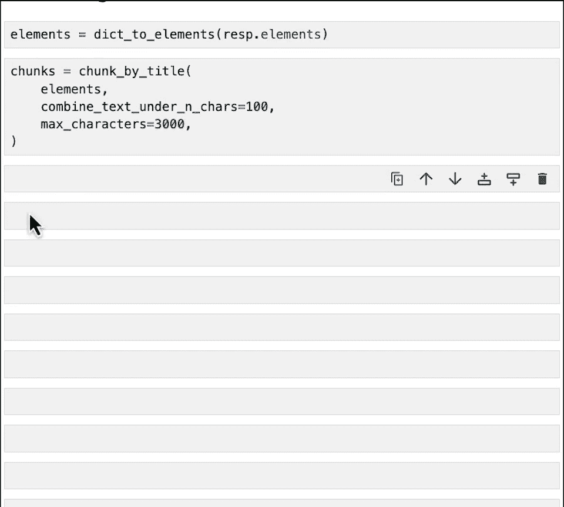

本节课中我们一起学习了元数据在LLM应用程序预处理中的关键作用。

首先，我们定义了元数据，并了解了它可以是文档级别或元素级别的附加信息。接着，我们回顾了语义搜索的基础，并指出了其局限性，从而引出了**混合搜索**的概念。混合搜索通过结合语义相似度和元数据过滤，能更精准地检索信息。

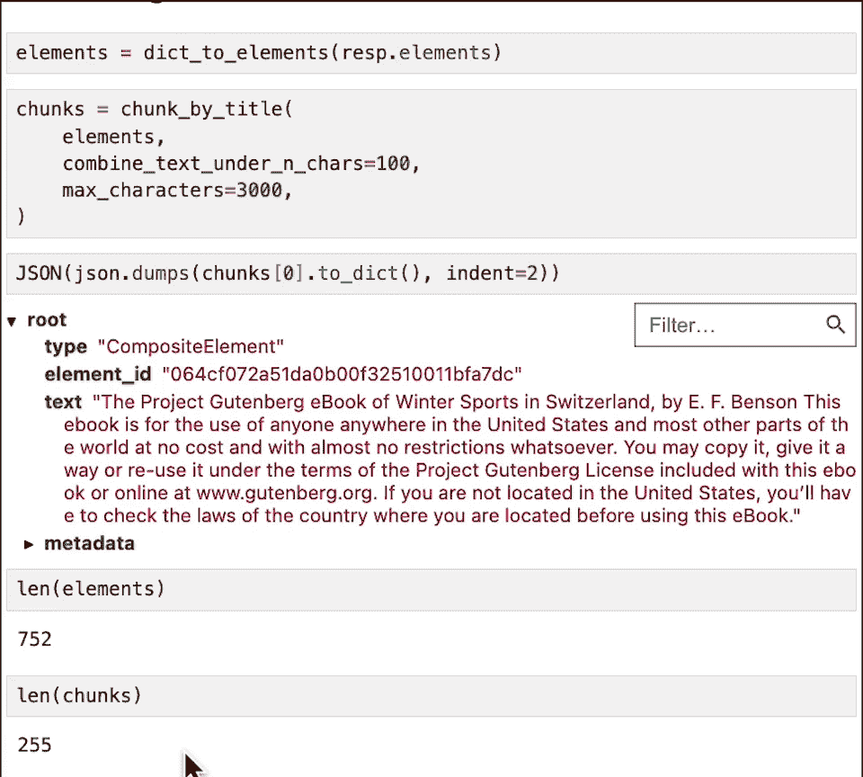

然后，我们通过一个实践示例，演示了如何从文档中提取章节信息作为元数据，建立映射，并将其用于Chroma向量数据库的混合搜索查询中。

最后，我们探讨了元数据的另一个重要应用：**智能分块**。与传统的均匀分块相比，基于文档元素（如标题）的分块能创建更连贯、语义更完整的块，从而提升后续检索和LLM回答的质量。

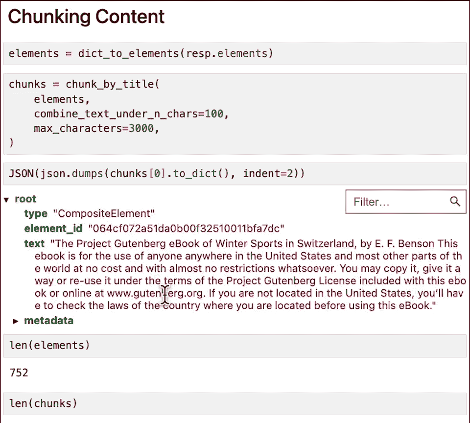

在下一课中，您将学习更多关于在PDF文档和图像上运行的复杂预处理技术。