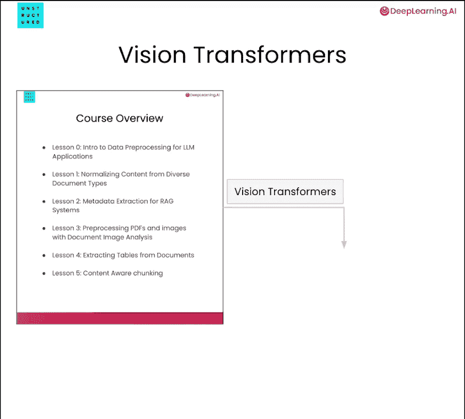
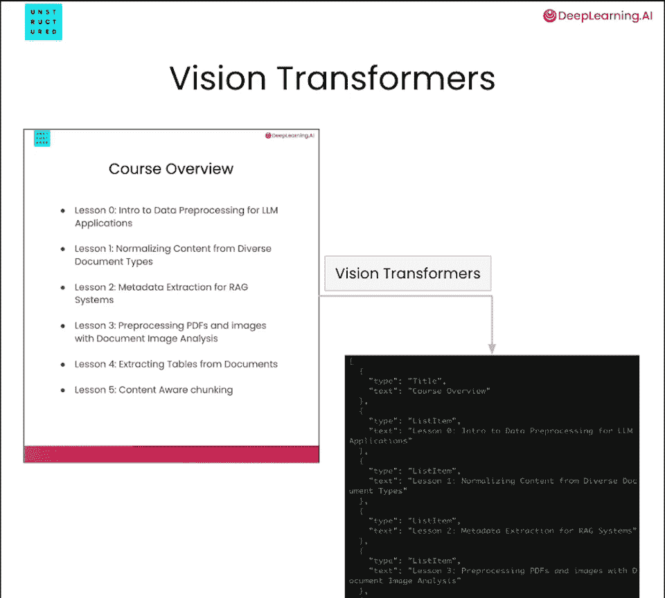
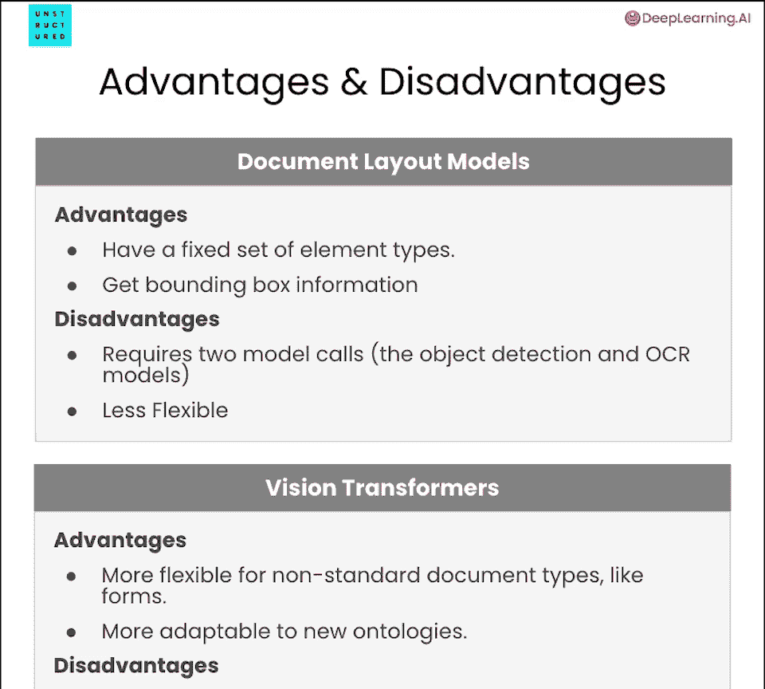
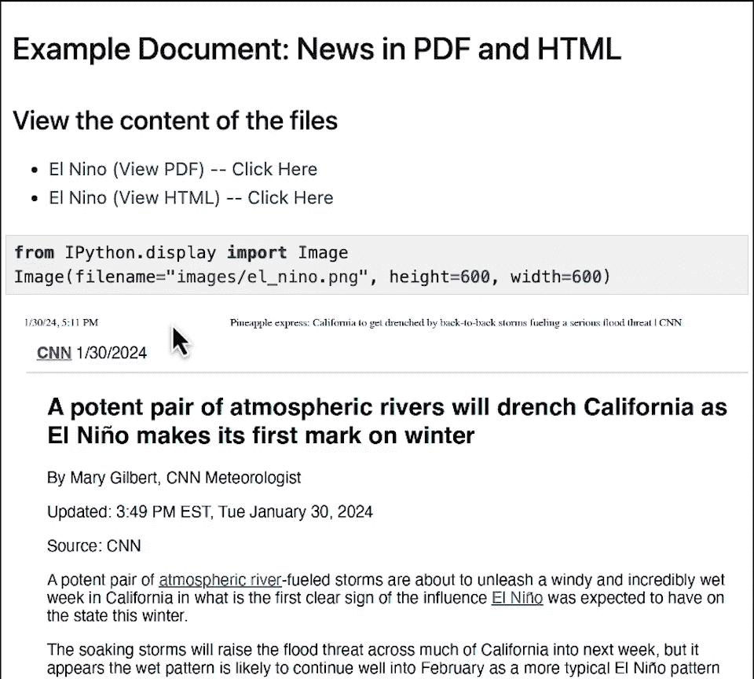
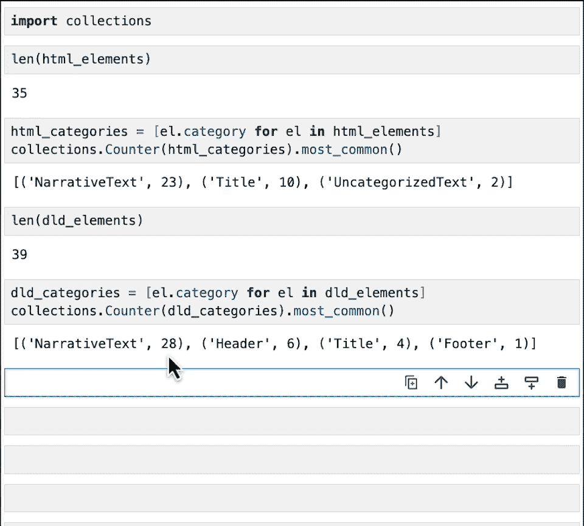

# 005：预处理PDF与图像文档

在本节课中，我们将要学习如何为大型语言模型（LLM）应用程序预处理PDF和图像这类非结构化文档。我们将重点介绍两种关键的文档图像分析技术：文档布局检测和视觉转换器，并了解它们如何从视觉信息中提取结构化的文本内容。

## 概述

到目前为止，我们已经学习了如何预处理HTML、Word文档和PowerPoint这类本身包含结构化信息的文档。然而，像PDF和图片这样的文档，其内部通常没有可用的结构化标记。对于这些文档，我们需要借助视觉信息来理解其布局和内容。本节课程将介绍两种基于视觉的预处理方法。

## 文档图像分析技术简介

上一节我们介绍了基于规则解析器的应用，本节中我们来看看如何利用视觉信息处理非结构化文档。文档图像分析允许我们从文档的原始图像中提取格式化信息和文本。以下是两种主要的方法：

1.  **文档布局检测**：使用目标检测模型识别并标记文档中的不同元素。
2.  **视觉转换器**：以整个文档图像作为输入，直接生成结构化的文本输出。

## 文档布局检测

文档布局检测模型通过两个步骤工作：首先识别并分类文档中各个元素（如标题、段落、列表）的边界框，然后从这些边界框内提取文本。

以下是其工作流程的两个核心步骤：

1.  **绘制与标记边界框**：模型在文档图像中为每个视觉元素（如叙述性文本、标题、项目符号列表）绘制一个边界框，并为其分类。
2.  **提取文本**：根据文档类型，有两种提取文本的方式：
    *   对于纯图像或扫描件，需要应用**光学字符识别（OCR）**技术来识别文本。
    *   对于某些包含可选中文本层的PDF，可以直接利用边界框坐标信息，从原始文档中提取对应区域的文本。

一个常用于文档布局检测的模型是**YOLOX**。其架构是一个典型的目标检测模型，专门针对文档中的元素进行训练。

作为实践示例，下图展示了文档布局检测的结果。模型成功地在标题、叙述性文本和表格等元素周围绘制了边界框。在确定并标记这些边界框之后，就可以进行文本提取。



## 视觉转换器

与需要多步处理的文档布局检测不同，视觉转换器提供了一种更直接的解决方案。它可以在一个步骤中从PDF和图像中提取内容。

视觉转换器接受文档图像作为输入，并直接生成文本作为输出。在这个过程中，无需单独调用OCR模型。一种常见的视觉转换器架构是**Donut**（文档理解转换器）。

这种模型可以被训练为生成结构化的输出，例如一个有效的**JSON字符串**。这个JSON可以包含我们感兴趣的文档元素及其类别。

下图展示了Donut模型的架构。模型处理图像后，会输出一个字符串。



该字符串是一个有效的JSON，其中每个元素都包含文本内容及其类别信息。获得这个字符串后，我们可以将其转换为我们期望的规范化文档元素格式。

## 技术选型：如何选择？


那么，在实际应用中，应该何时使用视觉转换器，何时使用文档布局检测模型呢？每种模型都有其优缺点。

以下是文档布局检测模型的优缺点：


*   **优点**：
    1.  模型针对一组固定的元素类型进行训练，对这些元素的识别精度通常非常高。
    2.  提供边界框信息，便于将提取结果追溯回原始文档的特定位置，并且在某些情况下可以不依赖OCR直接提取文本。
*   **缺点**：
    1.  在某些情况下需要两次模型调用：首先是目标检测模型，其次是OCR模型。
    2.  灵活性不足。模型基于固定的元素类型集工作，如果需要提取新的元素类型，可能需要重新训练模型。

以下是视觉转换器的优缺点：

*   **优点**：
    1.  对非标准文档类型（如复杂表格）更灵活，能够相对轻松地提取键值对等信息。
    2.  更容易适应新的元素类型。对于文档布局检测模型，添加新元素类型很困难，但可以通过提示（Prompt）的方式引导视觉转换器识别新类别。
*   **缺点**：
    1.  模型具有生成性，因此可能像自然语言模型一样，出现幻觉或重复内容。
    2.  通常比文档布局检测模型计算量更大，因此需要更多的计算资源或运行速度更慢。

## 实践练习：预处理同一文档的不同格式

现在我们已经学习了一些预处理PDF和图像的技术，让我们把它们付诸实践。在这个练习中，我们将预处理同一篇文档，先处理其HTML版本，再处理其PDF版本，以展示不同方法如何提取出相似的文档结构。

我们将处理的文档是CNN发布的一篇关于厄尔尼诺气象模式的新闻文章。



首先，导入必要的依赖项。由于处理PDF是基于模型的工作负载，我们将通过API进行调用。

### 步骤一：预处理HTML文档

首先，我们处理文档的HTML表示形式。使用`partition_html`函数（来自`unstructured`开源库）来处理HTML文件。


```python
from unstructured.partition.html import partition_html

elements_html = partition_html(filename="document.html")
```

查看提取出的元素，函数识别出了叙述性文本、标题等，并利用了HTML标签本身的信息。

### 步骤二：使用快速策略预处理PDF

接下来，预处理相同文档的PDF表示形式。首先使用`unstructured`库中的`FAST`策略。该策略直接从PDF文档中提取文本，适用于像新闻文章这样布局简单的PDF。



```python
from unstructured.partition.pdf import partition_pdf

elements_pdf_fast = partition_pdf(filename="document.pdf", strategy="fast")
```

查看提取出的元素，它们与从HTML中提取的元素非常相似。

### 步骤三：使用文档布局检测预处理PDF

现在，使用文档布局检测模型（这里使用YOLOX模型）通过非结构化API来预处理同一个PDF。该模型会绘制边界框并提取文本。

```python
# 通过API调用，指定使用高分辨率模型‘yolox’
elements_pdf_yolox = partition_pdf(filename="document.pdf", strategy="hi_res", model_name="yolox")
```

这个过程是基于模型的，可能需要一些时间。完成后，查看输出。模型同样识别出了标题和叙述文本，输出结果与HTML和快速策略的输出非常类似。


### 步骤四：结果对比

现在，我们可以比较这些输出。例如，HTML输出有35个元素，包括23个叙述文本元素和10个标题元素。而文档布局检测（YOLOX）输出有39个元素，包括28个叙述文本元素和10个标题元素（可能细分为页眉、主标题等）。

可以看到，输出并不完全一致，但非常接近。这表明，无论文档是以PDF还是HTML格式呈现，我们都能提取出几乎相同的结构化信息，从而可以在应用程序中统一处理它们。

## 自主尝试

现在您已经知道如何预处理PDF文档了，可以尝试以下练习：

1.  **尝试视觉转换器**：将上面代码中的`model_name`参数从`"yolox"`改为`"chipper"`（一种视觉转换器模型），运行并观察输出的不同。
2.  **处理您自己的文档**：找一个您自己的PDF文档，使用上述方法进行预处理，观察效果。

## 总结

本节课中我们一起学习了如何为LLM应用预处理PDF和图像这类非结构化文档。我们深入探讨了两种核心技术：**文档布局检测**和**视觉转换器**。我们了解了它们的工作原理、优缺点，并通过实践练习，使用不同方法处理了同一文档的HTML和PDF版本，验证了它们能提取出相似的结构化信息。

在下一课中，您将学习如何预处理包含更复杂布局（如表格）的PDF文档。



