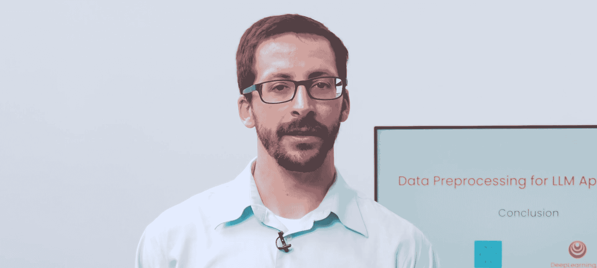

# 008：总结 🎯

在本节课中，我们将一起回顾整个课程的核心内容，总结从非结构化数据预处理到构建功能完善的RAG应用程序的关键步骤。

## 课程概述

在本课程中，我们学习了如何为大型语言模型应用程序处理和准备非结构化数据。主要内容包括从多种数据源摄取内容、对内容进行规范化处理、利用元数据增强检索增强生成应用程序，以及应用高级技术从PDF和图像中提取信息。

## 核心内容回顾

上一节我们介绍了各种高级建模技术，本节中我们来对整个课程进行总结。

以下是本课程涵盖的主要学习要点：

*   **数据摄取与规范化**：您学习了如何从各种不同的数据源中摄取和规范化内容。
*   **元数据的使用**：您学习了如何在预处理过程中使用提取的元数据来丰富RAG应用程序。
*   **高级内容提取技术**：您学习了用于解锁PDF和图像中内容的高级建模技术。
*   **构建完整应用**：您学会了如何将数据预处理的输出转换为一个功能完善的RAG机器人。

## 最终成果与展望

现在，您已经掌握了构建一个了解您特定项目或组织信息的RAG机器人所需的核心技能。通过本课程的学习，您已经准备好将理论应用于实践，开始构建属于自己的智能问答或信息检索系统。

## 总结

本节课中我们一起回顾了为LLM应用程序预处理非结构化数据的完整流程。从最初的数据处理到最终构建出可用的RAG机器人，您已经走过了一条完整的学习路径。掌握这些技能是开发现实世界中高效、准确的大型语言模型应用的重要基础。