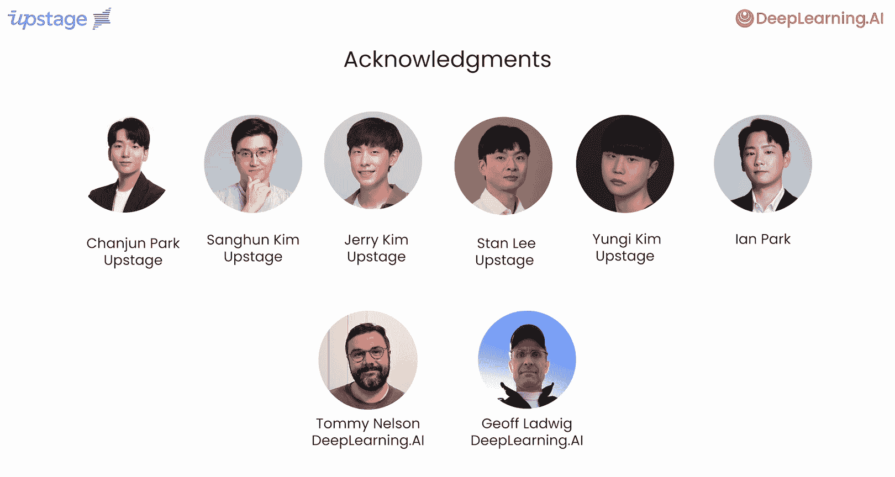

# 001：课程介绍 🎬

在本节课中，我们将要学习大语言模型预训练的基本概念、适用场景以及本课程的整体安排。

欢迎来到由Upstage合作开发、并由Upstage首席科学官Lucy Park教授的大语言模型预训练课程。欢迎你，Lucy。感谢你，Andrew。我们非常高兴来到这里。

预训练一个大语言模型，是指对一个模型（通常是Transformer神经网络）在大规模文本语料上进行监督学习的过程，目的是让模型学会根据给定的输入提示，反复预测下一个词元。这个过程之所以被称为“预训练”，是因为它是训练一个语言模型的第一步，之后才会进行指令微调或与人类偏好对齐等步骤。

预训练的产出被称为**基础模型**。本课程将涵盖两种方式：**从零开始训练**（即从随机初始化的权重开始），以及**在已有预训练模型的基础上，使用自己的数据继续预训练**。

从零开始训练一个大模型计算成本高昂，通常需要多台GPU服务器，训练过程可能持续数周甚至数月。因此，大多数开发者不会选择从零开始预训练模型，而是会采用现有的模型，通过提示工程或微调来使其适应自己的任务。

然而，在某些情况下，预训练模型仍然是必需或更优的选择，这也正是Upstage为其客户提供的服务。没错，Andrew。我们的客户出于各种原因进行模型预训练。有些是为了在特定领域（如法律、医疗、电子商务）测试模型性能；有些则需要模型在特定语言（如泰语、日语）上具备更强的能力。此外，新的训练方法（如深度扩展）使得更高效的预训练成为可能，这种方法利用两个或多个现有模型来构建更大的模型。例如，我们的Solar模型就是使用深度扩展技术训练的。正因为这些技术进步，我们看到人们对预训练的兴趣与日俱增。

**深度扩展**通过复制一个较小预训练模型的层来创建一个新的、更大的模型。然后对这个新模型进行进一步的预训练，最终得到一个比原始模型更大、更好的模型。Upstage团队通过实验发现，以这种方式创建的模型，其预训练所需的计算量比传统方法最多可减少70%，这意味着巨大的成本节约。

预训练是否适合您的工作，取决于几个因素：是否存在无需预训练就能满足您任务的现成模型、您拥有哪些数据、您能获取多少计算资源（包括训练和部署），以及您可能面临的隐私和合规性要求。因此，根据您所在的公司或行业，您可能会被要求预训练一个模型，或者至少需要考虑这个选项。

在本课程中，您将学习从零开始预训练一个模型所需的所有步骤，从收集和准备训练数据，到配置模型并进行训练。您将首先了解一些预训练模型是获得最佳性能的首选方案的用例，并讨论预训练与微调的区别。接下来，您将逐步了解预训练所需的数据准备步骤，探索如何从互联网或Hugging Face等现有仓库收集数据，然后学习获取高质量训练数据的步骤，包括**去重**、基于文本长度的**过滤**以及**语言清洗**。之后，您将探索配置模型架构的一些选项，了解如何修改Meta的Llama模型来创建更大或更小的模型，并了解几种初始化权重的方法（随机初始化或从其他模型加载）。最后，您将看到如何使用开源的Hugging Face库训练模型，并实际运行几步训练，观察损失值如何随着训练进程下降。

本课程使用仅包含数百万参数的小型模型，以确保内容足够轻量，能在CPU上运行。但您可以将课程中的代码扩展到更大的数据集和模型，并用于GPU训练。

感谢Lucy，这听起来对于建立关于“何时预训练有意义”以及“执行预训练需要什么”的直觉会非常有帮助。许多人为创建这门课程付出了努力。我要感谢Changjun Park、Sanang Juung Kim、Jerry Kim、Stan Lee Jung Hi Kimim，以及他们的合作者Ian Park。Tommy Nelson和Jeff Ladwick也为本课程做出了贡献。我想重申，在大数据上预训练大模型是一项昂贵的活动，最小模型的成本可能从约100美元起，到数十亿参数规模的模型则可能高达数万甚至数十万美元。因此，如果您选择自己尝试，请务必谨慎。课程中会提到像Hugging Face提供的计算器这样的工具，可以帮助您在开始前估算预训练场景的成本，从而避免云服务商带来的意外账单。

但预训练是语言模型技术栈的关键部分。无论您只是想建立对语言模型的直觉，还是想继续预训练一个现有模型，甚至尝试从零开始预训练以在模型排行榜上竞争，我都希望您能享受这门课程。

那么，让我们进入下一个视频，正式开始学习。