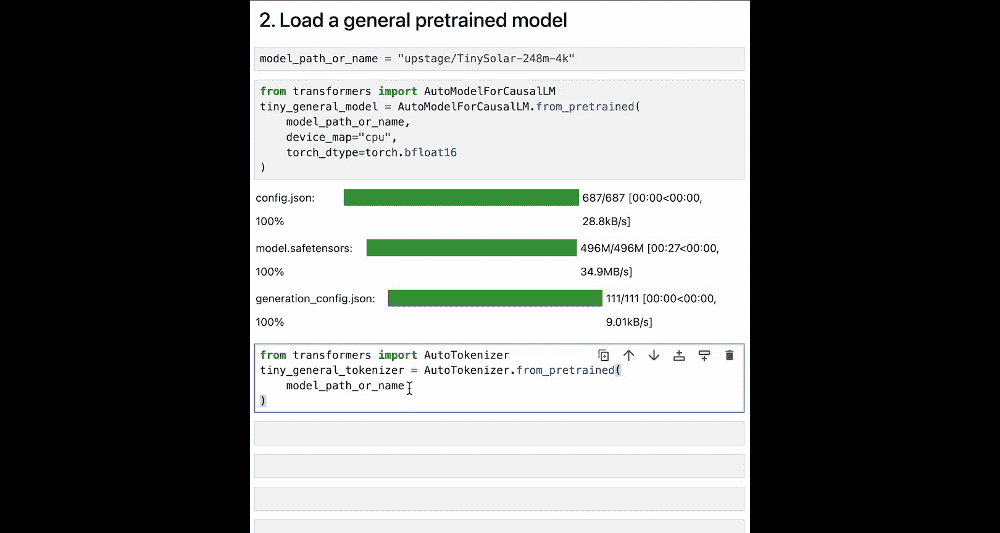
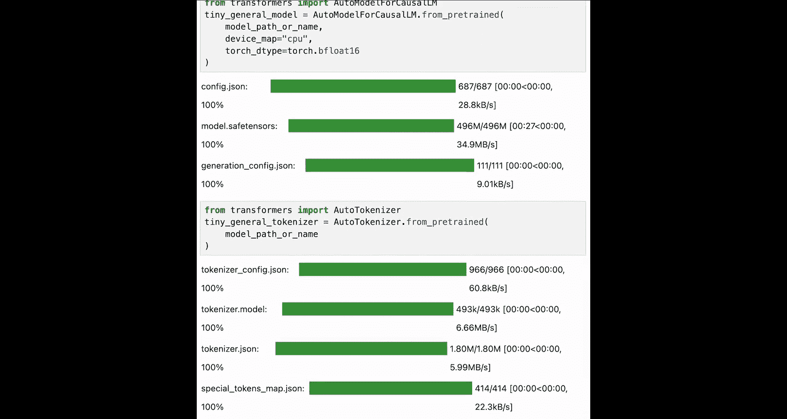
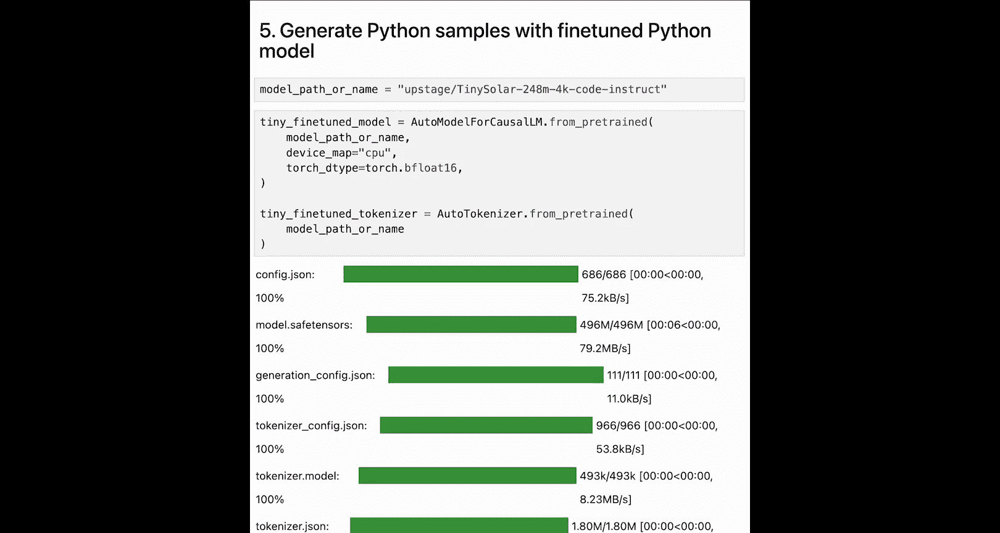
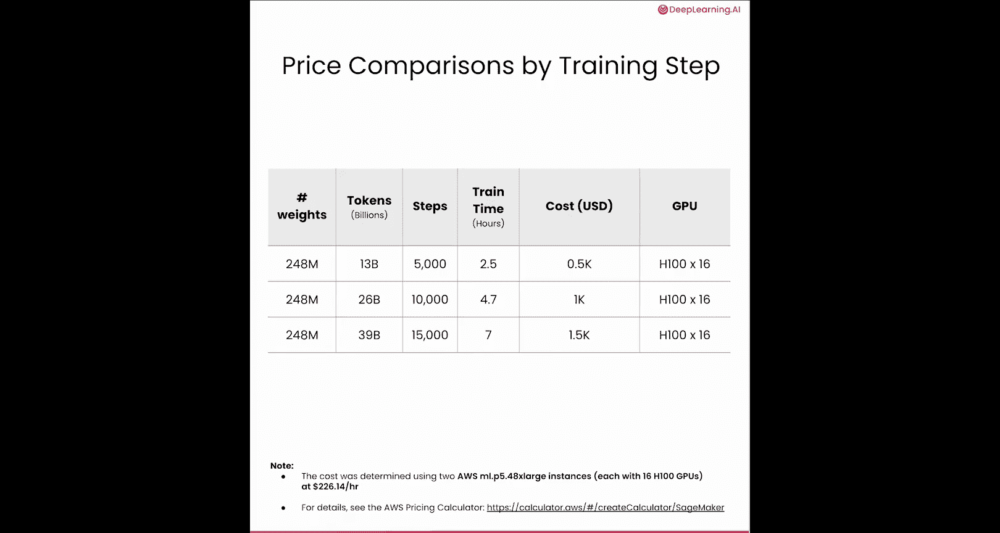

# 002：为何需要预训练

在本节课中，我们将探讨预训练为何是获得良好模型性能的最佳选择。你将通过对比同一模型的不同版本（基础通用模型、微调模型和特定领域预训练模型）的文本生成效果，直观地理解预训练的重要性。

## 概述

预训练是大语言模型训练的第一阶段。模型通过在海量非结构化文本数据上反复预测下一个词来学习生成文本。在此过程中，模型编码了关于世界的知识。然而，这些基础模型虽然擅长生成文本，却不一定擅长遵循指令或确保行为安全。因此，消费级应用中的模型（如ChatGPT）通常在初始预训练后，会通过指令微调和对齐训练来提升其遵循指令和符合人类偏好的能力。

模型的知识仅限于其训练数据。若要让模型学习新知识，必须进行额外的训练或引入更多数据。微调或对齐训练可用于教授模型新行为（例如，以特定风格撰写摘要或避免特定话题）。但如果希望模型深入理解一个新领域，则必须在该领域的特定文本上进行额外的预训练。

人们常试图绕过预训练，仅用较小的数据集对模型进行微调来添加新知识。然而，这在某些情况下并不奏效，特别是当新知识在基础模型中代表性不足时。此时，额外的预训练是获得良好性能的必要条件。

## 具体示例：韩语能力

让我们看一个具体例子。假设你想创建一个擅长韩语的大语言模型。一个未在大量韩语文本上训练过的基础模型（例如Llama 7b）无法用韩语书写。如果你要求该模型介绍韩服（Hanbok），它会完全答错，甚至误以为“Hanbok”是一个冒犯性词汇。

第二个模型在少量数据上进行了微调，这些数据很可能是英韩句子对形式的直接翻译。其回答仅部分使用韩语。虽然懂双语的人能理解其意，但该模型可能适合写韩语歌词，却不足以支撑一个韩语聊天机器人。

最后一个模型是我们的团队通过额外预训练创建的。我们在海量的英韩非结构化文本上对一个英语模型进行了额外预训练。如你所见，这个模型现在可以流利地使用韩语。由此可见，预训练对于获得一个优秀的韩语模型至关重要。

## 代码实践：Python代码生成

接下来，我们通过一个笔记本来查看另一个预训练至关重要的例子，并体验不同预训练模型和微调模型在Python语言上的差异。

我们已经为你安装了所需的包。同时，我们过滤掉一些警告，以保持笔记本整洁。你还需要导入`torch`，以便为可复现性设置随机种子。你可以将此数字更改为你选择的任何数字，然后运行`fixed torch seed`来固定种子。

首先，我们尝试让一个小的预训练模型生成文本。这里我们使用由Upstage构建的、拥有2.48亿参数的`Ti Solar`模型。

要加载此模型，我们将使用`transformers`库中的`AutoModelForCausalLM`。加载模型需要三个参数：我们刚刚初始化的模型路径名、设备（这里使用CPU）以及数据类型（这里使用`bfloat16`）。在CPU上加载模型需要一些时间，你也可以通过设置为`auto`来使用GPU。

接着，我们通过调用`transformers`中的`AutoTokenizer`来设置分词器。只需提及模型路径名，分词器就会被加载。

有了模型和分词器，我们就可以开始生成文本了。语言模型是解码器，因此可以自动补全给定的输入文本或提示。现在，让我们尝试使用预训练模型自动补全一个提示。

我将输入一个提示：“I am an engineer I love”。给定这样的提示，你能想象我们的模型会如何自动补全吗？让我们看看。

我们首先需要用分词器对提示进行分词。然后创建一个文本流实例来流式输出文本。我们将传入分词器，并设置跳过提示本身和特殊标记。

现在你将看到神奇的一幕。这段代码将让我们生成最多128个标记。对于随机输出，你可以简单地将`do_sample`设置为`True`并选择你想要的`temperature`值。

输出是：“I am an engineer. I love to travel and have a great time, but I’m not sure if I can do it all again and so on.” 可以看出，它在生成英语文本方面相当不错。

然而，当我尝试让它自动补全Python代码片段时，这个模型就显得力不从心了，因为它主要是在英语文本上训练的。让我们试试。

这次，我们尝试一个Python代码提示：“Define max numbers.” 顾名思义，我们期望模型编写一个函数，用于在给定的数字列表中找到最大值。我们将像之前一样，从提示创建输入并设置流式输出。

现在创建输出。嗯，这并没有很好地完成任务，对吧？看起来有点像Python代码，但仔细看，结果只是随机的。这里有注释和一个返回格式，但内部没有计算逻辑，这使得这段Python代码无效。这可能是因为我们的预训练模型没有在Python代码本身上进行训练。

那么，如何改善结果呢？有些人会想到微调。微调涉及在少量特定任务的数据上训练你的模型。让我们看看微调模型的表现如何，而不是通用的预训练模型。

我们尝试一个新模型。这个模型与我们之前的小型Solar模型相同，但在Python代码上进行了微调。由于此模型在代码上进行了微调，我们期望它在代码生成方面表现更好。

像之前一样，加载我们的模型和分词器，并流式输出结果。我们将输入相同的提示，将其分词为输入，设置流式输出，然后创建输出。

你认为如何？看输出，可以看到有一些操作，比如`if else`，但模型似乎仍需要学习更多代码知识，因为它仍然没有写对函数。

现在，让我们用一个预训练的Python模型来生成Python示例。这里我们将使用一个拥有2.48亿参数、最大标记长度为4K、在Python代码上预训练的模型。这个模型与之前模型的不同之处在于，之前的模型是在指令数据上训练的，而这个模型是在纯Python代码上训练的。另一个区别是，其数据集至少大了100倍。

现在，像之前一样加载模型和分词器。将相同的Python代码片段输入给这个定制的预训练模型，并流式输出文本。

好多了！这个函数终于有意义了。这是我们的大语言模型刚刚输出的函数。让我们把它放进去，看看它是否真的有效。我们将输入一个包含不同数字的列表，看看它是否能定义出最大值。

成功了！最大值是7，这是正确的。

通过运行这三个模型，你可以清楚地看到预训练的好处。最后一个模型学习了大量Python知识，在编写可运行代码方面比完全不懂Python的原始模型好得多。而微调模型只学了一点点，还不够流利。

## 成本考量

你看到了两个必须通过预训练模型才能使其表现良好的用例。值得注意的是，与微调（有时仅需数万个标记即可完成，且成本可能很低）相比，预训练需要大量数据，因此成本高昂。

在下表中，你可以看到训练你在笔记本中尝试过的2.48亿参数模型，针对不同训练数据规模所需的成本。最后一行，使用3900万标记进行训练，对应你在笔记本中看到的那个特定于Python的模型。该训练在6800个GPU上进行了7小时，花费了1500美元。

因此，在开始预训练任务之前，请务必考虑成本。在本课程后面，你将看到一些可用于估算成本的资源。

## 总结

本节课中，我们一起学习了预训练在大语言模型开发中的核心作用。我们了解到，预训练是模型获取世界知识和语言能力的基础阶段。通过韩语模型和Python代码生成的对比示例，我们直观地看到，当模型需要深入掌握一个在基础训练数据中代表性不足的新领域（如特定语言或编程语言）时，额外的领域特定预训练是获得优异性能的关键，其效果远超单纯的指令微调。同时，我们也认识到预训练需要海量高质量数据和可观的计算成本。创建优秀的模型始于高质量的训练数据，下一节课我们将学习如何构建好的训练数据集。