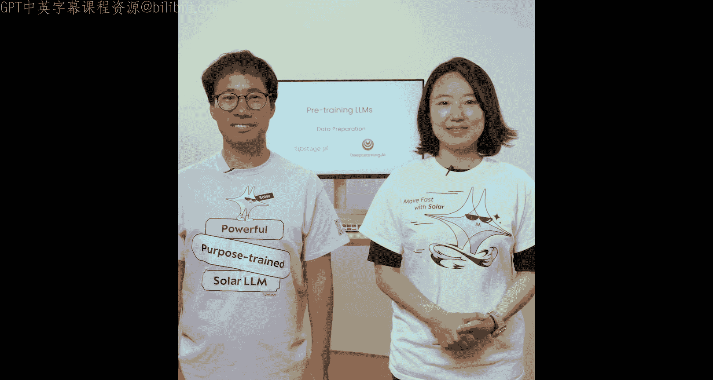
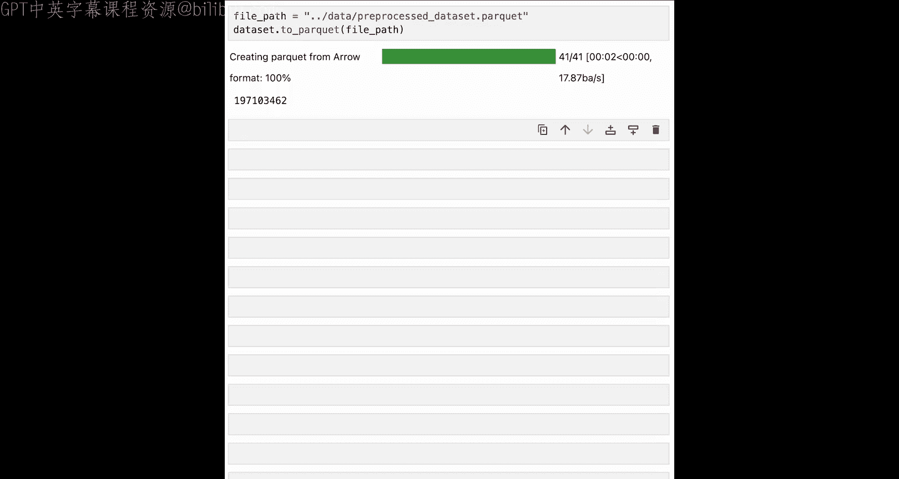

# 003：数据准备 📚

在本节课中，我们将学习如何为大语言模型的预训练准备高质量的训练数据。我们将了解预训练数据与微调数据的区别，并掌握一系列数据清洗的关键步骤，以确保模型训练的有效性。

## 概述

预训练模型的第一步是获取高质量的训练数据。本节课将介绍如何利用来自网络和现有数据集的文本来创建训练集。我们将对比预训练数据与微调数据的差异，并详细讲解数据清洗的核心流程。

## 预训练数据与微调数据

上一节我们介绍了大语言模型的基本概念，本节中我们来看看训练它们所需的数据有何不同。

用于预训练大语言模型的数据集由海量非结构化文本组成。在训练过程中，每个文本样本都被用来训练大语言模型反复预测下一个词，这被称为自回归文本生成。模型参数在处理训练数据中的每个样本时不断更新，最终模型变得擅长预测下一个词。你可以将此过程想象成“阅读”，输入文本以其原始形式被使用，无需对训练样本进行任何额外的结构化处理。

语言模型需要海量的训练文本（相当于数百万本完整的书籍）才能精通下一个词的预测，并在其参数中编码关于世界的可靠知识。

用于微调的数据则高度结构化，例如问答对、指令-回复对等。左侧是关于“朋友”的文本，这对预训练很有用；右侧是一个微调数据样本，它是一个关于“朋友”的具体问题及其合适的回答。因此，微调样本的形式截然不同。微调的目标是让模型以特定方式行为，或擅长完成特定任务。如果预训练像是阅读许多许多书籍，那么微调就像是参加模拟考试。你并非在学习新知识（这些知识应该已在预训练阅读中掌握），而是在学习如何以特定方式回答问题。

## 数据来源

如果你想阅读大量文本，就必须找到许多书籍、代码示例、文章和网页。因此，预训练数据集通常从大量文本文档集合中填充，其中许多来源于互联网。世界上充满了文本，因此为预训练找到大量文本相对容易。

另一方面，微调数据需要精确的问题和高质量的对应答案。传统上，这项工作由人工完成，耗时且昂贵。最近，人们开始使用大语言模型来生成微调数据，但这需要一个能力非常强的模型才能取得良好效果。因此，创建高质量的微调数据集需要付出更多努力。

在本节课稍后的笔记本练习中，你将与Lucy一起比较和对比一些预训练和微调数据集的样本。

## 数据质量的重要性

数据质量对于预训练大语言模型至关重要。如果你的训练数据存在问题，例如大量重复样本、拼写错误、事实不一致或不准确、以及有毒语言，那么最终得到的大语言模型将表现不佳。采取措施解决这些问题并确保训练数据的高质量，将带来更好的模型效果和更高的训练投资回报率。

以下是清理训练文本数据时应完成的主要任务。

### 去重

以下是数据清洗的首要步骤：去重。存在重复数据会使模型偏向特定的模式和例子。它还会增加训练时间，却不一定能提升模型性能。因此，移除重复文本是数据清洗的关键步骤。这应包括文档内部和所有文档之间的去重。

### 质量过滤

我们希望训练数据的内在质量高，因此文本应是你感兴趣的语言，与你希望大语言模型建立知识的主题相关，并满足你设定的其他质量标准。你可以设计质量过滤器来清理训练数据的这方面问题。

例如，这里的样本包含日语、中文甚至韩语文本。如果你想训练英语大语言模型，就应该移除这些内容。

### 安全过滤

另一个步骤是应用内容过滤器，以移除可能有害或有偏见的内容。安全性是一个重要考量。

### 隐私保护

为了避免潜在的数据泄露，你应该始终移除个人身份信息。一个常见的策略是对训练文本中的此类信息进行脱敏处理，就像你在这里看到的一样。

### 格式修正

最后，你可以制定规则来修复常见的质量问题，例如全大写、多余标点和格式混乱的文本。

Lucy将在本节课的笔记本中向你详细展示如何执行其中一些步骤。正如你所见，数据清洗可能很复杂且耗时。幸运的是，有越来越多的工具可以帮助你完成这一重要步骤。一个例子是DataBurst，这是我们在Upstage研究的一个开源项目。DataBurst是一个即用型数据清洗流水线，它会接收你的原始训练数据，应用你刚刚看到的清洗步骤以及其他步骤，然后将你的数据打包成适合训练的形式。你可以查看其GitHub页面以了解更多关于如何使用DataBurst的信息。

## 动手实践：数据收集与清洗

现在，让我们进入笔记本，亲身体验一些数据清洗步骤。

### 数据收集

让我们从数据收集开始。由于预训练的目标是执行下一个词元预测，因此需要一个庞大的无标签语料库。你通常可以通过网络爬取、收集组织内部文档或直接从数据枢纽下载开放数据集来获取这些数据。这里，我们将使用Hugging Face的`datasets`库下载两个数据集。

第一个是来自Upstage的预训练数据集。该数据集是从包含1万亿词元的Red Pajama数据集中截取60000个样本创建的。请注意，Red Pajama是用于Llama 1预训练的数据集，由来自Common Crawl、C4、Github等的数据组成。

在我们继续之前，让我们查看一下数据集的信息。在这里，你可以看到每个示例都包含文本和相关的元数据。为简化起见，我们将只使用数据集的文本列。让我们也看一个示例。这是一段关于阿富汗的文本。内容本身并不重要，重要的是它是一个由纯文本组成的预训练示例。这正是我们想要的：没有任何指令类型的结构化（例如问答对）的纯文本。你可以随意更改这里的索引号，以探索数据集中的其他示例。

现在，让我们下载另一个名为Alpaca的数据集。Alpaca是一个微调数据集，包含52000条由GPT-4生成的指令遵循数据。在这里，你可以看到数据由指令、输入和输出组成。让我们看看一个示例的样子。这里我们将查看第一个示例，并打印指令、输入和输出。这是“保持健康的三个建议”。请注意，与仅由文本组成的预训练数据集不同，这个指令数据集（Alpaca）包含了指令、输入和输出列。由于我们关注预训练，从现在起我们将选择只使用预训练数据。

### 构建自定义数据集

现在，让我们尝试从网络爬取并构建一个自定义数据集。为此，我们将下载九个随机的Python脚本。然而请注意，在实践中你会有多得多（多达数十亿）的样本。让我们从导入一些必需的包开始：`os`用于与文件系统交互，`requests`用于向网站发出请求。

这是一个托管在GitHub上的随机Python脚本列表。使用`requests`库，我们可以初始化并请求URL以检索Python脚本，并将其存储到代码目录中的一个文件中。让我们通过列出代码目录中的结果文件来检查文件是否已成功下载。很好。

现在，我们将把它们转换成Hugging Face数据集，以便可以将它们用作训练文件。为此，我们将首先创建一个字典列表，其中键名为“text”，然后使用`from_list`方法加载它们。你可以看到，所有九个文件都已成功加载。如果你还记得，这与我们上面下载的预训练数据的结构完全相同。

### 合并数据集

现在，让我们合并我们下载的预训练数据和从网络爬取的代码数据集。我们将通过调用`datasets`库中的`concatenate_datasets`方法来实现。这是在你预训练自己的模型时会经常进行的非常实用的操作：下载一些数据，添加一些自定义数据，然后合并。现在我们总共有60009行数据。

### 数据清洗步骤

让我们进行一些典型的数据清洗步骤，看看随着清洗的进行，行数是如何减少的。

首先，我们将过滤掉太短的样本。这是一个描述预训练数据常见实践的函数。简而言之，我们保留至少有三行或三个句子，且每行文本至少包含三个词的文本。我们这样做是因为预训练的目标是预测下一个词元，但短样本对该任务不是很有用。让我们尝试运行这个函数。请注意，`datasets`库有一个`filter`方法，它将一个函数应用于数据中的每个示例。所以如果你检查行数，你可以看到超过7000行被剔除了。

现在我们将进入第二部分：移除重复内容。这基本上是一个函数，给定输入段落，可以找到重复部分。我们使用这个函数来查找段落内的重复，并判断如果一个段落与其长度相比有太多重复，则返回`False`以丢弃该段落。我们将在整个数据上运行这个函数。现在我们剩下大约52000个示例，减少了30行。这是一个非常小的减少，但这是从Hugging Face下载数据集的一个优势，因为Hugging Face上的数据集已经完成了大量的预处理。

对于预处理的第三部分，让我们继续进行去重。这个函数通过存储唯一的文本片段并将每个文本与之比较来移除重复条目。让我们尝试运行那个函数。结果，移除了8000行，这是一个很大的减少。实际上，文档之间也存在大量重复，所以请确保你涵盖了这个步骤。

最后一步是语言过滤。这是Sung之前提到的质量过滤器之一。如果你想专注于特定语言或领域，最好过滤掉其他语言或领域，以便模型在相关文本上进行训练。这里我们将使用fastText语言分类器，只保留英语样本来训练我们的模型。你会看到这个警告，但不必太担心。另外请注意，运行速度比我们上面运行的过滤器要慢。这是因为这实际上是一个真正的机器学习模型在运行。如果你想为另一种语言训练模型，只需将语言“English”更改为该特定语言即可。让我们检查一下行数。现在，在移除了大约3000行之后，我们剩下大约40000行。

我想指出，从一开始就拥有一个大数据集非常重要，因为你会在清洗数据集的过程中不断丢弃行。

### 保存数据

最后，我们将以parquet格式将数据保存到本地文件系统中。请注意，在实践中，你希望在清洗的每个阶段都保存数据，因为你处理的是大量数据，且数据可能无法完全装入内存。Parquet是一种列式存储文件格式，在大数据和数据分析场景中广泛使用。你也可以自由使用任何其他格式，如CSV或JSON。但由于parquet速度非常快，我们在这里选择它。

## 总结

在本节课中，我们一起学习了如何为大语言模型的预训练准备数据。我们了解了预训练数据（非结构化文本）与微调数据（结构化任务数据）的根本区别。我们深入探讨了数据清洗的关键步骤，包括去重、质量过滤、安全过滤、隐私保护和格式修正，并亲自动手实践了数据收集、合并和清洗流程。最后，我们学习了如何将清洗后的数据保存为适合后续处理的格式。数据准备是模型成功的基石，高质量的数据是训练出优秀大语言模型的前提。

流程的下一步是准备你的安全数据集以进行训练。这涉及对数据的一些额外操作。请加入下一节课，看看这是如何完成的。