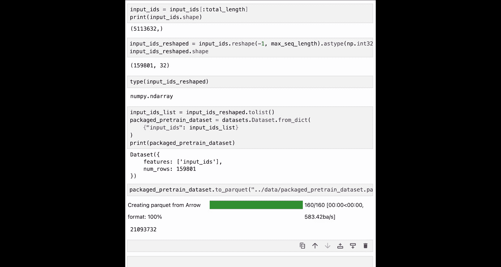

# 004：第三课 数据打包 📦

在本节课中，我们将学习如何为模型训练准备数据。具体来说，我们将了解如何对清洗后的数据集进行分词和打包，使其符合Hugging Face训练流程的要求。


## 概述

上一节我们介绍了数据清洗，本节中我们来看看数据打包。在将数据用于训练之前，你需要对数据进行进一步处理。两个主要步骤是：**对数据进行分词**，然后**将其打包**。大语言模型并不直接处理文本，其内部计算需要数字。分词是将文本数据转换为数字的步骤。

## 分词

分词的具体细节取决于模型的词汇表和分词算法。每个模型都有特定的分词器，选择正确的分词器至关重要，否则模型将无法正常工作。

以下是使用Hugging Face数据集库进行分词的步骤。我们将使用之前课程中创建的`.parquet`文件。为了减少执行时间，我们将整个数据集分成10份，只处理其中一份。

```python
# 示例：加载数据集并分片
from datasets import load_dataset
dataset = load_dataset('parquet', data_files='your_data.parquet')
# 此处进行分片操作，例如取前1/10
```

现在加载分词器。你可以从Hugging Face上托管的现有模型中选择一个，或创建自己的。通常，同一系列的模型会使用相同的分词器。在本例中，我们将使用来自So的`tiny-solar`分词器。

```python
from transformers import AutoTokenizer
tokenizer = AutoTokenizer.from_pretrained("your-model-name", use_fast=False)
```

我们禁用了`use_fast`标志。如果`use_fast`为True，自动分词器会使用Rust实现的并行分词器，速度更快。但在本例中，处理长文本样本有时会导致挂起，因此我们将其设为False，并单独使用数据集库的`map`函数进行并行处理。

分词器的输出是怎样的？让我们在处理批次之前先尝试一下。

```python
sample_text = "这是一个示例句子。"
tokens = tokenizer.tokenize(sample_text)
print(tokens)
```

正如幻灯片中讨论的，你可以看到输入被分成了多个词元（token），其中特殊词元`▁`指示了原始空格的位置。注意，输出仍然是文本形式。

现在我们将把这些词元转换为数字ID。我们将创建一个辅助函数，以便利用Hugging Face数据集库的`map`方法。我们的函数将执行以下操作：对文本进行分词、将词元转换为ID、添加起始（BOS）和结束（EOS）词元。

我们添加BOS和EOS词元是因为我们希望模型能够理解哪些词元是连贯的。然后，我们计算每个样本的词元数量。

```python
def tokenize_function(examples):
    # 分词并转换为ID
    tokenized_output = tokenizer(examples['text'])
    # 添加BOS和EOS词元（如果分词器没有自动添加）
    # 注意：许多分词器会自动添加，请根据你的分词器调整
    input_ids_with_special = [tokenizer.bos_token_id] + tokenized_output['input_ids'] + [tokenizer.eos_token_id]
    examples['input_ids'] = input_ids_with_special
    examples['n_tokens'] = len(input_ids_with_special)
    return examples

# 映射函数到数据集
tokenized_dataset = dataset.map(tokenize_function, batched=True)
```

让我们看看结果。我们现在将分词函数映射到数据上。你注意到区别了吗？现在我们的数据中有了`input_ids`和`n_tokens`字段。让我们查看第一个样本。

```python
print(tokenized_dataset[0])
```

这里你可以看到我们有原始文本、与之对应的输入ID，以及文本对应的总词元数。一切看起来都很好。如果你想查看其他样本，可以自由更改索引。

## 计算总词元数

现在我们来计算数据中的总词元数。在训练大语言模型时，我们经常需要计算总词元数，这可以很容易地用NumPy来检查。

```python
import numpy as np
total_tokens = np.sum(tokenized_dataset['n_tokens'])
print(f"总词元数: {total_tokens}")
```

对于这个最初大约有4000个文本样本的小数据集，你实际上拥有约500万个词元。你可以想象，一个基于大部分互联网或整个图书馆书籍构建的数据集，最终可能达到数十亿甚至数万亿的词元。

## 数据打包

现在我们进入准备数据集的最后一步：打包数据集。我们当前的数据集包含长度不等的行，即样本的长度各不相同。但在训练大语言模型时，我们希望将可变长度转换为等长的序列。

为此，我们将执行以下操作：
1.  首先，我们将连接所有的`input_ids`，使其变成一个巨大的列表。这也称为序列化。
2.  其次，我们通过将这个巨大列表分割成具有最大序列长度的小列表来重塑它。

以下是具体操作：

```python
# 1. 将所有样本的input_ids连接成一个列表
all_input_ids = []
for example in tokenized_dataset:
    all_input_ids.extend(example['input_ids'])
all_input_ids = np.array(all_input_ids)
print(f"连接后的input_ids数量: {len(all_input_ids)}")
```

你可以看到，输入ID的数量等于我们上面计算的词元总数。

现在，我们将选择一个最大序列长度。这里我们将其设置为32，但如果你的设备有足够内存，可以设置为更长的长度。更长的最大序列长度能使模型在处理长文本时表现更好。请注意，最近的模型如Solar、Llama2使用4096。

```python
max_sequence_length = 32
```

接下来，我们计算总输入ID数，使其除以最大序列长度时余数为0。

```python
# 计算需要保留的长度，使其能被max_sequence_length整除
total_length = (len(all_input_ids) // max_sequence_length) * max_sequence_length
# 从数据末尾丢弃余下的输入ID，以便能按最大序列长度精确分区
all_input_ids = all_input_ids[:total_length]
print(f"调整后的总长度: {len(all_input_ids)}")
```

你可以看到输入ID的数量略有减少。

现在，让我们将`input_ids`重塑为`(-1, max_sequence_length)`的形状。使用`-1`可以让重塑函数自动确定行数。我们还可以确保其数据类型为`int32`。

```python
# 重塑为二维数组
input_ids_reshaped = all_input_ids.reshape(-1, max_sequence_length).astype(np.int32)
print(f"重塑后的形状: {input_ids_reshaped.shape}")
```

检查`input_ids_reshaped`的类型，该对象目前是一个NumPy数组，但你需要将其转换为Hugging Face数据集，以便用于训练。

```python
# 转换回Hugging Face数据集
from datasets import Dataset
# 首先转换为字典列表
data_dict = {"input_ids": input_ids_reshaped.tolist()}
packed_dataset = Dataset.from_dict(data_dict)
```

最后，让我们将数据保存到本地文件系统，以便后续再次使用。

```python
packed_dataset.save_to_disk("./packed_training_data")
```

## 总结

本节课中我们一起学习了数据准备的最后阶段。我们首先对清洗后的文本进行了分词，将其转换为模型可以理解的数字ID，并添加了特殊的起始和结束标记。接着，我们计算了数据的总词元量。最后，我们通过连接和重塑操作，将长度不一的样本打包成固定长度的序列，为高效训练做好了准备。



现在，我们拥有了经过清洗、分词并打包成适合训练形状的干净数据。下一步是配置我们的模型。让我们进入下一课，看看如何操作。