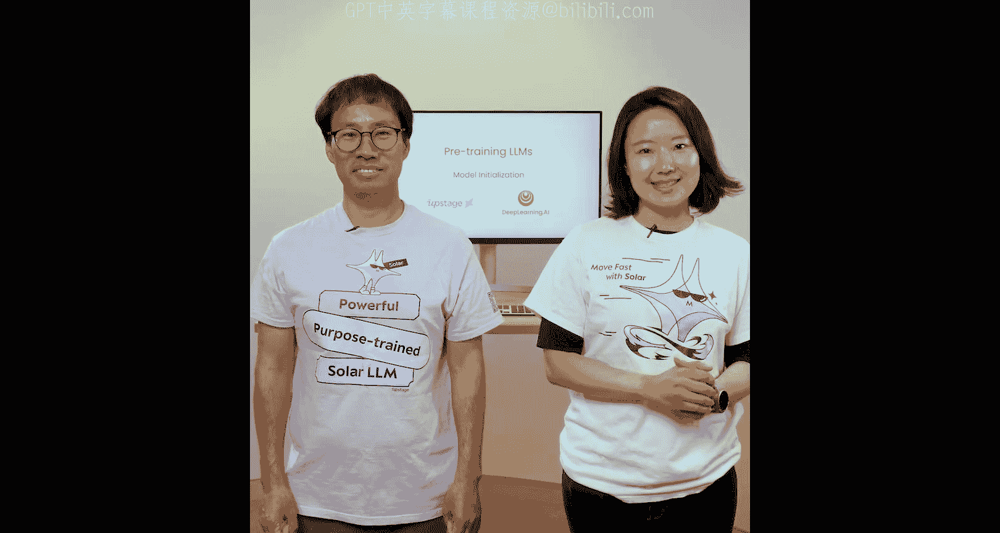
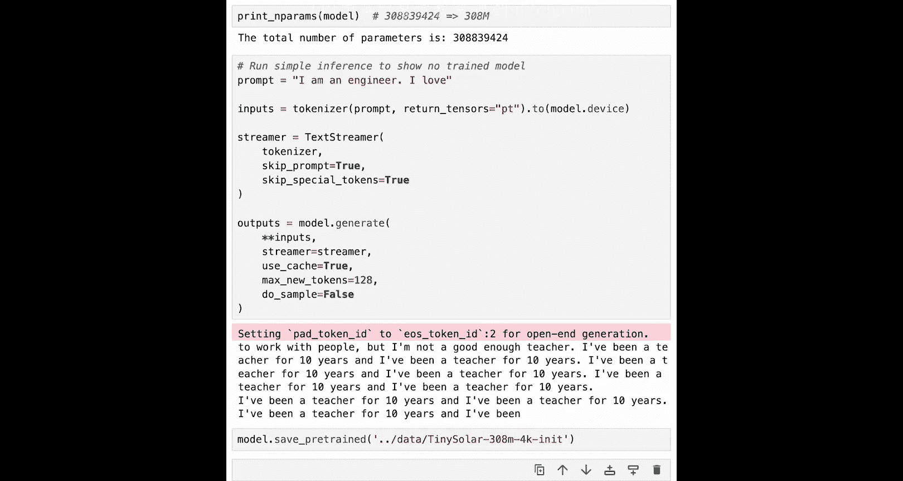

# 005：模型初始化 🏗️



在本节课中，我们将学习如何为大型语言模型的预训练配置和初始化模型。模型初始化的选择会直接影响预训练的速度和效果。我们将探讨几种不同的初始化方法，包括随机初始化、使用预训练权重、以及通过模型缩放（上采样和下采样）来调整模型大小。

---

## 模型架构选择

上一节我们介绍了预训练的整体流程，本节中我们来看看如何为训练准备一个模型。首先需要确定模型的基础架构。

尽管大语言模型有多种Transformer架构变体，本课程主要关注**仅解码器**或**自回归模型**。仅解码器架构简化了模型，并且对于下一个词元预测任务更高效。OpenAI的GPT模型以及其他流行的LLM，如Llama、Mistral、Tekcon等，都采用仅解码器架构。这也是我们在Upstage开发Solar系列模型时使用的架构。

一个仅解码器模型由以下几部分组成：
*   **嵌入层**：将文本转换为向量表示。
*   **多个解码器层**：每一层都包含基于神经网络的不同组件。
*   **分类器层**：从词汇表中预测最可能的下一个词元。

## 权重初始化方法

一旦确定了架构，下一步就是初始化模型的权重。这些权重会在训练过程中根据训练数据中的示例学习预测下一个词元而不断更新。

以下是几种初始化权重的方法：

### 1. 随机初始化

最简单的方法是使用随机值初始化权重。这种方法可行，但意味着训练需要非常长的时间和海量的数据。在代码中，这通常意味着从一个默认配置创建模型实例。

### 2. 使用预训练权重

一个更好的方法是重用现有的权重。例如，如果你想构建一个70亿参数的模型，可以从Llama-7B或Mistral-7B的权重开始。这意味着你的模型已经具备了一定的知识基础，能够生成像样的文本。如果你想在新领域的数据上继续预训练模型，这是最佳的起点。在这种场景下，训练所需的数据量和时间远少于从随机权重开始，但仍远多于微调。

鉴于目前开源模型众多，这为创建自定义LLM提供了一个绝佳的选择。例如，我们的团队在Upstage创建韩语版Solar模型时，就是以Solar-10.7B英文模型为基础，使用相同的架构规模，但混合了2000亿个韩语和英语词元进行继续预训练。

## 模型缩放技术

有时，你可能需要调整模型的大小。这里有两种主要技术：

### 下采样

如果你想得到一个更小的模型，可以选择**下采样**。这涉及从现有模型中移除一些层来产生一个更小的模型。这种方法通常对大型模型效果较好，但对小型模型效果不佳。通常，会移除靠近模型中间的层，然后对得到的较小模型进行大量文本的预训练，使其权重恢复一致性。

### 上采样

更好的方法是**上采样**。即从一个较小的模型开始，然后复制一些层来构建一个更大的模型。例如，要创建一个100亿参数的模型，可以从一个70亿参数的模型开始。通过复制模型并组合不同副本的层来增加总层数。此时，模型的层之间缺乏一致性，推理效果不佳，因此需要进行额外的预训练来使模型恢复一致并能够生成文本。

然而，由于复制层的权重已经编码了一定的语言理解和知识，因此创建一个好模型所需的数据和时间更少。实际上，上采样可以让你用比从头训练同等规模模型少70%的数据来训练一个性能良好的更大模型。我们在构建Solar模型时就采用了这种方法，从两个Mistral-7B模型的副本开始，扩展到100亿参数，然后继续用1万亿词元进行预训练。

---

## 动手实践：初始化模型

现在，让我们进入实践环节，看看如何使用上述每种方法创建模型。

首先，我们设置环境以确保结果可复现，并基于流行的Llama2架构（一种仅解码器模型）进行实验。为了在有限的计算资源下运行，我们将调整一些参数来缩小模型尺寸。

```python
# 设置配置以减少警告并确保可复现性
import warnings
warnings.filterwarnings('ignore')
import torch
import transformers
torch.manual_seed(42)

# 基于Llama2架构配置一个较小的模型
from transformers import LlamaConfig
config = LlamaConfig(
    hidden_size=512,       # 隐藏层大小
    intermediate_size=1024, # 前馈网络中间层大小
    num_hidden_layers=12,   # 解码器层数
    num_attention_heads=8,  # 注意力头数
    num_key_value_heads=4,  # 键值头数（用于分组查询注意力）
    vocab_size=32000,       # 词汇表大小
)
```

### 方法一：随机初始化

使用随机权重初始化模型非常简单。我们只需将配置传递给模型类即可。

```python
from transformers import LlamaForCausalLM
# 随机初始化模型
model_random = LlamaForCausalLM(config)
print(f"随机初始化模型的参数量：{model_random.num_parameters():,}")
```

此时模型的权重遵循截断正态分布（标准差0.02，均值0）。由于模型未经任何数据训练，如果尝试用它进行推理，将会输出完全随机的乱码。

### 方法二：加载预训练权重

我们可以加载一个现有的预训练模型（例如一个小型的Solar模型）作为起点。这被称为**继续预训练**，是比从头开始训练快得多的方法。

```python
from transformers import AutoModelForCausalLM
# 加载预训练模型权重
model_pretrained = AutoModelForCausalLM.from_pretrained("upstage/SOLAR-10.7B-248M")
print(f"预训练模型的参数量：{model_pretrained.num_parameters():,}")
```

### 方法三：下采样（缩小模型）

下采样通过移除现有模型的中间层来创建一个更小的模型。以下是如何操作的示例：

```python
# 假设我们有一个12层的模型
original_model = AutoModelForCausalLM.from_pretrained("upstage/SOLAR-10.7B-248M")
print(f"原始模型层数：{len(original_model.model.layers)}")

# 创建下采样模型：移除第5和第6层（索引从0开始）
layers_to_keep = list(range(0, 5)) + list(range(7, 12)) # 保留除第5、6层外的所有层
downscaled_layers = [original_model.model.layers[i] for i in layers_to_keep]

# 注意：此处仅为概念演示。实际创建新模型需要更复杂的配置和权重复制。
```

### 方法四：上采样（扩大模型）

上采样从一个较小的预训练模型开始，通过复制其层来构建一个更大的模型。首先，我们为目标大模型创建配置。

```python
# 配置一个更大的模型（例如16层）
config_large = LlamaConfig(
    hidden_size=512,
    intermediate_size=1024,
    num_hidden_layers=16,  # 目标：16层
    num_attention_heads=8,
    num_key_value_heads=4,
    vocab_size=32000,
)
# 随机初始化这个大模型
model_large_random = LlamaForCausalLM(config_large)
```

接下来，我们用预训练小模型的权重来覆盖这个大模型的权重。我们复制小模型的底部若干层和顶部若干层，并可能重复某些层来填满大模型的层数。

```python
# 加载小预训练模型
small_pretrained = AutoModelForCausalLM.from_pretrained("upstage/SOLAR-10.7B-248M")
small_layers = small_pretrained.model.layers # 假设有12层

# 构建大模型的层：例如，取小模型的前8层和后8层（有重叠）
# 目标是拼出16层
new_layers = []
# 复制前8层
new_layers.extend(small_layers[:8])
# 复制后8层（如果小模型只有12层，则从第4层开始取）
new_layers.extend(small_layers[-8:])

# 注意：此处需要将new_layers的权重精确复制到model_large_random的对应层中。
# 同时还需要复制嵌入层和分类器的权重。
# 此过程需要精细的代码实现，此处省略具体赋值细节。

print(f"上采样后模型的参数量：{model_large_random.num_parameters():,}")
```

经过上采样初始化后，模型已经具备了一些生成英语文本的能力，但由于新组合的层之间缺乏协调，输出可能不流畅。因此，必须用更多数据对这个模型进行**继续预训练**，以使所有层能够协同工作。尽管如此，这比起从随机权重开始，已经前进了一大步。

---

## 总结 🎯



本节课中我们一起学习了大型语言模型预训练中的模型初始化策略。我们了解了仅解码器架构，并探讨了四种关键的初始化方法：**随机初始化**、**加载预训练权重**、**下采样**和**上采样**。选择正确的初始化方法能显著影响训练效率和最终模型性能。通常，从预训练模型出发并进行调整（缩放或继续预训练），是比从头开始随机训练更高效、更经济的路径。在接下来的课程中，我们将学习如何实际训练这些初始化好的模型。