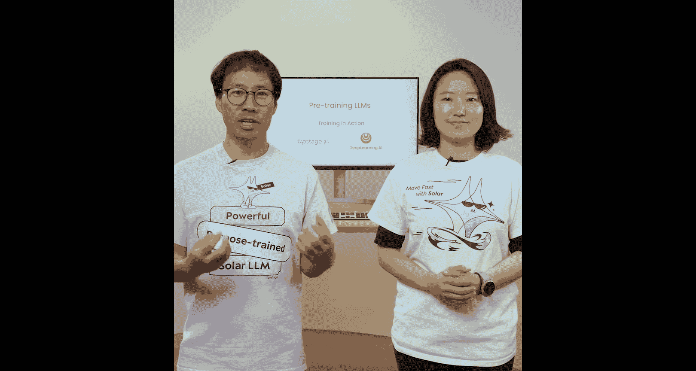
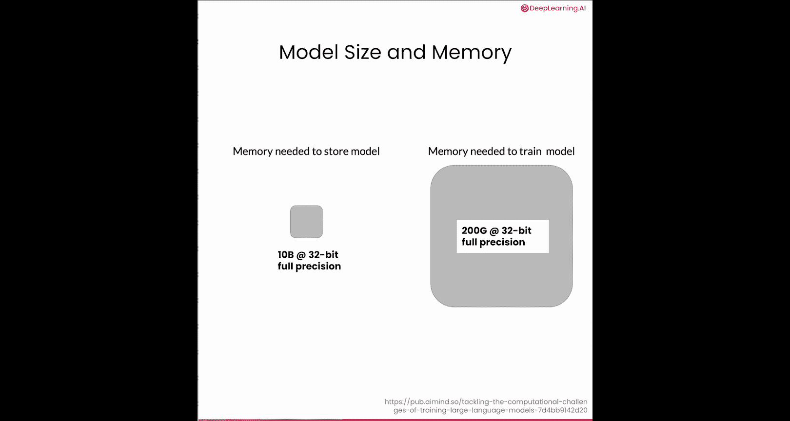
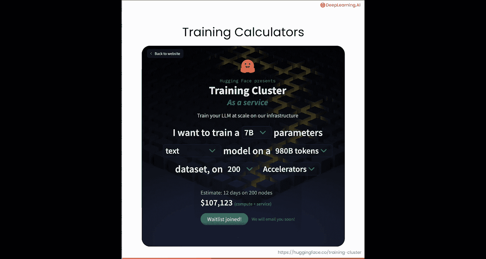
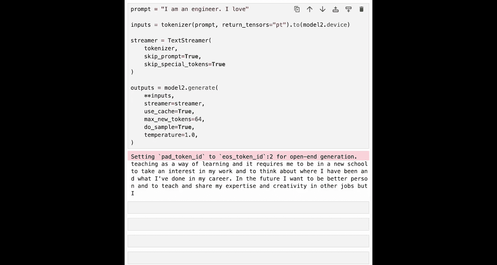

# 006：模型训练 🚀

在本节课中，我们将学习如何配置一次训练任务并训练你自己的模型。上一节我们介绍了如何准备训练数据集和初始化模型，本节中我们来看看具体的训练过程。



## 概述

现在，你已经拥有了训练数据集，并且知道了如何用你偏好的训练配置来初始化一个模型。接下来，我们将进入有趣的部分——训练。你将学习如何使用 Hugging Face 的 `Trainer` 来配置并执行一次训练任务。

## 使用 Hugging Face Trainer 进行训练

我们将使用 Hugging Face 的 `Trainer` 来处理大部分训练步骤。首先，我们需要加载数据并设置训练的超参数。

### 加载数据与设置参数

以下是训练准备的核心步骤：

1.  **加载数据**：使用 Hugging Face 的 `Dataset` 类加载数据。这个类实现了训练和数据加载所需的一些方法。
2.  **设置超参数**：为训练设置超参数，包括批处理大小、学习率等。我们将在本课的笔记中为你提供这些参数的推荐起始值。
3.  **启动训练**：将你的数据、配置好的模型和训练参数传递给 `Trainer`，然后调用 `train` 函数即可开始训练。

此时，一切就绪，你可以坐下来监控训练过程了。我知道你会迫不及待地想使用新模型，但请保持耐心。训练需要很长时间，具体取决于你的硬件。对于大型模型和大型数据集，可能需要数周甚至数月。

### 训练内存需求

一个重要的注意事项是：训练模型比推理需要更多的内存。额外的内存用于存储在训练过程中更新的梯度和激活值。



假设你需要存储一个 **100亿** 参数的模型，那么实际上你可能需要高达 **20倍** 的内存，即 **200 GB**。这通常需要多个 GPU，并且成本会非常高昂。在开始之前，你可以使用一些计算器来估算训练任务的成本。例如，Hugging Face 提供了一个计算器。


在这个例子中，使用 **200 个 GPU** 在 **9800 亿个词元** 上训练一个 **170 亿** 参数的模型，估计成本约为 **100 万美元**，耗时约 **两周**。



## 代码实践：设置训练任务

让我们进入笔记，看看如何为你的模型设置训练任务。我将向你展示如何设置训练流程，我们将使用前几课中保存的数据和 `Upscaled` 模型作为示例。请注意，我们将在 CPU 上进行训练。


当然，如果你有 GPU，可以随时将其更改为 `auto`。

### 1. 加载模型和数据

首先，像之前一样加载模型。

```python
# 加载模型
model = AutoModelForCausalLM.from_pretrained("your_model_path")
```

现在加载我们的数据。我们需要为 `Dataset` 类更新两个方法，以便它能与 `Trainer` 交互。

*   `__len__` 方法：返回训练样本的数量。
*   `__getitem__` 方法：以字典格式返回每个样本的输入和输出词元。

我们创建这个自定义类是为了加载在第三课中创建的预处理后的 `.pkl` 文件，并返回 `input_ids` 和 `labels`。

```python
class CustomDataset(Dataset):
    def __init__(self, file_path):
        # 加载预处理数据
        with open(file_path, 'rb') as f:
            self.data = pickle.load(f)

    def __len__(self):
        return len(self.data)

    def __getitem__(self, idx):
        # 返回输入ID和标签
        # 对于因果语言模型，标签通常与输入ID相同（用于下一个词元预测）
        item = self.data[idx]
        return {'input_ids': item, 'labels': item}
```

请注意，这里我们将 `labels` 设置为等于 `input_ids`，因为我们想要执行下一个词元预测。然后，`LlamaForCausalLM` 模型会在内部对标签进行偏移，以创建用于监督学习的输入-输出对，正如你在第一课中看到的那样。

### 2. 定义训练参数

现在，让我们定义一个自定义的参数类来设置训练参数。为 LLM 选择参数可能具有挑战性，通常涉及大量研究，因为训练 LLM 成本高昂，通常不允许进行太多试错，这与传统的小规模机器学习不同。

这里有许多重要的配置，但我只强调最重要的几个设置：

*   `optim`：指示优化器。虽然你可以自由探索不同的优化器，如普通的 `Adam`，但如今 `AdamW`（带权重衰减的 Adam）是训练 LLM 的首选优化器。
*   `max_steps`：指示训练的最大步数。在进行预训练时，通常将 `num_train_epochs` 设置为 1，而不是设置步数，这意味着你将完整处理一次所有数据。
*   `per_device_train_batch_size`：决定批处理大小主要取决于你，但经验法则是根据训练设备的内存容量最大化批处理大小。

回想一下，在你创建的数据集中，最大序列长度是 **32** 个词元。如果批处理大小为 **2**，那么整个批次就由 **64** 个词元组成。此外，这个设置是 **每个加速器** 的批处理大小。因此，如果你有 **8** 个可用的 GPU，你每训练一步将处理 **8 倍** 的批处理大小，即 **512** 个词元。

在配置的末尾，有一些被注释掉的代码行，它们会保存模型的中间检查点。我将在本课末尾详细讨论这一点。

### 3. 配置训练器并开始训练

现在，创建一个 Hugging Face 参数解析器，它将解析输入参数，并添加一个参数以便我们可以指定输出目录。

```python
# 设置训练参数
training_args = TrainingArguments(
    output_dir="./output",          # 模型保存目录
    overwrite_output_dir=True,
    num_train_epochs=1,
    per_device_train_batch_size=2,
    save_steps=3,                   # 每3步保存一个检查点
    save_total_limit=2,             # 最多只保留2个检查点
    logging_steps=3,
    optim="adamw_torch",
    max_steps=30                    # 仅训练30步作为演示
)
```

这行代码将输出目录设置为 `./output`。这是运行结束时模型将被保存的目录。

将参数传递给自定义数据集后，我们的数据集将按照 `Trainer` 的需要进行配置。配置好数据集后，我建议你总是打印一个样本行或至少数据的形状，以确保你正在处理正确的数据。你绝对不希望花费大量的 GPU 时间在错误的数据上。

在这里，你可以看到词元的长度是 **32**，这正是我们上面配置的最大序列长度。所以这看起来没问题。

现在，我们终于准备好开始训练了。这是最重要，却也是最简单的部分。你所要做的就是用一个待训练的模型、训练参数和训练数据集来初始化一个 `Trainer` 对象。

```python
# 初始化训练器
trainer = Trainer(
    model=model,
    args=training_args,
    train_dataset=train_dataset,
)

# 开始训练
trainer.train()
```

在这里，我们将让训练器运行 **30** 步，并每 **3** 步打印一次日志。让我们开始训练运行。我们将加快视频速度，这在笔记中运行需要几分钟。

请注意，你可能需要运行相当长的时间才能观察到损失的下降，因为模型已经具备了一些书写英语的能力，每一步训练带来的损失变化较小。在这里，仅仅 **30** 步，你会看到损失值波动，可能看起来并没有下降。但如果你运行 **1000** 或 **10000** 步，你会看到这个值下降。通常，你会预训练一个模型数周，甚至数月。

## 训练监控与检查点

在训练过程中，我们并非无所事事，而是密切监控整个过程。我们首先会使用 **Weights & Biases** 记录损失，这允许我们的团队随时检查进度。如果你感兴趣，可以查看 Weights & Biases 关于深度学习的短期课程。

我们还会创建 **检查点**，即模型的中间版本，例如每天保存一次。像这样保存模型可以确保在计算资源宕机或崩溃时，我们不必从头开始。

在训练器运行之后，它实际上会输出一些关于训练的信息，包括全局步数、训练损失和训练运行时间。回想一下，这些是我在上面注释掉的保存配置。在这里，我们提到了保存策略，默认是 `steps`。你也可以将其替换为 `epochs`。我们还提到 `save_steps` 是每 **3** 步一次，所以我们将每 **3** 步有一个检查点。

你总是可以用另一个数字替换它，在实践中，可能是每 **10，000** 步、**100，000** 步等等。我们还想限制检查点的数量，因为检查点会占用大量存储空间。这里我们将其限制为 **2**，这意味着只有 **2** 个检查点会被保存在存储中。

## 检查训练效果

如果你好奇，这里可以看看模型在训练 **10，000** 步后的表现。这里你加载一个分词器，然后加载一个在 **10，000** 步后保存的检查点，并设置它来生成文本。让我们看看它的输出。

```python
# 示例：加载检查点并生成文本
tokenizer = AutoTokenizer.from_pretrained("your_tokenizer_path")
model_checkpoint = AutoModelForCausalLM.from_pretrained("./output/checkpoint-10000")

inputs = tokenizer("Once upon a time", return_tensors="pt")
outputs = model_checkpoint.generate(**inputs, max_length=50)
print(tokenizer.decode(outputs[0]))
```

好的，看起来和之前有点不同。文本仍然没有太多意义，但部分原因是这么小的模型在生成长段连贯文本时本身就会有问题。不过，性能仍然比以前好很多。它不再重复相同的文本，每个句子都不同，并且句子之间存在一些相关内容。总的来说，我们看到了一些变化，如果我们继续进行完整的预训练，我们期望看到更多改进。

像这样保存检查点可以让你获得模型的中间版本，你可以对其进行评估，了解训练进展如何。让我们进入下一课，更多地讨论评估。



## 总结


本节课中，我们一起学习了如何配置和启动大语言模型的训练任务。我们介绍了使用 Hugging Face `Trainer` 的流程，包括加载数据、设置关键超参数（如优化器、批处理大小和最大步数），并启动了训练。我们还讨论了训练的内存需求和成本估算，以及通过保存检查点和监控损失来有效管理长期训练的重要性。最后，我们观察了模型在部分训练后的输出变化，为下一课的模型评估做好了准备。