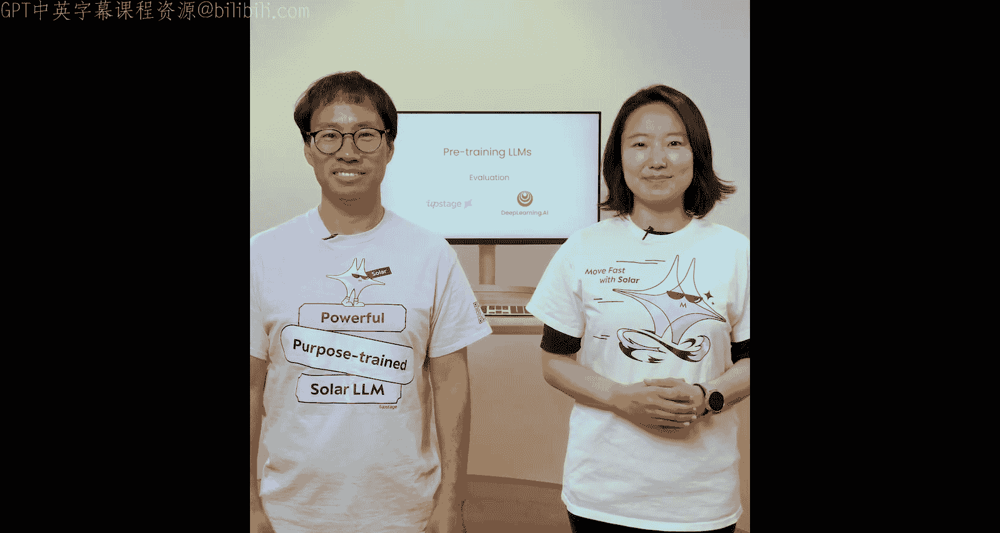
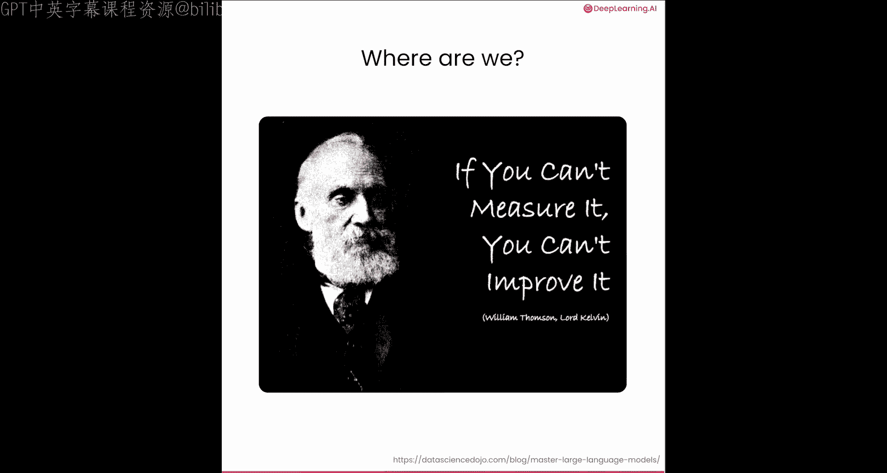
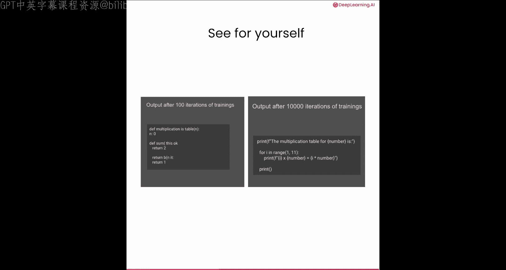
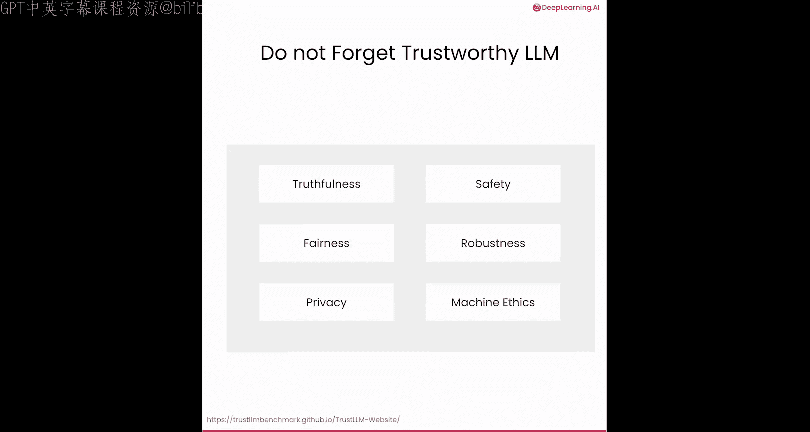

# 007：模型评估 🧪

在本节课中，我们将学习如何评估预训练后的大语言模型。评估是衡量模型性能、发现改进方向的关键步骤。我们将介绍几种常见的评估方法，并了解如何使用基准测试来公平地比较不同模型。



## 概述

你已经了解了预训练模型的所有步骤。但训练完成后，如何知道模型的好坏呢？在这最后一课中，你将探索一些针对大语言模型的常见评估策略，包括一些用于比较不同模型性能的重要基准任务。

## 评估方法



评估就像一场测试，虽然有时令人不快，但为了了解模型的优势与不足，这是必要的。评估模型有四种常见方法：观察损失、检查输出、模型比较和使用基准数据集。这不是一次性的工作，而是一个持续的过程。

### 1. 观察训练损失

第一种方法是在训练过程中观察损失。如果训练进展顺利，损失值应该以一种一致的方式随时间下降。

```
# 伪代码示例：监控训练损失
for epoch in range(num_epochs):
    loss = train_one_epoch(model, data_loader)
    print(f"Epoch {epoch}: Loss = {loss}")
    # 绘制损失曲线以观察趋势
```

如果损失没有下降，你可能需要重新考虑训练超参数，特别是学习率。如果你观察到损失曲线趋于平缓（即达到平台期），也可能存在一些问题。一种可能是你的模型已达到其最大学习能力，无法从额外数据中学到更多。这在训练小规模模型时可能发生。这也可能表明你的训练数据集存在问题，例如存在低质量样本。因此，如果训练大型模型时出现这种情况，一定要检查你的数据。

### 2. 检查模型输出



在训练大语言模型时，亲自检查模型的输出非常重要。你可以定期（例如每10,000个训练步）创建模型的检查点，并确保模型的输出符合你的预期。随着时间的推移，模型生成的文本应该越来越好。人工评估对于大语言模型仍然非常重要，不要忽视这一步。

以下是检查模型输出的步骤：
*   定期保存模型检查点。
*   使用固定的提示词（prompt）测试不同检查点的模型。
*   人工评估生成文本的质量、连贯性和相关性。

### 3. 与其他模型比较

将结果并排比较，更容易判断哪个更好。有一些在线工具可用于比较模型，包括Uptage Console和Buckley的LMC，你可以在笔记中找到相关链接。这是衡量性能的最佳方法之一，但确实需要人工投入。一个活跃的研究领域是使用大语言模型作为“裁判”来判断哪个模型输出更好，但“裁判”模型可能存在偏见，这取决于它是如何训练的。

### 4. 使用基准数据集

最常见的评估方法是使用基准数据集。这就像让大语言模型参加标准化考试，通过在相同的基准上测试所有模型，你可以公平地比较不同模型的能力和性能。

有几个著名的基准数据集，如ARC、MMLU、HellaSwag、TruthfulQA、MGSM和GSM8K。这些数据集衡量大语言模型的通用能力，如推理、常识和数学技能。

但根据你使用大语言模型的目的，测量其组合能力可能更有用。为此，开发了像BIG-Bench、EQ-Bench和Instruct这样的基准。

## 实践：运行基准测试

在最后的笔记中，你将学习如何下载并在你的模型上运行一些基准测试。这里我们将使用一个流行的开源评估库，名为LM Evaluation Harness，来自EleutherAI项目。

它已安装在当前学习环境中，但如果你在其他环境中需要，可以运行这行代码进行安装：
```
pip install lm-eval
```

该工具包含许多用于评估的任务。我们将选择在TruthfulQA MC2任务上评估TinyStories模型。MC2任务由牛津大学和OpenAI开发的多选题组成，是Hugging Face开放大语言模型排行榜中包含的评估任务之一。

MC2任务的工作原理如下：给定一个问题以及多个真/假参考答案，得分是分配给所有真实答案集合的归一化总概率。我们将在CPU上运行此评估，并且只运行五个示例，以便评估能在10分钟内完成。

请注意，评估任务需要相当长的时间，因为需要为每个候选答案计算对数似然。为了你的方便，我们将在此处加速视频播放。

现在评估完成了。在最终的表格中，你可以看到最终得分约为0.4。请记住，我们的模型非常小，因此与拥有数十亿参数的其他模型进行比较是不公平的。

你可以使用这里的代码运行整个评估套件。如果你训练了自己的模型并希望登上Hugging Face排行榜，这里的自定义函数将使用相应的few-shot参数运行所有六个任务。

我们不会在这里运行它，因为对于短期课程来说时间太长了。few-shot参数表示提示中包含多少个示例供大语言模型参考。例如，对于ARC挑战，将包含25个示例。请注意，这些是Hugging Face排行榜的固定数字，因此所有模型都以相同的方式进行测试。我希望如果你训练了自己的模型，能在这些基准上进行评估，以便社区能看到你的模型有多棒。

## 评估工具

在笔记中，你看到了几种手动运行基准测试的方法。幸运的是，有一些工具可以使评估变得容易得多。

例如，Eververse是我们在Upsage创建的一个开源项目，旨在支持你的大语言模型评估，我们公司内部也使用它。Eververse使用Git子模块统一了各种大语言模型评估框架，设置和运行相当容易。你可以一次在多个模型上运行Eververse，它将提供其性能的综合报告，包括基准分数、排名和其他标准。

最后，在完成预训练后，你可能会对模型进行微调和对齐，以便在实际应用中使用。不要忘记评估模型的行为及其与人类价值观的一致性。关于真实性、安全性、公平性等方面的基准测试也已存在，并且仍在积极开发中。你可以在笔记中查看链接以获取更多信息。

## 总结



本节课中，我们一起学习了评估预训练大语言模型的关键方法。我们探讨了通过观察损失曲线、人工检查输出、与其他模型比较以及使用标准化基准数据集来评估模型性能。记住，评估是一个持续的过程，对于理解模型能力、指导后续的微调和对齐至关重要。选择合适的评估策略和工具，将帮助你更客观地衡量模型表现，并推动其不断改进。