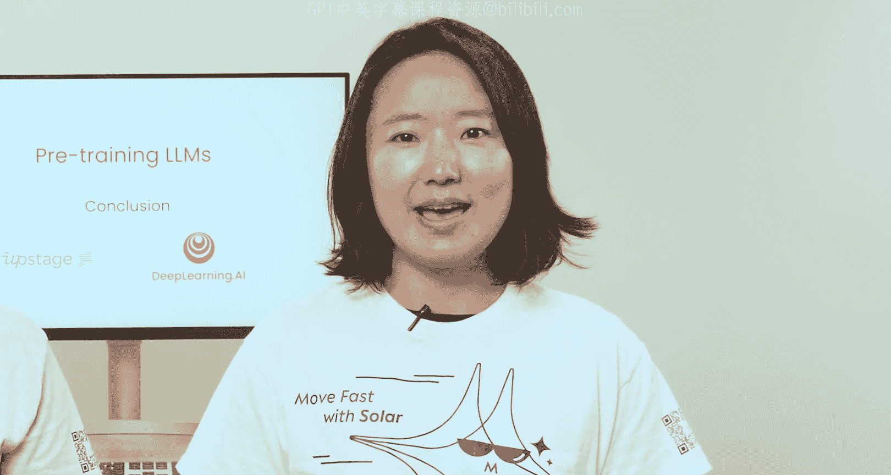

# 008：课程总结 🎉

在本节课中，我们将对《大语言模型预训练》课程的全部内容进行总结，回顾从数据准备到模型评估的完整流程。

---

感谢您完成本课程的学习。您现在已掌握了预训练一个模型所需的所有步骤，包括准备训练数据、配置模型、进行训练以及评估其性能。

尽管您在此处看到的示例是在CPU上运行的，但您可以调整Notebook中的代码，以便在GPU上训练更大的模型。只是请务必注意，预训练工作会伴随相应的成本。

掌握了本课程的知识后，我们期待看到您创造出更多突破性的预训练模型。

如果您真的训练了自己的模型，请务必与社区分享您的工作成果。

我们希望您喜欢这门课程。祝您预训练顺利愉快！

---

**课程总结**

本节课中我们一起回顾了整个大语言模型预训练的流程。我们学习了从数据准备、模型配置、实际训练到性能评估的核心步骤。虽然示例基于CPU，但您已具备将代码迁移至GPU以训练更大模型的能力。请记住关注计算成本，并鼓励您将成果与社区分享。预训练是一个强大的工具，期待您运用所学，构建出创新的模型。