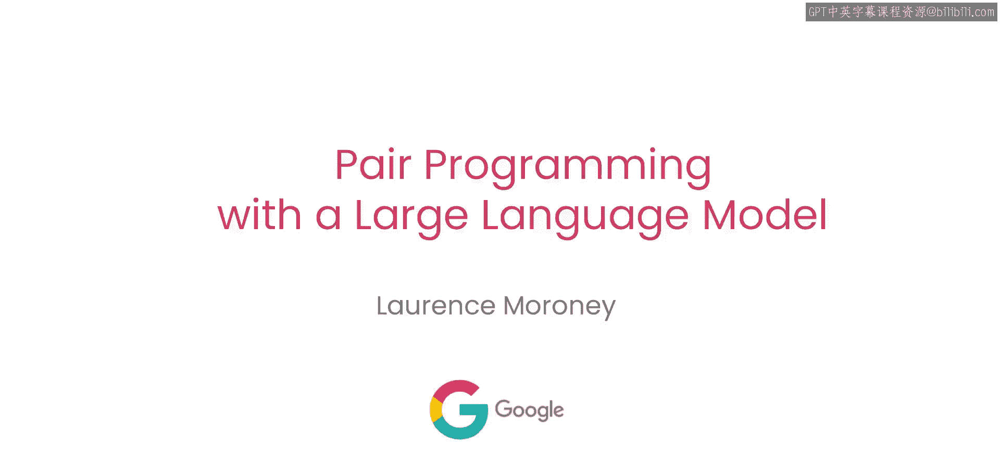
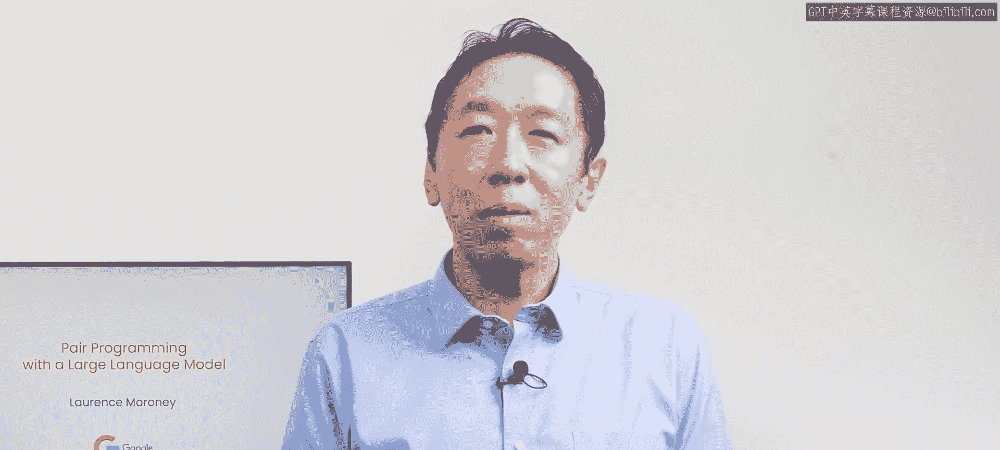
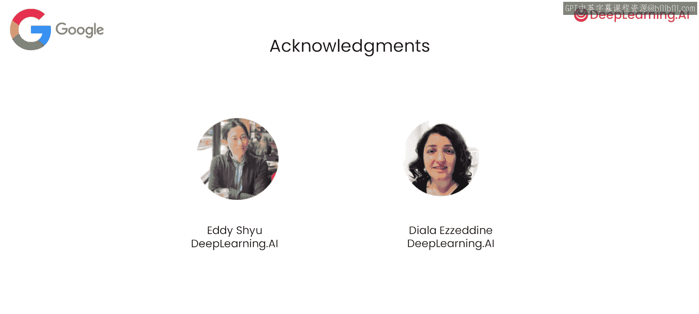

# 001：课程介绍与概述 🚀

在本节课中，我们将要学习如何利用大型语言模型（LLM）作为编程伙伴，来简化和改进我们的编码工作流程。课程将介绍一系列新兴的最佳实践，帮助你更高效地编写、测试、调试和重构代码。

欢迎来到这门与谷歌合作开发的关于使用大型语言模型进行配对编程的简短课程。大型语言模型正在改变我们编写代码的方式。当我为翻译一些DeepLearning.AI内容而开发基于LLM的翻译软件原型时，我需要使用一些不熟悉的Python库。我没有阅读文档，而是让LLM先尝试编写代码，然后我再进行修正。

经验丰富的开发者正以多种方式使用LLM来加速工作。在本课程中，你将学习这套新兴的最佳实践，包括如何让LLM帮助你进行错误处理、性能优化等等。我很高兴本课程的讲师是我的老朋友劳伦斯·莫罗尼，他是谷歌的AI首席倡导者。

非常感谢，安德鲁。我也非常高兴能与你和你的团队合作。在本课程中，你将学习如何使用LLM来简化和改进你的代码、编写测试用例、调试代码以及重构代码。你将学习如何处理复杂的现有代码库，这些代码库可能存在技术债务，而LLM可以帮助你解释、记录和格式化这些现有代码。

劳伦斯将使用PaLM API来讲解这些概念，我自己也使用过它，我相信你也会觉得它很有趣。这正是生成式AI和大型语言模型真正让我兴奋的地方。如果我们仅仅把它们看作是**从零开始创造**某些东西（比如代码），那么我们实际上错过了它们能带来的大部分价值。

希望我们今天将要探讨的一些例子能为你自己的编程之旅带来启发，并帮助你成为一名更高效的软件工程师。我在使用生成式代码时有过一个有趣的经历：它帮助我发现了那些我**不知道自己不知道**的东西。来自DeepLearning.AI团队的Ed Shu和Dila Eadin也为本课程做出了贡献。

第一课将介绍如何开始使用PaLM API来改进和简化你的代码。这听起来很棒。让我们开始吧。

---

本节课中我们一起学习了本课程的总体目标：利用大型语言模型作为编程助手，提升编码效率和质量。我们了解到LLM不仅能辅助编写新代码，更能帮助理解、优化和维护现有复杂代码库。接下来，我们将进入第一课，具体学习如何开始使用相关工具。