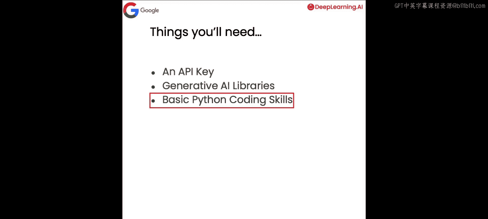
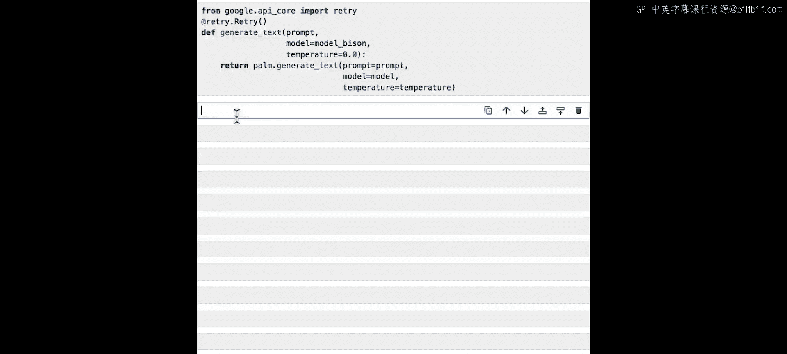
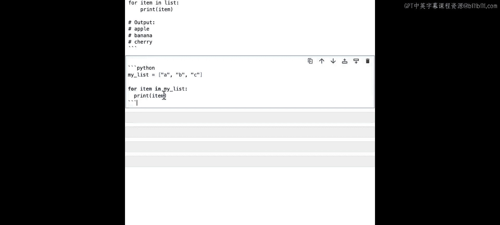
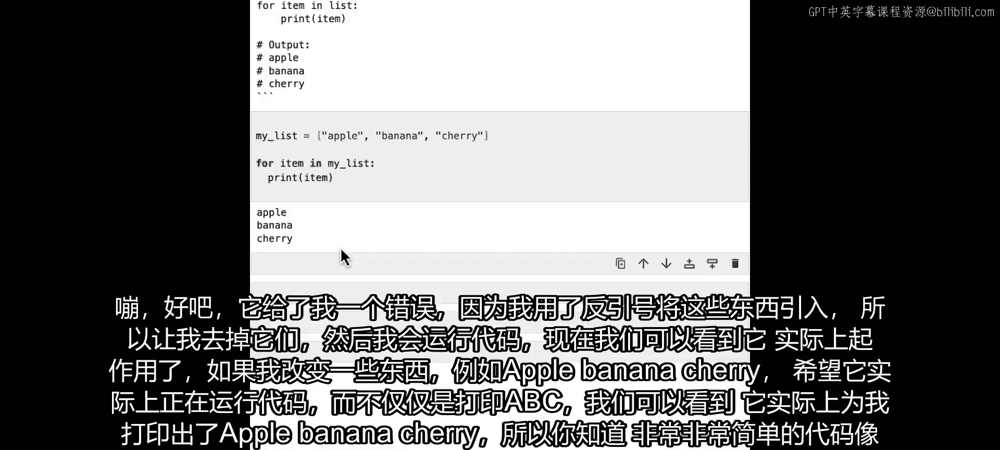
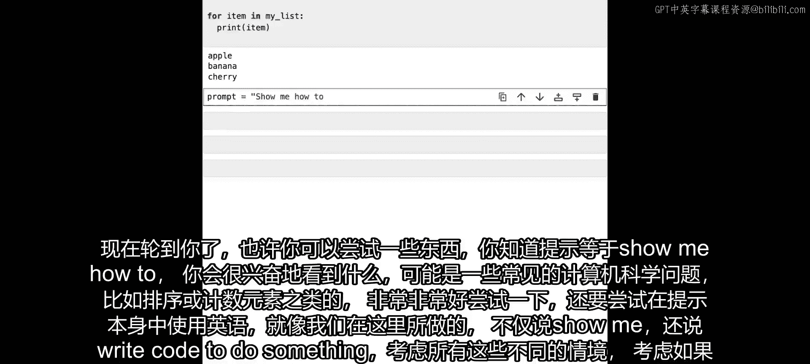
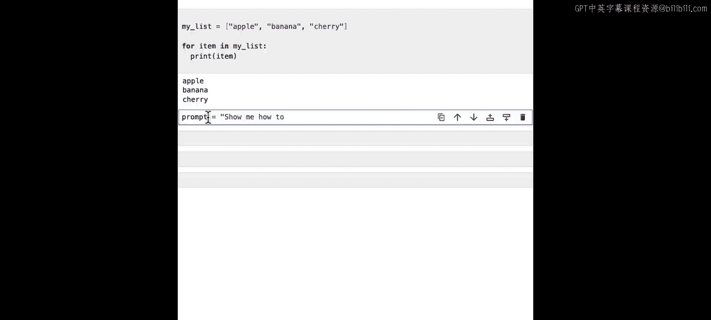

# 002：开始使用PaLM API进行代码生成 🚀


在本节课中，我们将学习如何开始使用PaLM API进行代码生成。我们将介绍必要的设置步骤，并编写一个简单的代码生成示例。

---

## 概述


首先，我们需要完成一些必要的设置。我将指导你完成整个过程。

PaLM API及其相关工具在Google的开发者生成式AI网站上持续更新。这包括Maker Suite（一个快速、简单的生成式AI提示原型设计工具）和Vertex AI（提供可扩展性和企业级隐私、安全性等更多功能）。但本课程的重点将放在PaLM API上，它允许你通过编码接口访问Google大型语言模型的许多功能。在本课程中，你将亲自动手使用这个API编写代码。

让我们深入了解你需要准备什么。

---



## 准备工作 📋


以下是开始所需的简单清单。

首先，你需要一个API密钥。在现实世界中，你可以从我上一张幻灯片展示的网站（develop.generativeai.google）获取。为了本课程的目的，你无需担心，我们已经为你准备了一个，但你需要记住这一点。

其次，你需要Google的生成式AI库。在录制本视频时，它们支持Node.js、Swift和Python，以及一个curl接口。但在本课程中，我将使用Python，并向你展示如何进行Pip安装。

当然，不言而喻，你可能需要一些Python技能。如果你没有，可以查看learnPython.org。但我要做的大部分内容都相当基础。

---

## 探索模型 🦎

PaLM包含很多内容，包括许多为不同目的设计的后端模型。探索它们，特别是它们的命名，会很有趣。你会看到很多动物名字。一般来说，动物越大，模型也越大。让我们来看看。

首先，为了获取你的API密钥，我们为你提供了一个，但你需要一个工具来获取它。这里有一个辅助函数。我将执行`get_api_key`来获取那个辅助函数。

在下一个单元格中，我将导入Google的生成式AI库，我们将其称为`palm`，然后使用API密钥配置它。

现在我已经完成了这些，我将运行这个单元格。我已经导入了密钥。如前所述，我导入了`google.generativeai`，我将其称为`palm`，并通过传递`api_key`参数为`get_api_key`的结果来配置`palm`。

现在我们已经准备好了。如果你要在没有后端的自己的系统上做这件事，你将需要通过`pip install google-generative-ai`来安装。

接下来，我将探索其中一些模型。我将执行`models = palm.list_models()`。这是PaLM API中的一个函数，允许你列出所有模型。我将粘贴接下来的代码，然后我们将打印名称、描述和支持的方法。

运行这个单元格，看看我们得到了什么。我们看到我们得到了`chat-bison`、`text-bison`和`embedding-gecko`。猜猜哪些是大模型，哪些是小模型？我们可以看到有两个`bison`和一个`gecko`。我们今天要做的是生成文本，我们会看到这个`chat-bison`支持`generate_message`，而这个`text-bison`支持`generate_text`。这很好。我们知道我们将使用这个模型。

但这里还有另一个函数可以使用。随着更多模型得到支持，如果有多个模型支持`generate_text`，我可以开始这样做：

```python
models = [m for m in palm.list_models() if 'generateText' in m.supported_generation_methods]
```

我在这里说的是，如果`generate_text`确实在支持生成方法中，那么我将展示这些模型是什么。运行这个，现在我们可以看到关于这个模型的更多细节。`text-bison`是唯一真正支持它的模型。

同样，这只是你可以开始使用PaLM API来了解情况的一些方法。随着API的发展和支持模型的增长，你可能会在这里得到不同的结果，并且你可能能够尝试不同的模型，并从中获得更多乐趣。

我们看到最终列出了三个模型：`chat-bison-001`、`text-bison-001`和`embedding-gecko-001`。想象一下，`gecko`会更小。我提到过，它是基于动物大小的。随着时间的推移，你可能会看到更多模型被添加到这里。

现在你可能会经常听到的一个问题是：`chat-bison`和`text-bison`有什么区别？`chat-bison`的目标是更优化于聊天场景，它会跟踪上下文。你问它一些东西，它会给出答案，你可能会跟进，或者它会给出另一个答案，你可能再次跟进。而`text-bison`则更优化于单次提示。你给它一个提示，你会得到一个答案，然后你就继续前进。我们今天将使用那个，因为我发现它通常对代码工作得更好。

现在我们只有一个模型支持`generate_text`，所以我将创建一个指向它的变量。我将其称为`model_bison`。当然，这是我们模型列表中的第一个。如果我输出`model_bison`，确保我得到了正确的那个。运行这段代码，我们看到我得到了相同的输出。

---

## 创建辅助函数 🔧

现在我们有了模型，让我们创建另一个辅助函数。这个辅助函数将用于生成文本，这样我们就不必一遍又一遍地编写相同的代码。不重复自己总是一个好习惯。

我将从`from google.api_core import retry`开始。`retry`库是这样一个东西：当你像我们在这里一样对LLM数据库进行后端调用时，有时事情可能会不同步，有时你的调用可能会在互联网中丢失。与其编写一大堆代码来重试并不断重试，这可以通过一个非常简单的装饰器来完成，比如`@retry.Retry()`。

然后我们可以编写我们的函数。我们的函数将被称为`generate_text`。在`generate_text`中，我将传递我的提示、我想要使用的模型（我们已经创建了一个称为`model_bison`的东西），然后我将使用一个温度。模型的默认温度是0.7，但使用0.0的温度，它将是一个更具确定性的模型。所以，无论我从提示中得到什么结果，你都应该看到相同的结果。当然，如果你使用更新的版本甚至更新的模型，它可能已经改变了。

完成这些后，我们现在只想返回`palm`将给我们的东西，所以是`palm.generate_text`并传递相同的东西：`prompt=prompt`，`model=model`，`temperature=temperature`。这有助于我们在整个代码中拥有一个很好的辅助函数，这样我们就不必不断地重新发明轮子。

运行这个单元格，确保一切正常。看起来不错。



---


## 代码生成的第一步 💻

现在我们将使用PaLM API进行代码生成的第一步。有一个我喜欢的模式，我们将在这个短期课程的所有示例中遵循这个过程。

这个过程如下所示：

首先，我们将创建一个提示。我们将从一个非常简单的静态字符串开始，稍后将展示如何模板化它以使其更复杂和强大。这包含我们想要发送给LLM以指示其为我们生成一些输出的基本命令。

然后，我们将使用我们刚刚创建的`generate_text`函数和我们选择的模型来获取一个完成。值得注意的是，通常在使用LLM时，模型的输出文本是它预测的下一个标记集。因此，当你传入一个问题时，下一个标记集通常是一个答案。因此，它完成了你以引号开始的字符串。这就产生了“完成”这个术语，而不是“答案”或其他不太准确的词。

当然，最后，在完成输出之后，由你决定如何操作。在本课程中，我们将在Jupyter笔记本中打印出来，但在真实应用程序中，你可能将代码注入IDE、保存到仓库或做许多其他事情。

让我们探索这些步骤的代码，用PaLM进行基本的代码生成。

---

## 基本代码生成示例

现在我们已经完成了这些，让我们做一些非常非常基本的代码生成。

我将给它一个非常简单的提示：

```python
prompt = "How about show me how to iterate across a list in Python"
```

这将是我的提示。这里假设了很多东西，对吧？因为它假设有一个列表，假设是用Python完成的，假设了很多事情。那么，这会是什么样子呢？让我们看看。

如果我说`completion = generate_text(prompt)`，你认为会发生什么？让我们看看。运行它。这需要一点时间，因为它正在实例化API，正在调用后端，后端正在为我们生成东西。完成后，如果你不是在观看录制视频，而是在自己的笔记本中操作，你会在旁边看到一个小星星。当那个星星变成单元格的编号时，你就可以继续了，然后你就可以做类似`print(completion.result)`的事情。

结果出来了！我们将看到类似这样的结果。它给出了在Python中迭代列表的方法。你可以使用`for`循环，语法看起来像这样。例如，如果你有一个包含A、B、C的列表，你的`for`循环`for item in my_list: print(item)`将输出A、B、C。

但关于这一点的一个非常有用的地方是，它也找到了其他方法来做这件事。例如，有`enumerate`函数。你可以看到`enumerate`函数在列表上工作。但当你查看代码时，你会看到所有这些是如何为你工作的。同样，这是非常非常简单、非常基本的代码生成。

但我们不仅仅是创建代码，因为我要求它“展示如何在Python中迭代列表”。所以它给了我代码并解释了它，不仅仅是给我代码。这是第一部分，这是非常非常基本的代码生成。

现在，正如我所展示的，我要求它“展示如何在Python中迭代列表”，所以我们得到了很多额外的东西。当然，你典型的代码生成可能只是类似这样的东西：

```python
prompt = "Write code to iterate across a list in Python"
```

运行那个，然后让我偷懒一下，复制这些。我的`completion`是`generate_text(prompt)`。然后`print(completion.result)`。让我们看看那给了我什么。现在你可以看到它只给了我代码。我有一个小注释，创建列表`['apple', 'banana', 'cherry']`，然后就是`for item in list: print(item)`。它只给了我一种使用`for`循环迭代的方法。



所以有时候，这就是你提示的方式，并思考如何措辞。你的大型语言模型会非常非常字面地理解你的要求。所以，如果你要求它写代码，它会写代码；如果你要求它展示如何做某事，你可能会得到一些更有价值的东西，就像我们在这里得到的那样，它给了我各种选项并向我解释。

为了好玩，我们也可以取一些它输出的代码，比如这里Python给了我一个列表`['A', 'B', 'C']`，然后只是遍历它。我们可以把它粘贴到一个单元格里，看看会发生什么？它给了我一个错误，因为我用反引号引入了这些东西。让我去掉那些，然后运行代码。现在我们可以看到它实际上工作了。如果我改变一些东西，比如`['apple', 'banana', 'cherry']`，希望它实际上在运行代码，而不仅仅是打印A、B、C。我们可以看到它实际上为我打印出了apple、banana、cherry。

所以，像这样非常非常简单的代码会工作，但我们在课程中将大量讨论的一件事是，输出代码容易出现幻觉，所以在任何严肃或生产环境中使用之前，你真的应该彻底测试你的代码。



---

## 轮到你了！🎯

现在轮到你了。也许你可以尝试一些东西，比如`prompt = "show me how to..."`，然后是你想看到的东西。它可能是一些常见的计算机科学问题，比如排序或计数元素之类的。实验它，也实验提示本身的英语语言，就像我们在这里做的那样，我们用“show me”而不是“write code to do something”。想想所有这些不同的场景，想想如果你有一个能做事但非常字面理解指令的人，你会如何措辞你的指令。实验它，玩得开心，我们很乐意了解你使用它时的体验。



---

## 总结



在你亲自尝试并想出一些有趣的代码之后，看到你做了什么会非常有趣，我们很乐意得到你的反馈。在下一课中，我们将看到如何使这个提示更高效，我们将使用一种叫做字符串模板的东西来实现。