# 003：提示词模板化 🧩


在本节课中，我们将学习如何通过“模板化”你的提示词字符串，使其更加强大和结构化。我们将把提示词分解为三个核心部分，并通过一个具体的例子来演示如何构建和使用模板。


## 概述

与大型语言模型交互的一个有效方法是，通过你的提示词来“引导”它表现出特定的行为模式。这意味着，与其简单地要求模型“生成执行某功能的代码”，不如构建一个更结构化的提示，例如：“你是一位擅长编写清晰、工程化Python代码的专家，请生成执行某功能的代码，并为每一行代码添加注释。” 通过将你的具体需求嵌入到这个主提示模板中，你可以获得更好的输出结果。

## 环境准备

在开始模板化之前，我们需要重新设置环境依赖。以下是准备步骤：

1.  导入API密钥并设置PaLM模型。
2.  从PaLM支持的模型中选择文本生成模型，例如 `text-bison-001`。
3.  复用上一课中的 `generate_text` 辅助函数，以便轻松地向模型后端发送请求并调整参数（例如将默认温度值 `temperature` 从0.7改为0.0）。

## 提示词的三元结构

我认为一个有效的提示词通常由三个部分组成：

*   **引导部分**：这部分类似于给墙面刷漆前的“底漆”，用于为模型设定角色和预期行为模式。
*   **问题部分**：这是提示的核心，即你希望模型完成的具体任务，例如“用Python创建一个双向链表”。
*   **修饰部分**：这部分指示模型如何处理输出，例如“为每一行代码添加注释”或“逐步展示工作过程”。（注意：此处的“修饰”并非Python中的装饰器概念。）

接下来，我们通过一个例子来具体看看。

## 构建第一个模板

我们将按照上述结构构建一个提示词模板。

首先，定义引导文本：
```python
priming_text = “你是一位擅长编写清晰、简洁Python代码的专家。”
```

接着，定义问题部分。我们先从一个简单任务开始：
```python
question = “创建一个双向链表。”
```

然后，定义修饰部分。最初，我们尝试一个可能更适合解谜而非编码的指令：
```python
decorator = “逐步完成，展示你的工作过程，每一步占一行。”
```

现在，我们使用Python的字符串格式化功能将它们组合成完整的提示词：
```python
prompt_template = “{priming}\n\n{question}\n\n{decorator}”
my_prompt = prompt_template.format(priming=priming_text, question=question, decorator=decorator)
```

打印出 `my_prompt`，我们可以看到完整的提示词内容。将其发送给模型后，我们得到了包含逐步推理过程的输出。然而，对于代码生成任务，“逐步展示工作过程”的指令可能不是最合适的。

## 优化修饰指令

为了使输出更符合编程场景，我们将修饰部分修改为：
```python
decorator = “为每一行代码插入注释。”
```

更新提示词模板并重新生成提示。这次，模型的输出为双向链表的代码，并且每一行都附带了清晰的注释，这更符合我们的期望。这个例子说明，在构建提示时，指令的具体性和与任务的匹配度非常重要。

模板化的优势在于，你可以固定引导和修饰部分，只更换问题部分来尝试不同的任务，非常灵活。

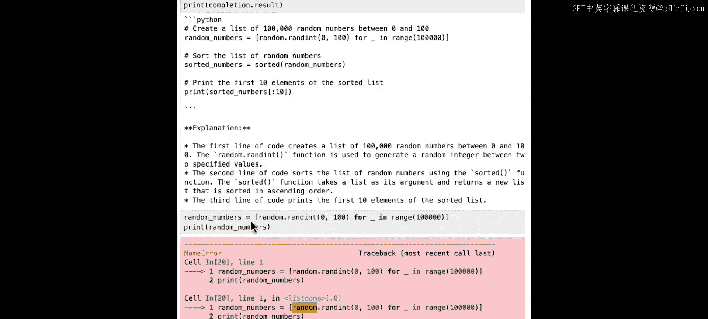

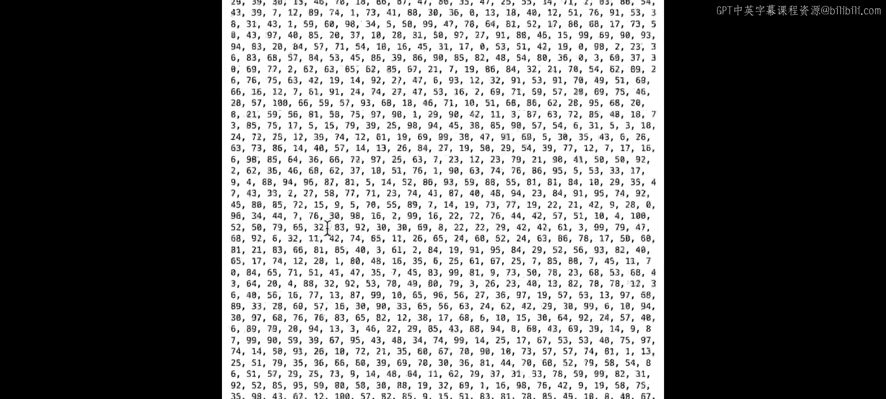

## 尝试更复杂的场景

为了进一步测试，我们提出一个更复杂的问题：
```python
question = “在Python中创建一个非常大的随机数列表，然后编写代码对该列表进行排序。”
```

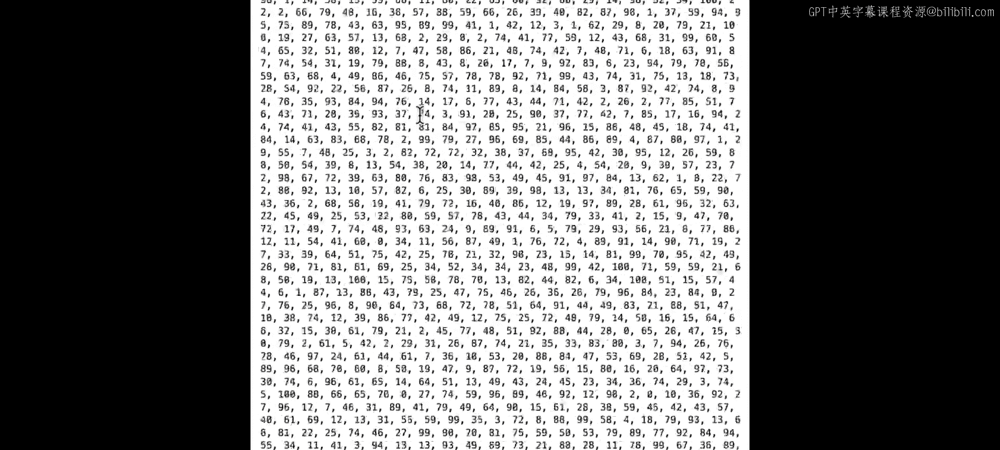

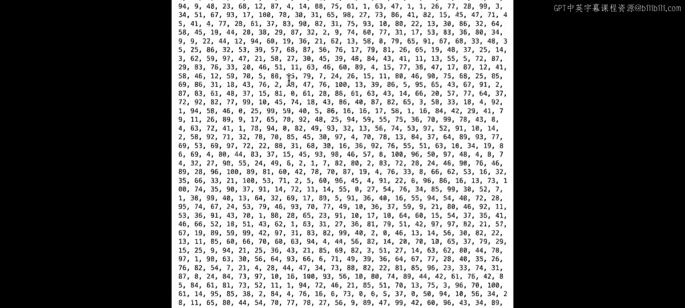

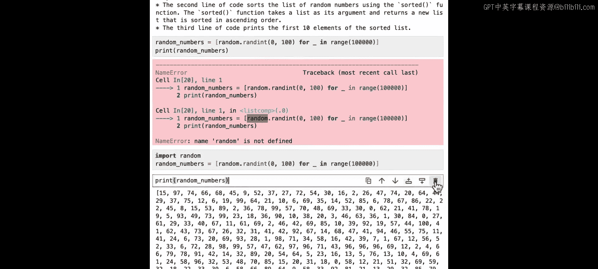

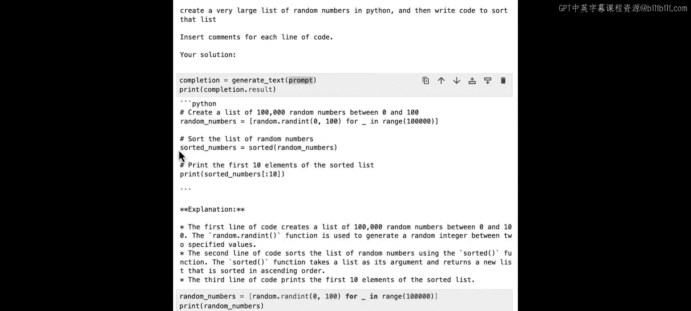

我们保持引导和修饰部分不变，仅更新问题部分，生成新的提示词并发送给模型。

模型生成的代码首先使用 `random.randint` 创建了一个包含10万个随机数的列表，然后使用内置的 `sorted()` 函数对其进行排序，并且每一行都有注释。我们在笔记本中实际运行这段生成的代码，它成功地创建并排序了列表，验证了代码的有效性。

这个例子展示了如何通过一个结构良好的提示模板，让模型生成复杂且可工作的代码，同时提供解释。

## 总结

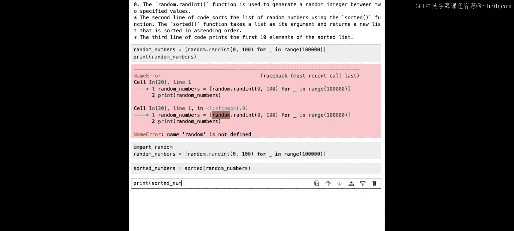


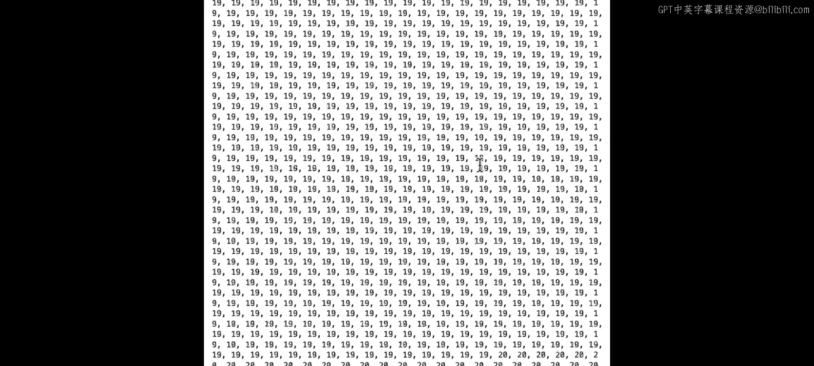

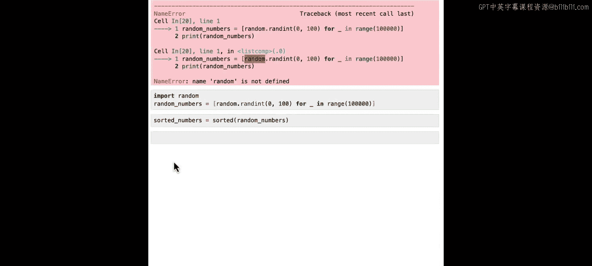

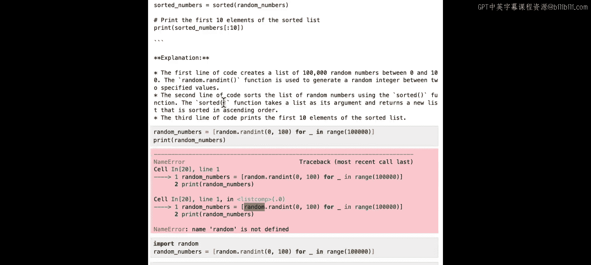

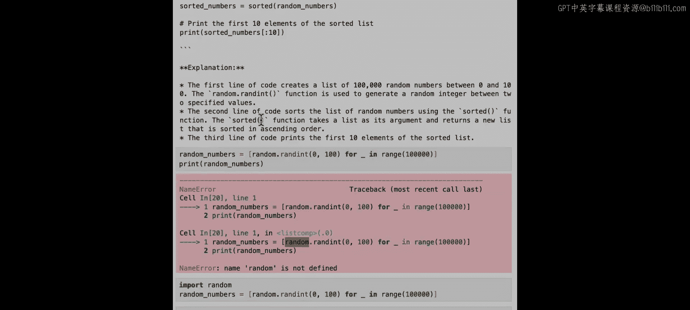

本节课我们一起学习了提示词模板化的方法。我们将提示词分解为**引导**、**问题**和**修饰**三个部分，并通过字符串格式化灵活地构建提示。这种方法使得提示词更结构化、易于维护，并能通过调整特定部分（尤其是更具体的修饰指令）来显著提升模型输出的质量。在下一节课中，我们将探讨如何利用大型语言模型来分析和改进现有的代码。