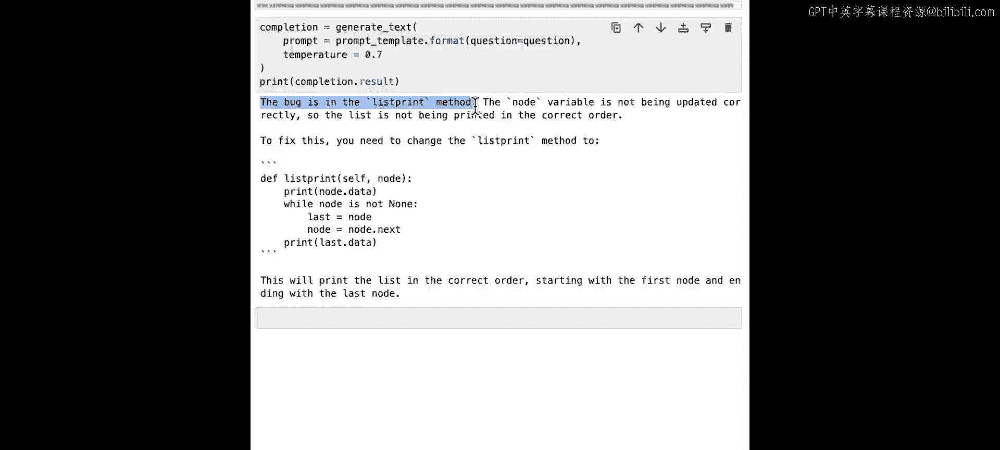

# 004：SC-Laurence_L3_v04.zh - GPT中英字幕课程资源


在本节课中，我们将学习如何将大型语言模型（LLM）用作一个能响应你编码需求的宝贵助手，而不是一个取代程序员的工具。我们将通过一系列具体场景来探索LLM在代码改进、简化、测试、优化和调试等方面的应用。请注意，生成的代码可能存在“幻觉”，因此在投入实际使用前务必彻底测试。同时，由于模型的随机性，你得到的代码可能与示例有所不同。

## 环境设置与准备工作 🛠️

在开始之前，我们需要完成一些环境设置工作。这包括导入必要的库、配置API密钥以及设置一个辅助函数来生成文本。


以下是设置步骤：

1.  **导入API密钥**：首先，我们需要导入PaLM的API密钥。
2.  **导入库并配置**：我们将使用Google的生成式AI库，并将其配置为使用我们的API密钥。
3.  **选择模型**：我们需要找到支持生成文本的模型。在本例中，我们将使用 `models/text-bison-001`。
4.  **设置生成函数**：我们将创建一个包装函数来调用PaLM的文本生成功能，并设置一个确定性的温度值（`temperature=0.0`），以获得更稳定的输出。

以下是核心的代码设置：

```python
import google.generativeai as palm
palm.configure(api_key=‘YOUR_API_KEY’)

models = [m for m in palm.list_models() if ‘generateText’ in m.supported_generation_methods]
model = models[0].name  # 例如 ‘models/text-bison-001’

from google.api_core import retry
@retry.Retry()
def generate_text(prompt, **kwargs):
    return palm.generate_text(prompt=prompt, model=model, **kwargs)

# 设置确定性输出
generate_text = lambda prompt: palm.generate_text(prompt=prompt, model=model, temperature=0.0)
```

现在，我们已经完成了所有准备工作，可以开始探索LLM如何协助编码任务了。

## 改进现有代码 ✨

上一节我们完成了环境设置，本节中我们来看看如何利用LLM改进现有的代码。当你使用一门不太熟悉的语言编写代码时，代码可能“能用”，但未必是最佳实践。LLM不仅能帮你修正代码，还能解释原因，从而帮助你成为更好的程序员。

我们将使用一个简单的提示模板，其中包含“引导语”（priming）和“修饰语”（decorator）。

```python
prompt_template = “””
I don‘t think this code is the best way to do it in Python. Can you help me?

{question}

Please explain in detail what you did to improve it.
“””
```

以下是我们要改进的代码示例：

```python
question = “””
def print_array(array):
    for i in range(len(array)):
        print(array[i])
“””
```

运行生成函数后，LLM可能会建议使用Python的星号（`*`）操作符来解包列表，这是一种更简洁高效的方法。

```python
# LLM建议的改进版本
def print_array(array):
    print(*array)
```

为了探索更多可能性，我们可以修改提示，要求LLM提供多种解决方案。

```python
new_prompt_template = “””
I don‘t think this code is the best way to do it in Python. Can you help me?

{question}

Please explore multiple ways of solving the problem and explain each.
“””
```

运行后，LLM可能会列出多种方法，例如列表推导式、`enumerate`函数和`map`函数，并比较它们的优缺点。

我们甚至可以询问LLM哪种方式最“Pythonic”（最符合Python风格）。

```python
pythonic_prompt_template = “””
I don‘t think this code is the best way to do it in Python. Can you help me?

{question}

Please explore multiple ways of solving the problem and tell me which is the most pythonic.
“””
```

LLM可能会指出，使用列表推导式（`[print(element) for element in array]`）是最Pythonic的，因为它最简洁、可读性最高。通过这种方式，LLM不仅能生成和改进代码，还能提供观点，帮助我们学习最佳实践。

## 简化复杂代码 🧹

在学习了如何改进代码风格后，我们来看看如何简化功能正确但结构复杂的代码。通常，代码审查员会提出简化建议，但如果没有审查员，LLM可以充当这个角色。

我们将以一个Python实现的简单链表类为例。虽然功能正确，但代码不够优雅。

以下是初始的提示模板：

```python
simplify_prompt_template = “””
Can you please simplify this code for a linked list in Python?

{question}

Explain in detail what you did to modify it and why.
“””
```

初始的链表代码如下：

```python
question = “””
class Node:
  def __init__(self, dataval=None):
    self.dataval = dataval
    self.nextval = None

class SLinkedList:
  def __init__(self):
    self.headval = None

list1 = SLinkedList()
list1.headval = Node(“Mon”)
e2 = Node(“Tue”)
e3 = Node(“Wed”)
list1.headval.nextval = e2
e2.nextval = e3
“””
```

LLM在简化后，可能会引入一个辅助函数来从列表创建链表，使代码更清晰、更易于维护。

为了获得更详细的输出，我们可以强化提示，要求LLM扮演专家角色并为每行代码添加注释。

```python
expert_prompt_template = “””
You are an expert in Pythonic code. Can you please simplify this code for a linked list in Python?

{question}

Please comment each line in detail and explain in detail what you did to modify it and why.
“””
```

这样，LLM生成的代码会包含详细的注释和解释，例如添加`add_to_head`和`print_list`等方法。虽然生成的方法名可能不够准确（如`add_to_head`），但整体上代码结构得到了显著改善，类似于人类代码审查员给出的建议。这提醒我们，对LLM的输出仍需保持审慎，但它的确能提供巨大的帮助。

## 为代码生成测试用例 🧪

代码简化之后，确保其健壮性至关重要。好的自动化测试是第一步，而创建单元测试可能很耗时。LLM可以帮助我们快速生成测试用例。

我们将为上一节中简化后的链表代码生成测试用例。

以下是生成测试用例的提示模板：

```python
test_prompt_template = “””
Can you please create test cases in code for this Python code?

{question}

Explain in detail what you‘re doing and what these test cases are designed to achieve.
“””
```

我们将把简化后的链表代码作为问题传入。LLM可能会生成一个使用Python `unittest`框架的测试类，包含测试链表创建、节点插入和节点删除等方法。

```python
# LLM可能生成的测试框架示例
import unittest

class TestSLinkedList(unittest.TestCase):
    def test_creation(self):
        # 测试链表创建
        pass
    def test_insertion(self):
        # 测试节点插入
        pass
    def test_deletion(self):
        # 测试节点删除（即使原代码没有此功能，LLM也可能建议）
        pass
```

有趣的是，LLM生成的测试可能包含原代码中没有的功能（如删除节点），这可以启发你完善原始代码。因此，使用LLM生成测试不仅是为了自动化，更是为了发现你可能遗漏的边界情况和功能需求，激发你的编程灵感。

## 提高代码效率 ⚡

除了简化代码和生成测试，LLM还能从一个中立的视角分析代码，发现效率问题。例如，一个使用递归实现的二分查找树算法，可能没有意识到递归会消耗较多内存。

我们将使用一个递归实现的二分查找算法，并请LLM优化其效率。

提示模板如下：

```python
efficiency_prompt_template = “””
Can you please make this code more efficient?

{question}

Explain in detail what you‘re doing, what you‘ve changed and why.
“””
```

递归二分查找的示例代码：

```python
question = “””
def binary_search(arr, x):
    if len(arr) == 0:
        return -1
    mid = len(arr) // 2
    if arr[mid] == x:
        return mid
    elif arr[mid] < x:
        return binary_search(arr[mid+1:], x)
    else:
        return binary_search(arr[:mid], x)
“””
```

LLM可能会建议使用Python内置的`bisect`模块，它提供了高效的二分查找算法。

```python
# LLM建议的优化版本（需注意“幻觉”）
import bisect

def binary_search(arr, x):
    index = bisect.bisect_left(arr, x)
    if index != len(arr) and arr[index] == x:
        return index
    else:
        return -1
```

**这是一个需要警惕“幻觉”的典型例子**。LLM的解释可能说“使用`bisect`函数查找数组中间元素的索引”，这并不准确。实际上，`bisect`执行的是完整的二分查找。此外，它可能提到使用了`break`语句，而生成的代码中并没有。因此，虽然LLM给出了更高效的代码（直接使用库函数），但我们必须仔细验证其解释和代码逻辑，不能盲目相信。

## 调试与查找Bug 🐛

最后，我们探索LLM在调试方面的能力。有些Bug不会导致程序崩溃，只在特定情况下出现，难以发现。LLM可以分析代码，找出潜在问题。

我们以一个从在线教程获取的双向链表代码为例，并故意引入一个Bug（在打印函数中未处理空节点，可能导致空指针错误）。

调试提示模板：

```python
debug_prompt_template = “””
Can you please help me to debug this code?

{question}

Explain in detail what you found and why you think it was a bug.
“””
```

有Bug的双向链表代码示例：

```python
question = “””
# … (包含故意引入的打印空节点Bug的双向链表代码) …
“””
```

LLM很可能会准确地指出Bug位于`list_print`函数中，因为它在打印节点数据前没有检查节点是否为`None`。然而，它提供的修复代码可能不完全正确（例如，检查放在了错误的位置）。这正是一个绝佳的学习机会：我们可以利用LLM的分析来理解问题所在，然后自己动手写出正确的修复代码，而不是直接复制粘贴。

此外，我们可以通过调整生成文本时的`temperature`参数来观察输出的变化。较低的`temperature`（如0.0）使输出更确定，较高的值（如默认的0.7）会引入更多随机性，有时可能帮助我们从不同角度理解问题。

## 总结 📝

本节课中，我们一起探索了大型语言模型作为配对编程助手在多个场景下的应用：

1.  **改进代码**：LLM可以将代码变得更符合语言规范（如Pythonic），并解释原因。
2.  **简化代码**：LLM可以重构复杂代码，使其更清晰、更易于维护。
3.  **生成测试**：LLM能快速创建单元测试用例，甚至启发你发现未实现的功能。
4.  **优化效率**：LLM能从算法角度提出改进建议，但需警惕其解释可能存在的“幻觉”。
5.  **调试找Bug**：LLM可以分析代码，定位潜在错误，但最终的修复需要你结合理解来完成。



关键在于，LLM是一个强大的灵感来源和辅助工具，它能加速开发流程并提升代码质量，但并不能替代开发者自身的思考、验证和决策。希望这些示例能启发你思考如何在自己的项目中利用LLM。