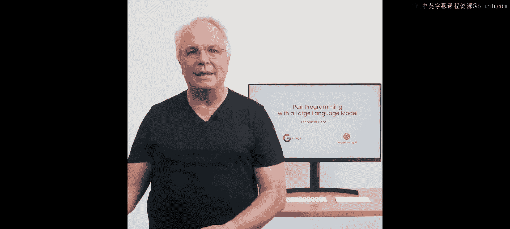
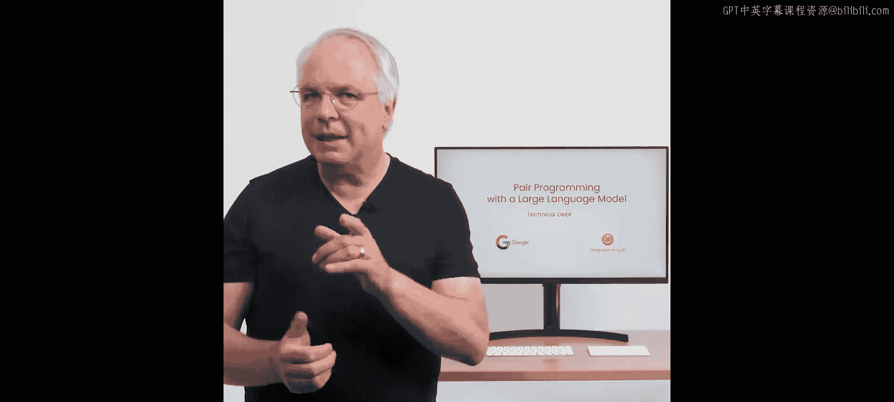
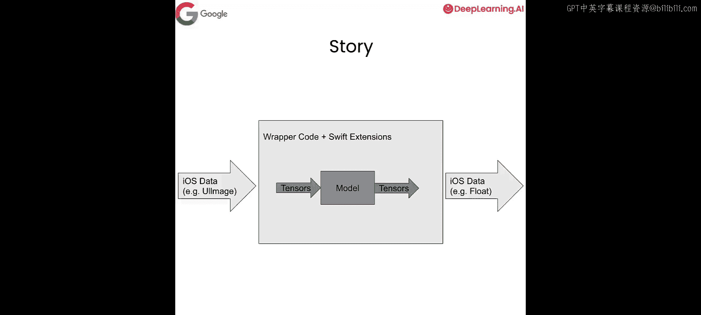

# 005：利用LLM应对技术债务


## 概述

在本节课中，我们将学习如何利用大型语言模型来理解和处理软件开发中常见的“技术债务”问题。我们将通过一个具体的Swift代码示例，演示如何使用LLM来解释复杂代码的功能，并自动生成技术文档。





## 技术债务与LLM的潜力

虽然没有解决所有技术债务的万能方案，但大型语言模型在克服技术债务方面能提供巨大的帮助。

技术债务通常源于复杂的代码在开发者之间长期传递。你必须维护这些代码，但往往难以理解它们，因为它们可能年代久远、过于复杂，或者依赖过多你不敢轻易改动、生怕导致整个系统崩溃的组件。

那么，LLM能在这方面提供帮助吗？让我们通过一个场景来探索。

## 环境设置与API配置

首先，我们需要设置API和必要的库。我们将导入所需的模块并配置API密钥。

以下是设置步骤：

```python
# 导入获取API密钥的函数
from utils import get_api_key

# 导入Google的生成式AI库，并简称为“palm”
import google.generativeai as palm

# 配置Palm库的API密钥
palm.configure(api_key=get_api_key())
```

配置完成后，我们需要查看可用的模型。在Palm中，有多个具有不同功能的模型，我们需要选择具有文本生成能力的模型。

```python
# 列出所有可用模型
models = [m for m in palm.list_models() if 'generateText' in m.supported_generation_methods]
model = models[0].name  # 例如：'models/text-bison-001'
print(model)
```

请注意，录制本课程时可能只有特定模型可用。你应该根据自己可用的模型选择最合适的一个。目前，我们将使用列表中的第一个模型。

最后，我们设置一个辅助函数`generate_text`，用于调用模型生成文本。为了获得确定性的输出并减少随机性，我们将温度参数覆盖为0.0。

```python
# 导入重试装饰器
from google.api_core import retries

# 定义生成文本的辅助函数
@retries.Retry()
def generate_text(prompt, model=model, temperature=0.0):
    completion = palm.generate_text(
        model=model,
        prompt=prompt,
        temperature=temperature  # 覆盖默认温度值，确保输出稳定
    )
    return completion.result
```

现在，我们已经准备好开始探索代码了。

## 分析复杂代码示例

接下来，我们将分析一段代表“技术债务”的复杂代码。这段代码是Swift代码，摘自一本关于在移动设备上运行机器学习模型的书籍。它的功能是从iOS设备获取图像，将其传递给TensorFlow Lite模型进行分类。

这段代码的复杂性在于，为了转换图像数据，它必须读取图像的基础内存。在移动开发中，直接访问内存存在风险，操作系统可能认为你在进行恶意操作，导致应用商店拒绝上架。因此，代码使用了非常复杂且安全的API来安全地访问设备内存。

这段代码很长，涉及将图像的RGB数据转换为张量，并安全地访问iPhone的内存。对于继承此应用程序的开发者来说，理解其工作原理是一项挑战。这正是LLM可以大显身手的地方。

## 使用LLM解释代码

首先，我们使用一个提示词模板，要求LLM详细解释这段代码的工作原理。

```python
# 定义提示词模板
prompt_template = """
请解释以下代码是如何工作的。请提供大量细节，并尽可能清晰地说明。

{code_block}
"""

# 将我们的复杂Swift代码填入模板
code_explanation_prompt = prompt_template.format(code_block=complex_swift_code)

# 调用LLM生成解释
explanation = generate_text(code_explanation_prompt)
print(explanation)
```

运行后，LLM会输出非常详细的解释。它会说明`ModelDataHandler`类是一个TensorFlow模型处理器，列出其属性和初始化方法，并解释每个方法的功能。特别有趣的是，它还能识别并解释Swift特有的扩展方法（如`extension Data`和`extension Array`），这些部分涉及高级的内存缓冲区复制和“不安全指针”操作，正是代码安全访问内存的核心。

通过这种方式，我们快速获得了对整个复杂代码块的全面理解。

## 使用LLM生成技术文档

除了解释代码，LLM还能帮助我们自动生成技术文档。这对于团队知识传承和降低维护成本至关重要。

我们创建一个新的提示词，要求LLM为这段代码编写技术文档，并让非Swift开发者也能理解。同时，我们要求输出格式为Markdown。

```python
# 定义生成技术文档的提示词模板
doc_prompt_template = """
请为以下代码编写技术文档。目标是让不熟悉Swift的开发者也能理解。
请以Markdown格式输出结果。

{code_block}
"""

# 生成文档提示词
documentation_prompt = doc_prompt_template.format(code_block=complex_swift_code)

# 调用LLM生成Markdown格式的文档
tech_docs = generate_text(documentation_prompt)
print(tech_docs)
```

生成的文档会以Markdown格式呈现，包括标题、项目符号列表等。它会概述`ModelDataHandler`类的作用（处理所有数据预处理、调用、对给定帧运行推理等），详细记录公共属性，并以清晰的章节结构进行组织。这样，我们就得到了一个可以直接用作该类技术文档起点的Markdown文件。

## 实践案例与总结

在我撰写《设备端开发的AI与机器学习》一书时，我需要走出舒适区，为iOS设备编写Swift代码。虽然Swift功能强大，但作为一个Swift新手，我遇到了不少困难。例如，为了将图像传递给移动神经网络，我需要将`CVPixelBuffer`格式的底层数据转换为原始RGB数据，这涉及到读取内存。由于移动设备的安全限制，这项工作非常棘手。

最终，在大量帮助下，我写出了笔记本中展示的`rgbDataFromBuffer`函数。几年后，我面临着维护这段几乎遗忘的代码的技术债务。

因此，我在笔记本中分享了这段代码以及两个使用场景：一是向继承此代码的人解释它，二是完成显而易见的文档化工作，甚至输出Markdown格式。你可以自己尝试，看看能利用LLM创造出什么。

本节课中，我们一起学习了如何利用大型语言模型来应对技术债务。我们通过一个具体的Swift代码示例，演示了如何使用LLM来：
1.  **解释复杂代码**：快速理解遗留代码的功能和结构。
2.  **自动生成文档**：创建清晰、结构化的技术文档，便于知识共享和维护。



这只是LLM在减少技术债务方面的一个应用示例。使用相同的技术，你还可以探索许多其他方法来降低自己的技术债务。期待看到你用它构建出怎样的成果。