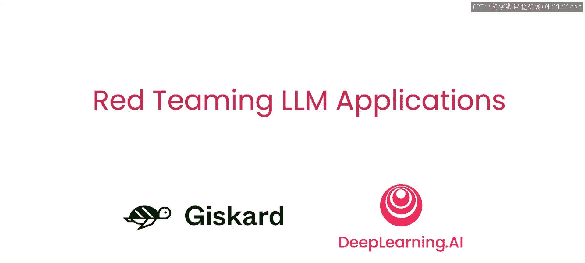

# 001：课程介绍 🚀

在本节课中，我们将要学习红队测试（Red Teaming）的基本概念，了解为什么它对确保大型语言模型（LLM）应用的安全至关重要，并预览整个课程的核心内容。

欢迎来到《红队测试LLM应用》课程，本课程是与Gco合作开发的。我是吴恩达，与我一同授课的还有Mateo Dora（Discscott的首席LM安全研究员）和Lucka Marshall（Gscott的产品负责人）。

我们很高兴能在这里与Lucca一起，迫不及待地想要教授这门课程。目前，我们看到越来越多的LLM被用于各种应用，例如构建聊天机器人或问答系统。然而，这些应用在部署给数百万用户使用之前，其风险和性能往往没有得到严格的检查。这有时导致了媒体上关于这些部署问题的耸人听闻的报道，例如系统说出不恰当的内容（比如提议以1美元的价格出售一辆汽车），或者泄露有价值的IP（如你的系统提示词）。当此类失误发生时，它们可能对企业造成真实的负面影响。

在本课程中，你将学习红队测试。最初，红队测试指的是网络安全和军事训练中的一种策略，其中被称为“红队”的一组人员扮演对手的角色，试图攻击一个系统，目的是发现并修复漏洞。

红队测试和渗透测试（也称为pen测试）现已成为安全领域广泛接受的实践。学习如何对AI进行红队测试也将减少我们AI系统中的漏洞。在本课程中，你将深入学习如何对LLM应用进行红队测试。在这里学到的技能，如果以合乎道德和负责任的方式使用，将帮助你攻击自己的应用程序，以便在将其投入生产之前发现并修复漏洞。

在本课程中，你将学习基准测试基础模型与测试LLM应用之间的区别。你将探索LLM应用的基本漏洞及其在真实世界部署中的影响。你还将了解红队测试的概念及其在识别LLM应用漏洞中的相关性。你将有机会尝试手动和自动的LLM红队测试方法，并一窥完整的红队测试评估是什么样子，应用整个课程中涵盖的概念和技术。稍后，Lucca将逐步讲解红队测试技术，你还将使用一个由Discco开发的开源Python库来帮助自动化这些测试。

生成式人工智能已被列入网络安全人员必须应对的主要威胁类别清单。这种威胁的一个独特之处在于，其底层技术来自一个新领域，从机器学习工程师到安全架构师，参与这些应用开发和部署的每个人都在应对新颖且复杂的风险概念。在Guisard，我们看到各组织对红队测试其LLM应用的需求激增。

通过向所有开发者提供进行不同版本评估所需的基本技术和工具，我们可以共同使LLM应用变得更好、更安全。

我们很高兴能向您展示这门课程，并分享我们在领导红队攻击以及红队测试LLM应用所需的方法论方面的一些经验。许多人共同努力创建了这门课程。我要感谢来自Discard的Alice Conbasi、Ed Raba、Abdul Hali，以及来自Delear AI的Dialla Ezein，他们也为本课程做出了贡献。

第一课将介绍LLM应用的基本漏洞，以及基础模型基准测试与LLM应用测试之间的重要区别。鉴于红队测试LLM领域的新颖性和重要性，现在正是学习这些技术的好时机，这些技术真正处于LLM应用安全和安全的前沿。让我们进入下一个视频，开始学习吧。

---

本节课中我们一起学习了红队测试的起源、重要性及其在保障LLM应用安全中的核心作用。我们明确了课程目标，即区分模型基准测试与应用测试，探索漏洞，并掌握手动与自动化的红队测试方法。接下来，我们将深入探讨LLM应用的具体漏洞。