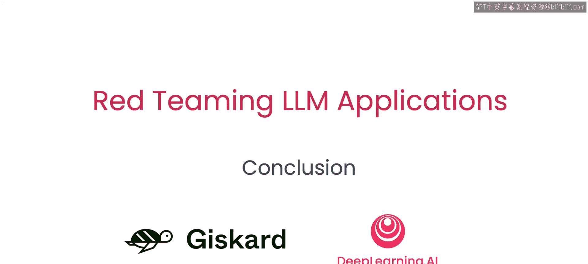
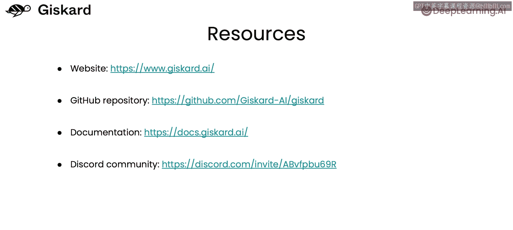

# 007：总结与后续步骤 🎯

在本节课中，我们将对红队测试LLM应用的核心内容进行总结，并为你指明后续自主探索的方向与资源。



## 课程总结

上一节我们介绍了红队测试的具体实践方法，本节中我们来对整个课程进行回顾与展望。

你已经掌握了开始自主探索红队测试所需的核心知识与技能。红队测试是一个持续的过程，旨在通过模拟对抗性攻击来发现和修复大型语言模型应用中的漏洞与风险。

## 后续行动指南

以下是你可以立即开始的后续步骤：

*   **自主探索**：利用所学知识，对你自己的或开源的LLM应用项目进行红队测试实践。
*   **贡献与尝试**：如果你希望参与贡献或尝试Jis cards的开源红队测试工具库。
*   **访问资源**：请前往GitHub上的Jis card代码仓库。我们期待看到你构建的成果。



**代码示例：查找资源**
```bash
# 你可以在GitHub等平台搜索相关开源项目
搜索关键词：“Jis card red teaming LLM”
```

本节课中我们一起学习了红队测试的完整流程与重要性，并获得了继续深入实践的路径。记住，持续的安全测试是构建健壮、可靠LLM应用的关键。