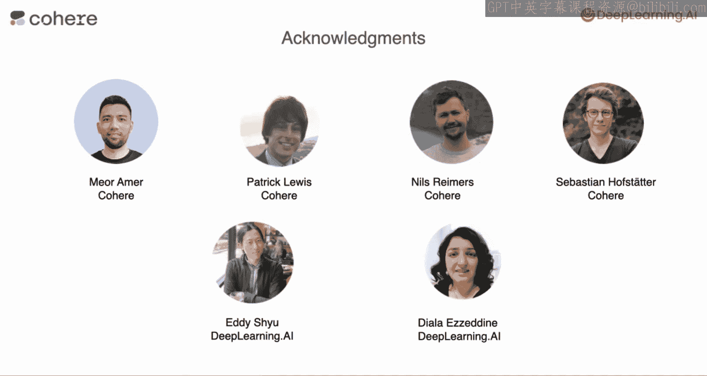

# 001：课程介绍 🎯

在本节课中，我们将要学习如何将大型语言模型（LLMs）集成到应用程序的信息搜索功能中。课程由Cohere公司合作推出，旨在为开发者提供构建强大LLM应用所需的工具。

欢迎来到与Cohere合作推出的“大型语言模型与语义搜索”短期课程。在本课程中，你将学习如何将大型语言模型（LLMs）整合到你自己应用程序的信息搜索功能中。

例如，假设你运营一个拥有大量文章的网站（比如类似维基百科的网站），或者一个拥有大量电子商务产品的网站。即使在LLMs出现之前，使用关键词搜索来让用户搜索网站内容也很常见。但有了LLMs，你现在可以实现更多功能。首先，你可以让用户提问，然后你的系统会搜索网站或数据库来回答问题。其次，LLM还能使检索结果与用户查询的含义或语义更加相关。

我来介绍一下本课程的讲师：Jay Alammar和Luis Serrano。Jay和Luis都是经验丰富的机器学习工程师和教育工作者。我钦佩Jay很久了，他创作了一些高度参考价值的图解来解释Transformer网络。他也是《动手学大型语言模型》一书的合著者。Luis是《机器学习图解》一书的作者，他也在Cohere教授深度学习与AI机器学习课程。Jay和Luis，以及Mia Amir，还共同运营着一个名为“LM”的网站，在教授开发者使用LLMs方面拥有丰富经验。所以当他们同意教授这门关于LLMs语义搜索的课程时，我感到非常激动。

谢谢Andrew。能和你一起教授这门课程是莫大的荣幸。你的机器学习课程在8年前将我引入了机器学习领域，并且一直激励着我继续分享所学知识。正如你提到的，Luis和我在Cohere工作。因此，我们有机会为行业内的其他人提供建议，指导他们如何为各种用例使用和部署大型语言模型。我们很高兴能开设这门课程，为开发者提供构建强大LLM应用所需的工具，并且我们很乐意分享我们在该领域获得的经验。

谢谢Jay和Luis，很高兴你们能加入我们。

本课程包含以下主题。

首先，你将学习如何使用基本的关键词搜索，这也被称为词汇搜索。在大型语言模型出现之前，许多搜索系统都依赖这种技术。它通过查找与查询词匹配度最高的文档来实现。

接下来，你将学习如何通过一种名为“重排序”的方法来增强这种关键词搜索。顾名思义，这种方法会根据结果与查询的相关性对响应进行重新排序。

之后，你将学习一种更高级的搜索方法，它极大地改进了关键词搜索的结果，因为它试图利用文本的实际含义或语义来进行搜索。这种方法被称为“密集检索”。它使用自然语言处理中一个非常强大的工具——嵌入。嵌入是一种将一段文本与一个数字向量关联起来的方式。

语义搜索包括在嵌入空间中查找与查询最接近的文档。与其他模型一样，搜索算法也需要进行适当的评估。你也会学习进行有效评估的方法。

最后，由于LLMs可用于生成答案，你还将学习如何将搜索结果输入LLM，并让它基于这些结果生成答案。结合嵌入的密集检索极大地提升了LLM的问答能力，因为它首先搜索并检索相关文档，然后根据检索到的信息生成答案。

许多人为此课程做出了贡献。我们感谢Cohere的Mia Amir、Patrick Lewis、Nils Reimers和Sebastian Hofstätter，以及DeepLearning.AI团队的Eddie Shao和Dina Elenbogen的辛勤工作。

在第一课中，你将看到在大型语言模型出现之前是如何进行搜索的。

从那里开始，我们将向你展示如何使用LLMs（包括嵌入和重排序等工具）来改进搜索。

这听起来很棒。那么，让我们开始深入探索，进入下一个视频。

---

本节课中我们一起学习了“大型语言模型与语义搜索”课程的概述和目标。我们了解了课程将涵盖从传统关键词搜索到利用嵌入进行语义搜索的进阶方法，并介绍了如何结合LLMs生成答案。课程由经验丰富的讲师团队设计，旨在为开发者提供实用的工具和知识。接下来，我们将从基础的关键词搜索开始我们的学习之旅。