# 002：关键词搜索

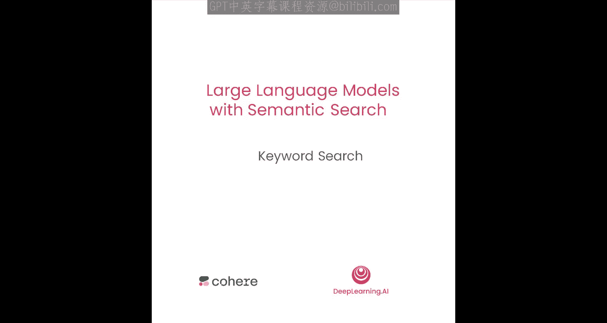

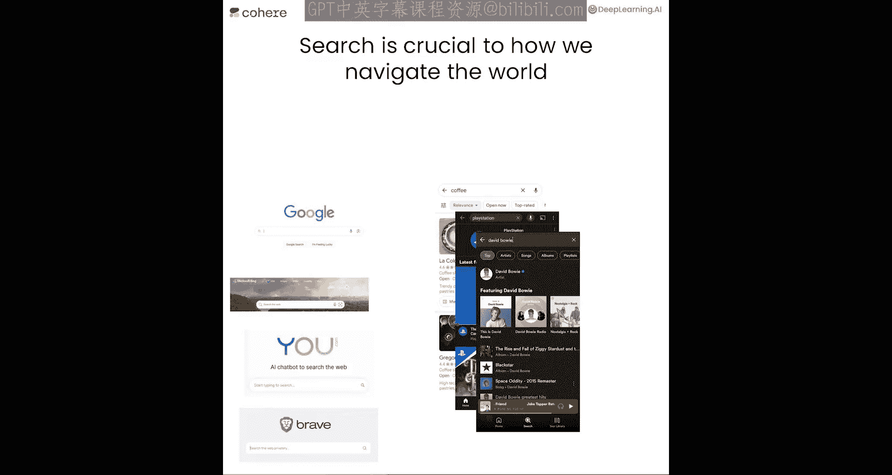

## 概述

在本节课中，我们将学习如何使用关键词搜索技术，基于数据库来回答问题。搜索是我们与世界交互的核心方式，无论是搜索引擎还是应用内搜索。关键词搜索是构建搜索系统最常用的方法。

## 什么是关键词搜索

上一节我们介绍了搜索的重要性。本节中，我们来看看关键词搜索的基本原理。

关键词搜索通过比较查询语句与文档之间共同词汇的数量来工作。例如，对于查询“what color is the grass?”，系统会计算它与文档库中每个句子共享的单词数，并返回共享单词最多的文档作为结果。

## 连接数据库与准备工作

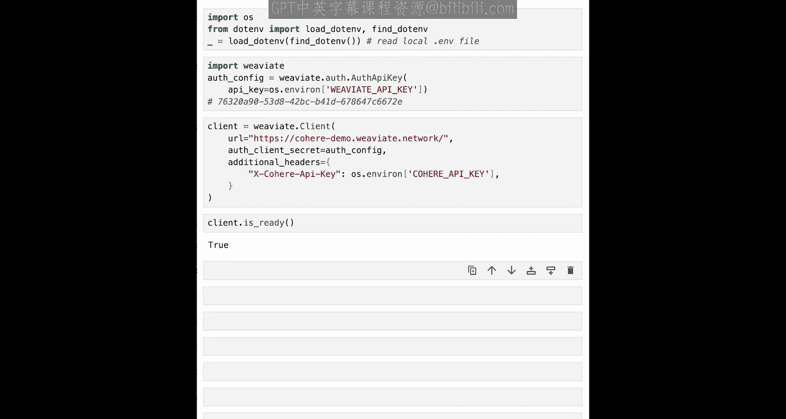

在开始编写代码之前，我们需要连接到一个数据库。这里我们将使用Weaviate，一个开源的、支持关键词搜索和向量搜索的数据库。

以下是设置步骤：

1.  **安装客户端**：如果你在自己的环境中运行代码，需要安装Weaviate客户端。
    ```python
    # 安装Weaviate客户端（在课堂环境中无需运行）
    # !pip install weaviate-client
    ```

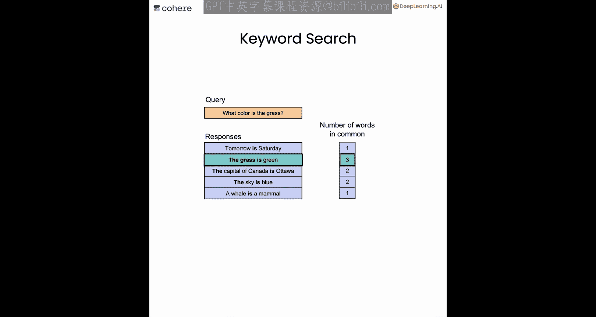

2.  **加载API密钥**：加载访问演示数据库所需的密钥。
    ```python
    import os
    # 加载API密钥（示例，实际使用时请替换）
    os.environ['WEAVIATE_API_KEY'] = 'your-public-demo-key-here'
    ```

3.  **导入库并连接客户端**：导入Weaviate并连接到包含1000万条维基百科记录的公共数据库。
    ```python
    import weaviate

    # 配置认证
    auth_config = weaviate.AuthApiKey(api_key=os.environ['WEAVIATE_API_KEY'])
    client = weaviate.Client(
        url="https://your-weaviate-cluster-url",
        auth_client_secret=auth_config
    )

    # 检查连接是否成功
    print(client.is_ready())
    ```

## 构建关键词搜索函数

现在我们已经连接到数据库，接下来构建一个执行关键词搜索的函数。

我们将使用BM25算法，这是一种常用的关键词（词汇）搜索算法。它根据一个特定的公式对文档进行评分，该公式主要考察查询与每个文档之间共享词汇的数量。

以下是`keyword_search`函数的定义：

```python
def keyword_search(query,
                   results_lang='en',
                   properties=["title", "url", "text"],
                   num_results=3):
    """
    在Weaviate数据库上执行关键词搜索。

    参数:
        query (str): 用户的搜索查询。
        results_lang (str): 结果的语言代码（例如，‘en’代表英文）。
        properties (list): 希望返回的文档属性列表。
        num_results (int): 返回的结果数量。

    返回:
        dict: 包含搜索结果的响应。
    """
    response = (
        client.query
        .get("Articles", properties) # “Articles”是数据库中的集合名称
        .with_bm25(query=query)      # 使用BM25算法进行关键词搜索
        .with_where({
            "path": ["lang"],
            "operator": "Equal",
            "valueString": results_lang
        })                           # 过滤指定语言的文档
        .with_limit(num_results)     # 限制返回结果数量
        .do()
    )
    return response
```

## 执行搜索并查看结果

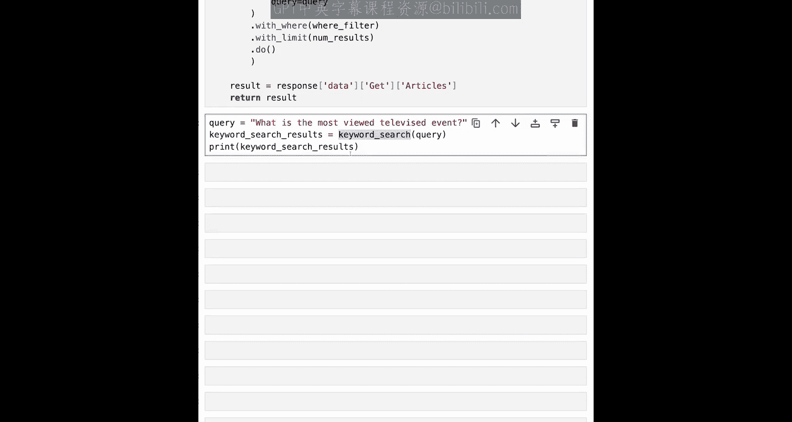

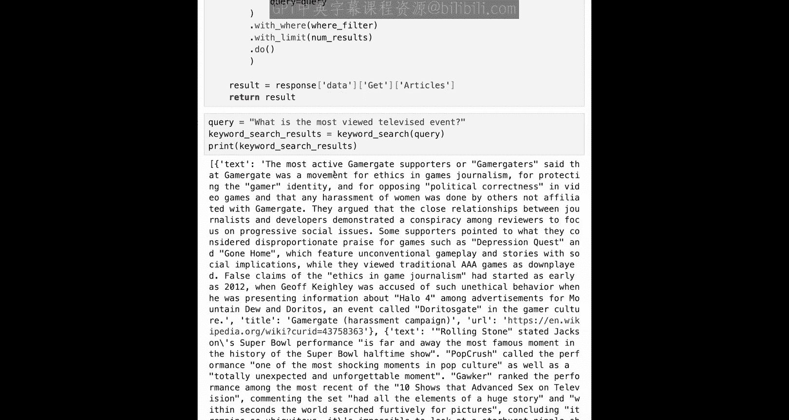

让我们使用上面定义的函数来搜索“收视率最高的电视节目是什么”。

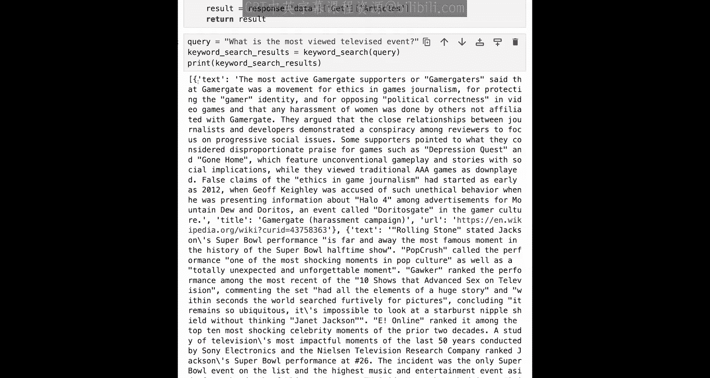

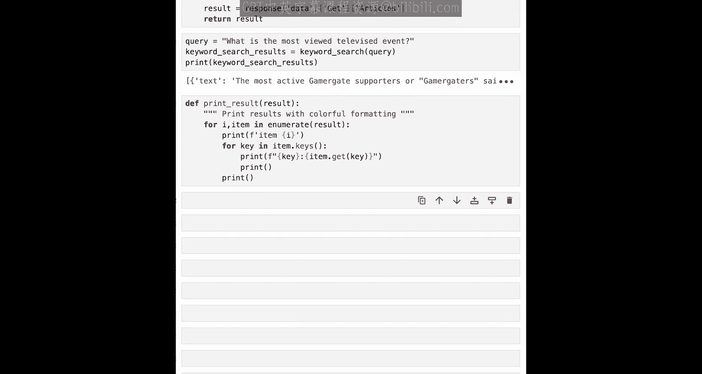

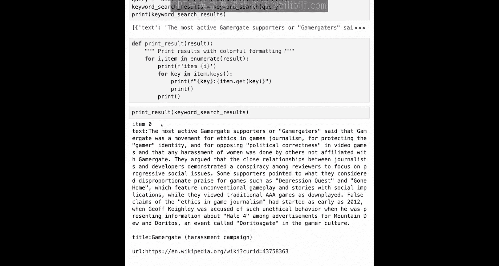

```python
# 执行搜索
query = "what is the most viewed televised event"
search_results = keyword_search(query)

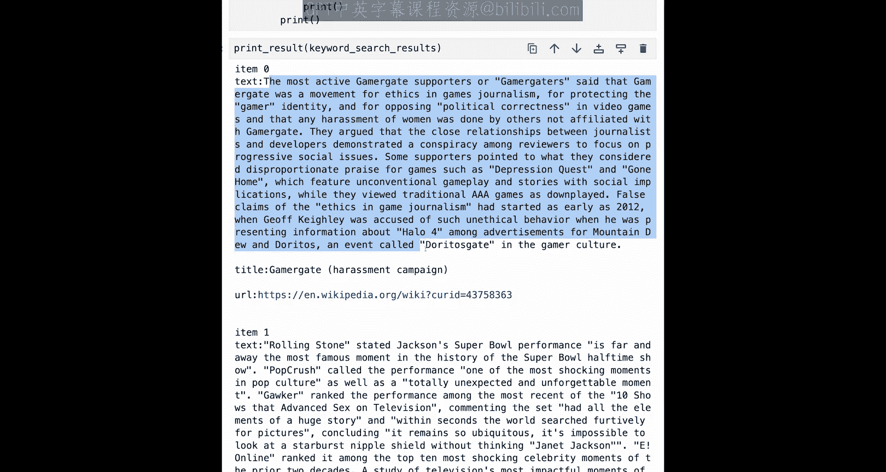

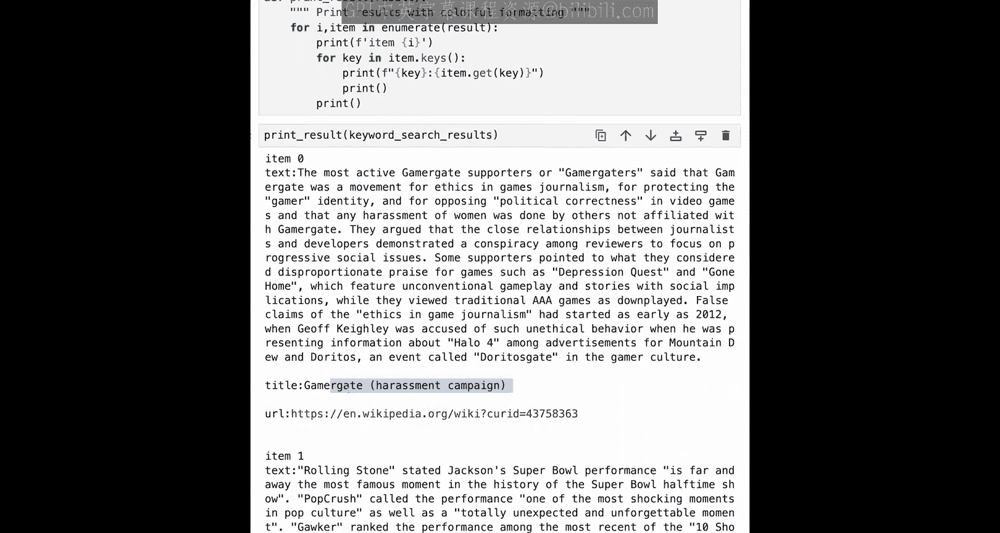

# 定义一个函数来美观地打印结果
def print_results(results):
    for i, item in enumerate(results['data']['Get']['Articles']):
        print(f"\n=== 结果 {i+1} ===")
        print(f"标题: {item['title']}")
        print(f"URL: {item['url']}")
        print(f"内容摘要: {item['text'][:200]}...") # 只打印前200个字符

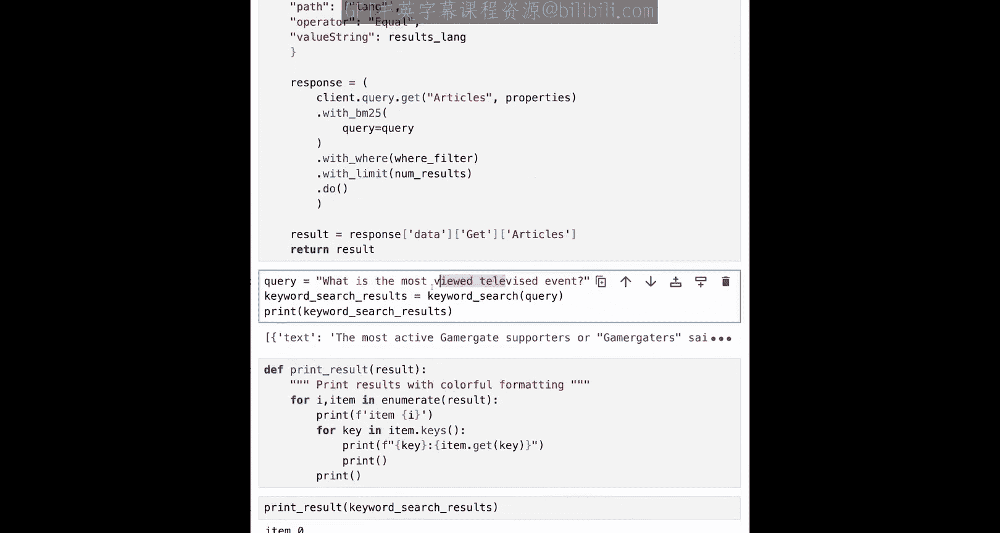

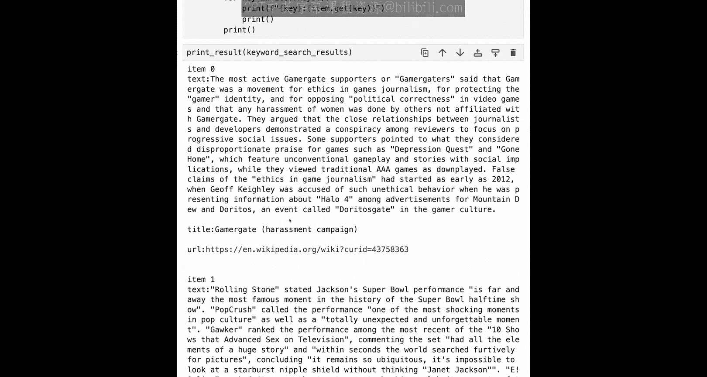

# 打印结果
print_results(search_results)
```

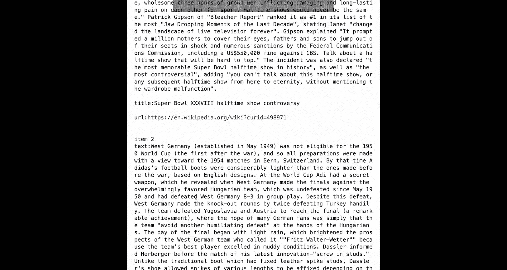

运行上述代码后，你可能会看到类似以下的结果。第一个结果可能因为包含“event”等关键词而被检索到，但相关性不高。第二个关于“超级碗”的结果则更相关。

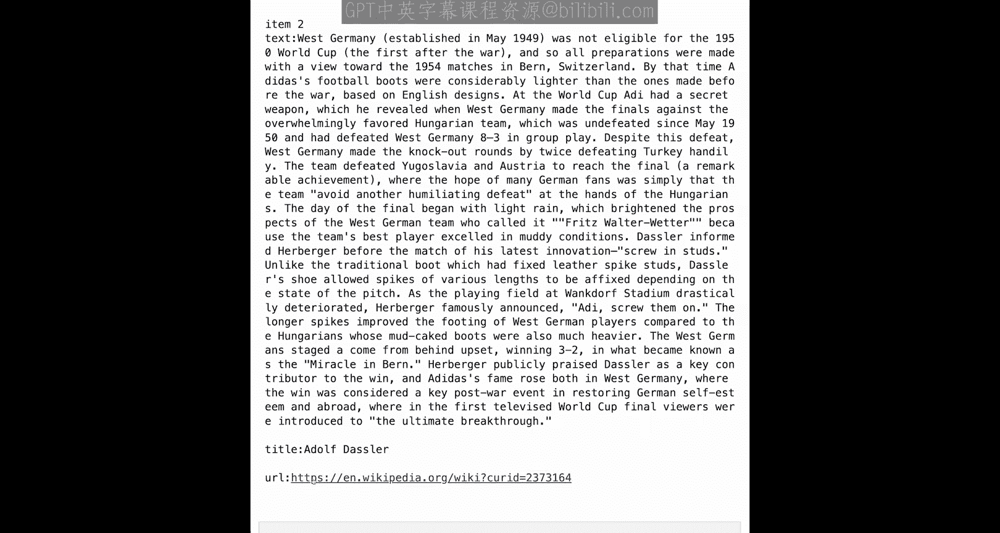

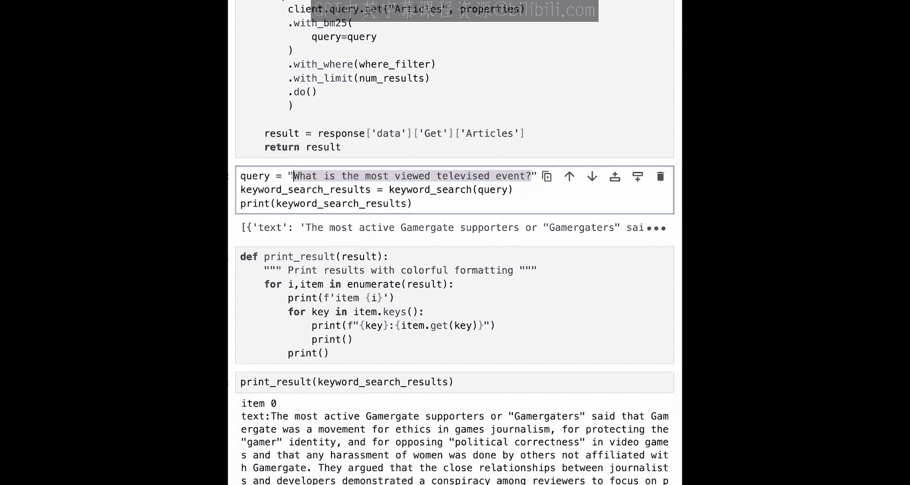

## 尝试多语言搜索

我们的数据库支持多种语言。你可以通过修改`results_lang`参数来搜索其他语言的文档。

以下是支持的语言代码示例：
*   `en` - 英语
*   `de` - 德语
*   `fr` - 法语
*   `es` - 西班牙语
*   `zh` - 中文

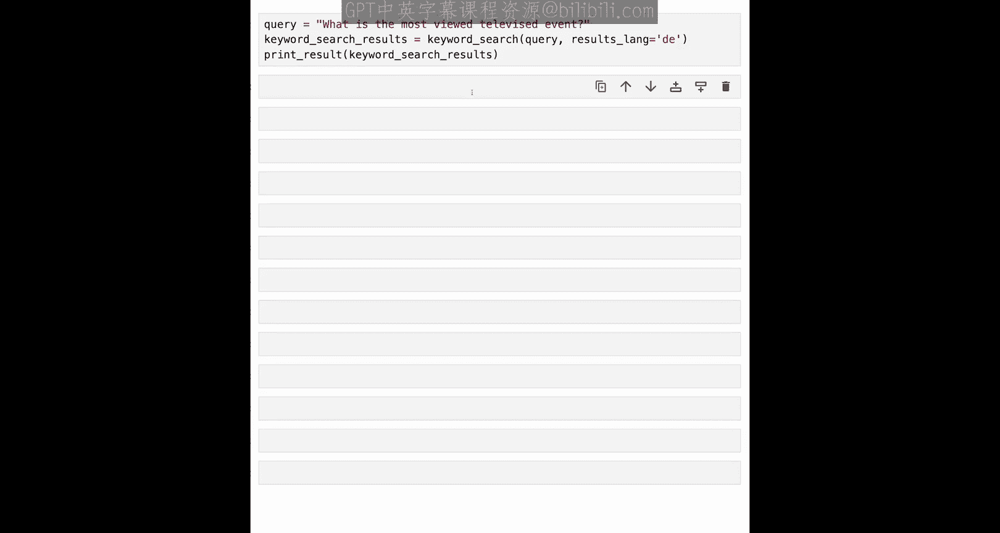

例如，用德语进行搜索：

```python
german_results = keyword_search("was ist das meistgesehene Fernsehereignis", results_lang='de')
print_results(german_results)
```

## 关键词搜索的系统架构与局限性

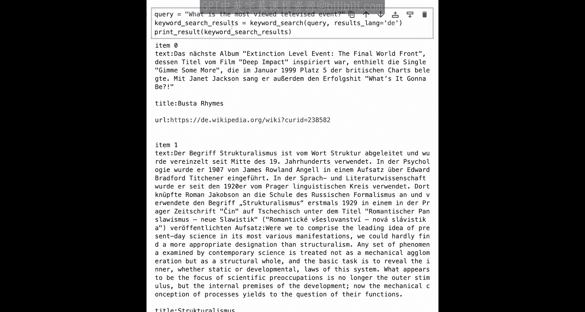

现在，让我们从更高层面回顾搜索系统的构成。

一个典型的搜索系统包含以下主要组件：
1.  **查询**：用户输入的问题。
2.  **搜索系统**：处理查询的核心。
3.  **文档库**：系统预先处理并索引的文档集合。
4.  **结果列表**：系统返回的、按相关性排序的文档。

更仔细地看，搜索系统通常分为两个阶段：
*   **检索阶段**：使用如BM25等算法，快速从海量文档中找出可能与查询相关的候选文档子集。为了提高速度，这通常依赖于**倒排索引**数据结构。
*   **重排序阶段**：对第一阶段的候选结果进行更精细的排序，可能引入除文本匹配外的其他信号（如点击率、权威性等）。

然而，关键词搜索有其局限性。它严重依赖字面匹配。例如，对于查询“头部一侧剧烈疼痛”，如果一个文档使用“sharp temple headache”来描述，尽管语义相同，但由于没有共享关键词，BM25可能无法检索到该文档。

## 总结与展望

本节课中，我们一起学习了关键词搜索的基础知识。我们了解了其工作原理，使用Weaviate数据库和BM25算法实现了关键词搜索，并探讨了其多语言能力及核心架构。

我们也看到了关键词搜索的局限：它无法理解语义，当查询和文档用词不同但意思相同时，可能会失效。

这正是语言模型可以发挥作用的地方。在接下来的课程中，我们将探讨：
*   **嵌入**：如何使用语言模型将文本转换为向量（嵌入），从而在检索阶段实现语义搜索。
*   **重排序**：如何利用语言模型对初步检索结果进行更智能的重新排序。
*   **生成式回答**：如何结合搜索步骤，让大语言模型生成基于检索信息的答案。

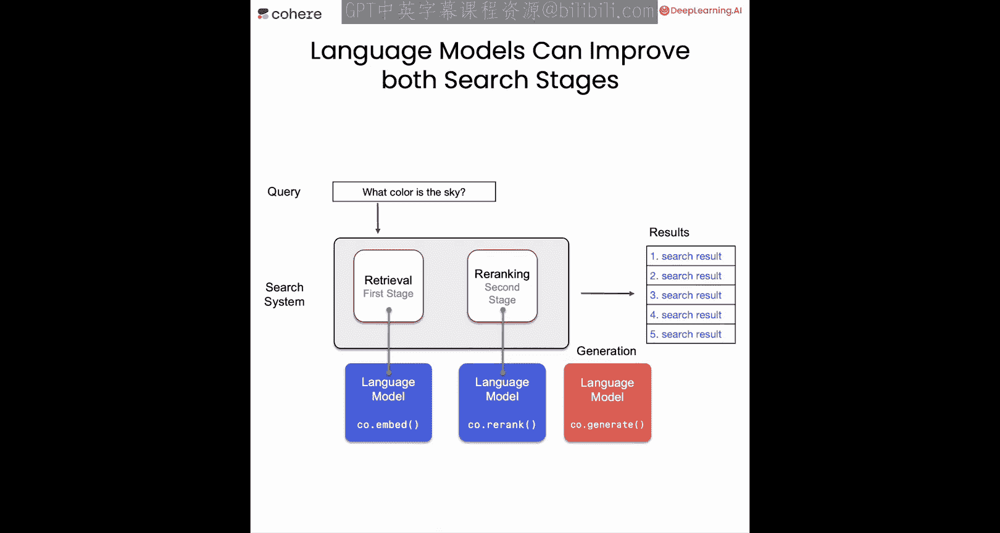

让我们进入下一课，学习关于嵌入的知识。🚀