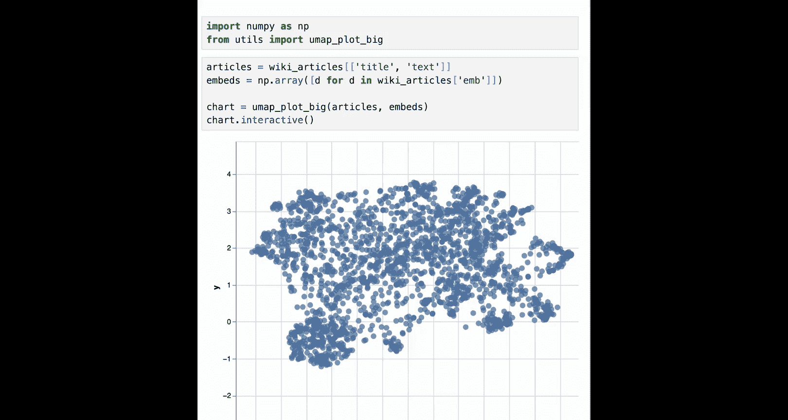
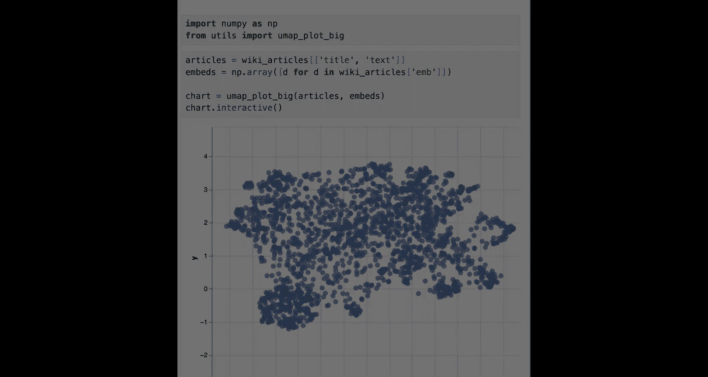

# 003：词嵌入（Embeddings）入门


在本节课中，我们将学习词嵌入（Embeddings）的概念。词嵌入是文本的数值化表示，它能让计算机更容易地处理文本信息。这是大型语言模型中最重要的组成部分之一。

## 什么是词嵌入？

上一节我们介绍了课程概述，本节中我们来看看词嵌入的核心概念。

词嵌入将文本（如单词或句子）转换为一系列数字，这些数字可以表示在坐标空间中。相似含义的文本在空间中的位置也相近。

例如，我们可以想象一个二维坐标网格。在这个网格中，词语根据其含义被放置在不同的位置。**水果**类的词语（如“香蕉”、“橙子”）会聚集在一起，**交通工具**类的词语（如“汽车”、“自行车”）会聚集在另一处。如果我们想放置“苹果”这个词，根据其含义，它应该被放在**水果**聚集的区域。

在数学上，一个词嵌入函数可以将一个单词 `word` 映射为一个数值向量：
`embedding(word) -> vector`
例如，`embedding(“apple”)` 可能得到向量 `[5, 5]`。在实际应用中，向量维度通常高达数百甚至数千。

## 环境设置与库导入

要开始使用词嵌入，我们首先需要设置编程环境并导入必要的库。

以下是需要安装和导入的核心库：

*   **cohere**: 提供调用大型语言模型API的功能，我们将使用其 `embed` 函数。
*   **pandas (pd)**: 用于高效处理表格数据。
*   **numpy**: 用于数值计算。
*   **umap-learn 和 altair**: 用于将高维嵌入向量可视化到二维或三维空间。

在课程环境中，这些设置已完成。若想自行操作，需通过 `pip install` 命令安装上述包。

```python
# 导入必要的库
import cohere
import pandas as pd
import numpy as np
# 可视化库通常在需要时导入
```

接下来，我们需要使用API密钥创建Cohere客户端，以便调用其服务。

```python
# 使用你的API密钥创建Cohere客户端
co = cohere.Client(‘YOUR_API_KEY_HERE’)
```

## 为单词创建嵌入

理解了基本概念并设置好环境后，我们来实践如何为单个单词生成嵌入。

首先，我们创建一个包含三个单词的小型数据集。

```python
# 创建一个包含三个单词的简单数据表
three_words = pd.DataFrame({‘text’: [‘joy’, ‘happiness’, ‘potato’]})
```

现在，我们使用Cohere的 `embed` 函数为这三个单词生成嵌入向量。

```python
# 调用embed函数生成嵌入
embeddings_three_words = co.embed(
    texts=list(three_words[‘text’]), # 要嵌入的文本列表
    model=‘embed-english-v3.0’ # 指定使用的模型
).embeddings

# 将嵌入向量转换为numpy数组以便处理
embeddings_three_words = np.array(embeddings_three_words)
```

我们可以查看每个单词对应的向量。例如，“joy”的向量可能是一个包含4096个数字的长列表（具体长度取决于模型）。

```python
# 获取第一个单词（‘joy’）的嵌入向量
word1_vector = embeddings_three_words[0]
# 查看该向量的前10个数值
print(word1_vector[:10])
```

## 为句子创建嵌入

词嵌入的强大之处在于它不仅能处理单词，也能处理更长的文本序列，如句子或段落。

让我们创建一个由问答对组成的小型句子数据集。

```python
# 创建一个包含句子的数据表
sentences = pd.DataFrame({
    ‘text’: [
        ‘What color is the sky?’,
        ‘The sky is blue.’,
        ‘What is an apple?’,
        ‘An apple is a fruit.’,
        ‘Where does the bear live?’,
        ‘The bear lives in the woods.’,
        ‘Where is the World Cup?’,
        ‘The World Cup is in Qatar.’
    ]
})
```

同样地，我们使用 `embed` 函数为所有句子生成嵌入。

```python
# 为所有句子生成嵌入
embeddings_sentences = co.embed(
    texts=list(sentences[‘text’]),
    model=‘embed-english-v3.0’
).embeddings
embeddings_sentences = np.array(embeddings_sentences)
```

## 可视化与理解嵌入空间

生成数值向量后，我们可以通过降维技术（如UMAP）将其可视化在二维平面上，直观地观察文本间的语义关系。

以下是可视化步骤的简要说明：

1.  使用UMAP算法将高维嵌入（例如4096维）降至2维。
2.  使用Altair等库绘制二维散点图。
3.  观察图中点的分布。

在生成的图中，你会发现：
*   “What color is the sky?” 和 “The sky is blue.” 这两个句子的点距离非常近。
*   同样，“What is an apple?” 和 “An apple is a fruit.” 也彼此靠近。
*   而语义不同的句子，如关于天空的问题和关于熊的问题，则在图中相距较远。

这个特性至关重要：**嵌入模型将语义相似的文本映射到向量空间中相近的点**。这构成了**密集检索**的基础——通过寻找与问题嵌入最接近的答案嵌入，来从大型数据库中检索信息。

## 应用于大规模数据集：维基百科文章

掌握了小规模数据的处理方法后，我们可以将其扩展至大规模数据集。

我们将一个包含2000篇维基百科文章（标题、首段文本及其嵌入向量）的数据集加载进来。通过可视化这2000个高维嵌入点，我们可以看到清晰的语义聚类：

*   **语言**相关的文章聚集在一个区域。
*   **国家**相关的文章聚集在另一个区域。
*   **国王/女王**、**足球运动员**、**艺术家**等主题也分别形成了各自的聚类。

这演示了嵌入技术如何帮助我们在海量文本数据中组织和发现信息。

## 总结

本节课中我们一起学习了词嵌入（Embeddings）的核心知识。我们了解到，词嵌入是将文本转换为计算机可处理的数值向量的技术，它能捕捉文本的语义信息，使语义相似的文本在向量空间中位置接近。

我们实践了如何使用Cohere API为单词和句子生成嵌入，并通过可视化观察到语义相似性如何在嵌入空间中体现。最后，我们看到了这项技术如何应用于大规模文本数据集（如维基百科），为语义搜索和**密集检索**奠定了基础。





在下一节课中，J将教你如何利用嵌入技术进行密集检索，即从大型数据库中精准搜索查询的答案。