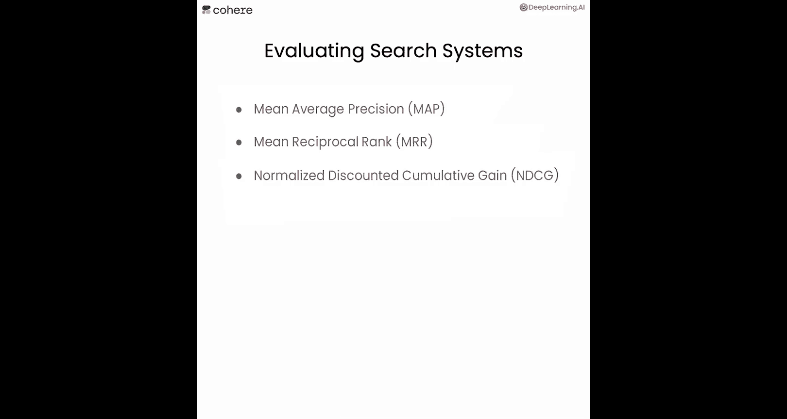

# 005：重排序（Rerank）技术详解 🎯

## 概述

在本节课中，我们将学习语义搜索的第二个核心组件——**重排序（Rerank）**。这是一种利用大型语言模型对搜索结果进行排序，以提升关键词搜索和密集检索效果的方法。

---

## 重排序（Rerank）简介

上一节我们介绍了密集检索，本节中我们来看看如何通过重排序技术来优化搜索结果。

重排序是一种让大型语言模型根据搜索结果与查询的相关性，将其从最佳到最差进行排序的方法。其核心目标是基于搜索结果与查询的相关性进行排序。

## 重排序的工作原理

为了理解重排序的必要性，我们先来看一个密集检索的局限性示例。

我们使用密集检索来搜索查询：“What is the capital of Canada”。以下是返回的结果：

1.  **正确答案**：渥太华（Ottawa）。
2.  **噪声结果**：多伦多（Toronto，并非加拿大首都）。
3.  **错误答案**：魁北克市（Quebec City）。

为什么会出现这种情况？让我们通过一个简化的图示来理解。

假设查询是“What is the capital of Canada?”，可能的回答有五个：
*   A：加拿大的首都是渥太华。（正确）
*   B：多伦多在加拿大。（正确但与问题无关）
*   C：法国的首都是巴黎。（正确但与问题无关）
*   D：加拿大的首都是悉尼。（错误）
*   E：安大略省的首府是多伦多。（正确但与问题无关）

在嵌入空间中，这些句子可能的位置分布如下。密集检索的工作原理是将查询也放入嵌入空间，然后返回最接近的响应。在这个例子中，最接近查询的句子可能是E：“安大略省的首府是多伦多”。虽然这个句子在语义上与查询相似（都涉及“首都”和加拿大地区），但它并没有回答“加拿大”的首都是什么这个问题。

因此，密集检索有可能返回语义相似但并非正确答案的结果。

**如何解决这个问题？这正是重排序发挥作用的地方。**

## 重排序示例

假设查询是“What is the capital of Canada?”，我们有10个可能的答案，其中一些与问题相关，一些不相关。

当我们使用密集检索时，它返回与查询最相似的**前5个**结果。但我们无法直接判断哪一个才是真正的答案。

此时，重排序开始工作。**重排序为每个“查询-响应”对分配一个相关性分数**，这个分数表明答案（或文档）与查询的相关程度。

如下图所示，相关性最高的分数（0.9）对应着“加拿大的首都是渥太华”，这正是正确答案。这就是重排序的作用。

你可能会好奇重排序模型是如何训练的。

以下是训练重排序模型的基本方法：
1.  **提供大量正样本对**：即查询和响应（或文档）高度相关的配对，训练模型为这些配对给出高相关性分数。
2.  **提供大量负样本对**：即查询和响应不匹配的配对（即使它们在语义上可能接近），训练模型为这些配对给出低相关性分数。

通过这种方式训练出的模型，就能在遇到高度相关的查询-响应对时给出高分，反之则给出低分。

## 实践应用：优化关键词搜索

现在让我们看看如何使用重排序来改进关键词搜索的效果。

我们导入第一课中使用的关键词搜索函数，并再次查询“What is the capital of Canada?”。

首先，我们输出3个结果，但这些结果并不理想（例如“monarchy of Canada”）。这是因为关键词搜索只能找到与查询有大量共同词汇的文档，但无法判断文档是否真正回答了问题。

接下来，我们扩大搜索范围，获取500个结果（仅打印标题）。面对如此多的结果，如何找到包含答案的那一个？

这时就需要重排序。我们调用重排序函数，对关键词搜索返回的500个结果进行处理，并输出**相关性最高的前10个**。

以下是重排序后的部分结果：
*   **第1名**：“Ottawa” – 相关性分数：**0.98**（非常接近1）。
*   **第2名**：一篇关于加拿大历史上不同首都的文章 – 相关性分数：0.97。

可以看到，重排序成功地从关键词搜索提供的大量结果中，筛选出了与问题最相关的答案。

## 实践应用：优化密集检索

最后，我们尝试一个更难的问题：“Who is the tallest person in history?”。这对关键词搜索来说可能很困难，因为它可能返回包含“history”或“person”词汇的文章，而无法理解问题的真正含义。

我们使用密集检索函数来获取一些结果。打印后发现，它确实找到了正确答案——“Robert Wadlow”，但也包含其他相关度较低的文档。

我们再次使用重排序来处理这些结果。重排序函数会评估每个结果文本与我们给出的查询的相关性。

打印重排序后的答案，我们可以看到：
*   相关性分数最高（**0.97**）的正是关于Robert Wadlow的文章。
*   其他文章的相关性分数则较低。

因此，重排序帮助我们从密集检索返回的结果中，精准地识别出了问题的正确答案。

---

## 搜索系统的评估方法

现在我们已经掌握了多种搜索技术，你可能会想知道如何评估它们的性能。

以下是几种常见的评估指标：
*   **MAP（Mean Average Precision，平均精度均值）**
*   **MRR（Mean Reciprocal Rank，平均倒数排名）**
*   **NDCG（Normalized Discounted Cumulative Gain，归一化折损累计增益）**

如何构建用于评估模型的测试集？一个好的测试集应包含一系列查询及其对应的**正确答案**。然后，你可以将模型返回的结果与这些标准答案进行比较，其方式类似于评估分类模型的准确率、精确率或召回率。

---

## 总结

本节课中，我们一起学习了**重排序（Rerank）** 技术。我们了解到：
1.  重排序是语义搜索的关键组件，用于对初步搜索结果进行相关性排序。
2.  它通过为“查询-响应”对打分来工作，高分表示高度相关。
3.  重排序能有效优化**关键词搜索**和**密集检索**的结果，帮助我们从大量或嘈杂的返回信息中精准定位正确答案。
4.  我们还简要了解了评估搜索系统性能的常用指标（如MAP、MRR、NDCG）。

在下一课中，你将学习更酷的内容：如何将搜索系统与生成模型结合，以人类回答问题的句子形式，直接输出查询的答案。