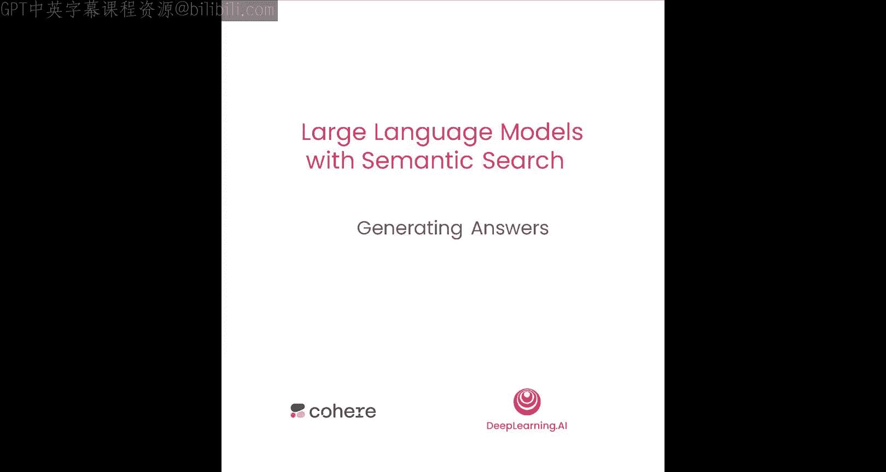
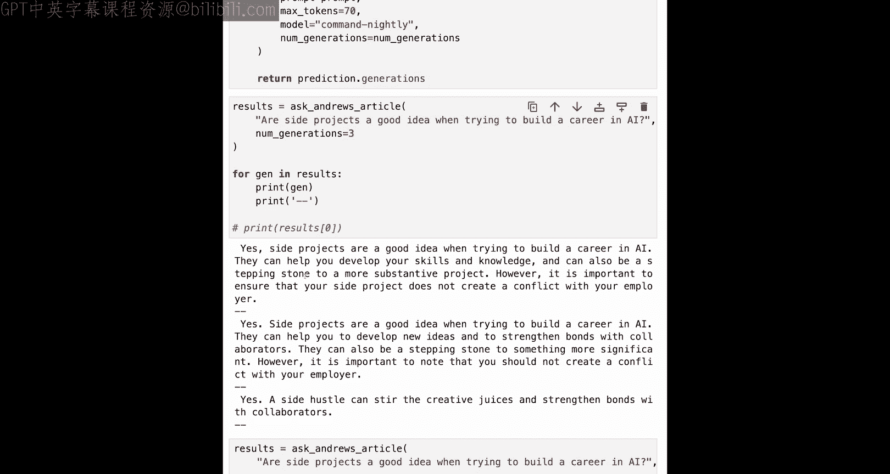

# 006：检索增强生成（RAG）实战 🚀




在本节课中，我们将学习如何在语义搜索流程的末端，增加一个使用大型语言模型（LLM）的生成步骤。通过这种方式，我们可以直接获得一个答案，而不仅仅是搜索结果。这是一种构建应用程序的实用方法，例如让用户可以与文档、书籍或文章进行对话。

## 概述

大型语言模型在许多方面表现出色，但在某些应用场景中，它们也需要一些辅助。例如，当你有一个关于“AI领域的副业项目是否是个好主意”的问题时，直接询问LLM可能会得到一些有趣的答案。然而，更有价值的是咨询专家或参考专家的著作。本节课，我们将利用吴恩达（Andrew Ng）关于“如何构建AI职业生涯”的系列文章，结合我们已学的语义搜索技术，构建一个能够基于特定文档生成答案的系统。

上一节我们介绍了语义搜索的核心技术，本节中我们来看看如何将搜索与生成结合，实现检索增强生成（Retrieval-Augmented Generation, RAG）。

## 构建文本档案库

首先，我们需要构建一个文本档案库。对于本示例，我们将使用吴恩达的三篇相关文章。以下是具体步骤：

以下是构建文本档案库的步骤：
1.  收集目标文档的文本内容。
2.  将长文本分割成较小的、语义连贯的块（chunks）。
3.  使用嵌入模型（如Cohere的嵌入模型）将每个文本块转换为向量表示。
4.  将这些向量存储到向量数据库中，构建可搜索的索引。

我们使用以下代码进行文本分块和嵌入：

```python
# 示例：文本分块与嵌入
import cohere
co = cohere.Client(‘YOUR_API_KEY’)

# 假设 `text` 变量包含了所有文章的文本
text_chunks = chunk_text(text) # 自定义分块函数
embeddings = co.embed(texts=text_chunks).embeddings
```

## 实现语义搜索功能

在生成答案之前，我们需要一个能够从档案库中检索相关信息的搜索系统。这个系统与我们之前构建的语义搜索引擎类似。

以下是定义搜索函数的关键步骤：
1.  将用户的查询语句转换为向量。
2.  在向量数据库中进行相似性搜索，找到与查询最相关的文本块。
3.  返回最匹配的结果。

搜索函数的核心代码如下：

```python
def search_articles(query):
    # 嵌入查询语句
    query_embedding = co.embed(texts=[query]).embeddings[0]
    # 在向量索引中搜索（假设 `index` 是已构建的向量索引）
    search_results = index.search(query_embedding, k=1) # 返回最相关的1个结果
    # 返回匹配的文本内容
    return search_results[0][‘text’]
```

## 集成生成模型

现在，我们将搜索步骤与生成步骤结合起来。核心思想是：先通过搜索获取与问题最相关的上下文信息，然后将此上下文与原始问题一同作为提示词（prompt）提交给生成模型，从而获得一个基于特定文档的答案。

以下是 `ask_article` 函数的工作流程：
1.  调用 `search_articles` 函数，获取与问题最相关的文章段落。
2.  精心构建一个提示词（prompt），其中包含检索到的上下文、用户的问题以及明确的指令（例如：“请根据提供的文本提取答案”）。
3.  将构建好的提示词发送给生成模型（如Cohere的Command模型）。
4.  解析并返回模型生成的答案。

我们使用以下代码来构建提示词并调用生成模型：

```python
def ask_article(question):
    # 1. 检索上下文
    context = search_articles(question)

    # 2. 构建提示词
    prompt = f“””
    以下是摘自吴恩达（Andrew Ng）文章《如何构建AI职业生涯》的片段：

    {context}

    问题：{question}

    请根据以上提供的文本内容提取答案。如果文本中没有相关信息，请说明“无法根据提供文本回答”。
    “””

    # 3. 调用生成模型
    response = co.generate(
        prompt=prompt,
        model=‘command-nightly’, # 使用最新的模型
        max_tokens=100,
        num_generations=1 # 生成1个答案
    )

    # 4. 返回答案
    return response.generations[0].text
```

## 测试与优化

运行上述代码后，当我们提问“在尝试构建AI职业生涯时，副业项目是个好主意吗？”，系统会先搜索文章，找到相关段落，然后生成一个简洁的答案，例如：“是的，副业项目是个好主意……”。

在开发过程中，我们可以通过调整 `num_generations` 参数来一次性获得模型的多个生成结果，这有助于快速评估模型响应的稳定性和质量，是进行提示工程（Prompt Engineering）调试的有效方法。

```python
# 测试模型行为：一次性获取3个生成结果
response = co.generate(
    prompt=prompt,
    model=‘command-nightly’,
    max_tokens=70,
    num_generations=3 # 生成3个不同的答案变体
)
for i, gen in enumerate(response.generations):
    print(f“Generation {i+1}: {gen.text}\n”)
```

## 总结

本节课中我们一起学习了检索增强生成（RAG）的基本流程。我们首先构建了一个基于特定文章（吴恩达的AI职业指南）的语义搜索系统，然后将其与一个大型语言模型相结合。这种方法的核心优势在于，它让模型能够基于我们提供的、可靠的上下文信息来生成答案，而不是仅仅依赖其内部训练时学到的知识，从而提高了答案的相关性和事实准确性。



这种“先搜索，后生成”的模式是当前构建文档问答、知识聊天机器人等应用的主流方法。你可以将此框架应用于其他领域，例如让用户与播客文字记录、学术论文或公司内部文档进行交互。