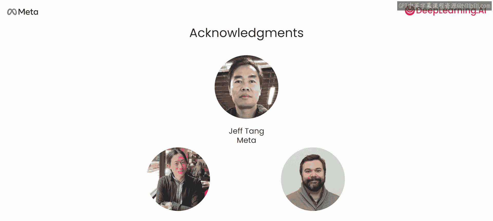

# 001：课程介绍 🚀

在本节课中，我们将要学习由Meta与DeepLearning.AI合作推出的《Llama2提示工程》课程。本课程由Meta的合作伙伴工程总监Ait Sangani主讲，旨在介绍Llama系列模型的核心能力、应用场景以及最佳实践。

欢迎来到Llama2提示工程课程。我是Amit Sangani，来自Meta的合作伙伴工程团队，也是本课程的讲师。很高兴能在这里与大家分享。

我很高兴向大家介绍Llama系列模型激动人心的功能和用例。Llama模型对AI开发者而言是一个改变游戏规则的存在，因为Meta已将模型权重公开发布在网络上，任何人都可以下载、修改、实验并基于它们开发应用。

这与闭源模型形成对比。闭源模型可能也非常强大和有用，但你只能通过API调用来访问。由于Llama的权重可以免费获取，许多大小公司的团队，以及构建酷炫应用的独立开发者，都在使用它。包括我在内的许多人，也经常在个人笔记本电脑上运行Llama模型。

在本课程中，你将直接从Meta的Amit这里学习使用Llama开发应用的最佳实践。这些模型可以免费下载，因此AI社区的每个人都可以使用它们来构建生成式AI应用、修改它们并进行额外的训练，从而推动研究和创新。我们看到模型被下载了数百万次，非常感谢所有使用Llama为他人构建出色应用的开发者。

Llama并非单一模型，而是一个包含不同尺寸和不同目标用例的模型集合。

以下是Llama模型的主要类别：

首先，是一组基础模型。这些模型经过训练，能够基于互联网文本等数据反复预测下一个词，但没有接受任何额外的训练来调整其行为。这些基础模型对于希望继续训练模型以在特定任务上表现良好的开发者很有用。

其次，是一组聊天模型。这些模型经过了进一步的训练，以遵循指令并以安全的方式行事，而不仅仅是预测互联网上的下一个词。这些聊天模型非常适合为聊天机器人提供动力，以及遵循你的指令来回答问题或完成任务。

最后，还有一组代码模型。这些模型接受了额外的专门训练，使其擅长理解和编写计算机代码。虽然这些模型看起来对软件工程师最有用，但它们也能让许多编程新手更容易地自行编写、调试和学习代码。在本课程中，你将有机会尝试所有这些不同的Llama模型。

你将从提示一个Llama模型帮助你写一张生日贺卡开始。在这个过程中，你将学习大语言模型输入格式的细节，例如输入不同部分的开始和结束标记。

你还会提示Llama帮助你分类短信的情感，并总结一封邮件。你还将学习提示工程，包括一项通过上下文学习实现的重要技术——**少样本学习**。具体来说，通过给模型提供一两个你希望它如何响应提示的例子，你可以让模型以类似的方式给出回应。

你还将学习**思维链提示**，以及如何使用专门的Llama代码模型。许多开发者正在使用Code Llama来辅助编码，从而成为更高效的开发者。在本课程中，你将学到很多相关技巧，例如使用Code Llama来编写和解释代码。

最后，你还将了解Llama Guard。这是一个特殊的模型，帮助你确保生成的内容无害或不具毒性。对于许多希望部署AI应用的企业来说，这是关键的一步。

这听起来像是一次对Llama模型及其使用方式的全面探索。我们要感谢为制作本课程付出努力的人们，来自Meta团队的Jeff Tang，以及来自DeepLearning.AI团队的Eddie Shu和Tommy Nelson。

那么，让我们进入下一个视频，正式开始学习。

希望在本课程结束后，当有人问起你关于使用Meta模型的问题时，你能自信地说“没问题”。