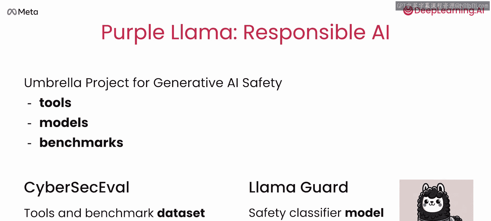

# 002：Llama模型概述 🦙

在本节课中，我们将学习Llama模型家族的基本情况，包括其不同规模、训练策略以及衍生出的专门模型。了解这些是后续进行有效提示工程的基础。

---

## Llama模型概览

正如Andrew在介绍中提到的，Llama并非单一模型，而是一个包含不同规模和训练策略的模型集合。为了给后续课程奠定基础，本节将详细介绍这些模型及其训练方式。

### 模型规模与架构

Llama模型由Meta的研究团队构建，是基于Transformer架构的大型语言模型。Llama 2主要提供三种不同规模的版本：
*   **7B参数模型**：小型模型。
*   **13B参数模型**：中型模型。
*   **70B参数模型**：大型模型。

通常，模型越大，其从训练数据中学习的能力（容量）就越强。然而，大模型在训练和部署时所需的计算资源也远多于小模型。这些模型可应用于不同的场景和目的。

### 指令微调模型

指令微调模型是通过对基础模型（也称为基础模型）进行额外的“指令微调”训练而创建的。这使得指令模型能更好地遵循人类语言指令，例如“总结这个”或“讲个笑话”。这三个经过指令微调的Llama模型被称为**Llama Chat模型**。

根据您的具体用例，您可以选用其中任何一个模型，并进一步针对您的应用需求进行微调。不过，更常见的做法是使用基础模型进行微调。

### 模型对比与访问方式

面对众多大型语言模型，您可能想知道Llama的定位。Llama 2的性能与其他流行模型（如Falcon 40B和GPT-3.5）相当。值得注意的是它们的访问方式：
*   **Llama 2**：可以免费下载到个人电脑，或托管在您的云环境中，也可以通过第三方服务访问。Falcon 40B等开源模型也是如此。如果您或您的应用用户有特定的隐私和安全要求，这种方式会很有帮助。
*   **GPT-3.5**：通过调用OpenAI的API访问，这对许多用例来说也是可行的。

### 生态系统与工具

Llama模型的另一个亮点是其周围的开发者社区正在构建的开源库和工具生态系统。例如，一些优秀的开发者开发了**Llama.cpp**库，它能让小型Llama 2模型在典型的个人电脑上适配并运行。

---

## 专用模型：Code Llama

上一节我们介绍了通用的Llama模型，本节中我们来看看一个重要的专用分支——Code Llama。2023年8月，Meta发布了Code Llama。它的创建旨在帮助更多人编写代码，并更轻松地学习编程。Code Llama是通过在Llama 2模型基础上针对编码任务进行训练而创建的。

### 模型类型与用途

Code Llama同样提供三种规模：7B小型、13B中型和34B大型参数模型。每种规模都有基础版本和指令版本。

*   **基础版Code Llama模型**：衍生自非聊天版的Llama模型。它们主要用于生成代码，因此可用于代码自动补全或填充现有代码。
*   **指令版Code Llama模型**：通过对Llama Chat模型进行训练而创建。因此，与Llama Chat模型类似，Code Llama指令模型表现出更类人的行为。它们可以响应人类指令，例如“帮我写一些构建网页的代码”或“请调试我刚刚写的以下代码”。

Code Llama聊天模型也能生成代码，但同时还能用人类语言解释代码的功能。Code Llama和Code Llama指令支持几乎所有最流行的编程语言，包括Python、JavaScript、C++、Java、HTML等。此外，还有一个专门为Python编码优化的版本——**Code Llama Python**。

---

## 负责任AI：Purple Llama项目

了解了通用的和专用的Llama模型后，我们还需要关注如何负责任地使用它们。Purple Llama是一个伞式项目，它汇集了工具和评估基准，旨在帮助社区负责任地构建生成式AI应用。目前，Purple Llama包含两个关键项目：
1.  确保AI生成的代码能防范网络安全攻击。
2.  检查LLM的输入和输出是否安全、诚实且无害。

第一个项目名为**CyberSecEval**。它是一套工具和基准数据集，被广泛用于检查代码补全工具生成的代码是否能防范病毒或网络威胁，确保其安全性。

另一个项目是又一个Llama模型，名为**Llama Guard**。它负责筛查任何大型语言模型的输入和输出，以检测有害或有毒内容。

Purple Llama是一项旨在帮助开发者构建负责任的生成式AI应用的倡议，Meta计划在不久的将来贡献更多此类项目。

---

## 总结

本节课中，我们一起学习了Llama模型家族的核心知识。我们了解了Llama 2的三种不同规模（7B、13B、70B）及其指令微调版本（Llama Chat）。我们还探讨了专门用于代码生成的Code Llama系列模型，包括其基础版和指令版。最后，我们介绍了Meta的Purple Llama项目，它强调了在开发生成式AI应用时确保安全性和负责任的重要性。在下一课中，您将开始动手使用Llama模型。